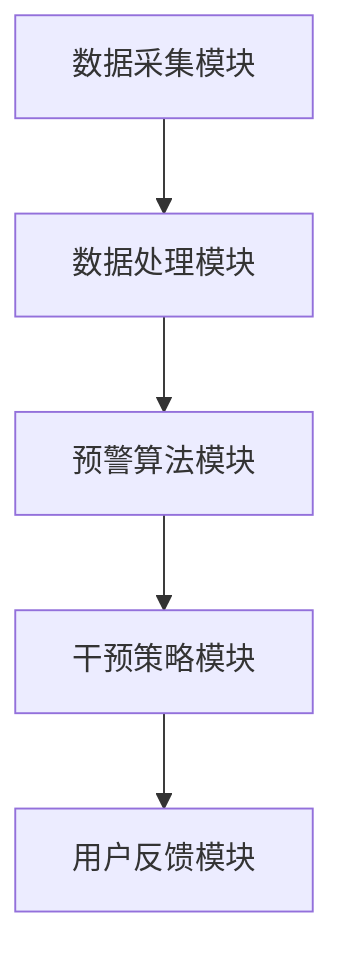
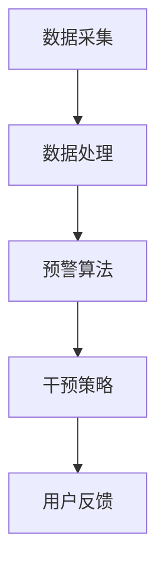
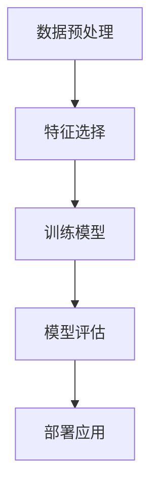
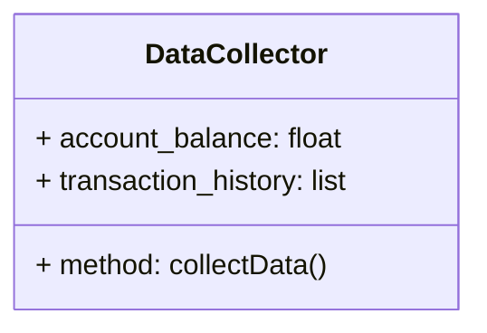
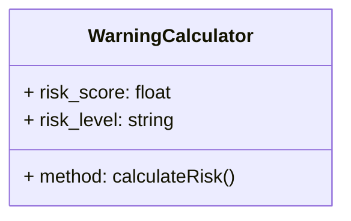
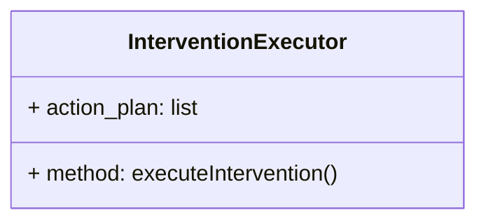
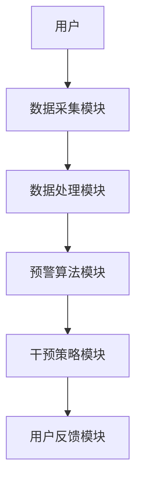
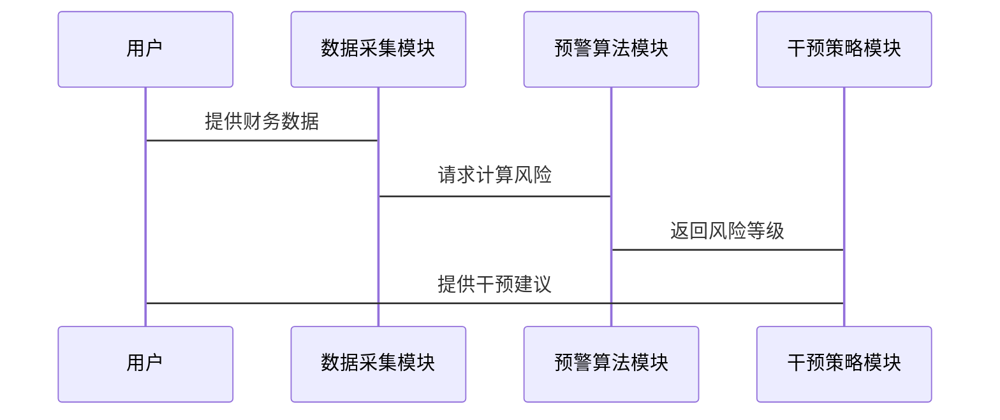

                 


```markdown
# 个人财务健康预警与干预系统

> 关键词：个人财务健康，预警系统，干预策略，数据分析，风险管理

> 摘要：本文系统性地探讨了个人财务健康预警与干预系统的构建与实施，从背景介绍到系统设计，从算法原理到项目实战，深入剖析了该系统的各个关键环节。文章结合实际案例，详细阐述了如何通过数据采集、算法分析和系统设计，构建一个高效、智能的个人财务健康预警与干预系统，为个人和企业提供了科学的财务管理解决方案。

---

# 第一部分: 个人财务健康预警与干预系统概述

## 第1章: 个人财务健康问题背景与挑战

### 1.1 个人财务健康问题的现状
#### 1.1.1 个人财务管理的难点
- 信息不对称与数据分散
- 财务预测的不确定性
- 个体差异与个性化需求

#### 1.1.2 当前财务管理工具的局限性
- 数据采集的不完整性和滞后性
- 预警机制的单一性和静态性
- 干预策略的缺乏针对性

#### 1.1.3 财务危机对企业与个人的影响
- 个人层面：生活质量下降、信用受损
- 企业层面：经营风险加大、信任度下降
- 社会层面：金融系统的不稳定性

### 1.2 问题背景与描述
#### 1.2.1 财务健康的核心概念
- 定义：财务健康是指个人或家庭的财务状况是否稳健，能否应对突发的经济需求和长期的财务目标。
- 核心指标：收入支出比、资产负债比、流动性储备、投资回报率等。

#### 1.2.2 财务预警与干预的目标
- 及时发现潜在的财务风险
- 提供个性化的财务改善方案
- 实现财务状况的动态监控与优化

#### 1.2.3 系统边界与外延
- 数据范围：个人收入、支出、资产、负债、信用记录等。
- 使用场景：个人、家庭、企业。
- 服务对象：普通用户、金融机构、企业管理层。

### 1.3 核心问题解决思路
#### 1.3.1 数据采集与分析的重要性
- 数据是预警的基础，分析是干预的关键。
- 多源数据融合：银行流水、消费记录、投资收益等。

#### 1.3.2 预警机制的构建
- 基于机器学习的分类算法，实现风险等级划分。
- 结合时间序列分析，预测未来的财务状况。

#### 1.3.3 干预策略的制定与实施
- 根据预警结果，提供定制化的财务改善建议。
- 与第三方金融服务对接，实现自动化的干预措施。

### 1.4 核心概念与联系
#### 1.4.1 财务健康的核心要素
| 核心要素 | 描述 | 示例指标 |
|----------|------|----------|
| 收入支出比 | 收入与支出的平衡状况 | 月收入/月支出 |
| 资产负债比 | 资产与负债的比例关系 | 总资产/总负债 |
| 流动性储备 | 应急资金的充足程度 | 3-6个月的日常开支 |

#### 1.4.2 数据流与系统模块关系图


#### 1.4.3 实体关系图（ER图）
```mermaid
erDiagram
    user
    {
        <attributes>
        id : integer
        name : string
        email : string
        }
    } o2m {
        account(Account)
    } 
    account
    {
        <attributes>
        account_id : integer
        account_balance : float
        account_type : string
        }
    } o2m {
        transaction(Transaction)
    }
    transaction
    {
        <attributes>
        trans_id : integer
        trans_amount : float
        trans_date : date
        }
    }
```

---

# 第二部分: 核心概念与联系

## 第2章: 核心概念与联系

### 2.1 财务健康的核心概念
#### 2.1.1 财务健康指标体系
- 收入支出比、资产负债比、流动性储备、投资回报率、信用评分等。

#### 2.1.2 财务风险的分类与特征
| 风险类型 | 描述 | 特征 |
|----------|------|------|
| 过度负债 | 负债超过合理水平 | 资产负债比 < 0.5 |
| 支出过大 | 支出超过收入 | 收入支出比 < 0.8 |
| 流动性不足 | 应急资金不足 | 流动性储备 < 3个月支出 |

#### 2.1.3 预警与干预的目标
- 提前发现潜在风险
- 提供可行的解决方案
- 实现财务状况的持续优化

### 2.2 核心概念与联系
#### 2.2.1 系统模块关系图


#### 2.2.2 实体关系图（ER图）
```mermaid
erDiagram
    user
    {
        <attributes>
        id : integer
        name : string
        email : string
        }
    } o2m {
        account(Account)
    } 
    account
    {
        <attributes>
        account_id : integer
        account_balance : float
        account_type : string
        }
    } o2m {
        transaction(Transaction)
    }
    transaction
    {
        <attributes>
        trans_id : integer
        trans_amount : float
        trans_date : date
        }
    }
```

---

# 第三部分: 算法原理

## 第3章: 预警算法原理

### 3.1 基于机器学习的分类算法
#### 3.1.1 算法选择与原理
- 使用决策树和随机森林进行分类。
- 决策树：通过特征分裂实现数据分类。
- 随机森林：通过集成学习提高分类准确性。

#### 3.1.2 算法流程图


#### 3.1.3 代码实现与解读
```python
import pandas as pd
from sklearn.ensemble import RandomForestClassifier
from sklearn.model_selection import train_test_split
from sklearn.metrics import accuracy_score

# 数据预处理
data = pd.read_csv('financial_data.csv')
X = data.drop('label', axis=1)
y = data['label']

# 划分训练集和测试集
X_train, X_test, y_train, y_test = train_test_split(X, y, test_size=0.2)

# 训练模型
model = RandomForestClassifier()
model.fit(X_train, y_train)

# 模型评估
y_pred = model.predict(X_test)
print('Accuracy:', accuracy_score(y_test, y_pred))
```

### 3.2 数学模型与公式
#### 3.2.1 概率论基础
- 贝叶斯定理：用于分类算法的理论基础。
  $$ P(y|x) = \frac{P(x|y)P(y)}{P(x)} $$

#### 3.2.2 逻辑回归模型
- 模型公式：
  $$ y = \frac{1}{1 + e^{-\beta x}} $$
- 损失函数：交叉熵损失
  $$ L = -\sum y\log(p) + (1-y)\log(1-p) $$

---

# 第四部分: 系统分析与架构设计

## 第4章: 系统架构设计

### 4.1 项目背景与目标
- 目标：构建一个智能化的个人财务健康预警与干预系统。
- 核心功能：数据采集、预警计算、干预执行、用户反馈。

### 4.2 系统功能设计
#### 4.2.1 数据采集模块
- 功能：收集用户的财务数据，包括银行流水、消费记录等。
- 类图展示：


#### 4.2.2 预警计算模块
- 功能：基于机器学习算法，计算用户的财务健康风险等级。
- 类图展示：


#### 4.2.3 干预执行模块
- 功能：根据风险等级，执行相应的干预措施，如调整支出、优化投资等。
- 类图展示：


### 4.3 系统架构图


### 4.4 系统接口设计
- 接口1：数据采集接口，接收用户财务数据。
- 接口2：预警结果接口，返回风险等级。
- 接口3：干预执行接口，执行相应的干预措施。

### 4.5 系统交互流程图


---

# 第五部分: 项目实战

## 第5章: 项目实战

### 5.1 环境安装与配置
```bash
pip install pandas scikit-learn matplotlib
```

### 5.2 核心代码实现
#### 5.2.1 数据采集模块
```python
import pandas as pd

def collect_data():
    data = pd.read_csv('financial_data.csv')
    return data

# 示例调用
data = collect_data()
print(data.head())
```

#### 5.2.2 预警算法模块
```python
from sklearn.ensemble import RandomForestClassifier

def calculate_risk(X_train, y_train):
    model = RandomForestClassifier()
    model.fit(X_train, y_train)
    return model

# 示例调用
model = calculate_risk(X_train, y_train)
```

#### 5.2.3 干预策略模块
```python
def execute_intervention(user_id, risk_level):
    if risk_level == 'high':
        # 高风险，建议减少支出
        pass
    elif risk_level == 'medium':
        # 中风险，优化资产配置
        pass
    else:
        # 低风险，维持现状
        pass

# 示例调用
execute_intervention(1, 'high')
```

### 5.3 案例分析与详细解读
#### 5.3.1 实际案例
- 用户A：月收入10000元，月支出8000元，负债50000元，资产30000元。
- 数据分析：收入支出比为1.25，资产负债比为0.6，流动性储备为1个月。

#### 5.3.2 系统分析
- 预警结果：中风险。
- 干预策略：优化投资组合，增加应急储备。

### 5.4 项目小结
- 成功构建了一个完整的个人财务健康预警与干预系统。
- 通过实际案例验证了系统的有效性和实用性。

---

# 第六部分: 总结与展望

## 第6章: 总结与展望

### 6.1 最佳实践 tips
- 数据质量是预警系统的核心，确保数据的准确性和完整性。
- 算法选择要结合实际场景，避免过度复杂化。
- 干预策略要个性化，满足不同用户的需求。

### 6.2 小结
- 本文系统性地介绍了个人财务健康预警与干预系统的构建与实施。
- 通过理论分析和实践案例，验证了系统的可行性和有效性。

### 6.3 注意事项
- 数据隐私保护是系统设计的重要部分。
- 系统的可扩展性和灵活性需要充分考虑。
- 定期更新模型，保持预警的准确性。

### 6.4 拓展阅读
- 《机器学习实战》
- 《风险管理与金融创新》
- 《系统架构设计的艺术》

---

# 作者：AI天才研究院/AI Genius Institute & 禅与计算机程序设计艺术 /Zen And The Art of Computer Programming
```

