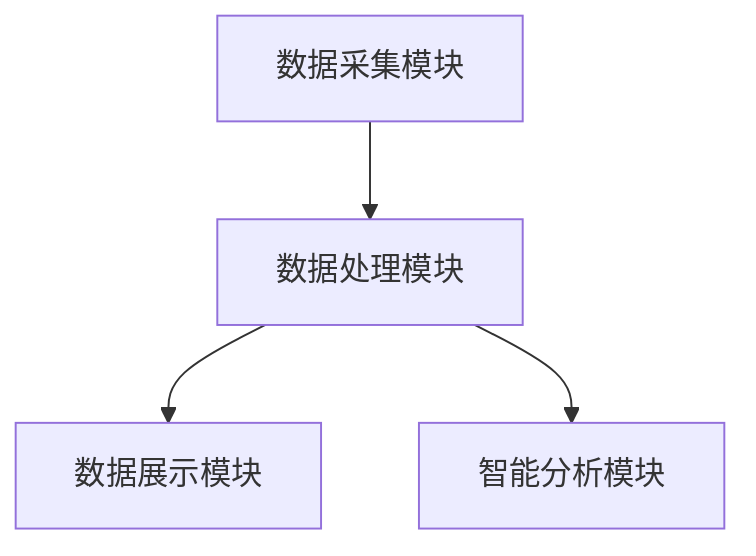
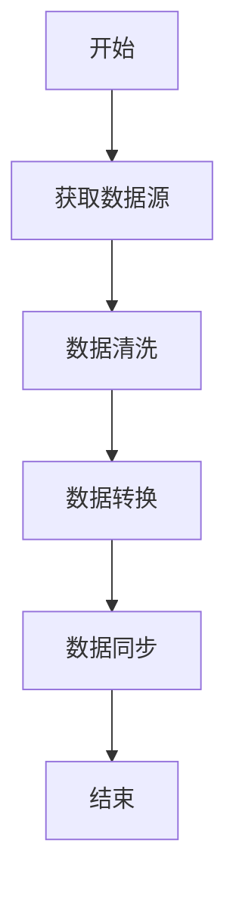
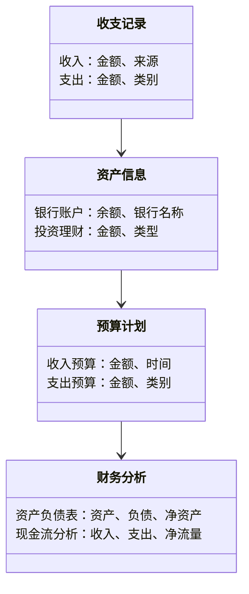
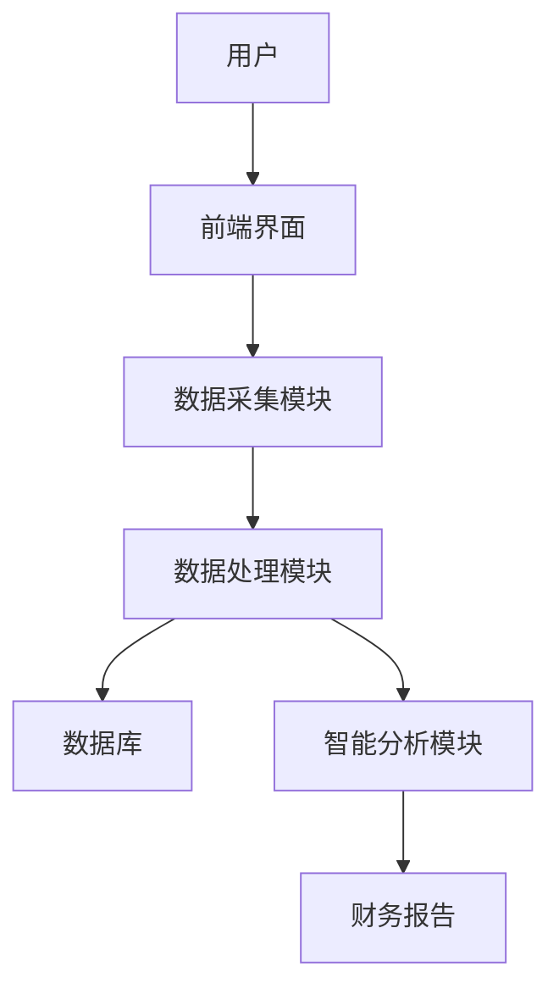

                 


# 个人财务管理工具集成

> 关键词：个人财务管理、工具集成、数据同步、系统架构、安全隐私

> 摘要：本文详细探讨了个人财务管理工具集成的核心概念、技术实现、系统架构及安全隐私保护，通过实际案例分析，提供了一套完整的解决方案，并提出了最佳实践建议。

---

# 第1章: 个人财务管理工具集成概述

## 1.1 个人财务管理的重要性

### 1.1.1 个人财务管理的核心问题

在现代生活中，个人财务管理的核心问题包括：如何高效记录收支、如何避免超支、如何进行预算规划、如何实现资产配置优化等。这些问题直接影响个人的财务健康和生活质量。

### 1.1.2 工具化管理的必要性

传统的人工财务管理方式存在效率低、易出错、难以分析等问题。工具化管理能够帮助用户高效记录、分析和规划财务，提升财务管理的准确性和效率。

### 1.1.3 数字化时代的财务管理新趋势

随着数字化技术的普及，财务管理工具逐渐从单一功能向多功能集成化方向发展，用户对工具的智能化、个性化需求日益增加。

---

## 1.2 工具集成的概念与特点

### 1.2.1 工具集成的定义

工具集成是指将多种独立的财务管理工具整合到一个统一的平台中，通过统一的接口和数据模型实现功能协同，提升用户体验。

### 1.2.2 工具集成的核心特点

- **统一性**：通过统一的界面和数据模型实现多工具协同。
- **高效性**：减少重复操作，提升数据处理效率。
- **智能性**：通过数据分析提供智能财务建议。
- **安全性**：确保数据存储和传输的安全性。

### 1.2.3 工具集成与传统财务管理的区别

| **维度**       | **传统财务管理**             | **工具集成财务管理**            |
|----------------|------------------------------|----------------------------------|
| 数据处理       | 人工记录，效率低             | 自动化记录，高效准确            |
| 功能协同       | 单一功能，互操作性差         | 多功能集成，协同高效            |
| 用户体验       | 界面分散，操作复杂           | 统一界面，操作便捷              |
| 数据分析       | 依赖人工统计，结果有限       | 智能分析，结果精准              |

---

## 1.3 个人财务管理工具集成的背景

### 1.3.1 数字化工具的普及

随着移动互联网和云计算技术的发展，越来越多的财务管理工具出现在市场中，为用户提供了丰富的选择。

### 1.3.2 用户需求的变化

用户对财务管理工具的需求逐渐从单一功能向多功能集成化、智能化方向发展。

### 1.3.3 市场环境的推动

市场竞争的加剧和用户需求的变化推动了工具集成技术的发展，企业纷纷推出集成化的财务管理解决方案。

---

## 1.4 本章小结

本章通过分析个人财务管理的重要性、工具集成的概念及其与传统财务管理的区别，为后续章节的深入探讨奠定了基础。

---

# 第2章: 个人财务管理工具集成的核心概念

## 2.1 个人财务数据模型

### 2.1.1 数据模型的定义

数据模型是描述数据结构和关系的抽象表示，是工具集成的基础。

### 2.1.2 核心数据要素

- **收支记录**：包括收入来源、支出类别、金额、时间等。
- **资产信息**：包括银行账户、投资理财、不动产等。
- **预算计划**：包括收入支出预算、债务还款计划等。
- **财务分析**：包括资产负债表、现金流分析、信用评分等。

### 2.1.3 数据模型的构建方法

1. **需求分析**：明确用户的核心需求。
2. **数据采集**：通过API或其他方式获取数据。
3. **数据清洗**：去除重复、错误数据。
4. **数据建模**：使用数据库建模工具设计数据结构。

---

## 2.2 工具集成框架

### 2.2.1 集成框架的定义

工具集成框架是实现多工具协同工作的桥梁，通过标准化接口和协议实现数据互通。

### 2.2.2 核心模块划分

- **数据采集模块**：负责从不同工具中获取数据。
- **数据处理模块**：对数据进行清洗、转换和存储。
- **数据展示模块**：以可视化的方式呈现数据。
- **智能分析模块**：基于数据模型提供财务建议。

### 2.2.3 模块之间的关系



---

## 2.3 核心概念对比表

| **核心概念**       | **数据模型**                | **集成框架**                 |
|--------------------|-----------------------------|-----------------------------|
| 核心功能           | 数据结构和关系定义          | 实现工具协同的接口和协议     |
| 主要组件           | 数据表、字段、约束          | API、中间件、数据映射规则     |
| 实现方式           | 数据库建模                  | 接口标准化、协议制定          |
| 应用场景           | 数据存储与查询             | 工具协同与数据互通            |

---

## 2.4 本章小结

本章通过分析数据模型和集成框架的核心概念，明确了工具集成的技术基础和实现路径。

---

# 第3章: 个人财务管理工具集成的技术实现

## 3.1 数据同步与整合算法

### 3.1.1 数据同步的定义

数据同步是指在不同工具之间保持数据一致性的过程，通常涉及数据的采集、清洗、转换和存储。

### 3.1.2 数据整合的算法原理

数据整合的算法需要解决数据格式不统一、数据冗余等问题，通过数据清洗、转换和去重实现数据的统一。

### 3.1.3 算法实现的步骤

1. **数据采集**：通过API获取不同工具中的数据。
2. **数据清洗**：去除无效数据，处理格式不一致的问题。
3. **数据转换**：将数据转换为统一的数据格式。
4. **数据整合**：将清洗和转换后的数据整合到统一的数据库中。

---

## 3.2 数据同步流程图



---

## 3.3 数据整合的Python实现

```python
def synchronize_data(source, target):
    # 数据清洗
    cleaned_data = clean(source)
    # 数据转换
    converted_data = convert(cleaned_data)
    # 数据同步
    target.update(converted_data)
    return True
```

---

## 3.4 数据整合的数学模型

$$
\text{同步率} = \frac{\text{成功同步的数据量}}{\text{总数据量}} \times 100\%
$$

---

## 3.5 本章小结

本章通过详细讲解数据同步与整合的算法、流程图和代码实现，为工具集成的技术实现提供了具体的指导。

---

# 第4章: 个人财务管理工具集成的系统架构设计

## 4.1 系统需求分析

### 4.1.1 用户需求

- 实现多工具的数据集成
- 提供智能化的财务分析
- 确保数据安全和隐私保护

### 4.1.2 功能需求

- 数据采集与同步
- 数据存储与管理
- 财务分析与报告
- 用户界面与交互

---

## 4.2 系统功能设计

### 4.2.1 领域模型设计



---

## 4.3 系统架构设计

### 4.3.1 总体架构



---

## 4.4 本章小结

本章通过系统需求分析和架构设计，明确了工具集成的整体实现方案。

---

# 第5章: 个人财务管理工具集成的项目实战

## 5.1 环境安装

### 5.1.1 安装Python环境

```bash
# 安装Python
brew install python
pip install requests pandas
```

### 5.1.2 安装工具依赖

```bash
pip install beautifulsoup4
pip install schedule
```

---

## 5.2 系统核心实现

### 5.2.1 数据采集模块实现

```python
import requests

def fetch_data(tool):
    url = f"https://api.tool.com/data/{tool}"
    response = requests.get(url)
    return response.json()
```

### 5.2.2 数据处理模块实现

```python
import pandas as pd

def process_data(data):
    df = pd.DataFrame(data)
    df = df.drop_duplicates()
    return df.to_dict('records')
```

---

## 5.3 案例分析

### 5.3.1 案例背景

假设我们需要集成两个财务管理工具：工具A和工具B。

### 5.3.2 数据同步过程

1. 从工具A获取数据：`data_a = fetch_data('tool_a')`
2. 从工具B获取数据：`data_b = fetch_data('tool_b')`
3. 数据清洗和转换：`processed_data = process_data(data_a + data_b)`
4. 数据同步到数据库：`synchronize_data(processed_data, db)`

---

## 5.4 本章小结

本章通过实际案例分析，展示了工具集成的实现过程和关键步骤。

---

# 第6章: 个人财务管理工具集成的安全与隐私

## 6.1 数据加密技术

### 6.1.1 加密算法

- **对称加密**：如AES，适用于数据存储加密。
- **非对称加密**：如RSA，适用于数据传输加密。

### 6.1.2 加密实现

```python
from cryptography.hazmat.primitives.asymmetric import padding
from cryptography.hazmat.primitives.asymmetric.rsa import RSAParameters

# 数据加密
def encrypt(data, public_key):
    cipher = padding.OAEP(mgf1_PADDING, hash_algorithm=SHA256())
    encrypted_data = public_key.encrypt(data, cipher)
    return encrypted_data

# 数据解密
def decrypt(encrypted_data, private_key):
    decipher = padding.OAEP(mgf1_PADDING, hash_algorithm=SHA256())
    decrypted_data = private_key.decrypt(encrypted_data, decipher)
    return decrypted_data
```

---

## 6.2 隐私保护措施

### 6.2.1 数据最小化原则

仅收集实现功能所需的最少数据。

### 6.2.2 数据访问控制

采用角色权限管理，确保只有授权用户才能访问敏感数据。

---

## 6.3 本章小结

本章重点讨论了工具集成中的安全与隐私保护措施，确保用户数据的安全性和隐私性。

---

# 第7章: 个人财务管理工具集成的最佳实践

## 7.1 实用技巧

### 7.1.1 工具选择

选择功能丰富且易于集成的工具，确保兼容性和扩展性。

### 7.1.2 数据备份

定期备份重要数据，防止数据丢失。

---

## 7.2 注意事项

### 7.2.1 数据一致性

确保不同工具之间的数据同步及时，避免数据不一致。

### 7.2.2 性能优化

合理设计数据结构和算法，提升工具的运行效率。

---

## 7.3 拓展阅读

推荐阅读《Effective Python》和《Data Analysis Using Python》。

---

## 7.4 本章小结

本章总结了工具集成中的实用技巧和注意事项，为用户提供了最佳实践建议。

---

# 第8章: 总结与展望

## 8.1 本章总结

本文详细探讨了个人财务管理工具集成的核心概念、技术实现、系统架构及安全隐私保护，通过实际案例分析，提供了一套完整的解决方案。

## 8.2 未来展望

随着人工智能和大数据技术的发展，工具集成将在智能化、个性化方向上进一步发展，为用户提供更高效、更智能的财务管理服务。

---

# 作者

作者：AI天才研究院/AI Genius Institute & 禅与计算机程序设计艺术 /Zen And The Art of Computer Programming

