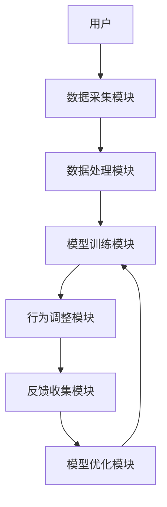

                 


# 个性化定制：为不同用户调整AI Agent的行为

## 关键词：个性化定制，AI Agent，行为调整，用户需求，机器学习

## 摘要：  
本文深入探讨了如何根据不同用户的需求定制化调整AI Agent的行为，分析了个性化定制的核心概念、算法原理、系统架构设计以及实际项目实现。通过详细的技术分析和实战案例，展示了如何在不同场景下实现高效、精准的AI Agent行为调整，为读者提供了从理论到实践的全面指导。

---

## 第一部分: 个性化定制与AI Agent行为调整的背景

### 第1章: 个性化定制与AI Agent概述

#### 1.1 个性化定制的定义与重要性

##### 1.1.1 个性化定制的基本概念  
个性化定制是指根据用户的特定需求、偏好或行为，动态调整系统或服务的响应方式。在AI Agent领域，个性化定制意味着根据用户的特点，调整AI Agent的行为模式，使其更贴合用户的使用习惯和需求。

##### 1.1.2 AI Agent的基本定义与功能  
AI Agent（人工智能代理）是指能够感知环境、自主决策并执行任务的智能实体。它可以是一个软件程序，也可以是嵌入在硬件中的智能模块。AI Agent的核心功能包括：感知环境、分析数据、决策选择、执行操作。

##### 1.1.3 个性化定制在AI Agent中的作用  
个性化定制能够显著提升用户体验，使AI Agent的行为更加智能化和人性化。通过个性化定制，AI Agent可以更好地理解用户需求，提供更精准的服务，从而提高用户满意度和系统效率。

---

#### 1.2 用户需求的多样性与动态变化

##### 1.2.1 用户需求的多样性分析  
用户需求的多样性体现在多个方面：  
1. **用户类型**：不同用户群体（如企业用户、个人用户）的需求差异显著。  
2. **使用场景**：用户在不同场景下的需求可能完全不同。例如，同一用户在工作场景和生活场景中的需求可能截然不同。  
3. **行为习惯**：用户的操作习惯、偏好也会影响AI Agent的行为调整方式。  

##### 1.2.2 用户行为的动态变化特点  
用户行为并非一成不变，会受到时间、环境、情绪等多种因素的影响。例如：  
- 时间变化：用户在早晨和晚上的行为模式可能不同。  
- 环境变化：用户在不同设备、网络条件下可能表现出不同的行为特点。  
- 情绪变化：用户情绪波动可能会影响其行为模式。  

##### 1.2.3 不同用户群体的需求差异  
不同用户群体的需求差异主要体现在：  
- **目标差异**：例如，企业用户可能更关注效率和数据安全性，而个人用户可能更关注便利性和用户体验。  
- **操作习惯差异**：不同用户可能习惯于不同的操作方式，如键盘操作或语音操作。  
- **反馈差异**：不同用户对AI Agent的反馈可能表现出不同的敏感性和接受度。  

---

### 第2章: AI Agent行为调整的背景与挑战

#### 2.1 AI Agent在不同场景中的应用

##### 2.1.1 企业级应用中的AI Agent  
在企业级应用中，AI Agent通常用于自动化任务处理，例如：  
- 自动化办公流程优化。  
- 企业资源规划（ERP）系统的智能辅助。  
- 客户关系管理（CRM）中的智能客服。  

##### 2.1.2 消费者端的AI Agent  
在消费者端，AI Agent的应用场景包括：  
- 智能音箱、智能助手（如Siri、Alexa）。  
- 智能推荐系统（如 Netflix 的个性化推荐）。  
- 智能客服系统。  

##### 2.1.3 特殊领域中的AI Agent  
在特殊领域中，AI Agent的应用包括：  
- 医疗领域的智能诊断助手。  
- 金融领域的智能投资顾问。  
- 智慧交通中的自动驾驶决策系统。  

---

#### 2.2 个性化定制的必要性

##### 2.2.1 用户体验的提升需求  
个性化定制能够显著提升用户体验，使AI Agent的行为更加智能化和人性化。例如，智能音箱可以根据用户的使用习惯调整响应速度和语气。  

##### 2.2.2 业务目标的精准实现  
通过个性化定制，AI Agent可以更精准地满足业务目标。例如，智能推荐系统可以根据用户的行为数据，精准推送相关产品，从而提高转化率。  

##### 2.2.3 市场竞争中的差异化优势  
个性化定制是企业差异化竞争的重要手段。通过提供个性化服务，企业可以吸引更多的用户，增强用户忠诚度。  

---

#### 2.3 行为调整中的技术挑战

##### 2.3.1 数据采集与处理的复杂性  
个性化定制需要大量的用户数据，包括行为数据、偏好数据等。如何高效采集和处理这些数据是一个技术挑战。  

##### 2.3.2 模型训练的计算成本  
个性化定制通常需要基于机器学习模型，模型训练需要大量的计算资源和时间。  

##### 2.3.3 系统实时响应的性能要求  
个性化定制要求系统能够实时响应用户的请求，这对系统的性能提出了更高的要求。  

---

## 第三部分: 个性化定制的核心概念与联系

### 第3章: 个性化定制的核心概念

#### 3.1 定制化方法

##### 3.1.1 基于规则的定制  
基于规则的定制是一种简单但有效的定制方法。通过预设规则，系统可以根据用户的特定行为或属性进行调整。例如，如果用户在晚上使用设备，系统可以自动调整屏幕亮度。  

##### 3.1.2 基于机器学习的定制  
基于机器学习的定制是一种更高级的定制方法。通过机器学习算法，系统可以自动学习用户的偏好和行为模式，并动态调整其行为。例如，智能推荐系统可以根据用户的点击行为调整推荐策略。  

##### 3.1.3 混合式定制方法  
混合式定制方法结合了基于规则和基于机器学习的优点，可以根据具体场景灵活调整定制策略。例如，系统可以根据用户的基本属性（如年龄、性别）和行为数据（如购买记录）综合调整其行为。  

---

#### 3.2 定制化策略

##### 3.2.1 预设策略  
预设策略是一种静态的定制策略，系统根据预设的规则进行调整。例如，系统可以根据用户的时间段预设不同的响应速度。  

##### 3.2.2 动态调整策略  
动态调整策略是一种动态的定制策略，系统可以根据实时数据动态调整其行为。例如，智能音箱可以根据用户的实时情绪调整其语气和响应速度。  

##### 3.2.3 用户主动参与策略  
用户主动参与策略是一种用户主导的定制策略，用户可以根据自己的需求主动调整系统行为。例如，用户可以手动设置智能音箱的默认音量。  

---

#### 3.3 定制化原则

##### 3.3.1 用户隐私保护原则  
个性化定制必须严格遵守用户隐私保护原则，确保用户数据的安全性和隐私性。  

##### 3.3.2 个性化与普适性的平衡原则  
个性化定制需要在个性化和普适性之间找到平衡点，既要满足用户个性化需求，又要确保系统在大多数场景下都能正常运行。  

##### 3.3.3 可解释性与可调整性原则  
个性化定制的系统必须具有良好的可解释性和可调整性，用户可以理解系统的调整逻辑，并能够根据需要调整系统行为。  

---

## 第四部分: 个性化定制的算法原理与实现

### 第4章: 个性化定制的核心算法

#### 4.1 基于机器学习的定制算法

##### 4.1.1 算法流程  
基于机器学习的个性化定制算法通常包括以下步骤：  
1. 数据采集：采集用户的特征数据和行为数据。  
2. 数据预处理：对数据进行清洗、归一化等处理。  
3. 模型训练：使用机器学习算法（如随机森林、神经网络）训练模型。  
4. 模型评估：评估模型的性能，调整参数。  
5. 模型部署：将模型部署到实际系统中，实时调整AI Agent的行为。  

##### 4.1.2 算法实现  
以下是一个基于机器学习的个性化定制算法的简单实现示例：  

```python
import numpy as np
from sklearn.ensemble import RandomForestClassifier

# 数据预处理
X = np.array([...])  # 特征数据
y = np.array([...])  # 标签数据

# 模型训练
model = RandomForestClassifier()
model.fit(X, y)

# 模型预测
new_X = np.array([...])  # 新用户的特征数据
prediction = model.predict(new_X)
```

##### 4.1.3 算法优化  
算法优化是提高个性化定制效果的关键。可以通过以下方式优化算法：  
- 使用更复杂的模型（如深度学习模型）。  
- 增加数据量，提高模型的泛化能力。  
- 调整模型超参数，优化模型性能。  

---

### 第5章: 个性化定制的系统架构设计

#### 5.1 系统功能设计

##### 5.1.1 用户画像构建  
用户画像是个性化定制的基础。通过收集用户的基本信息（如年龄、性别、职业）和行为数据（如浏览记录、点击行为），可以构建详细的用户画像。  

##### 5.1.2 行为预测模块  
行为预测模块是个性化定制的核心模块。通过机器学习模型，系统可以预测用户的下一步行为，并根据预测结果调整AI Agent的行为。  

##### 5.1.3 自适应调整模块  
自适应调整模块是个性化定制的关键模块。系统可以根据预测结果和实时反馈动态调整AI Agent的行为，确保其行为始终符合用户的期望。  

---

#### 5.2 系统架构设计

##### 5.2.1 模块划分  
个性化定制系统的架构通常包括以下模块：  
1. 数据采集模块：负责采集用户数据。  
2. 数据处理模块：负责对数据进行预处理。  
3. 模型训练模块：负责训练个性化定制模型。  
4. 行为调整模块：负责根据模型输出调整AI Agent的行为。  
5. 反馈收集模块：负责收集用户的反馈数据，用于模型优化。  

##### 5.2.2 模块交互流程  
以下是模块交互流程的示意图：  



---

## 第五部分: 个性化定制的项目实战

### 第6章: 个性化定制的项目实现

#### 6.1 环境安装与配置

##### 6.1.1 安装Python与相关库  
个性化定制项目需要安装以下Python库：  
- `scikit-learn`：用于机器学习算法。  
- `numpy`：用于数据处理。  
- `pandas`：用于数据分析。  

安装命令：  
```bash
pip install scikit-learn numpy pandas
```

##### 6.1.2 安装机器学习框架  
如果需要使用深度学习模型，可以安装 `TensorFlow` 或 `PyTorch`。  

安装命令：  
```bash
pip install tensorflow
```

---

#### 6.2 系统核心实现

##### 6.2.1 数据采集与预处理  
以下是一个数据采集与预处理的示例代码：  

```python
import pandas as pd
import numpy as np

# 数据采集
data = pd.read_csv('user_data.csv')

# 数据清洗
data.dropna(inplace=True)

# 数据归一化
from sklearn.preprocessing import StandardScaler
scaler = StandardScaler()
scaled_data = scaler.fit_transform(data[['age', 'income']])
```

##### 6.2.2 模型训练与优化  
以下是一个基于随机森林的个性化定制模型训练示例：  

```python
from sklearn.ensemble import RandomForestClassifier
from sklearn.metrics import accuracy_score

# 模型训练
model = RandomForestClassifier(n_estimators=100, max_depth=5)
model.fit(X_train, y_train)

# 模型预测
y_pred = model.predict(X_test)
print('准确率:', accuracy_score(y_test, y_pred))
```

##### 6.2.3 行为调整与反馈  
以下是一个行为调整模块的示例代码：  

```python
def adjust_behavior(user_profile, model):
    # 预测用户行为
    predicted_behavior = model.predict([user_profile])
    
    # 根据预测结果调整行为
    if predicted_behavior == 'click':
        return 'increase_volume'
    elif predicted_behavior == 'scroll':
        return 'decrease_volume'
    else:
        return 'no_change'

# 示例用户资料
user_profile = {'age': 25, 'income': 50000}
result = adjust_behavior(user_profile, model)
print(result)
```

---

## 第六部分: 最佳实践与总结

### 第7章: 最佳实践与总结

#### 7.1 最佳实践 tips

##### 7.1.1 数据隐私保护  
在个性化定制系统中，数据隐私保护是重中之重。必须确保用户数据的安全性和隐私性，避免数据泄露。  

##### 7.1.2 系统可解释性  
系统的可解释性是用户信任的重要基础。必须确保系统的行为调整逻辑清晰、可解释，让用户能够理解并信任系统。  

##### 7.1.3 系统可扩展性  
个性化定制系统需要具有良好的可扩展性，能够适应未来更多的用户和更复杂的需求。  

---

#### 7.2 小结

个性化定制是实现AI Agent智能化和人性化的关键手段。通过个性化定制，系统可以根据用户的特定需求动态调整其行为，显著提升用户体验和系统效率。  

---

#### 7.3 注意事项

##### 7.3.1 数据采集与处理  
在数据采集和处理过程中，必须严格遵守数据隐私保护法规，确保用户数据的安全性和隐私性。  

##### 7.3.2 模型选择与优化  
在模型选择和优化过程中，必须根据具体场景选择合适的算法，并通过不断优化模型参数和结构，提高模型的性能。  

##### 7.3.3 系统性能与稳定性  
个性化定制系统的性能和稳定性直接影响用户体验。必须确保系统能够实时响应用户的请求，并在高负载下保持稳定运行。  

---

#### 7.4 拓展阅读

##### 7.4.1 个性化推荐系统  
个性化推荐系统是个性化定制的重要应用之一。推荐系统的核心是通过算法分析用户的兴趣和行为，精准推送相关内容。  

##### 7.4.2 动态调整算法  
动态调整算法是实现个性化定制的核心技术之一。通过动态调整算法，系统可以实时响应用户的需求变化，确保行为调整的精准性和高效性。  

##### 7.4.3 用户隐私保护技术  
用户隐私保护技术是个性化定制系统的重要组成部分。通过加密技术、数据脱敏技术等手段，可以有效保护用户隐私。  

---

## 作者信息

作者：AI天才研究院/AI Genius Institute & 禅与计算机程序设计艺术 /Zen And The Art of Computer Programming  
邮箱：contact@aisinguli.com  
官网：https://www.aisinguli.com

