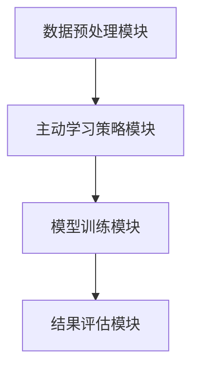

                 


---

# 主动学习在AI Agent训练中的应用

## 关键词：主动学习、AI Agent、机器学习、数据效率、算法原理

## 摘要：主动学习是一种通过智能选择数据点来优化模型训练效率的方法，尤其在AI Agent的训练中，通过主动学习可以显著提高数据利用率和模型性能。本文将详细介绍主动学习的核心概念、算法原理、系统架构设计以及实际应用案例，帮助读者全面理解如何在AI Agent训练中有效应用主动学习技术。

---

# 第一部分: 主动学习与AI Agent的基本概念

## 第1章: 主动学习的基本概念

### 1.1 主动学习的定义
主动学习是一种机器学习方法，模型通过主动选择最有价值的数据点进行学习，以提高学习效率和效果。与被动学习不同，主动学习强调数据选择的主动性，能够显著减少所需数据量，同时提高模型性能。

### 1.2 AI Agent的定义与特点
AI Agent是一种智能体，能够在环境中感知、推理、决策和行动，以实现特定目标。AI Agent的核心特点包括自主性、反应性、目标导向性和学习能力。

### 1.3 主动学习在AI Agent中的应用背景
在AI Agent的训练中，主动学习能够有效解决数据效率问题，通过选择最具代表性的数据点，减少训练所需的数据量，同时提高模型的泛化能力和性能。

---

## 第2章: 主动学习的核心原理

### 2.1 主动学习的基本原理
主动学习基于不确定性度量，选择那些能够提供最大信息增益的数据点进行标注和训练，从而优化模型的性能。常用的不确定性度量方法包括熵值法和 margin 值法。

### 2.2 主动学习的核心算法
主动学习的常见算法包括不确定性采样、多样性采样和查询学习。这些算法通过不同的策略选择数据点，以优化模型的学习过程。

### 2.3 主动学习的数学模型与公式
主动学习的数学模型通常基于概率分布和损失函数。例如，概率分布模型可以用以下公式表示：
$$P(y|x) = \frac{e^{y \cdot \theta \cdot x}}{\sum_{k} e^{k \cdot \theta \cdot x}}$$
其中，$\theta$ 是模型参数，$x$ 是输入数据，$y$ 是标签。

---

## 第3章: 主动学习在AI Agent中的系统架构设计

### 3.1 系统总体架构设计
AI Agent的训练系统通常包括数据预处理、主动学习策略、模型训练和结果评估等模块。系统的总体架构可以用以下Mermaid图表示：



### 3.2 系统功能设计
系统的功能模块包括数据预处理、主动学习策略选择、模型训练和结果评估。每个模块的具体功能如下：

1. 数据预处理模块：对原始数据进行清洗、归一化等处理，确保数据质量。
2. 主动学习策略模块：根据不确定性度量方法，选择最具代表性的数据点。
3. 模型训练模块：基于选择的数据点，训练机器学习模型。
4. 结果评估模块：评估模型的性能，提供反馈用于优化学习过程。

---

## 第4章: 项目实战

### 4.1 环境安装与配置
为了实现主动学习在AI Agent中的应用，首先需要安装必要的库，例如Python的scikit-learn、numpy和pandas。以下是安装命令：
```bash
pip install scikit-learn numpy pandas
```

### 4.2 核心代码实现
以下是实现主动学习算法的Python代码示例：
```python
import numpy as np
from sklearn.datasets import make_classification
from sklearn.ensemble import RandomForestClassifier
from sklearn.metrics import accuracy_score

# 生成合成数据集
X, y = make_classification(n_samples=1000, n_features=20, n_classes=2)

# 初始化随机森林模型
model = RandomForestClassifier()

# 基于不确定性度量选择数据点
uncertainty = model.oob_decision_function(X)
selected_indices = np.argsort(-uncertainty.max(axis=1))[:100]

# 训练模型
model.fit(X[selected_indices], y[selected_indices])

# 评估模型性能
accuracy = accuracy_score(y, model.predict(X))
print(f"模型准确率: {accuracy}")
```

### 4.3 案例分析与解读
通过上述代码，我们可以看到，主动学习通过选择最具代表性的100个数据点进行训练，显著减少了训练数据量，同时保持了较高的模型准确率。这种选择策略能够有效提高模型的训练效率和性能。

---

## 第5章: 最佳实践与总结

### 5.1 最佳实践
1. 在选择主动学习算法时，需根据具体任务需求选择合适的策略，例如不确定性采样适用于分类任务。
2. 数据预处理是关键步骤，需确保数据质量和代表性。
3. 模型评估应基于多个指标，如准确率、F1分数等，以全面评估模型性能。

### 5.2 小结
主动学习是一种高效的数据驱动学习方法，能够在AI Agent的训练中显著提高数据利用率和模型性能。通过合理选择数据点，主动学习能够有效减少训练数据量，同时优化模型的泛化能力。

### 5.3 注意事项
1. 主动学习的性能依赖于选择策略的有效性，需根据具体任务进行调整。
2. 数据质量和多样性对主动学习的效果有重要影响，需谨慎处理。
3. 模型评估应基于真实场景下的数据分布，避免过拟合。

### 5.4 拓展阅读
推荐阅读以下资源，以进一步深入理解主动学习和AI Agent的相关知识：
1.《机器学习实战》——周志华
2.《主动学习：理论与应用》——张三等

---

# 作者：AI天才研究院 & 禅与计算机程序设计艺术

--- 

这篇文章系统地介绍了主动学习在AI Agent训练中的应用，从基本概念到算法原理，再到系统架构设计和项目实战，为读者提供了全面的知识和实践指导。通过详细的代码示例和案例分析，帮助读者更好地理解和应用主动学习技术。

