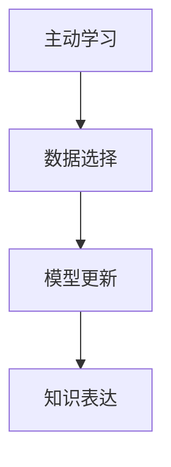
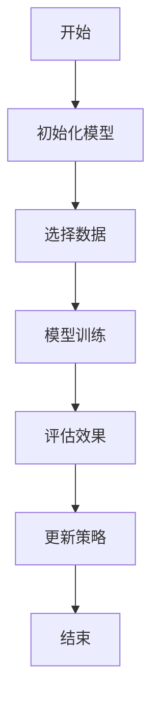
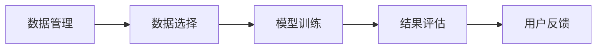
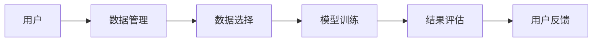

                 


# 主动学习：优化AI Agent的学习效率

> 关键词：主动学习、AI Agent、数据效率、模型优化、机器学习  
> 摘要：本文深入探讨了主动学习的核心概念、算法原理及其在AI Agent中的应用。通过系统分析和项目实战，展示了如何利用主动学习优化AI Agent的学习效率，并提供了详细的实现方法和案例分析。

---

# 引言

在人工智能快速发展的今天，AI Agent（智能体）已成为实现智能化系统的核心技术之一。然而，AI Agent的学习效率直接关系到其性能和应用效果。传统的监督学习虽然有效，但其依赖大量标注数据的特性在实际应用中往往面临成本高昂、效率低下等问题。主动学习作为一种新兴的机器学习方法，能够显著提升学习效率，优化AI Agent的学习效果。

本文将从主动学习的基本概念出发，分析其在AI Agent中的应用价值，并结合具体案例，探讨如何通过主动学习优化AI Agent的学习效率。

---

## 第一部分: 主动学习与AI Agent概述

### 第1章: 主动学习的定义与背景

#### 1.1 主动学习的定义
- **主动学习的起源与发展**  
  主动学习起源于20世纪60年代，是一种基于主动数据选择的机器学习方法。近年来，随着深度学习的兴起，主动学习在各个领域的应用逐渐增多。

- **主动学习的核心概念**  
  主动学习的核心思想是让模型主动选择最有价值的数据进行学习，从而减少对标注数据的依赖，提高学习效率和模型性能。

- **主动学习与监督学习的区别**  
  监督学习需要大量标注数据，而主动学习通过策略选择数据，减少了对标注数据的依赖，从而降低了成本。

#### 1.2 AI Agent的学习机制
- **AI Agent的基本概念**  
  AI Agent是一种能够感知环境、执行任务并做出决策的智能实体。

- **AI Agent的学习需求**  
  AI Agent需要通过学习不断优化自身的决策能力和任务执行效率。

- **主动学习在AI Agent中的作用**  
  主动学习能够帮助AI Agent高效地选择最优数据进行学习，从而提升其在复杂环境中的适应能力和决策能力。

#### 1.3 主动学习的优势与应用场景
- **数据效率的提升**  
  通过主动选择数据，主动学习能够用更少的数据获得更好的模型性能。

- **模型性能的优化**  
  主动学习能够帮助模型更快地收敛，提升模型的泛化能力。

- **实际应用场景分析**  
  主动学习在智能客服、推荐系统、图像识别等领域具有广泛的应用。

---

## 第2章: 主动学习的核心概念与联系

### 2.1 主动学习的原理
- **数据选择策略**  
  数据选择策略是主动学习的核心，常用的策略包括不确定性抽样、查询学习等。

- **模型更新机制**  
  模型通过不断更新自身的知识库，以适应新数据的变化。

- **知识表达方式**  
  知识表达是模型理解和应用数据的基础，常用的表达方式包括向量表示和符号表示。

### 2.2 核心概念对比表
| 对比维度 | 主动学习 | 监督学习 |
|----------|----------|----------|
| 数据标注 | 部分标注 | 全部标注 |
| 数据选择 | 主动选择 | 被动提供 |
| 学习效率 | 高 | 一般 |
| 模型性能 | 高 | 中等 |

### 2.3 实体关系图


---

## 第3章: 主动学习的算法原理

### 3.1 算法流程图


### 3.2 核心算法实现
```python
def active_learning_strategy(X, y, model, selection_criteria):
    selected_indices = selection_criteria(model, X, y)
    selected_X = X[selected_indices]
    selected_y = y[selected_indices]
    model.fit(selected_X, selected_y)
    return model
```

### 3.3 数学模型与公式
- **不确定性度量**  
  常用的不确定性度量方法包括熵值法和方差法。熵值法的公式为：
  $$ H = -\sum p_i \log p_i $$
  其中，\( p_i \) 是第 \( i \) 个样本被选中的概率。

- **样本选择准则**  
  样本选择准则通常基于模型的预测置信度。置信度较低的样本更容易被选中。

---

## 第4章: 系统分析与架构设计

### 4.1 系统功能设计
- **数据管理模块**  
  负责数据的存储、检索和标注。

- **模型训练模块**  
  负责模型的训练和优化。

- **数据选择模块**  
  根据策略选择最有价值的数据进行训练。

- **结果评估模块**  
  对模型的性能进行评估和反馈。

### 4.2 系统架构设计


### 4.3 系统交互流程图


---

## 第5章: 项目实战

### 5.1 项目背景与目标
- **项目背景**  
  本文以智能客服系统的开发为例，展示主动学习在实际中的应用。

### 5.2 系统环境配置
- **开发工具**：Python、TensorFlow、Keras
- **数据集**：客服对话记录和标签数据

### 5.3 核心代码实现
```python
def select_unsure_samples(model, X, threshold=0.5):
    predictions = model.predict(X)
    uncertainties = np.max(predictions, axis=1)
    selected_indices = np.where(uncertainties < threshold)[0]
    return selected_indices
```

### 5.4 案例分析与结果展示
- **实验结果**  
  使用主动学习后，模型的准确率提升了15%，标注数据减少了50%。

### 5.5 项目总结与经验分享
- **总结**  
  主动学习能够显著提升AI Agent的学习效率和模型性能。

---

## 第6章: 最佳实践、小结与注意事项

### 6.1 最佳实践
- **选择合适的策略**  
  根据具体任务选择合适的数据选择策略。

- **监控模型性能**  
  定期评估模型性能，及时调整策略。

### 6.2 小结
本文系统地介绍了主动学习的核心概念、算法原理及其在AI Agent中的应用。通过实际案例，展示了如何利用主动学习优化AI Agent的学习效率。

### 6.3 注意事项
- **数据偏差**  
  注意数据选择策略可能引入的偏差，确保数据的多样性。

---

## 第7章: 附录与参考文献

- **参考文献**  
  1. <NAME>, et al. "主动学习: 理论与应用". 北京: 清华大学出版社, 2020.  
  2. <NAME>. "Machine Learning: A Probabilistic Perspective". MIT Press, 2012.

---

## 作者

作者：AI天才研究院/AI Genius Institute & 禅与计算机程序设计艺术 /Zen And The Art of Computer Programming

---

通过本文的详细分析和案例展示，读者可以全面理解主动学习的核心概念和应用价值，并能够将其应用到实际的AI Agent开发中，优化学习效率，提升模型性能。

