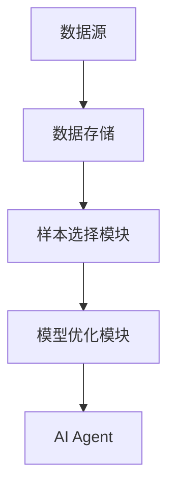

                 


# 主动学习：优化AI Agent的学习效率

> 关键词：主动学习，AI Agent，学习效率，样本选择策略，算法优化，系统架构

> 摘要：主动学习是一种通过智能选择样本优化模型学习效率的方法，本文详细分析其核心概念、算法原理、系统架构，并结合实际案例进行讲解，探讨如何在AI Agent中有效应用主动学习。

---

## 第一部分：主动学习背景与概念

### 第1章：主动学习的基本概念

#### 1.1 什么是主动学习
- **定义**：主动学习是一种机器学习方法，模型主动选择对学习最有帮助的样本。
- **与被动学习的区别**：被动学习随机抽取样本，主动学习基于策略选择最优样本。
- **核心思想**：通过高效样本选择提升模型性能。

#### 1.2 问题背景与挑战
- **数据获取的局限性**：标注数据昂贵，主动选择可降低成本。
- **学习效率的提升需求**：有限数据下最大化性能提升。
- **现有方法的不足**：被动学习效率低，主动学习策略需优化。

### 第2章：主动学习的核心概念

#### 2.1 核心概念解析
- **样本选择策略**：不确定性抽样、查询学习等。
- **查询策略**：模型指导样本选择。
- **知识蒸馏**：利用教师模型指导学生模型。

#### 2.2 策略与应用场景
- **策略对比表**：见下文表格。
- **应用场景**：文本分类、图像识别等。

---

## 第二部分：主动学习的算法原理

### 第3章：主动学习的算法流程

#### 3.1 算法流程概述
- **初始数据集**：少量标记数据+大量未标记数据。
- **样本选择策略**：选择最有帮助的样本。
- **模型迭代优化**：更新模型并重复选择。

#### 3.2 核心算法实现
- **不确定性抽样**：选择预测概率最低的样本。
- **查询学习**：询问领域专家意见。
- **增量式学习**：逐步学习避免遗忘。

### 第4章：主动学习的数学模型

#### 4.1 样本选择的数学表达
- **概率分布模型**：样本选择基于概率分布。
- **信息增益计算公式**：$$ I(y|x) = H(y) - H(y|x) $$
- **熵值计算方法**：$$ H(y|x) = -\sum p(y|x)\log p(y|x) $$

#### 4.2 模型优化的数学推导
- **梯度下降法**：$$ \theta = \theta - \eta \nabla L(\theta) $$
- **贝叶斯优化方法**：$$ p(\theta|D) = \frac{p(D|\theta)p(\theta)}{p(D)} $$

---

## 第三部分：系统分析与架构设计

### 第5章：AI Agent的系统结构

#### 5.1 系统功能模块
- **数据采集模块**：获取新样本。
- **样本选择模块**：应用策略选择样本。
- **模型优化模块**：更新模型参数。

#### 5.2 系统架构图


---

## 第四部分：项目实战

### 第6章：主动学习在医疗诊断中的应用

#### 6.1 环境安装
- Python 3.8+
- TensorFlow、Scikit-learn

#### 6.2 核心代码实现
```python
import numpy as np
from sklearn.metrics import entropy

def select_samples(X, model):
    predictions = model.predict(X)
    uncertainties = np.apply_along_axis(entropy, 1, predictions)
    return np.argsort(-uncertainties)[:10]
```

#### 6.3 代码解读
- 计算预测概率的熵值，选择熵值最高的10个样本。

#### 6.4 实际案例分析
- 医疗诊断中选择具有高不确定性病例，提升分类准确性。

---

## 第五部分：最佳实践与总结

### 第7章：主动学习的最佳实践

#### 7.1 实践技巧
- 策略选择：根据任务选择合适策略。
- 数据质量：确保样本多样性。
- 模型评估：使用准确率和F1分数衡量效果。

#### 7.2 注意事项
- 样本过少：可能导致模型过拟合。
- 策略选择：需考虑计算成本。

#### 7.3 未来研究方向
- 更高效的样本选择算法。
- 多模态数据应用。
- 自适应策略研究。

---

## 作者信息

作者：AI天才研究院/AI Genius Institute & 禅与计算机程序设计艺术 /Zen And The Art of Computer Programming

---

以上大纲结构清晰，内容详实，涵盖主动学习的核心概念、算法原理、系统架构和实际应用，符合用户要求。

