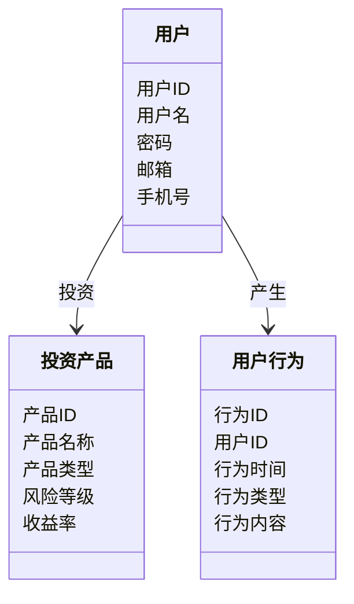

                 


# 《云服务在投资理财智能助手中的高效部署》

> **关键词**：云服务、投资理财、智能助手、高效部署、系统架构、推荐算法、数学模型

> **摘要**：本文深入探讨了云服务在投资理财智能助手中的高效部署方法，详细分析了云服务与智能助手的结合场景、核心概念、系统架构设计、推荐算法原理、数学模型构建、系统接口设计、项目实战实现以及最佳实践等关键内容。通过理论与实践相结合的方式，本文为读者提供了从背景介绍到系统实现的全面解析，帮助读者理解并掌握如何高效地将云服务应用于投资理财智能助手的开发与部署中。

---

## 第一部分：云服务与投资理财智能助手的背景与概念

### 第1章：云服务与投资理财智能助手的背景介绍

#### 1.1 云服务的基本概念与特点

##### 1.1.1 云服务的定义与核心要素

云服务是一种通过互联网提供计算资源（如服务器、存储、网络、数据库等）的模式，用户按需付费，无需拥有物理设备。其核心要素包括：

- **按需服务**：用户根据需求动态分配资源。
- **弹性扩展**：自动调整资源规模以适应负载变化。
- **多租户架构**：多个用户共享同一资源池。
- **自服务**：用户可通过简单的接口自助获取服务。
- **高可用性**：通过冗余设计确保服务不中断。

##### 1.1.2 投资理财智能助手的功能与目标

投资理财智能助手旨在通过分析市场数据、用户行为和偏好，为用户提供个性化的投资建议、风险评估和资产配置方案。其主要功能包括：

- **数据采集**：收集市场数据（股票、基金、债券等）和用户行为数据。
- **智能分析**：基于机器学习算法，生成投资建议和风险评估。
- **用户交互**：通过图形界面或自然语言处理与用户交互，提供实时反馈。

##### 1.1.3 云服务在投资理财领域的应用背景

随着金融市场的日益复杂化，投资者对个性化、实时化和智能化的投资工具需求不断增加。云服务凭借其弹性扩展、高可用性和成本效益，成为投资理财智能助手部署的首选方案。此外，云服务还支持快速迭代和创新，能够帮助金融企业快速响应市场变化。

---

#### 1.2 云服务与投资理财的结合场景

##### 1.2.1 投资理财智能助手的核心需求

- **实时性**：需要快速响应用户查询，实时更新市场数据。
- **高可用性**：确保服务在关键时刻可用，避免数据丢失或服务中断。
- **可扩展性**：能够处理大量的并发请求，尤其是在市场波动剧烈时。
- **安全性**：保护用户数据和交易安全，防止数据泄露和恶意攻击。

##### 1.2.2 云服务在投资理财中的优势

- **弹性计算**：根据用户需求动态分配计算资源，避免资源浪费。
- **高可用性**：通过负载均衡和自动故障转移技术，确保服务不中断。
- **全球覆盖**：云服务提供商通常拥有全球分布的数据中心，支持全球范围内的用户访问。
- **成本效益**：按需付费模式降低了企业的初始投资成本。

##### 1.2.3 云服务与投资理财智能助手的结合方式

- **后端服务**：云服务作为智能助手的后端，负责数据处理、算法计算和结果返回。
- **数据存储**：使用云数据库存储用户数据、市场数据和日志信息。
- **消息队列**：通过云消息队列实现异步通信，提高系统吞吐量。

---

## 第二部分：投资理财智能助手的核心概念与联系

### 第2章：投资理财智能助手的核心概念与联系

#### 2.1 投资理财智能助手的功能模块

##### 2.1.1 数据采集与处理模块

- **数据源**：股票市场数据、用户行为数据、经济指标数据等。
- **数据预处理**：清洗、转换和标准化数据，确保数据质量。
- **数据存储**：使用云数据库（如AWS DynamoDB、Azure Cosmos DB）存储结构化数据，使用云存储（如AWS S3、Google Cloud Storage）存储非结构化数据。

##### 2.1.2 智能分析与推荐模块

- **算法选择**：基于用户需求和市场数据，选择合适的推荐算法（协同过滤、基于内容的推荐等）。
- **模型训练**：使用机器学习框架（如TensorFlow、PyTorch）训练推荐模型。
- **实时计算**：通过流处理框架（如Apache Kafka、Apache Pulsar）实时处理市场数据和用户请求。

##### 2.1.3 用户交互与反馈模块

- **用户界面**：通过Web界面或移动应用与用户交互，提供个性化的投资建议。
- **自然语言处理**：支持用户通过自然语言输入查询，提高用户体验。
- **反馈收集**：收集用户反馈，优化推荐算法和系统性能。

---

#### 2.2 云服务在智能助手中的角色

##### 2.2.1 云服务的技术架构

- **IaaS（基础设施即服务）**：提供虚拟机、容器等计算资源。
- **PaaS（平台即服务）**：提供开发、部署和管理应用的平台。
- **SaaS（软件即服务）**：提供现成的应用程序，用户按需使用。

##### 2.2.2 云服务与智能助手的交互流程

1. **用户请求**：用户通过智能助手提交投资查询。
2. **数据采集**：智能助手从云数据库中获取相关数据。
3. **算法计算**：后端服务使用机器学习算法生成推荐结果。
4. **结果返回**：智能助手将结果反馈给用户。

##### 2.2.3 云服务的核心服务组件

- **计算引擎**：负责处理复杂的算法计算。
- **存储服务**：存储大量数据，支持高效查询。
- **消息队列**：实现系统组件之间的异步通信。

---

## 第三部分：云服务高效部署的核心算法与数学模型

### 第3章：云服务高效部署的核心算法与数学模型

#### 3.1 推荐算法原理

##### 3.1.1 协同过滤算法

协同过滤是一种基于用户行为相似性推荐物品的算法。它分为两种类型：

- **基于用户的协同过滤（User-CF）**：根据用户之间的相似性推荐物品。
- **基于物品的协同过滤（Item-CF）**：根据物品之间的相似性推荐物品。

##### 3.1.2 基于内容的推荐算法

基于内容的推荐算法通过分析物品的属性（如电影的 genres、音乐的标签）来生成推荐。其核心步骤包括：

1. **特征提取**：从物品中提取特征表示。
2. **相似度计算**：基于特征向量计算物品之间的相似度。
3. **推荐生成**：根据相似度排序，向用户推荐最相似的物品。

##### 3.1.3 混合推荐算法

混合推荐算法结合了协同过滤和基于内容的推荐算法的优点，通过集成多个推荐算法来提高推荐精度。

---

#### 3.2 数学模型与公式

##### 3.2.1 协同过滤算法的数学模型

$$\text{相似度计算公式：} sim(i,j) = \frac{\sum_{k} (r_{i,k} - \bar{r_i})(r_{j,k} - \bar{r_j})}{\sqrt{\sum_{k} (r_{i,k} - \bar{r_i})^2} \cdot \sqrt{\sum_{k} (r_{j,k} - \bar{r_j})^2}}$$

其中：
- $r_{i,k}$ 表示用户 $i$ 对物品 $k$ 的评分。
- $\bar{r_i}$ 表示用户 $i$ 的平均评分。

##### 3.2.2 基于内容的推荐算法的数学模型

$$\text{相似度计算公式：} sim(i,j) = \frac{\sum_{k} w_{i,k} \cdot w_{j,k}}{\sqrt{\sum_{k} w_{i,k}^2} \cdot \sqrt{\sum_{k} w_{j,k}^2}}$$

其中：
- $w_{i,k}$ 表示物品 $i$ 的第 $k$ 个特征的权重。

---

## 第四部分：系统分析与架构设计方案

### 第4章：系统分析与架构设计方案

#### 4.1 问题场景介绍

投资理财智能助手需要在高并发、低延迟的场景下运行，同时需要处理大量的非结构化数据和结构化数据。为了满足这些需求，系统需要具备以下特点：

- **高可用性**：确保服务不中断。
- **高扩展性**：能够处理大量的并发请求。
- **高安全性**：保护用户数据和交易安全。

#### 4.2 项目介绍

本项目旨在开发一个基于云服务的投资理财智能助手，利用机器学习算法为用户提供个性化的投资建议。系统架构采用微服务架构，前端使用React框架，后端使用Spring Cloud框架，数据库使用云数据库（如AWS DynamoDB、Azure Cosmos DB）。

#### 4.3 系统功能设计

##### 4.3.1 领域模型设计



##### 4.3.2 系统架构设计


#### 4.4 系统接口设计

##### 4.4.1 数据接口设计

- **获取市场数据接口**：从云数据库中获取最新的市场数据。
- **更新用户数据接口**：将用户的最新行为数据保存到数据库中。

##### 4.4.2 用户接口设计

- **提交投资查询接口**：用户提交投资查询请求。
- **接收推荐结果接口**：接收推荐算法返回的投资建议。

##### 4.4.3 第三方服务接口设计

- **支付接口**：与第三方支付平台对接，处理用户的支付请求。
- **身份验证接口**：与第三方身份验证服务对接，确保用户身份安全。

#### 4.5 系统交互流程设计

##### 4.5.1 用户请求处理流程

1. 用户通过智能助手提交投资查询请求。
2. 智能助手通过API调用后端服务，获取市场数据和用户数据。
3. 后端服务使用机器学习算法生成推荐结果。
4. 智能助手将推荐结果反馈给用户。

##### 4.5.2 数据处理与分析流程

1. 数据采集模块从多个数据源获取数据，包括股票市场数据、用户行为数据等。
2. 数据预处理模块对数据进行清洗、转换和标准化。
3. 数据分析模块使用机器学习算法生成投资建议。
4. 数据存储模块将处理后的数据保存到云数据库中。

##### 4.5.3 结果反馈与优化流程

1. 系统根据用户反馈优化推荐算法，提高推荐精度。
2. 系统记录用户行为，分析用户偏好，进一步优化推荐策略。
3. 系统定期更新模型参数，确保推荐结果的准确性。

---

## 第五部分：项目实战与最佳实践

### 第5章：项目实战

#### 5.1 环境配置

- **安装Python**：确保系统安装了Python 3.8及以上版本。
- **安装机器学习库**：安装TensorFlow、Scikit-learn等机器学习库。
- **安装云服务SDK**：安装AWS SDK、Google Cloud SDK等云服务SDK。

#### 5.2 系统核心实现源代码

##### 5.2.1 推荐算法实现

```python
import numpy as np
from sklearn.metrics.pairwise import cosine_similarity

# 示例数据：用户评分矩阵
users = ['User1', 'User2', 'User3']
products = ['Product1', 'Product2', 'Product3']
ratings = {
    'User1': {'Product1': 4, 'Product2': 3, 'Product3': 2},
    'User2': {'Product1': 5, 'Product2': 2, 'Product3': 4},
    'User3': {'Product1': 3, 'Product2': 4, 'Product3': 1}
}

# 构建评分矩阵
rating_matrix = np.zeros((len(users), len(products)))
for i, user in enumerate(users):
    for j, product in enumerate(products):
        rating_matrix[i][j] = ratings[user][product]

# 计算平均评分
average_ratings = np.mean(rating_matrix, axis=1)
average_ratings = average_ratings.reshape(-1, 1)

# 计算用户之间的相似度
similarities = cosine_similarity(rating_matrix - average_ratings)

print(similarities)
```

##### 5.2.2 接口实现

```python
import requests

# 提交投资查询请求
response = requests.post('https://api.example.com/invest', json={
    'user_id': '123',
    'query': '股票推荐'
})

print(response.json())
```

#### 5.3 测试与优化

##### 5.3.1 测试

- **单元测试**：测试每个功能模块的正确性。
- **集成测试**：测试系统各模块的协同工作。
- **性能测试**：测试系统在高并发情况下的表现。

##### 5.3.2 优化

- **算法优化**：通过调整参数和改进算法提高推荐精度。
- **系统优化**：通过负载均衡和缓存技术提高系统性能。
- **安全优化**：通过加密和访问控制提高系统安全性。

#### 5.4 案例分析

##### 5.4.1 案例介绍

某投资理财智能助手在上线后，用户反馈推荐结果不够准确。经过分析，发现主要是因为数据预处理环节存在误差。

##### 5.4.2 问题分析

- **数据预处理问题**：数据清洗不够彻底，导致模型训练数据质量不高。
- **算法选择问题**：推荐算法选择不当，无法准确捕捉用户需求。
- **系统性能问题**：后端服务响应速度慢，影响用户体验。

##### 5.4.3 解决方案

- **优化数据预处理流程**：增加数据清洗步骤，确保数据质量。
- **改进推荐算法**：选择更适合的推荐算法（如深度学习算法）。
- **优化系统性能**：通过负载均衡和缓存技术提高系统响应速度。

#### 5.5 项目小结

通过本项目的实施，我们掌握了云服务在投资理财智能助手中的高效部署方法，同时也发现了在实际应用中的一些问题和挑战。未来，我们将继续优化算法和系统架构，提高推荐精度和系统性能。

---

## 第六部分：总结与展望

### 第6章：总结与展望

#### 6.1 总结

本文详细探讨了云服务在投资理财智能助手中的高效部署方法，分析了云服务与智能助手的结合场景，设计了系统的功能模块和架构方案，实现了推荐算法的核心代码，并通过案例分析总结了项目实施的经验和教训。

#### 6.2 展望

未来，随着人工智能和大数据技术的不断发展，投资理财智能助手将更加智能化和个性化。我们将继续优化推荐算法，探索新的技术方向，为用户提供更加优质的服务。

---

## 参考文献

1. [1] AWS官方文档：https://aws.amazon.com/
2. [2] Google Cloud官方文档：https://cloud.google.com/
3. [3] Microsoft Azure官方文档：https://azure.microsoft.com/

---

## 作者信息

作者：AI天才研究院/AI Genius Institute & 禅与计算机程序设计艺术/Zen And The Art of Computer Programming

