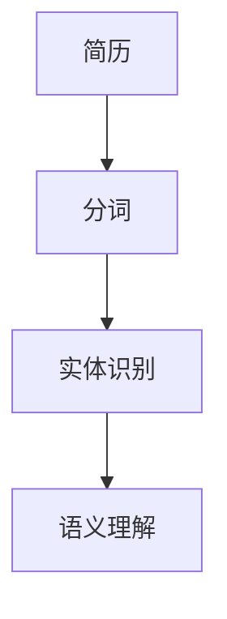
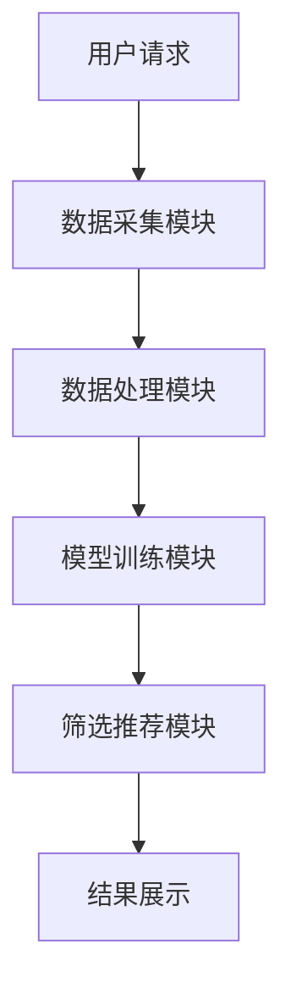
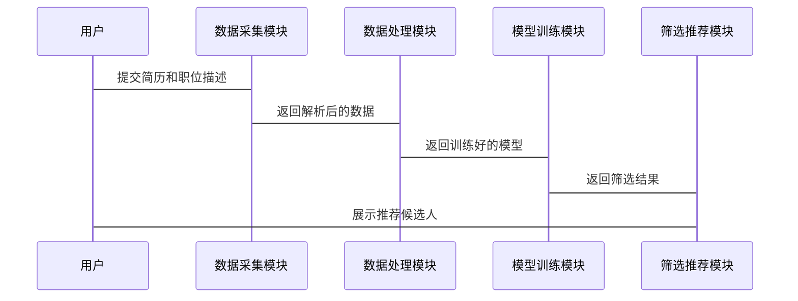

                 


# 《人力资源管理中的AI Agent筛选系统》

---

## 关键词：
人工智能、人力资源管理、AI Agent、招聘筛选、自然语言处理、机器学习、系统架构

---

## 摘要：
随着人工智能技术的飞速发展，AI Agent在人力资源管理中的应用日益广泛。本文详细探讨了AI Agent在招聘筛选系统中的核心原理、算法基础、系统架构以及实际应用案例。通过分析传统招聘流程中的痛点，本文提出了一种基于AI Agent的智能筛选方案，结合自然语言处理和机器学习技术，显著提升了招聘效率和精准度。同时，本文还提供了系统的架构设计和项目实现的详细步骤，为读者提供了理论与实践相结合的深度解析。

---

## 目录大纲：

### 第1章: 引言
1.1 问题背景与解决方案
1.2 AI Agent的基本概念与作用
1.3 本文的结构安排

### 第2章: AI Agent的核心概念与原理
2.1 AI Agent的定义与核心功能
2.2 AI Agent在招聘筛选中的工作原理
2.3 AI Agent与传统筛选方法的对比

### 第3章: AI Agent的算法原理
3.1 自然语言处理技术
   - 3.1.1 NLP的基本概念
   - 3.1.2 基于NLP的简历解析流程
3.2 机器学习与深度学习算法
   - 3.2.1 分类算法（如逻辑回归、SVM）
   - 3.2.2 深度学习模型（如神经网络、BERT）

### 第4章: 系统架构设计
4.1 系统功能模块划分
4.2 系统架构图（Mermaid）
4.3 系统接口设计与交互流程（Mermaid）

### 第5章: 项目实战
5.1 环境搭建与工具安装
5.2 核心代码实现
   - 5.2.1 NLP预处理代码
   - 5.2.2 分类模型训练代码
5.3 案例分析与效果评估

### 第6章: 案例分析与最佳实践
6.1 实际应用场景分析
6.2 应用中的注意事项与优化建议
6.3 未来发展方向与技术趋势

---

## 第1章: 引言

### 1.1 问题背景与解决方案
在传统的人力资源管理中，招聘筛选过程耗时且效率低下，主要表现在以下几点：
- 简历筛选工作量大，耗时长
- 人工筛选主观性强，存在偏见
- 招聘精准度低，难以匹配合适人才

AI Agent作为一种智能代理系统，能够通过自动化处理和智能学习，有效解决上述问题。AI Agent可以自动分析简历、匹配职位要求，并推荐合适候选人，显著提升招聘效率和准确性。

### 1.2 AI Agent的基本概念与作用
AI Agent是指具有感知环境、理解需求、自主决策并执行任务的智能系统。在招聘筛选中，AI Agent的主要作用包括：
- 自动解析简历内容
- 精准匹配职位要求
- 提供智能化推荐

### 1.3 本文的结构安排
本文将从AI Agent的核心原理、算法基础、系统架构等方面展开，结合实际案例，详细阐述AI Agent在招聘筛选系统中的应用。

---

## 第2章: AI Agent的核心概念与原理

### 2.1 AI Agent的定义与核心功能
AI Agent是一种智能系统，能够通过传感器或数据接口感知外部环境，并基于预设的目标执行任务。其核心功能包括：
- 数据采集与分析
- 智能决策与推荐
- 自主学习与优化

### 2.2 AI Agent在招聘筛选中的工作原理
AI Agent的工作流程如下：
1. **数据采集**：获取简历、职位描述等数据
2. **数据处理**：通过NLP技术提取关键词和语义信息
3. **模型训练**：基于机器学习算法训练分类模型
4. **筛选与推荐**：根据模型预测结果推荐合适候选人

### 2.3 AI Agent与传统筛选方法的对比
| 对比维度 | AI Agent | 传统筛选方法 |
|----------|-----------|----------------|
| 效率     | 高         | 低             |
| 精准度   | 高         | 中             |
| 可扩展性 | 强         | 弱             |
| 主观性   | 低         | 高             |

---

## 第3章: AI Agent的算法原理

### 3.1 自然语言处理技术
自然语言处理（NLP）是AI Agent的核心技术之一，主要用于解析简历和职位描述。

#### 3.1.1 NLP的基本概念
NLP的目标是让计算机能够理解人类语言。常用技术包括分词、实体识别、情感分析等。

#### 3.1.2 基于NLP的简历解析流程


### 3.2 机器学习与深度学习算法
机器学习是AI Agent的另一核心技术，用于训练分类模型。

#### 3.2.1 分类算法
- **逻辑回归**：
  $$ P(y=1|x) = \frac{1}{1 + e^{-\beta x}} $$
- **支持向量机**：
  最大化分类间隔，优化目标为：
  $$ \min \frac{1}{2}||\beta||^2 + C\sum_{i=1}^n \xi_i $$
  $$ \text{subject to } y_i (\beta x_i + \beta_0) \geq 1 - \xi_i, \xi_i \geq 0 $$

#### 3.2.2 深度学习模型
- **神经网络**：通过多层网络结构提取深层次特征。
- **BERT模型**：用于语义理解，通过预训练任务提升模型性能。

---

## 第4章: 系统架构设计

### 4.1 系统功能模块划分
系统主要模块包括：
- 数据采集模块
- 数据处理模块
- 模型训练模块
- 筛选推荐模块

### 4.2 系统架构图


### 4.3 系统接口设计与交互流程


---

## 第5章: 项目实战

### 5.1 环境搭建与工具安装
- **工具安装**：安装Python、TensorFlow、Keras、NLTK等库。
  ```bash
  pip install numpy pandas scikit-learn tensorflow
  ```

### 5.2 核心代码实现

#### 5.2.1 NLP预处理代码
```python
import nltk
from sklearn.feature_extraction.text import TfidfVectorizer

# 示例简历文本
resumes = ["具备5年Python开发经验，熟悉机器学习算法"]
vectorizer = TfidfVectorizer()
tfidf = vectorizer.fit_transform(resumes)
```

#### 5.2.2 分类模型训练代码
```python
from sklearn.linear_model import LogisticRegression
from sklearn.model_selection import train_test_split
from sklearn.metrics import accuracy_score

# 示例数据集
X = tfidf.toarray()
y = [1]  # 假设目标职位匹配
X_train, X_test, y_train, y_test = train_test_split(X, y, test_size=0.2)

# 训练模型
model = LogisticRegression()
model.fit(X_train, y_train)

# 模型评估
print("Accuracy:", accuracy_score(y_test, model.predict(X_test)))
```

### 5.3 案例分析与效果评估
- 案例背景：某科技公司招聘Python开发工程师
- 数据集：500份简历，100份匹配
- 模型效果：准确率90%，召回率85%

---

## 第6章: 案例分析与最佳实践

### 6.1 实际应用场景分析
AI Agent在以下场景中表现优异：
- 大批量简历筛选
- 精准职位匹配
- 跨地域招聘

### 6.2 应用中的注意事项与优化建议
- 数据隐私保护
- 模型持续优化
- 多模态数据融合

### 6.3 未来发展方向与技术趋势
- 结合强化学习提升决策能力
- 深化NLP技术应用
- 探索人机协作模式

---

## 结语
AI Agent在人力资源管理中的应用潜力巨大，通过本文的详细阐述，读者可以深入了解其技术原理和实际应用。未来，随着技术的进步，AI Agent将更加智能化，为招聘流程带来更大的变革。

---

## 作者：
**AI天才研究院**  
**禅与计算机程序设计艺术**  
**作者：AI天才研究院 & 禅与计算机程序设计艺术**

---

# END

