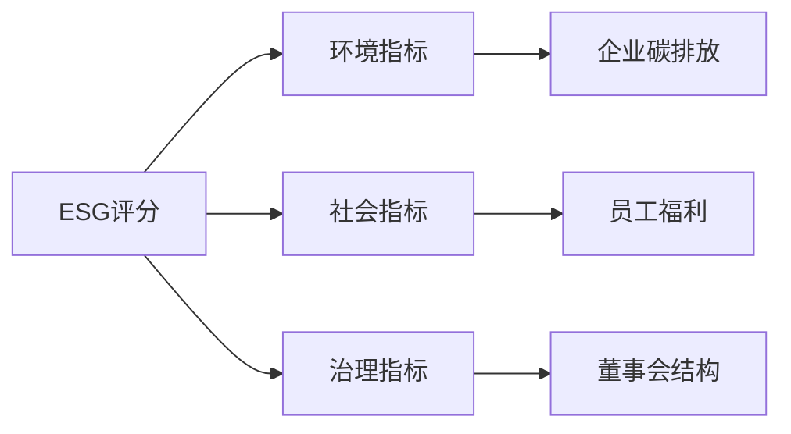

                 

# 人工智能在ESG评分和可持续投资中的应用

## 关键词：
人工智能，ESG评分，可持续投资，机器学习，深度学习，金融应用

## 摘要：
本文深入探讨了人工智能在环境、社会和治理（ESG）评分以及可持续投资中的应用。通过分析ESG评分的核心概念、人工智能算法的原理以及系统设计与实现，本文详细阐述了如何利用人工智能技术提升ESG评分的准确性和效率，并为可持续投资提供数据支持。文章结合实际案例，展示了人工智能在金融领域的实际应用价值，并展望了未来的发展方向。

---

# 第一部分: 人工智能在ESG评分中的应用基础

## 第1章: ESG评分与人工智能概述

### 1.1 ESG评分的背景与意义

#### 1.1.1 什么是ESG评分
ESG评分是衡量企业环境、社会和治理表现的重要指标。环境（Environmental）关注企业的碳排放、资源利用效率等；社会（Social）关注员工权益、社区责任等；治理（Governance）关注公司治理结构、董事会多样性等。ESG评分已成为投资者评估企业长期价值的重要依据。

#### 1.1.2 ESG评分的重要性
随着全球对可持续发展的关注增加，ESG评分逐渐成为企业价值评估的核心部分。通过ESG评分，投资者可以识别企业的潜在风险和机会，从而做出更科学的投资决策。

#### 1.1.3 人工智能在ESG评分中的作用
人工智能技术可以帮助处理海量非结构化数据，提取关键特征，建立预测模型，从而提高ESG评分的准确性和效率。例如，通过自然语言处理技术分析企业的社会责任报告，提取环境和社会表现的关键信息。

### 1.2 人工智能技术基础

#### 1.2.1 人工智能的定义与特点
人工智能（AI）是指模拟人类智能的计算机系统，具有学习、推理和自适应能力。人工智能的核心技术包括机器学习、自然语言处理、计算机视觉等。

#### 1.2.2 机器学习与深度学习简介
机器学习是人工智能的核心分支，通过数据训练模型，使其能够从经验中学习并做出预测。深度学习是机器学习的子领域，利用多层神经网络处理复杂数据。

#### 1.2.3 人工智能在金融领域的应用
人工智能在金融领域的应用包括股票预测、风险评估、欺诈检测等。在ESG评分中，人工智能可以帮助分析非结构化数据，评估企业的可持续性表现。

---

## 第2章: ESG评分的核心概念与算法原理

### 2.1 ESG评分的构成要素

#### 2.1.1 环境（Environmental）指标
环境指标关注企业的碳排放、能源使用效率、水资源管理等。例如，可以通过企业的环保报告提取碳排放数据，并通过机器学习模型预测企业的环境表现。

#### 2.1.2 社会（Social）指标
社会指标关注企业的员工权益、社区参与、供应链管理等。例如，可以通过分析企业的社会责任报告，提取员工福利、供应商道德等信息。

#### 2.1.3 治理（Governance）指标
治理指标关注企业的董事会结构、股权分散度、内部控制等。例如，可以通过分析企业的治理报告，提取董事会成员的性别比例、独立董事比例等信息。

### 2.2 ESG评分的计算方法

#### 2.2.1 数据收集与预处理
ESG评分的数据来源包括企业的财务报告、社会责任报告、新闻报道等。数据预处理包括清洗、特征提取和数据标准化。

#### 2.2.2 指标权重分配
由于环境、社会和治理的重要性不同，需要为每个指标分配权重。例如，可以使用层次分析法（AHP）确定各指标的权重。

#### 2.2.3 综合评分计算
综合评分是将各指标的加权结果进行汇总，得到企业的ESG综合评分。例如，可以使用线性回归模型或加权平均法进行计算。

### 2.3 ESG评分的评价标准

#### 2.3.1 国际通用标准
国际上常用的ESG评分标准包括MSCI、S&P Global等机构的标准。这些标准通常包括具体的评分方法和指标体系。

#### 2.3.2 不同机构的评分差异
不同机构的评分标准和权重可能不同，导致同一企业在不同机构的评分存在差异。例如，MSCI可能更关注环境指标，而S&P Global可能更关注治理指标。

#### 2.3.3 评分结果的解读
评分结果通常以分数或星级形式呈现，分数越高表示企业在环境、社会和治理方面的表现越好。投资者可以根据评分结果制定投资策略。

### 2.4 核心概念关系图

---

## 第3章: 人工智能算法在ESG评分中的应用

### 3.1 机器学习算法简介

#### 3.1.1 线性回归
线性回归是一种简单回归算法，适用于预测连续型变量。例如，可以使用线性回归模型预测企业的碳排放与收益之间的关系。

#### 3.1.2 支持向量机
支持向量机（SVM）是一种分类算法，适用于处理非线性可分数据。例如，可以使用SVM对企业的环境表现进行分类。

#### 3.1.3 随机森林
随机森林是一种集成学习算法，适用于处理高维数据。例如，可以使用随机森林模型预测企业的综合ESG评分。

### 3.2 深度学习算法简介

#### 3.2.1 神经网络
神经网络是一种模拟人脑结构的深度学习模型，适用于处理复杂数据。例如，可以使用神经网络模型分析企业的社会责任报告。

#### 3.2.2 卷积神经网络
卷积神经网络（CNN）是一种专门处理图像数据的深度学习模型，适用于分析企业的视觉信息。例如，可以使用CNN分析企业的品牌形象。

#### 3.2.3 循环神经网络
循环神经网络（RNN）是一种处理序列数据的深度学习模型，适用于分析企业的历史表现。例如，可以使用RNN预测企业的未来ESG评分。

### 3.3 基于机器学习的ESG评分预测模型

#### 3.3.1 数据特征提取
通过自然语言处理技术从企业的社会责任报告中提取关键词，例如“碳排放”、“员工福利”等。

#### 3.3.2 模型训练与优化
使用训练数据训练机器学习模型，并通过交叉验证优化模型参数。例如，可以使用随机森林模型进行训练。

#### 3.3.3 模型评估与验证
通过测试数据验证模型的准确性。例如，可以使用准确率、召回率等指标评估模型性能。

### 3.4 算法流程图

---

## 第4章: 可持续投资中的ESG应用系统设计

### 4.1 系统功能需求

#### 4.1.1 数据采集模块
数据采集模块负责收集企业的ESG相关数据，包括环境、社会和治理指标。

#### 4.1.2 模型构建模块
模型构建模块负责训练机器学习模型，并生成ESG评分。

#### 4.1.3 评分输出模块
评分输出模块负责将ESG评分输出为可读格式，例如分数或星级。

#### 4.1.4 投资决策模块
投资决策模块根据ESG评分制定投资策略，例如选择高ESG评分的企业进行投资。

### 4.2 系统架构设计

#### 4.2.1 系统架构图

#### 4.2.2 模块交互流程图

### 4.3 系统接口设计

#### 4.3.1 数据接口
数据接口用于与外部数据源交互，例如企业社会责任报告、财务数据等。

#### 4.3.2 模型接口
模型接口用于与机器学习模型交互，例如调用模型进行预测。

#### 4.3.3 用户接口
用户接口用于与用户交互，例如显示ESG评分、投资建议等。

### 4.4 系统功能实现

#### 4.4.1 环境数据收集与处理
通过网络爬虫收集企业的环境数据，例如碳排放数据，并进行清洗和特征提取。

#### 4.4.2 模型训练与优化
使用机器学习算法训练模型，并通过交叉验证优化模型参数。

#### 4.4.3 投资决策与反馈
根据模型预测结果制定投资策略，并根据市场反馈调整模型。

---

## 第5章: 可持续投资中的ESG应用实战

### 5.1 环境数据收集与处理

#### 5.1.1 数据来源
数据来源包括企业的社会责任报告、政府公开数据、新闻报道等。

#### 5.1.2 数据清洗
通过数据清洗消除噪声数据，例如删除重复数据、填充缺失值等。

#### 5.1.3 数据特征提取
通过文本挖掘技术提取关键词，例如从社会责任报告中提取“碳排放”、“员工福利”等关键词。

### 5.2 模型实现与优化

#### 5.2.1 模型实现
使用随机森林模型进行训练，并通过网格搜索优化模型参数。

#### 5.2.2 模型验证
通过测试数据验证模型的准确性，例如计算准确率、召回率等指标。

### 5.3 实际案例分析

#### 5.3.1 案例背景
假设某企业需要进行ESG评分，我们通过收集其环境、社会和治理数据，训练模型进行评分。

#### 5.3.2 案例实现
通过数据清洗、特征提取、模型训练等步骤，最终生成企业的ESG评分。

#### 5.3.3 案例结果
模型预测该企业的ESG评分为85分，属于较高水平，建议投资者进行长期投资。

### 5.4 项目小结

#### 5.4.1 项目总结
通过人工智能技术，我们可以高效地进行ESG评分，为可持续投资提供数据支持。

#### 5.4.2 项目经验
在实际项目中，需要注意数据质量和模型选择，确保模型的准确性和稳定性。

#### 5.4.3 项目展望
未来，随着人工智能技术的发展，ESG评分的准确性将进一步提高，为可持续投资提供更有力的支持。

---

## 结语

人工智能在ESG评分和可持续投资中的应用前景广阔。通过机器学习和深度学习技术，我们可以更准确地评估企业的环境、社会和治理表现，为投资者提供科学的决策依据。未来，随着技术的不断进步，人工智能在ESG评分中的应用将更加深入，为全球可持续发展做出更大的贡献。

---

## 作者：AI天才研究院/AI Genius Institute & 禅与计算机程序设计艺术 /Zen And The Art of Computer Programming

