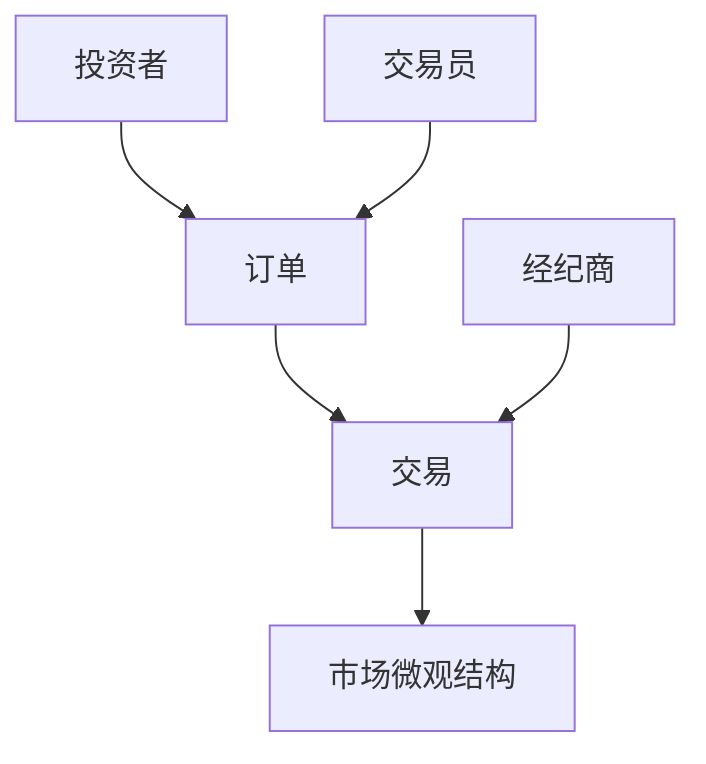
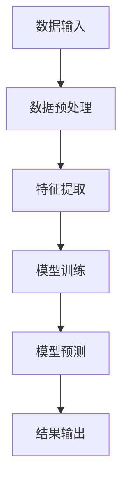

                 


# 人工智能在市场微观结构建模中的应用

> 关键词：人工智能、市场微观结构、机器学习、深度学习、金融建模

> 摘要：本文探讨人工智能在市场微观结构建模中的应用，从背景、核心概念、算法原理到系统架构设计和项目实战，全面解析AI如何提升金融建模的准确性和效率。

---

## 第一部分: 背景介绍

### 第1章: 市场微观结构的基本概念

#### 1.1 市场微观结构的定义与特点
##### 1.1.1 市场微观结构的定义
市场微观结构是指金融市场的组成部分及其相互关系，包括投资者、订单、交易等核心要素。通过分析这些要素，可以揭示市场的运行机制和动态特征。

##### 1.1.2 市场微观结构的核心特点
- **实时性**：市场数据不断更新，需要实时处理。
- **复杂性**：涉及多种参与者和交互，关系复杂。
- **动态性**：市场环境不断变化，模型需动态调整。

##### 1.1.3 市场微观结构与宏观市场的关系
微观结构是宏观市场的基础，影响整体市场的稳定性。例如，订单簿的深度直接影响资产价格的波动。

#### 1.2 人工智能的基本概念
##### 1.2.1 人工智能的定义
人工智能是模拟人类智能的技术，涵盖学习、推理和自适应能力。

##### 1.2.2 人工智能的核心技术
- **机器学习**：通过数据训练模型，实现预测和分类。
- **深度学习**：基于神经网络，处理非结构化数据。
- **自然语言处理**：分析文本数据，提取信息。

##### 1.2.3 人工智能在金融领域的应用潜力
- **风险管理**：识别市场风险，优化投资组合。
- **交易策略**：利用算法进行高频交易，提高收益。
- **市场预测**：分析市场走势，辅助决策。

### 第2章: 人工智能在市场微观结构建模中的背景与问题

#### 2.1 市场微观结构建模的背景
##### 2.1.1 金融市场的发展与挑战
- 金融市场日益复杂，传统模型难以捕捉高频交易和非线性关系。
- 数据量激增，需要高效处理和分析方法。

##### 2.1.2 微观结构建模的重要性
- 了解市场运行机制，优化交易策略。
- 识别市场操纵，维护公平性。

##### 2.1.3 人工智能的引入动机
- AI能够处理海量数据，发现复杂模式。
- 提高预测精度，优化投资决策。

#### 2.2 问题背景与问题描述
##### 2.2.1 传统建模的局限性
- 传统统计模型假设数据分布，难以处理复杂关系。
- 需要大量特征工程，效率低下。

##### 2.2.2 AI在建模中的优势
- 自动特征提取，减少人工干预。
- 高维数据处理能力强，适合金融时间序列分析。

##### 2.2.3 当前研究中的主要问题
- 数据质量与完整性问题，影响模型准确性。
- 模型解释性不足，难以验证因果关系。
- 计算资源需求高，实施成本大。

#### 2.3 问题解决与边界
##### 2.3.1 AI如何解决建模问题
- 使用机器学习和深度学习，捕捉复杂模式。
- 实时数据处理，优化交易策略。

##### 2.3.2 建模的边界与外延
- 数据范围和时间窗口的限制。
- 模型适用性和泛化的考量。

##### 2.3.3 核心要素与组成结构
- 数据来源：订单簿、交易数据、市场深度。
- 模型选择：监督学习、无监督学习、强化学习。
- 计算资源：算力、存储和数据处理能力。

---

## 第二部分: 核心概念与联系

### 第3章: AI驱动的市场微观结构建模原理

#### 3.1 核心概念原理
##### 3.1.1 数据驱动的建模方法
- 数据预处理：清洗、标准化和特征提取。
- 特征工程：创建有意义的特征，如订单簿动量和市场深度变化率。

##### 3.1.2 机器学习在市场微观结构中的应用
- 监督学习：分类和回归任务，如预测价格变化。
- 无监督学习：聚类分析，识别市场状态。

##### 3.1.3 深度学习的优势与挑战
- 深度学习擅长处理非结构化数据，如自然语言文本。
- 训练时间长，参数调整复杂。

#### 3.2 核心概念对比分析
##### 3.2.1 传统统计模型与机器学习模型对比
| 特性          | 传统统计模型                | 机器学习模型               |
|---------------|-----------------------------|-----------------------------|
| 数据需求      | 需要明确的假设              | 数据驱动，无需假设          |
| 处理能力      | 适合线性关系                | 适合非线性复杂关系          |
| 解释性        | 高解释性                    | 低解释性，黑箱问题          |

##### 3.2.2 不同AI模型的性能特征对比
| 模型类型       | 适用场景                   | 优势                       |
|----------------|---------------------------|-----------------------------|
| 线性回归       | 线性关系                   | 简单，易于解释             |
| 支持向量机     | 分类任务                   | 高维数据表现优秀           |
| 随机森林       | 高维数据分类               | 抗过拟合，稳定性好           |
| 卷积神经网络   | 图像和序列数据             | 局部特征提取能力强         |
| Transformer     | 顺序数据和注意力机制       | 长序列处理效果好           |

##### 3.2.3 市场微观结构中的实体关系图


---

## 第三部分: 算法原理与数学模型

### 第4章: 常见AI算法及其在市场微观结构中的应用

#### 4.1 传统机器学习算法
##### 4.1.1 线性回归模型
线性回归用于预测连续型变量，如股票价格。数学模型：
$$ y = \beta_0 + \beta_1x_1 + \beta_2x_2 + \dots + \beta_nx_n + \epsilon $$

##### 4.1.2 支持向量机（SVM）
适用于分类和回归任务，通过最大化-margin优化问题。数学模型：
$$ \text{min} \frac{1}{2} \|\mathbf{w}\|^2 + C \sum_{i=1}^{n} \xi_i $$
$$ \text{subject to } y_i(\mathbf{w} \cdot \mathbf{x_i} + b) \geq 1 - \xi_i, \xi_i \geq 0 $$

##### 4.1.3 随机森林与梯度提升树
随机森林通过集成学习提高准确性，梯度提升树通过迭代优化模型。适合处理高维数据。

#### 4.2 深度学习算法
##### 4.2.1 卷积神经网络（CNN）
适合处理图像和序列数据，如K线图分析。数学模型：
$$ f(\mathbf{x}) = \sigma(W \mathbf{x} + b) $$

##### 4.2.2 循环神经网络（RNN）
适合时间序列数据，捕捉序列依赖性。数学模型：
$$ s_t = \sigma(W_{hh}s_{t-1} + W_{xh}x_t) $$
$$ h_t = s_t $$

##### 4.2.3 Transformer架构
基于注意力机制，适合长序列数据处理。数学模型：
$$ \text{Attention}(Q, K, V) = \text{softmax}\left(\frac{QK^T}{\sqrt{d_k}}\right)V $$

#### 4.3 算法流程图


---

## 第四部分: 系统架构设计

### 第5章: 市场微观结构建模的系统架构

#### 5.1 系统架构设计
系统分为数据层、算法层和应用层。数据层负责数据采集和存储，算法层处理建模，应用层展示结果。

##### 5.1.1 系统架构设计


##### 5.1.2 系统功能设计
- 数据预处理：清洗、标准化和特征提取。
- 模型训练：训练AI模型，优化参数。
- 模型预测：利用模型预测市场动态。
- 结果展示：可视化结果，辅助决策。

##### 5.1.3 系统交互设计


---

## 第五部分: 项目实战

### 第6章: 项目实战

#### 6.1 项目介绍
以高频交易中的价格预测为例，展示AI在市场微观结构建模中的实际应用。

#### 6.2 环境配置
- Python 3.8+
- 机器学习库（Scikit-learn、TensorFlow、PyTorch）
- 数据处理库（Pandas、NumPy）

#### 6.3 核心实现
##### 6.3.1 数据预处理
```python
import pandas as pd
import numpy as np

data = pd.read_csv('market_data.csv')
data = data.dropna()
data['log_return'] = np.log(data['price'].shift(1))
```

##### 6.3.2 模型训练与预测
```python
from sklearn.ensemble import RandomForestRegressor
from sklearn.metrics import mean_squared_error

model = RandomForestRegressor(n_estimators=100, random_state=42)
model.fit(X_train, y_train)
y_pred = model.predict(X_test)
print(mean_squared_error(y_test, y_pred))
```

#### 6.4 案例分析与结果解读
分析预测结果，评估模型性能，优化参数，提高准确性。

---

## 第六部分: 总结与扩展阅读

### 第7章: 总结与扩展阅读

#### 7.1 核心观点总结
人工智能为市场微观结构建模提供了新的方法，提高了预测精度和效率，但需要解决数据质量和模型解释性等挑战。

#### 7.2 扩展阅读
- 《Advances in Financial Machine Learning》
- 《Deep Learning for Market Microstructure》

#### 7.3 最佳实践Tips
- 数据预处理是关键，需仔细清洗和特征工程。
- 选择合适的模型，平衡准确性和计算资源。
- 注重模型解释性，避免黑箱问题。

#### 7.4 项目小结
通过实战项目，展示了AI在市场微观结构建模中的应用价值，为金融从业者提供了新思路。

---

作者：AI天才研究院/AI Genius Institute & 禅与计算机程序设计艺术 /Zen And The Art of Computer Programming

