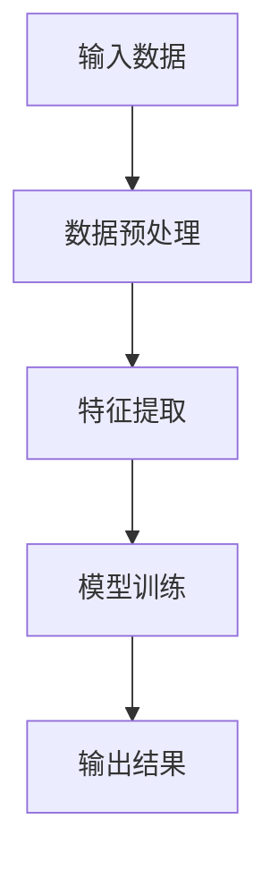

                 


# 人工智能在高频数据异常检测中的应用

> 关键词：人工智能、高频数据、异常检测、机器学习、深度学习

> 摘要：高频数据异常检测在金融、网络安全等领域具有重要应用。本文介绍异常检测的基本概念，分析高频数据的特点，探讨基于机器学习和深度学习的异常检测算法，展示系统设计和实际案例，总结实践经验。

---

# 引言

随着信息技术的飞速发展，高频数据在金融交易、网络流量监控等领域的应用越来越广泛。高频数据的实时性和大规模特点使得异常检测变得至关重要。本文将从基础到应用，全面探讨人工智能在高频数据异常检测中的应用。

---

# 第一部分：高频数据异常检测的背景与概述

## 第1章：高频数据的基本概念

### 1.1 高频数据的定义与特点

- **定义**：高频数据指在短时间内快速生成的大量数据，如金融交易、网络流量等。
- **特点**：
  - 数据量大
  - 产生速度快
  - 数据类型多样

### 1.2 异常检测的基本概念

- **定义**：识别数据中偏离正常模式的异常点。
- **分类**：
  - 点异常
  - 关系异常
  - 上下文异常

## 第2章：高频数据异常检测的应用场景

### 2.1 金融领域的应用

- **高频交易**：检测异常交易行为，防范市场操纵。
- **风险管理**：识别异常波动，降低投资风险。

### 2.2 网络流量中的应用

- **异常流量检测**：识别网络攻击、数据窃取等异常行为。
- **网络安全**：实时监控网络流量，防止入侵。

---

# 第二部分：高频数据异常检测的核心概念与联系

## 第3章：高频数据的特征分析

### 3.1 时间序列分析

- **定义**：对按时间顺序排列的数据进行分析。
- **关键特征**：
  - 均值
  - 方差
  - 周期性

### 3.2 数据预处理

- **数据清洗**：去除噪声数据。
- **数据标准化**：统一数据尺度。

## 第4章：异常检测的核心算法

### 4.1 基于统计的异常检测

#### Z-Score方法

- **公式**：$$ Z = \frac{x - \mu}{\sigma} $$
- **步骤**：
  1. 计算均值和标准差。
  2. 计算每个数据点的Z值。
  3. 标识Z值超过阈值的异常点。

---

# 第三部分：人工智能算法在高频数据异常检测中的应用

## 第5章：机器学习方法

### 5.1 支持向量机（SVM）

- **原理**：通过找到最优超平面，将数据分为正常和异常两类。
- **流程图**：


### 5.2 随机森林

- **原理**：利用决策树的集成方法，通过投票机制识别异常点。

## 第6章：深度学习方法

### 6.1 LSTM网络

- **原理**：利用长短期记忆单元，捕捉时间序列中的异常模式。
- **流程图**：


---

# 第四部分：系统设计与实现

## 第7章：系统架构设计

### 7.1 系统功能模块

- **数据采集**：实时采集高频数据。
- **特征提取**：提取关键特征。
- **模型训练**：训练异常检测模型。
- **实时检测**：在线检测异常。

### 7.2 系统架构图



---

# 第五部分：项目实战与案例分析

## 第8章：金融领域实战

### 8.1 环境安装

```bash
pip install numpy pandas scikit-learn
```

### 8.2 代码实现

```python
import numpy as np
from sklearn.ensemble import IsolationForest

# 示例数据
data = np.random.randn(10000)
model = IsolationForest(n_estimators=100, random_state=42)
model.fit(data.reshape(-1, 1))
predictions = model.predict(data.reshape(-1, 1))
```

### 8.3 案例分析

- **异常交易检测**：通过模型识别异常交易行为，防止市场操纵。

---

# 第六部分：总结与展望

## 第9章：总结与建议

### 9.1 总结

- 人工智能在高频数据异常检测中具有重要应用。
- 统计方法、机器学习和深度学习各有优缺点。

### 9.2 建议

- 结合多种方法，提高检测精度。
- 加强模型实时性优化。

## 第10章：未来展望

- **研究方向**：探索更高效的算法。
- **技术趋势**：结合边缘计算，提升实时性。

---

# 作者

作者：AI天才研究院  
联系邮箱：contact@aicourse.com  
GitHub：https://github.com/aicourse

