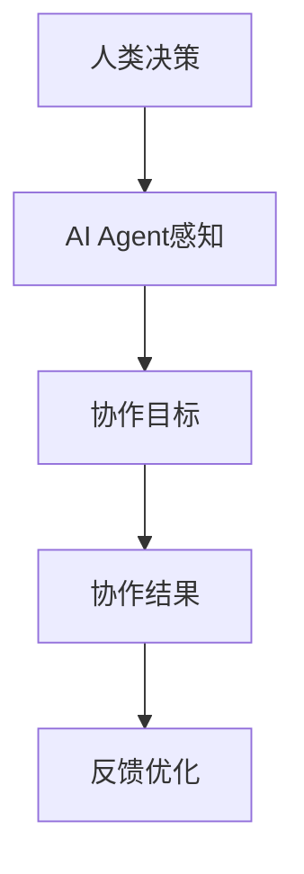
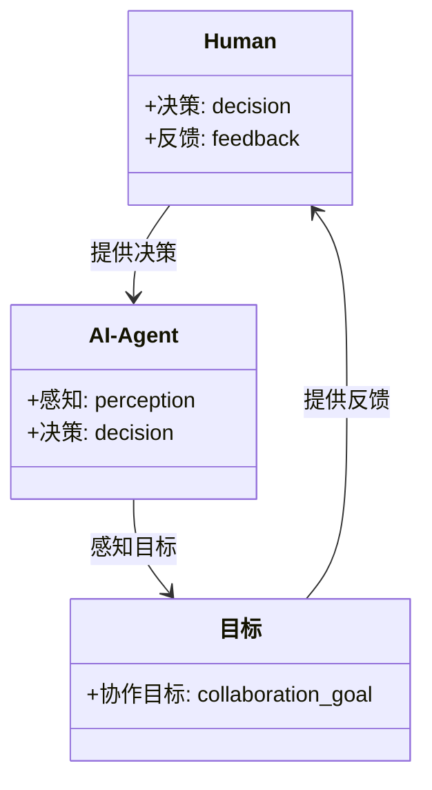
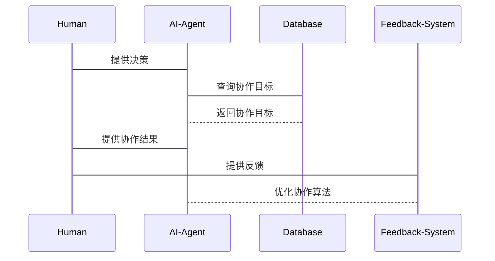

                 


# 人机协作：设计AI Agent与人类的配合模式

**关键词**：人机协作、AI Agent、人工智能、协作模式、系统设计、应用实践

**摘要**：  
随着人工智能技术的快速发展，AI Agent（智能体）与人类的协作模式正在成为人机交互领域的重要研究方向。本文从AI Agent的基本原理出发，分析人机协作的核心概念、算法原理、系统架构设计，结合实际案例，探讨如何设计高效的人机协作模式，最终实现人机共智的终极目标。通过本文的系统性分析与实践，读者将能够清晰理解人机协作的实现路径和应用价值。

---

## 第1章: 人机协作的背景与问题背景

### 1.1 人机协作的背景
#### 1.1.1 从人机交互到人机协作的演进
人机交互经历了从“命令行界面”到“图形用户界面”，再到“自然交互”的发展历程。随着AI技术的进步，人机协作正在从单一的“人机交互”向更加复杂的“协作共生”模式演进。AI Agent作为一种能够感知环境、自主决策的智能体，为人类提供了更强大的协作工具。

#### 1.1.2 AI Agent的定义与特点
AI Agent（智能体）是指能够感知环境、自主决策并执行任务的智能系统。其特点包括：
- **自主性**：能够自主决策，无需人工干预。
- **反应性**：能够实时感知环境并做出反应。
- **协作性**：能够与人类或其他智能体协作完成任务。
- **学习能力**：能够通过数据和经验不断优化自身的性能。

#### 1.1.3 人机协作的潜在应用领域
人机协作的应用场景广泛，包括：
- **医疗领域**：AI Agent辅助医生进行诊断和治疗方案设计。
- **金融领域**：AI Agent辅助分析师进行数据挖掘和风险评估。
- **制造业**：AI Agent辅助工人进行生产优化和质量控制。
- **教育领域**：AI Agent辅助教师进行个性化教学和学生评估。

### 1.2 人机协作的问题背景
#### 1.2.1 当前AI Agent与人类协作的痛点
尽管AI Agent技术已经取得了一定的进展，但在实际应用中仍然存在一些痛点：
- **信息不对称**：人类和AI Agent之间的信息传递存在障碍。
- **决策冲突**：AI Agent的决策可能与人类的目标不一致。
- **协作效率低**：现有协作模式缺乏高效的协同机制。

#### 1.2.2 协作模式的边界与外延
人机协作的边界在于：
- **协作范围**：AI Agent能够处理的任务范围。
- **协作深度**：AI Agent与人类协作的紧密程度。

协作的外延包括：
- **多智能体协作**：多个AI Agent之间的协作。
- **跨领域协作**：AI Agent与不同领域的人类专家协作。

#### 1.2.3 人机协作的核心要素与组成
人机协作的核心要素包括：
1. **目标一致性**：AI Agent与人类的目标一致。
2. **信息共享**：双方能够实时共享信息。
3. **协作机制**：高效的协作流程和规则。

### 1.3 本章小结
本章从人机协作的背景出发，分析了AI Agent的定义与特点，探讨了人机协作的潜在应用领域，并总结了当前协作模式的主要痛点和边界。接下来，我们将深入探讨人机协作的核心概念与联系。

---

## 第2章: AI Agent与人类协作的核心概念

### 2.1 AI Agent的核心原理
#### 2.1.1 AI Agent的定义与分类
AI Agent可以根据功能和应用场景进行分类：
- **简单反射型AI Agent**：基于规则的简单决策。
- **基于模型的AI Agent**：能够建模环境并进行复杂决策。
- **学习型AI Agent**：通过机器学习不断优化自身的决策能力。

#### 2.1.2 AI Agent的感知与决策机制
AI Agent的感知机制包括：
- **环境感知**：通过传感器或数据输入感知环境状态。
- **信息处理**：对感知到的信息进行分析和处理。
- **决策制定**：基于处理后的信息制定决策。

#### 2.1.3 AI Agent的执行与反馈机制
AI Agent的执行机制包括：
- **动作执行**：根据决策结果执行具体动作。
- **反馈接收**：接收环境对动作的反馈。

### 2.2 人类协作的核心要素
#### 2.2.1 人类的决策特点与局限性
人类的决策特点包括：
- **主观性**：决策受到人类情感、经验的影响。
- **有限性**：人类的决策能力受到时间和信息的限制。

#### 2.2.2 人类与AI Agent的协作需求
人类与AI Agent协作的需求包括：
- **信息透明**：双方能够清晰理解协作的目标和过程。
- **信任建立**：人类需要信任AI Agent的能力和意图。
- **高效协作**：协作过程需要高效且有序。

#### 2.2.3 人机协作的目标与实现路径
人机协作的目标是实现：
- **任务完成**：高效完成协作任务。
- **能力互补**：AI Agent与人类的能力互补。
- **持续优化**：通过协作不断优化AI Agent的能力。

### 2.3 AI Agent与人类协作的核心概念对比
#### 2.3.1 协作模式的特征对比表格

| 特征                | 人类协作                  | AI Agent协作                 |
|---------------------|---------------------------|------------------------------|
| 决策主体            | 人类                      | AI Agent                     |
| 决策方式            | 主观性、经验驱动           | 数据驱动、算法驱动           |
| 决策速度            | 较慢                     | 较快                         |
| 决策准确性          | 受限于经验和信息           | 基于大数据和算法优化         |

#### 2.3.2 协作流程的ER实体关系图
```mermaid
erd
actor:人类
agent:AI Agent
goal:协作目标
collaboration:协作过程
feedback:反馈
actor -协作-> agent
agent -感知-> goal
goal -驱动-> collaboration
collaboration -反馈-> feedback
feedback -优化-> actor
feedback -优化-> agent
```

### 2.4 本章小结
本章从AI Agent的核心原理出发，分析了人类协作的特点与需求，并通过对比表格和实体关系图，明确了AI Agent与人类协作的核心概念。接下来，我们将深入探讨人机协作的算法原理与数学模型。

---

## 第3章: 人机协作的算法原理与数学模型

### 3.1 协作算法的基本原理
#### 3.1.1 协作算法的定义与分类
协作算法可以根据应用场景分为：
- **基于规则的协作算法**：基于预定义规则的协作。
- **基于学习的协作算法**：通过机器学习优化协作过程。
- **基于博弈论的协作算法**：基于博弈论进行协作决策。

#### 3.1.2 基于概率论的协作算法
基于概率论的协作算法用于评估不同决策的概率，从而选择最优协作路径。例如：
$$ P(A|B) = \frac{P(B|A)P(A)}{P(B)} $$
其中，$P(A|B)$ 表示在事件B发生的条件下，事件A发生的概率。

#### 3.1.3 基于强化学习的协作算法
基于强化学习的协作算法通过奖励机制优化协作行为。例如：
$$ R = r_1 + r_2 + \dots + r_n $$
其中，$R$ 是总奖励，$r_i$ 是每一步的奖励。

### 3.2 协作算法的数学模型
#### 3.2.1 协作算法的数学公式
协作算法的数学模型可以表示为：
$$ f(x) = \sum_{i=1}^{n} w_i x_i $$
其中，$w_i$ 是权重，$x_i$ 是输入特征。

#### 3.2.2 协作算法的流程图


### 3.3 协作算法的Python实现
#### 3.3.1 算法实现代码
```python
def collaborative_algorithm(human_decision, ai_decision):
    # 协作逻辑
    result = human_decision + ai_decision
    return result
```

#### 3.3.2 代码解读与优化
上述代码展示了协作算法的基本逻辑，通过将人类决策和AI Agent的决策进行加权求和，得到最终的协作结果。为了优化协作效率，可以引入反馈机制，不断调整权重参数。

### 3.4 本章小结
本章从协作算法的基本原理出发，分析了基于概率论和强化学习的协作算法，并通过数学公式和流程图展示了协作算法的实现过程。接下来，我们将深入探讨人机协作系统的分析与架构设计。

---

## 第4章: 人机协作系统的分析与架构设计

### 4.1 系统问题场景介绍
#### 4.1.1 协作场景的定义
以医疗领域为例，AI Agent与医生协作完成病灶诊断和治疗方案设计。

#### 4.1.2 协作场景的特征
- **实时性**：协作过程需要实时进行。
- **准确性**：协作结果需要准确无误。
- **安全性**：协作过程需要确保数据安全。

### 4.2 系统功能设计
#### 4.2.1 领域模型


#### 4.2.2 系统架构设计


#### 4.2.3 系统接口设计
- **Human-Interface**：人类与AI Agent的交互界面。
- **Database**：存储协作过程中的数据。
- **Feedback-System**：接收反馈并优化协作算法。

#### 4.2.4 系统交互序列图


### 4.3 本章小结
本章从系统问题场景出发，分析了协作系统的功能设计和架构设计，并通过类图和序列图展示了协作过程。接下来，我们将深入探讨人机协作的项目实战。

---

## 第5章: 人机协作的项目实战

### 5.1 环境安装
- **Python环境**：安装Python 3.8及以上版本。
- **依赖库**：安装numpy、pandas、scikit-learn等机器学习库。

### 5.2 系统核心实现源代码
```python
import numpy as np
from sklearn import linear_model

def collaborative_algorithm(human_decision, ai_decision):
    # 初始化协作模型
    model = linear_model.LinearRegression()
    # 训练模型
    model.fit(human_decision.reshape(-1, 1), ai_decision)
    # 预测协作结果
    result = model.predict(human_decision.reshape(-1, 1))
    return result
```

#### 5.2.1 代码解读与优化
上述代码展示了基于线性回归的协作算法实现。通过训练模型，AI Agent能够根据人类的决策预测协作结果。

#### 5.2.2 案例分析
以医疗领域的病灶诊断为例，AI Agent可以根据医生的诊断建议，预测最终的治疗方案，并通过反馈优化协作模型。

### 5.3 本章小结
本章通过实际案例展示了人机协作的实现过程，并分析了协作算法在实际应用中的效果。接下来，我们将总结人机协作的最佳实践。

---

## 第6章: 人机协作的最佳实践

### 6.1 协作设计的原则
- **目标一致性**：确保AI Agent与人类的目标一致。
- **信息透明**：双方能够实时共享信息。
- **信任建立**：通过透明和高效的协作过程建立信任。

### 6.2 设计建议
- **持续优化**：通过反馈机制不断优化协作模型。
- **能力互补**：根据任务特点选择合适的协作模式。

### 6.3 拓展阅读
- **推荐书籍**：《人机协作：人工智能与人类的共生之道》
- **推荐论文**：《Collaborative AI: A Survey on Human-Agent Collaboration》

### 6.4 本章小结
本章总结了人机协作的最佳实践，并为读者提供了进一步学习的方向。

---

## 作者：AI天才研究院/AI Genius Institute & 禅与计算机程序设计艺术/Zen And The Art of Computer Programming

