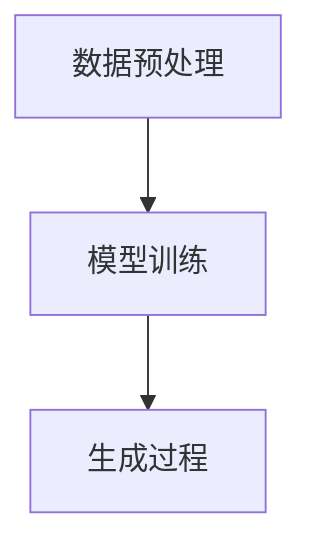
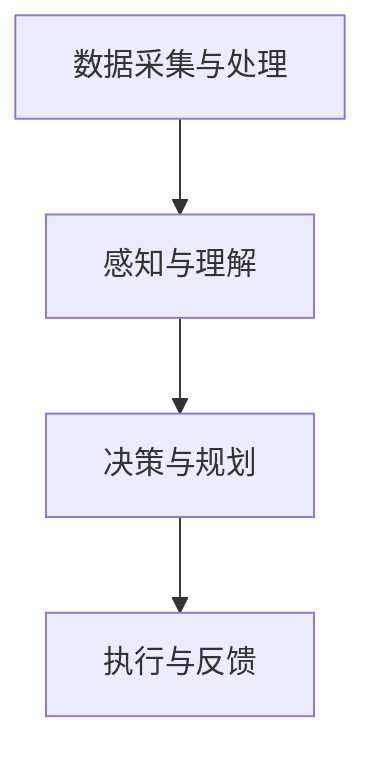
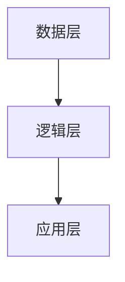
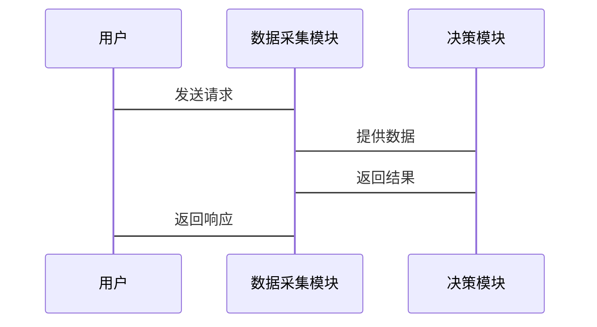

                 


# 从GPT到AI Agent：技术演进与应用变革

> **关键词**：生成式AI，AI Agent，GPT，技术演进，应用变革

> **摘要**：本文从生成式AI的发展历程出发，探讨了从GPT到AI Agent的技术演进与应用变革。通过分析生成式AI的核心原理、AI Agent的基本概念、系统架构设计以及实际项目案例，深入解析了生成式AI与AI Agent的协同关系及其在各领域的广泛应用。文章最后总结了技术发展的关键点，并展望了未来的发展趋势。

---

## 第一部分：生成式AI的发展历程

### 第1章：生成式AI的起源与演进

#### 1.1 生成式AI的定义与核心原理

生成式AI是一种能够生成新内容的人工智能技术，它通过学习大量的数据，模仿人类的思维方式，生成与训练数据类似的文本、图像或其他形式的内容。生成式AI的核心原理在于其模型能够通过概率分布来预测下一个可能的输出，从而实现内容的生成。

生成式AI与传统AI的区别主要体现在其生成能力上。传统AI更多关注于分类、回归等任务，而生成式AI则专注于生成新的数据，具有更强的创造性和灵活性。

#### 1.2 GPT系列模型的发展历程

GPT（Generative Pre-trained Transformer）系列模型是生成式AI领域的重要里程碑。从GPT-1到GPT-4，每个版本都代表了技术的进步和功能的增强。

- **GPT-1**：基础架构与初步尝试  
  GPT-1是生成式AI的早期尝试，主要基于Transformer架构，通过预训练的方式生成文本。尽管生成效果有限，但为后续研究奠定了基础。

- **GPT-2**：语言模型的改进与优化  
  GPT-2在GPT-1的基础上改进了模型结构，增加了模型的参数数量，生成的文本质量显著提升。同时，GPT-2还引入了多任务学习的能力，进一步增强了模型的泛化能力。

- **GPT-3**：通用化与可扩展性的突破  
  GPT-3采用了更大的模型规模和更复杂的训练策略，支持多种任务的生成，包括文本生成、对话生成等。其核心优势在于模型的通用性和可扩展性，能够适应更广泛的应用场景。

- **GPT-4**：多模态与功能的全面升级  
  GPT-4在GPT-3的基础上，引入了多模态输入，能够处理图像、文本等多种数据类型。其生成能力更加智能化，能够进行复杂任务的决策和生成。

#### 1.3 生成式AI的应用场景与挑战

生成式AI的应用场景广泛，包括自然语言处理、图像生成、音频生成等。在自然语言处理领域，生成式AI被用于自动文本生成、机器翻译、对话系统等。在图像生成领域，生成式AI被用于图像修复、图像生成等任务。

尽管生成式AI取得了显著进展，但其发展仍面临一些挑战。例如，生成内容的质量和一致性需要进一步提升，生成过程中的可解释性问题尚未得到充分解决。此外，生成式AI的应用还受到计算资源和数据隐私的限制。

---

## 第二部分：从生成式AI到AI Agent的核心概念

### 第2章：AI Agent的基本概念与分类

#### 2.1 AI Agent的定义与特点

AI Agent（人工智能代理）是一种能够感知环境、做出决策并执行任务的智能实体。AI Agent的核心特点包括自主性、反应性、目标导向性和社会性。与生成式AI不同，AI Agent不仅能够生成内容，还能够根据环境信息进行自主决策和行动。

#### 2.2 AI Agent的分类与应用场景

AI Agent可以根据功能和应用场景进行分类，主要包括以下几种类型：

- **基于任务的AI Agent**：这类AI Agent专注于完成特定任务，例如自动调度系统、智能客服等。
- **基于对话的AI Agent**：这类AI Agent主要用于对话交互，例如智能音箱、虚拟助手等。
- **基于决策的AI Agent**：这类AI Agent专注于复杂决策任务，例如自动驾驶、智能投资等。

AI Agent的应用场景广泛，涵盖了智能家居、医疗健康、金融投资、自动驾驶等多个领域。

#### 2.3 生成式AI与AI Agent的联系与区别

生成式AI与AI Agent之间既有联系又有区别。生成式AI主要关注内容的生成，而AI Agent则更注重任务的执行和环境的交互。生成式AI是AI Agent的重要组成部分，AI Agent可以通过生成式AI生成内容，从而实现更复杂的任务。

---

## 第三部分：生成式AI与AI Agent的核心技术原理

### 第3章：生成式AI的算法原理

#### 3.1 生成式AI的数学模型与公式

生成式AI的数学模型通常基于概率分布。生成式模型的目标是学习数据的分布，从而能够生成新的数据点。概率分布的核心公式可以表示为：

$$ P(x) = \prod_{i=1}^{n} P(x_i | x_{i-1}) $$

其中，$x_i$ 表示第i个数据点，$P(x_i | x_{i-1})$ 表示在给定前一个数据点的条件下，生成当前数据点的概率。

#### 3.2 生成式AI的算法流程

生成式AI的算法流程通常包括数据预处理、模型训练和生成过程三个阶段。

1. **数据预处理**：对原始数据进行清洗、归一化等预处理操作，确保数据符合模型输入要求。
2. **模型训练**：通过梯度下降等优化算法，调整模型参数，以最小化生成结果与真实数据之间的差异。
3. **生成过程**：根据训练好的模型，生成新的数据点。

生成式AI的算法流程可以用Mermaid图表示为：



#### 3.3 生成式AI的代码实现示例

以下是生成式AI的简单Python代码实现示例：

```python
import numpy as np

def generate_text(model, prompt):
    # 数据预处理
    input_ids = tokenizer.encode(prompt, return_tensors='np')
    # 模型训练
    outputs = model.generate(input_ids, max_length=50)
    # 生成过程
    generated_text = tokenizer.decode(outputs[0].tolist())
    return generated_text

# 环境安装与依赖管理
# pip install transformers
from transformers import GPT2Tokenizer, GPT2Model

model_name = 'gpt2'
tokenizer = GPT2Tokenizer.from_pretrained(model_name)
model = GPT2Model.from_pretrained(model_name)
```

---

## 第四部分：AI Agent的系统架构与实现

### 第4章：AI Agent的系统架构设计

#### 4.1 AI Agent的系统功能模块

AI Agent的系统功能模块包括：

- **数据采集与处理模块**：负责采集和处理环境中的数据。
- **感知与理解模块**：负责对环境数据进行理解和分析。
- **决策与规划模块**：负责根据理解和分析结果，制定决策和行动计划。
- **执行与反馈模块**：负责执行决策并根据反馈调整行动。

AI Agent的功能模块可以用Mermaid图表示为：



#### 4.2 AI Agent的系统架构设计

AI Agent的系统架构设计包括：

- **功能模块设计**：根据功能需求，设计系统的功能模块。
- **架构设计**：采用分层架构，包括数据层、逻辑层和应用层。
- **接口设计**：定义模块之间的接口，确保模块之间的通信和协作。

AI Agent的系统架构可以用Mermaid图表示为：



#### 4.3 AI Agent的系统交互流程

AI Agent的系统交互流程可以用Mermaid序列图表示为：



---

## 第五部分：生成式AI与AI Agent的协同工作模式

### 第5章：生成式AI在AI Agent中的应用

#### 5.1 生成式AI作为AI Agent的内容生成模块

生成式AI可以作为AI Agent的内容生成模块，负责生成文本、图像等输出内容。例如，在智能客服系统中，生成式AI可以生成回复文本。

#### 5.2 AI Agent作为生成式AI的决策层

AI Agent可以作为生成式AI的决策层，根据生成内容和环境信息，制定下一步行动。例如，在自动驾驶系统中，AI Agent可以根据生成的环境感知结果，制定驾驶决策。

#### 5.3 生成式AI与AI Agent的协同工作模式

生成式AI与AI Agent的协同工作模式可以分为以下几种：

- **独立模式**：生成式AI独立生成内容，AI Agent根据生成内容进行决策。
- **混合模式**：生成式AI与AI Agent协同工作，共同完成任务。
- **嵌入模式**：生成式AI嵌入AI Agent的系统架构中，作为其功能模块之一。

---

## 第六部分：项目实战

### 第6章：生成式AI与AI Agent的项目实战

#### 6.1 项目环境安装与依赖管理

在开始项目之前，需要安装必要的依赖库。例如，生成式AI的实现可能需要以下库：

```bash
pip install transformers
pip install numpy
```

#### 6.2 生成式AI的核心代码实现

以下是生成式AI的核心代码实现示例：

```python
import torch
import torch.nn as nn
import torch.optim as optim

class GPTModel(nn.Module):
    def __init__(self, vocab_size):
        super(GPTModel, self).__init__()
        self.embedding = nn.Embedding(vocab_size, 512)
        self.lm_head = nn.Linear(512, vocab_size)

    def forward(self, input_ids):
        embeds = self.embedding(input_ids)
        outputs = self.lm_head(embeds)
        return outputs

# 初始化模型
vocab_size = 10000
model = GPTModel(vocab_size)

# 定义损失函数和优化器
criterion = nn.CrossEntropyLoss()
optimizer = optim.Adam(model.parameters(), lr=0.001)

# 训练过程
for epoch in range(num_epochs):
    for batch in batches:
        optimizer.zero_grad()
        outputs = model(batch['input_ids'])
        loss = criterion(outputs, batch['labels'])
        loss.backward()
        optimizer.step()
```

#### 6.3 AI Agent的核心代码实现

以下是AI Agent的核心代码实现示例：

```python
class AIAssistant:
    def __init__(self):
        self.nlu = NaturalLanguageUnderstanding()
        self.dialogue_manager = DialogueManager()
        self.nlg = NaturalLanguageGeneration()

    def process_request(self, user_input):
        # 分析用户输入
        intent = self.nlu.analyze(user_input)
        # 生成响应
        response = self.nlg.generate_response(intent)
        return response
```

#### 6.4 项目总结

通过项目实战，我们可以看到生成式AI与AI Agent的协同工作模式。生成式AI负责内容的生成，AI Agent负责任务的执行和环境的交互。两者结合，能够实现更加复杂和智能化的任务。

---

## 第七部分：最佳实践与总结

### 第7章：生成式AI与AI Agent的技术总结

#### 7.1 关键点总结

- 生成式AI的核心原理是基于概率分布的内容生成。
- AI Agent是一种能够感知环境、做出决策并执行任务的智能实体。
- 生成式AI与AI Agent的协同工作模式可以实现更加复杂和智能化的任务。

#### 7.2 小结

从GPT到AI Agent，生成式AI技术不断演进，应用范围不断扩大。AI Agent作为生成式AI的扩展与增强，能够实现更复杂的任务和更广泛的应用场景。

#### 7.3 注意事项

- 在实际应用中，需要考虑生成内容的质量和一致性。
- 需要注意生成式AI的可解释性问题。
- 在AI Agent的设计中，需要考虑系统的鲁棒性和安全性。

#### 7.4 拓展阅读

- 《Deep Learning》—— Ian Goodfellow
- 《Generative Models and Model-Based Reinforcement Learning》—— OpenAI
- 《Artificial Intelligence: A Modern Approach》—— Stuart Russell

---

## 作者信息

作者：AI天才研究院/AI Genius Institute & 禅与计算机程序设计艺术/Zen And The Art of Computer Programming

---

通过本文的详细分析，我们从生成式AI的发展历程到AI Agent的核心概念、算法原理、系统架构设计，再到项目实战和最佳实践，全面探讨了从GPT到AI Agent的技术演进与应用变革。希望本文能够为读者提供清晰的技术视角，帮助他们在生成式AI和AI Agent领域深入理解和实践。

