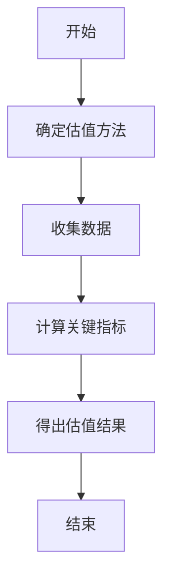

                 


# 从零开始学习企业估值方法

---

## 关键词：
企业估值、DCF模型、相对估值法、财务分析、企业价值、折现率、并购评估

---

## 摘要：
本文从零开始系统地讲解企业估值的核心概念、方法和实践。通过逐步分析企业估值的背景、核心概念、算法原理、系统架构以及实际案例，帮助读者掌握从基础到高级的企业估值技巧。文章内容包括企业估值的数学模型、相对估值法、DCF模型、企业架构设计、项目实战等，结合公式推导、代码实现和案例分析，为读者提供全面的企业估值知识体系。

---

## 目录大纲

### 第一章: 企业估值的背景与意义

#### 1.1 企业估值的基本概念
- 什么是企业估值
- 企业估值的常见应用场景
- 企业估值的重要性

#### 1.2 企业估值的核心问题
- 企业价值的定义与度量
- 企业估值的难点与挑战
- 企业估值的边界与外延

#### 1.3 企业估值的基本方法与分类
- 市场法、收益法、资产法的定义与特点
- 不同方法的适用场景与优缺点
- 企业估值方法的选择依据

#### 1.4 本章小结

---

### 第二章: 企业估值的核心概念与联系

#### 2.1 企业估值的核心要素
- 企业自由现金流的概念与公式
- 折现率的定义与计算方法
- 企业价值的公式推导

#### 2.2 核心概念的原理与联系
- 企业自由现金流模型的原理
- 折现率与风险的关系
- 企业价值与市场环境的互动

#### 2.3 核心概念的对比分析
- 不同估值方法的对比表格
- 企业估值模型的ER实体关系图

#### 2.4 本章小结

---

### 第三章: 企业估值的算法原理

#### 3.1 现金流折现模型（DCF模型）
- DCF模型的算法流程
- 现金流预测的步骤
- 折现率的计算方法

#### 3.2 相对估值法
- 市盈率法的原理与应用
- 市净率法的原理与应用
- EV/EBITDA倍数法的原理与应用

#### 3.3 企业估值算法的数学模型
- DCF模型的数学公式：
  $$\text{企业价值} = \sum_{t=1}^{n} \frac{CF_t}{(1+r)^t} + \frac{TV}{(1+r)^n}$$
- 相对估值法的数学公式：
  $$\text{目标公司价值} = \text{可比公司价值} \times \text{估值倍数}$$

#### 3.4 算法原理的Mermaid流程图


#### 3.5 本章小结

---

### 第四章: 企业估值的系统分析与架构设计

#### 4.1 企业估值的系统分析
- 问题场景介绍
- 项目目标与范围
- 系统功能设计（领域模型Mermaid类图）

#### 4.2 企业估值的系统架构设计
- 系统架构Mermaid架构图
- 系统接口设计
- 系统交互Mermaid序列图

#### 4.3 本章小结

---

### 第五章: 企业估值的项目实战

#### 5.1 项目背景与目标
- 项目背景介绍
- 项目目标与范围
- 项目需求分析

#### 5.2 项目实施步骤
- 环境安装与配置
- 数据收集与处理
- 模型实现与验证
- 结果分析与优化

#### 5.3 项目核心代码实现
- Python代码实现DCF模型
  ```python
  def calculate_enterprise_value(free_cash_flow, discount_rate, terminal_value):
      present_value = 0
      for t in range(len(free_cash_flow)):
          present_value += free_cash_flow[t] / (1 + discount_rate) ** t
      present_value += terminal_value / (1 + discount_rate) ** len(free_cash_flow)
      return present_value
  ```

#### 5.4 项目案例分析
- 案例分析与详细解读
- 实际案例中的应用与结果
- 案例总结与经验分享

#### 5.5 本章小结

---

### 第六章: 企业估值的最佳实践与注意事项

#### 6.1 企业估值的注意事项
- 数据的准确性和完整性
- 模型的假设与局限性
- 结果的验证与敏感性分析

#### 6.2 企业估值的最佳实践
- 数据收集的技巧
- 模型优化的方法
- 结果呈现与沟通的技巧

#### 6.3 本章小结

---

### 第七章: 企业估值的拓展阅读与深入学习

#### 7.1 拓展阅读推荐
- 经典书籍推荐
- 其他学习资源推荐

#### 7.2 深入学习方向
- 高级估值方法
- 行业估值特点
- 国际估值标准

#### 7.3 本章小结

---

### 附录

#### 附录A: 企业估值相关公式汇总
- DCF模型公式
- 相对估值法公式
- 折现率计算公式

#### 附录B: 企业估值常用工具与软件
- 财务分析工具
- 数据处理工具
- 模型构建工具

#### 附录C: 企业估值术语表
- 术语解释与定义

---

### 作者：AI天才研究院/AI Genius Institute & 禅与计算机程序设计艺术 /Zen And The Art of Computer Programming

