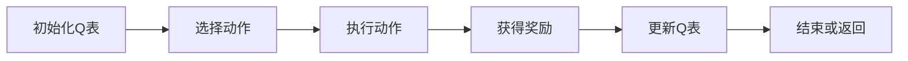
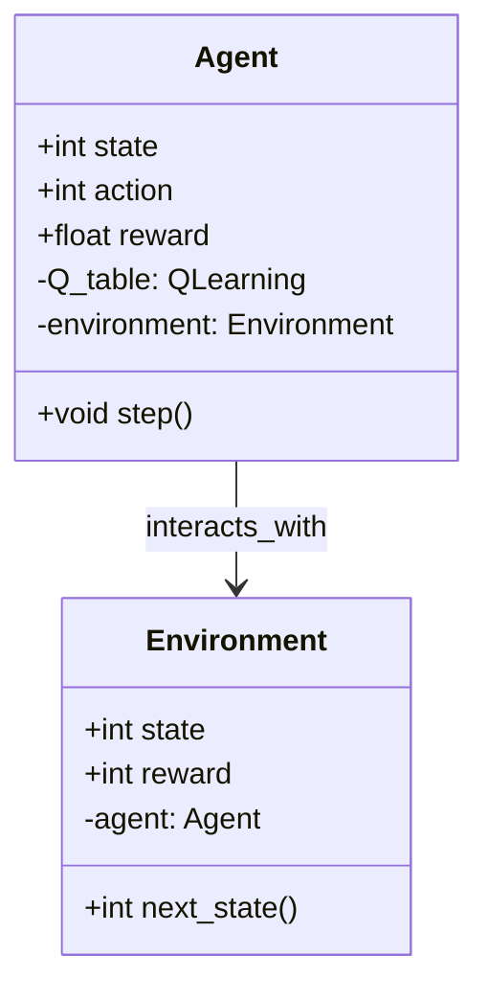
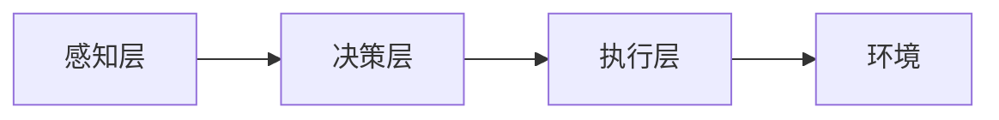
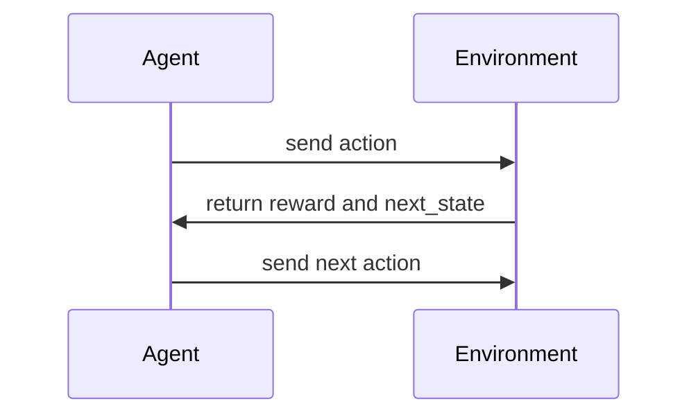

                 


# 《从零开始：搭建AI Agent开发环境》

## 关键词：
AI Agent, 开发环境, Python, 机器学习, 强化学习, 系统架构, 项目实战

## 摘要：
本文将从零开始，详细讲解搭建AI Agent开发环境的全过程。首先介绍AI Agent的基本概念和核心特点，然后分析其在各种场景中的应用价值。接着，详细探讨开发环境的选择与配置，包括Python环境的安装、开发工具的选择以及硬件环境的要求。随后，深入讲解AI Agent的核心算法原理，结合强化学习的数学模型和Python代码示例，帮助读者理解其实现机制。在系统架构设计部分，将通过领域模型类图、系统架构图和交互序列图，展示如何构建一个完整的AI Agent系统。最后，通过一个实际的项目实战，详细解读环境搭建、代码实现、测试优化和案例分析的过程。本文还总结了搭建AI Agent开发环境的最佳实践，并展望了未来的发展趋势。

---

# 第1章: AI Agent概述

## 1.1 AI Agent的基本概念

### 1.1.1 什么是AI Agent
AI Agent（人工智能代理）是指能够感知环境、自主决策并采取行动的智能体。它可以理解为一个软件或实体，旨在模拟人类或其他智能生物的行为和决策过程。

### 1.1.2 AI Agent的类型
AI Agent可以根据功能和智能水平分为以下几类：
- **反应式AI Agent**：基于当前感知做出即时反应，不依赖历史信息。
- **认知式AI Agent**：具备复杂推理和规划能力，能够处理复杂任务。
- **学习型AI Agent**：能够通过经验改进自身性能，类似于强化学习或监督学习。

### 1.1.3 AI Agent的应用场景
AI Agent广泛应用于多个领域，包括：
- 自动化控制（如自动驾驶）
- 智能推荐系统
- 游戏AI
- 机器人控制
- 智能助手（如Siri、Alexa）

## 1.2 AI Agent的核心特点

### 1.2.1 智能性
AI Agent能够通过感知和学习做出智能决策。

### 1.2.2 自主性
AI Agent能够在没有外部干预的情况下自主运行。

### 1.2.3 反应性
AI Agent能够实时感知环境变化并做出相应反应。

### 1.2.4 学习能力
AI Agent能够通过数据和经验改进自身的性能。

## 1.3 AI Agent开发的背景与意义

### 1.3.1 当前AI技术的发展趋势
随着深度学习和强化学习的快速发展，AI Agent的应用前景广阔。

### 1.3.2 AI Agent在企业中的应用价值
AI Agent可以帮助企业实现自动化、智能化和高效化。

### 1.3.3 开发AI Agent的挑战与机遇
- **挑战**：需要结合算法、系统架构和工程实践。
- **机遇**：AI Agent在多个领域的广泛应用带来了巨大的市场潜力。

## 1.4 本章小结
本章介绍了AI Agent的基本概念、类型和应用场景，并分析了其在开发中的挑战与机遇。

---

# 第2章: AI Agent的核心概念与联系

## 2.1 AI Agent的结构与功能

### 2.1.1 感知层
感知层负责接收和处理环境中的输入信息，例如传感器数据或用户输入。

### 2.1.2 决策层
决策层基于感知层提供的信息，结合内部模型和算法，做出决策。

### 2.1.3 执行层
执行层根据决策层的指令，通过执行机构或接口完成实际操作。

## 2.2 AI Agent的决策机制

### 2.2.1 基于规则的决策
基于规则的决策通过预定义的规则进行判断，适用于简单的场景。

### 2.2.2 基于模型的决策
基于模型的决策通过建立数学模型，预测最优结果。

### 2.2.3 基于强化学习的决策
基于强化学习的决策通过奖励机制不断优化策略，适用于复杂场景。

## 2.3 AI Agent的学习方法

### 2.3.1 监督学习
监督学习通过标注数据进行训练，适用于分类和回归任务。

### 2.3.2 无监督学习
无监督学习通过发现数据中的结构进行学习，适用于聚类和降维任务。

### 2.3.3 强化学习
强化学习通过与环境互动，通过奖励机制优化策略，适用于游戏和机器人控制。

## 2.4 AI Agent与其他AI技术的联系

### 2.4.1 与机器学习的联系
AI Agent可以利用机器学习算法进行感知和决策。

### 2.4.2 与自然语言处理的联系
自然语言处理技术可以增强AI Agent的语义理解能力。

### 2.4.3 与机器人技术的联系
AI Agent可以作为机器人的控制核心，实现智能交互。

## 2.5 本章小结
本章详细探讨了AI Agent的结构、决策机制和学习方法，并分析了其与其他AI技术的联系。

---

# 第3章: AI Agent开发环境搭建

## 3.1 开发环境的选择与配置

### 3.1.1 Python环境的安装与配置
Python是AI开发的首选语言，需要安装最新版本的Python，并配置环境变量。

### 3.1.2 开发工具的选择
推荐使用PyCharm、VS Code等IDE，并安装必要的插件。

### 3.1.3 硬件环境的要求
AI Agent开发需要高性能的硬件支持，尤其是GPU加速。

## 3.2 开发框架的选择

### 3.2.1 常见AI Agent开发框架介绍
常用的框架包括OpenAI Gym、TensorFlow、PyTorch等。

### 3.2.2 框架的优缺点对比
- **OpenAI Gym**：适合强化学习任务。
- **TensorFlow**：适合深度学习任务。
- **PyTorch**：适合动态计算和研究。

### 3.2.3 如何选择适合的框架
根据具体任务需求选择框架，例如强化学习任务选择Gym，深度学习任务选择TensorFlow。

## 3.3 开发环境的配置与验证

### 3.3.1 环境变量的配置
设置Python和相关框架的环境变量，确保命令行可以识别。

### 3.3.2 框架的安装与验证
安装必要的库和依赖项，并通过简单的测试脚本验证安装是否成功。

### 3.3.3 开发环境的测试
运行一些简单的AI Agent程序，确保环境配置正确。

## 3.4 本章小结
本章详细介绍了AI Agent开发环境的选择、配置和验证过程。

---

# 第4章: AI Agent算法原理讲解

## 4.1 强化学习原理

### 4.1.1 强化学习的基本概念
强化学习通过智能体与环境的互动，通过奖励机制优化策略。

### 4.1.2 Q-learning算法
Q-learning是一种经典的强化学习算法，适用于离散动作空间。

### 4.1.3 算法流程
1. 初始化Q表。
2. 选择动作。
3. 执行动作并获得奖励。
4. 更新Q表。

### 4.1.4 算法实现的数学模型
$$ Q(s, a) = Q(s, a) + \alpha (r + \gamma \max Q(s', a') - Q(s, a)) $$

### 4.1.5 算法实现的Python代码示例

```python
import numpy as np

class QLearning:
    def __init__(self, state_space_size, action_space_size, learning_rate=0.1, gamma=0.9):
        self.state_space_size = state_space_size
        self.action_space_size = action_space_size
        self.lr = learning_rate
        self.gamma = gamma
        self.q_table = np.zeros((state_space_size, action_space_size))
    
    def choose_action(self, state, epsilon=0.1):
        if np.random.random() < epsilon:
            return np.random.randint(self.action_space_size)
        else:
            return np.argmax(self.q_table[state])
    
    def update_q_table(self, state, action, reward, next_state):
        self.q_table[state, action] = self.q_table[state, action] + self.lr * (reward + self.gamma * np.max(self.q_table[next_state]) - self.q_table[state, action])
```

## 4.2 算法实现的详细解读

### 4.2.1 Q-learning算法流程
通过mermaid流程图展示Q-learning的实现流程。



### 4.2.2 算法优化
通过epsilon-greedy策略平衡探索与利用。

## 4.3 本章小结
本章详细讲解了强化学习的基本原理和Q-learning算法的实现，为后续开发奠定了基础。

---

# 第5章: 系统架构设计

## 5.1 问题场景介绍

### 5.1.1 项目介绍
以开发一个简单的AI Agent为例，用于模拟机器人导航任务。

### 5.1.2 系统功能设计
设计一个包含感知、决策和执行模块的AI Agent系统。

### 5.1.3 领域模型类图
通过mermaid类图展示系统模块之间的关系。



### 5.1.4 系统架构图
通过mermaid架构图展示系统的整体架构。



### 5.1.5 系统接口设计
定义感知层、决策层和执行层之间的接口。

### 5.1.6 系统交互序列图
通过mermaid序列图展示系统交互流程。



## 5.2 本章小结
本章详细设计了AI Agent系统的架构，并通过类图和序列图展示了模块之间的关系。

---

# 第6章: 项目实战

## 6.1 环境安装与配置

### 6.1.1 Python环境的安装
安装Python 3.8及以上版本。

### 6.1.2 开发框架的安装
安装TensorFlow、Keras、OpenAI Gym等框架。

## 6.2 系统核心实现

### 6.2.1 环境类的实现
实现一个简单的环境类，定义状态和动作空间。

```python
class Environment:
    def __init__(self):
        self.state = 0
        self.steps = 0
    
    def get_state(self):
        return self.state
    
    def get_reward(self):
        return self.steps * 1  # 简单奖励函数
    
    def step(self, action):
        self.steps += 1
        self.state = action
        return self.get_state(), self.get_reward()
```

### 6.2.2 AI Agent类的实现
实现一个基于Q-learning的AI Agent类。

```python
class AI_Agent:
    def __init__(self, state_space, action_space):
        self.agent = QLearning(state_space, action_space)
    
    def take_action(self, state):
        return self.agent.choose_action(state)
    
    def update(self, state, action, reward, next_state):
        self.agent.update_q_table(state, action, reward, next_state)
```

### 6.2.3 系统主程序的实现
实现主程序，协调环境和AI Agent的交互。

```python
def main():
    env = Environment()
    agent = AI_Agent(2, 2)
    for _ in range(100):
        state = env.get_state()
        action = agent.take_action(state)
        next_state, reward = env.step(action)
        agent.update(state, action, reward, next_state)
    print("Training completed!")

if __name__ == "__main__":
    main()
```

## 6.3 项目测试与优化

### 6.3.1 系统测试
运行主程序，观察训练过程和结果。

### 6.3.2 性能优化
通过调整学习率和epsilon值优化算法性能。

### 6.3.3 测试结果分析
分析训练曲线，评估算法效果。

## 6.4 项目案例分析

### 6.4.1 案例介绍
以简单的导航任务为例，展示AI Agent的实际应用。

### 6.4.2 案例实现
通过代码实现导航任务的AI Agent。

### 6.4.3 案例结果解读
分析AI Agent在导航任务中的表现。

## 6.5 本章小结
本章通过一个实际项目，详细展示了AI Agent开发环境的搭建和实现过程。

---

# 第7章: 总结与展望

## 7.1 搭建AI Agent开发环境的最佳实践

### 7.1.1 环境配置
确保硬件和软件环境满足开发需求。

### 7.1.2 框架选择
根据具体任务选择合适的开发框架。

### 7.1.3 代码规范
遵循良好的代码规范，提高代码可读性和维护性。

## 7.2 未来展望

### 7.2.1 AI Agent的发展趋势
随着深度学习和强化学习的进一步发展，AI Agent将在更多领域得到应用。

### 7.2.2 新技术的影响
新技术如Transformer和多模态学习将为AI Agent带来新的可能性。

## 7.3 本章小结
本章总结了搭建AI Agent开发环境的最佳实践，并展望了未来的发展趋势。

---

# 作者：AI天才研究院/AI Genius Institute & 禅与计算机程序设计艺术 /Zen And The Art of Computer Programming

