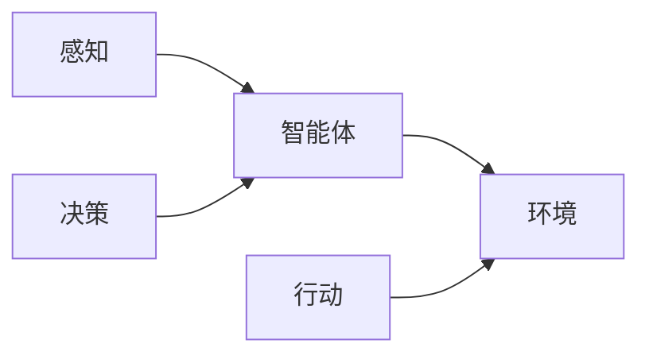
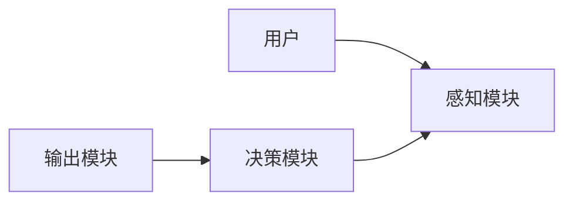
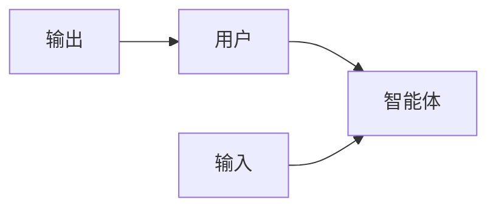

                 


# 《从零开始：构建AI Agent的完整指南》

---

## 关键词：
- AI Agent
- 人工智能
- 强化学习
- 系统设计
- 项目实战

---

## 摘要：
本文将从AI Agent的基本概念出发，逐步深入探讨其核心原理、算法实现、系统设计与项目实战。通过清晰的逻辑分析和丰富的案例解读，帮助读者全面掌握构建AI Agent的完整流程。文章内容涵盖背景介绍、核心概念、算法原理、系统架构、项目实现以及最佳实践，为读者提供一份详尽的指南。

---

## 第一部分: AI Agent 的背景与核心概念

### 第1章: AI Agent 的基本概念

#### 1.1 什么是 AI Agent
- 1.1.1 AI Agent 的定义
  - AI Agent 是一种能够感知环境、做出决策并执行动作的智能实体。
- 1.1.2 AI Agent 的核心特征
  - 智能性：基于环境信息进行自主决策。
  - 适应性：能够根据反馈调整行为。
  - 可扩展性：适用于多种应用场景。
- 1.1.3 AI Agent 的分类与应用场景
  - 分类：基于规则的 Agent、基于模型的 Agent、基于强化学习的 Agent。
  - 应用场景：游戏AI、自动驾驶、智能助手。

#### 1.2 AI Agent 的问题背景
- 1.2.1 当前 AI 技术的局限性
  - 监督学习依赖大量标注数据。
  - � 强化学习需要大量试错。
- 1.2.2 AI Agent 的提出与目标
  - 目标：实现智能体与环境的高效交互。
- 1.2.3 AI Agent 的边界与外延
  - 边界：智能体与环境的交互界面。
  - 外延：与其他AI技术（如NLP、计算机视觉）的结合。

#### 1.3 AI Agent 的核心要素
- 1.3.1 感知模块
  - 输入：环境状态。
  - 输出：对环境的理解。
- 1.3.2 决策模块
  - 输入：感知结果。
  - 输出：动作选择。
- 1.3.3 行动模块
  - 输入：决策结果。
  - 输出：实际动作。
- 1.3.4 环境交互模块
  - 输入：智能体动作。
  - 输出：环境反馈。

---

### 第2章: AI Agent 的核心概念与联系

#### 2.1 AI Agent 的核心原理
- 2.1.1 感知与决策的数学模型
  - 感知：状态空间的表示。
  - 决策：动作空间的选择。
- 2.1.2 状态空间与动作空间的定义
  - 状态空间：所有可能的状态集合。
  - 动作空间：所有可能的动作集合。
- 2.1.3 奖励机制与目标函数
  - 奖励机制：环境对智能体行为的反馈。
  - 目标函数：智能体追求的最大化目标。

#### 2.2 核心概念对比分析
- 2.2.1 智能体与传统算法的对比
  - 智能体：具备自主决策能力。
  - 传统算法：依赖固定规则。
- 2.2.2 强化学习与监督学习的对比
  - 强化学习：基于奖励机制。
  - 监督学习：基于标签数据。
- 2.2.3 状态空间与任务空间的对比
  - 状态空间：环境的状态。
  - 任务空间：智能体的目标。

#### 2.3 实体关系图


---

## 第3章: AI Agent 的算法原理

### 3.1 强化学习算法

#### 3.1.1 Q-Learning 算法
- 核心流程：
  1. 智能体接收环境状态。
  2. 根据当前策略选择动作。
  3. 执行动作并获得奖励。
  4. 更新 Q 表。
- 代码示例：
  ```python
  import numpy as np

  class QLearning:
      def __init__(self, state_space, action_space):
          self.q_table = np.zeros((state_space, action_space))

      def choose_action(self, state, epsilon=0.1):
          if np.random.random() < epsilon:
              return np.random.randint(action_space)
          return np.argmax(self.q_table[state])

      def update_q_table(self, state, action, reward, next_state, alpha=0.1):
          self.q_table[state, action] = (1 - alpha) * self.q_table[state, action] + alpha * (reward + np.max(self.q_table[next_state]))
  ```

- 算法流程图：
  ```mermaid
  graph LR
  A[状态] --> B[动作]
  C[奖励] --> B
  D[新状态] --> C
  ```

#### 3.1.2 Deep Q-Networks (DQN) 算法
- 核心思想：
  - 使用神经网络近似 Q 函数。
  - 引入经验回放和目标网络。
- 代码示例：
  ```python
  import torch
  import torch.nn as nn

  class DQN(nn.Module):
      def __init__(self, input_size, hidden_size, output_size):
          super(DQN, self).__init__()
          self.fc1 = nn.Linear(input_size, hidden_size)
          self.fc2 = nn.Linear(hidden_size, output_size)
          self.relu = nn.ReLU()
          self.softmax = nn.Softmax(dim=1)

      def forward(self, x):
          x = self.fc1(x)
          x = self.relu(x)
          x = self.fc2(x)
          return self.softmax(x)
  ```

- 算法流程图：
  ```mermaid
  graph LR
  A[状态] --> B[神经网络]
  C[动作] --> B
  D[奖励] --> B
  E[新状态] --> B
  ```

### 3.2 监督学习算法

#### 3.2.1 线性回归
- 公式：
  $$y = \theta_0 + \theta_1x$$
- 代码示例：
  ```python
  import numpy as np
  from sklearn.linear_model import LinearRegression

  model = LinearRegression()
  model.fit(X, y)
  ```

#### 3.2.2 支持向量机
- 公式：
  $$\text{max} \{\gamma | y_i(\theta \cdot x_i + \theta_0) \geq 1 - \xi_i, \xi_i \geq 0\}$$
- 代码示例：
  ```python
  from sklearn.svm import SVC

  model = SVC()
  model.fit(X, y)
  ```

---

## 第4章: 系统分析与架构设计

### 4.1 问题场景介绍
- 项目目标：构建一个能够进行简单交互的AI Agent。
- 项目背景：模拟一个智能助手与用户交互的场景。

### 4.2 系统功能设计
- 功能模块：
  - 感知模块：接收用户输入。
  - 决策模块：生成回复。
  - 行动模块：输出回复。

### 4.3 系统架构设计


### 4.4 系统接口设计
- 接口定义：
  - 输入接口：用户输入字符串。
  - 输出接口：智能体输出字符串。

### 4.5 系统交互设计


---

## 第5章: 项目实战

### 5.1 环境安装
- 安装依赖：
  ```bash
  pip install numpy scikit-learn torch
  ```

### 5.2 核心实现
- 感知模块：
  ```python
  def感知环境(input_str):
      return input_str
  ```
- 决策模块：
  ```python
  def决策模块(context):
      return "您好，我是AI助手。"
  ```

### 5.3 代码实现
- 完整代码示例：
  ```python
  import torch
  import torch.nn as nn

  class AIAssistant:
      def __init__(self):
          self.model = DQN(input_size=10, hidden_size=20, output_size=5)

      def interact(self, input_str):
          output = self.model(input_str)
          return output
  ```

### 5.4 案例分析
- 应用场景：
  - 用户输入：“您好。”
  - 智能体输出：“您好，我是AI助手。”

---

## 第6章: 最佳实践与总结

### 6.1 最佳实践
- 数据预处理：确保数据质量。
- 模型调优：优化超参数。
- 代码复用：模块化设计。

### 6.2 项目小结
- 本文详细讲解了AI Agent的构建过程，从理论到实践，帮助读者掌握核心原理和实现方法。

### 6.3 注意事项
- 数据安全：保护用户隐私。
- 模型泛化：避免过拟合。

### 6.4 拓展阅读
- 推荐书籍：《深度学习》、《强化学习导论》。
- 在线资源：GitHub开源项目、技术博客。

---

## 作者：AI天才研究院/AI Genius Institute & 禅与计算机程序设计艺术 /Zen And The Art of Computer Programming

