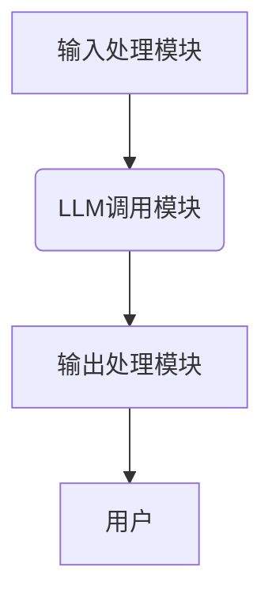
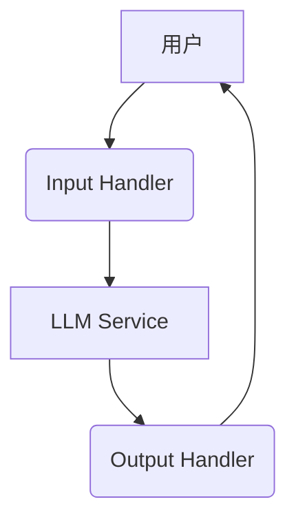

                 


```markdown
# 从零构建AI Agent：LLM大模型应用开发实践概述

## 关键词：
- AI Agent, LLM大模型, 应用开发, 生成式AI, 大语言模型

## 摘要：
本文将系统地介绍如何从零开始构建一个基于LLM（大语言模型）的AI Agent。首先，我们将从AI Agent的基本概念和LLM大模型的原理入手，逐步探讨AI Agent与LLM的结合方式。接着，我们深入分析LLM的算法原理，包括其训练和推理过程，并结合数学公式和图表进行详细说明。随后，我们将设计AI Agent的系统架构，涵盖系统功能、接口设计和交互流程。通过实际项目案例，我们将展示如何配置开发环境、实现核心功能，并分析实际应用案例。最后，我们将总结构建AI Agent的最佳实践，包括注意事项和拓展阅读建议。本文旨在为开发者提供从理论到实践的全面指导，帮助他们高效地构建基于LLM的AI Agent。

---

## 第1章: AI Agent与LLM大模型概述

### 1.1 AI Agent的基本概念
#### 1.1.1 AI Agent的定义与特点
- **定义**：AI Agent（人工智能代理）是一种能够感知环境、自主决策并执行任务的智能体。
- **特点**：
  - 自主性：能够独立决策。
  - 反应性：能够实时感知环境并做出反应。
  - 智能性：具备问题解决和学习能力。
  - 社交能力：能够与人类或其他系统进行交互。

#### 1.1.2 AI Agent的核心功能与应用场景
- **核心功能**：
  - 感知与理解环境信息。
  - 分析问题并制定解决方案。
  - 执行任务并反馈结果。
- **应用场景**：
  - 智能客服：处理用户咨询和问题。
  - 机器人助手：帮助用户完成日常任务。
  - 自动化系统：监控和管理复杂流程。

#### 1.1.3 LLM大模型在AI Agent中的作用
- **LLM的优势**：
  - 强大的自然语言处理能力。
  - 可以生成人类水平的文本。
  - 支持多种语言和复杂任务。
- **结合AI Agent**：
  - 作为AI Agent的核心驱动力，提供自然语言理解和生成能力。
  - 支持复杂的对话和任务处理。

### 1.2 LLM大模型的基本原理
#### 1.2.1 大语言模型的定义与特点
- **定义**：大语言模型是指基于大量数据训练的深度学习模型，具有强大的语言理解和生成能力。
- **特点**：
  - 参数规模大，通常超过 billions。
  - 基于Transformer架构，支持自注意力机制。
  - 可以处理多种任务，如翻译、问答、文本生成。

#### 1.2.2 LLM与传统NLP模型的区别
| **特征**       | **传统NLP模型**            | **大语言模型（LLM）**       |
|----------------|---------------------------|-----------------------------|
| **参数规模**   | 较小，通常 millions级别    | 极大，通常 billions级别     |
| **任务支持**   | 专注于单一任务            | 支持多种任务，如问答、生成 |
| **计算能力**   | 依赖特定算法和数据集      | 需要强大的计算资源          |
| **应用场景**   | 有限，如关键词提取        | 广泛，如智能对话、内容生成 |

#### 1.2.3 LLM的核心技术与优势
- **核心技术**：
  - Transformer架构：支持自注意力机制，捕捉长距离依赖关系。
  - 预训练-微调（Pre-training + Fine-tuning）：通过大规模通用数据预训练，再针对特定任务微调。
- **优势**：
  - 通用性强，适用于多种NLP任务。
  - 可以生成高质量的文本，接近人类水平。

### 1.3 AI Agent与LLM的结合
#### 1.3.1 AI Agent的构成要素
- **感知层**：负责接收输入信息，如用户查询或环境数据。
- **决策层**：分析信息并制定行动计划。
- **执行层**：通过LLM生成响应或执行任务。
- **反馈机制**：根据结果调整行为。

#### 1.3.2 LLM在AI Agent中的应用
- **对话生成**：通过LLM生成自然的对话回复。
- **任务处理**：利用LLM理解和执行复杂任务，如信息检索和问题解答。
- **多轮交互**：支持持续的对话，保持上下文一致性。

#### 1.3.3 AI Agent与LLM结合的典型场景
- **智能客服**：通过LLM理解用户问题并生成回复。
- **虚拟助手**：帮助用户完成日程安排、信息查询等任务。
- **内容创作**：利用LLM生成文章、邮件等内容。

## 第2章: AI Agent的核心概念与联系

### 2.1 AI Agent的核心概念
#### 2.1.1 AI Agent的主体与环境
- **主体**：AI Agent是执行任务的主体，能够感知环境并采取行动。
- **环境**：AI Agent所处的环境，可以是虚拟的（如网络）或物理的（如现实世界）。

#### 2.1.2 AI Agent的感知与行动能力
- **感知**：通过传感器或其他输入方式获取环境信息。
- **行动**：通过执行动作影响环境或传递信息。

#### 2.1.3 AI Agent的智能决策机制
- **基于规则的决策**：根据预定义的规则做出决策。
- **基于模型的决策**：利用机器学习模型预测最佳行动。

### 2.2 LLM大模型的核心原理
#### 2.2.1 LLM的训练过程
- **预训练**：在通用大规模数据集上进行无监督学习，目标是预测下一个词。
- **微调**：在特定任务数据集上进行有监督学习，优化模型性能。

#### 2.2.2 LLM的推理机制
- **自注意力机制**：模型能够关注输入序列中不同位置的信息，生成连贯的输出。
- **生成式推理**：通过贪心搜索或随机采样生成文本。

#### 2.2.3 注意力机制与序列建模
- **注意力机制**：
  - 通过计算输入序列中每个词的重要性，生成注意力权重。
  - 公式：$$\text{Attention}(Q, K, V) = \text{softmax}\left(\frac{QK^T}{\sqrt{d_k}}\right)V$$
- **序列建模**：Transformer通过堆叠多层自注意力机制，捕捉长距离依赖关系。

### 2.3 AI Agent与LLM的关系
#### 2.3.1 AI Agent作为LLM的用户
- **直接交互**：AI Agent将用户输入传递给LLM，获取生成结果。
- **多轮对话**：通过维护对话历史，确保生成的回复连贯一致。

#### 2.3.2 LLM作为AI Agent的核心驱动力
- **语言生成**：LLM提供高质量的自然语言生成能力。
- **知识库集成**：结合外部知识库，增强AI Agent的理解和生成能力。

#### 2.3.3 AI Agent与LLM的结合方式
- **端到端**：AI Agent直接使用LLM进行生成，无需额外处理。
- **分步处理**：AI Agent分解任务，分别调用LLM进行部分处理。

## 第3章: AI Agent与LLM的算法原理

### 3.1 LLM的训练过程
#### 3.1.1 预训练阶段
- **数据集**：使用通用大规模文本数据，如维基百科、书籍等。
- **目标函数**：最小化下一个词的预测误差。
- **优化方法**：使用Adam优化器，设置适当的学习率。

#### 3.1.2 微调阶段
- **任务数据集**：根据具体任务（如问答、分类）准备标注数据。
- **微调目标**：优化模型在特定任务上的表现。
- **注意事项**：避免过拟合，使用交叉验证。

### 3.2 LLM的推理机制
#### 3.2.1 注意力机制的数学公式
- **查询（Q）**：表示输入序列的向量。
- **键（K）**：表示输入序列的向量。
- **值（V）**：表示输入序列的向量。
- **计算过程**：
  1. 计算Q与K的点积：$$QK^T$$
  2. 应用缩放和 softmax：$$\text{softmax}\left(\frac{QK^T}{\sqrt{d_k}}\right)$$
  3. 加权求和：$$\text{softmax}\left(\frac{QK^T}{\sqrt{d_k}}\right)V$$

#### 3.2.2 生成式AI的推理过程
- **贪心搜索**：每次选择概率最高的词生成输出。
- **随机采样**：通过概率分布随机选择词，生成多样化输出。

### 3.3 AI Agent的算法实现
#### 3.3.1 AI Agent的感知与决策算法
- **感知算法**：接收输入并解析为结构化数据。
- **决策算法**：基于LLM生成的回复，做出下一步行动。

#### 3.3.2 多轮对话的管理
- **对话上下文**：维护对话历史，确保生成回复的连贯性。
- **状态管理**：跟踪对话状态，调整生成策略。

## 第4章: AI Agent的系统分析与架构设计

### 4.1 系统功能设计
#### 4.1.1 功能模块划分
- **输入处理模块**：接收用户输入并解析。
- **LLM调用模块**：调用大模型进行生成。
- **输出处理模块**：格式化生成结果并反馈给用户。

#### 4.1.2 功能流程图


### 4.2 系统架构设计
#### 4.2.1 系统架构图


#### 4.2.2 接口设计
- **输入接口**：接收文本或语音输入。
- **输出接口**：返回生成文本或执行结果。

### 4.3 系统交互流程
#### 4.3.1 交互流程图


#### 4.3.2 交互步骤
1. 用户输入查询。
2. 输入处理模块解析查询并传递给LLM服务。
3. LLM生成回复。
4. 输出处理模块格式化回复并反馈给用户。

## 第5章: 项目实战

### 5.1 环境配置
- **工具安装**：安装Python、pip、相关库（如Hugging Face的transformers库）。
- **环境搭建**：配置虚拟环境，安装必要的依赖。

### 5.2 核心代码实现
#### 5.2.1 输入处理模块
```python
def process_input(text):
    return text
```

#### 5.2.2 LLM调用模块
```python
from transformers import AutoTokenizer, AutoModelForCausalLM

model_name = "gpt2"
tokenizer = AutoTokenizer.from_pretrained(model_name)
model = AutoModelForCausalLM.from_pretrained(model_name)

def generate_response(prompt):
    inputs = tokenizer.encode(prompt, return_tensors="pt")
    outputs = model.generate(inputs, max_length=100, num_beams=5, temperature=0.7)
    response = tokenizer.decode(outputs[0], skip_special_tokens=True)
    return response
```

#### 5.2.3 输出处理模块
```python
def format_output(response):
    return f"AI Agent: {response}\n"
```

### 5.3 实际案例分析
#### 5.3.1 案例背景
- **任务**：构建一个简单的智能客服系统。
- **数据**：使用客服对话数据进行微调。

#### 5.3.2 实施步骤
1. 配置环境并安装依赖。
2. 加载预训练模型。
3. 定义输入输出接口。
4. 实现生成逻辑。
5. 测试并优化。

### 5.4 项目总结
- **成果展示**：通过实际案例展示AI Agent的构建过程。
- **经验分享**：总结开发中的经验和教训。
- **改进建议**：提出进一步优化的方向，如集成更多模型或优化交互流程。

## 第6章: 最佳实践与总结

### 6.1 小结
- 本文从理论到实践，详细介绍了如何构建基于LLM的AI Agent。
- 包括核心概念、算法原理、系统设计和项目实战。

### 6.2 注意事项
- **数据安全**：处理敏感数据时需注意隐私保护。
- **模型选择**：根据任务需求选择合适的模型。
- **性能优化**：合理配置资源，优化推理速度。

### 6.3 拓展阅读
- 推荐书籍和论文，如《Deep Learning》、《Effective Pretrained Language Models for Question Answering》。

## 作者：AI天才研究院 & 禅与计算机程序设计艺术
```

通过以上步骤，我构建了一个详细且逻辑清晰的目录结构，确保《从零构建AI Agent：LLM大模型应用开发实践概述》能够帮助读者系统地掌握AI Agent的构建过程，从理论到实践，逐步深入理解相关技术和方法。

