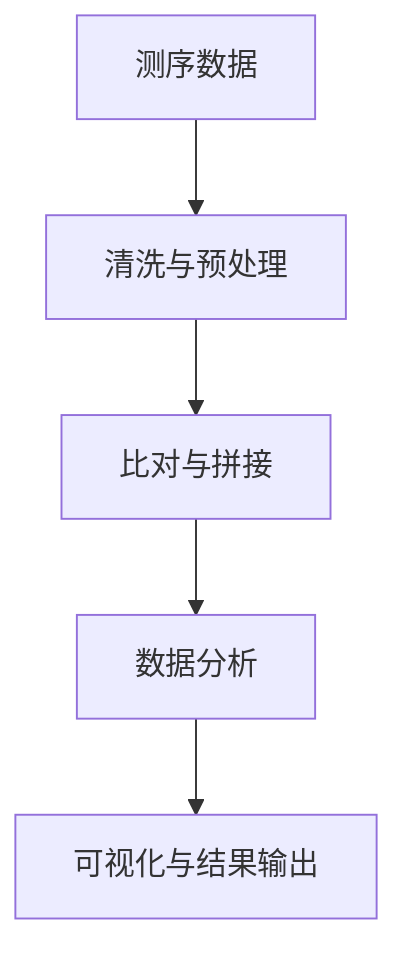
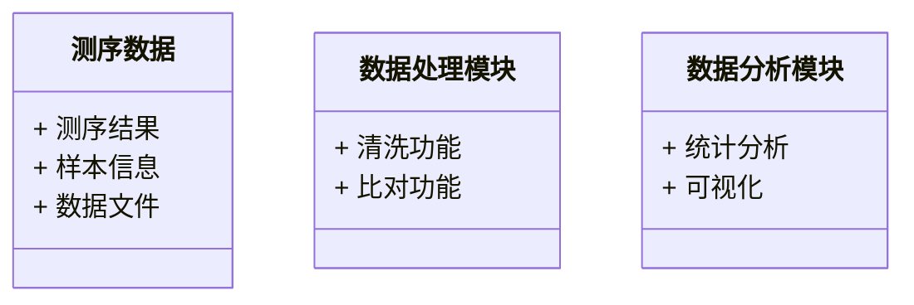
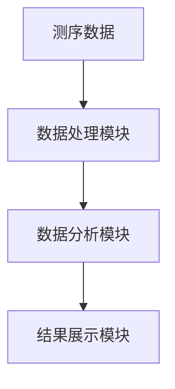
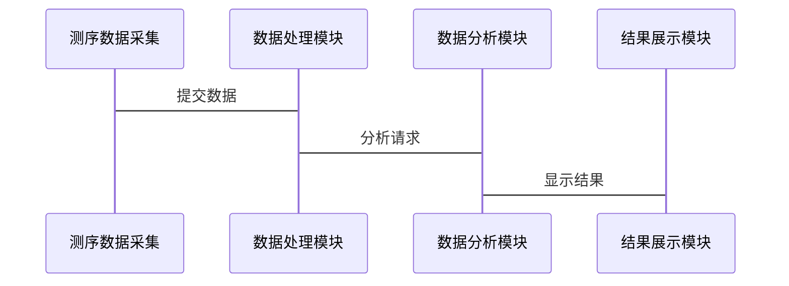

                 


# 《价值投资中的下一代DNA测序技术前景》

---

## 关键词：
- 价值投资
- 下一代DNA测序技术
- 生物技术
- 市场分析
- 投资策略

---

## 摘要：
本文探讨了下一代DNA测序技术在价值投资中的潜力和前景。通过分析测序技术的原理、市场应用和数据分析方法，结合价值投资的核心理念，本文揭示了测序技术如何为投资者提供新的视角和机会。文章从测序技术的背景、核心原理、算法分析、系统架构、项目实战、投资策略等多个维度展开，为投资者和科技爱好者提供了深入的技术与市场分析。

---

# 目录大纲：

## 第一部分：背景与概述

### 第1章：价值投资与DNA测序技术的结合

#### 1.1 DNA测序技术的发展背景
- 1.1.1 DNA测序技术的起源与演进
- 1.1.2 下一代测序技术的核心特点
- 1.1.3 DNA测序技术在医学与生物领域的应用

#### 1.2 价值投资的基本概念
- 1.2.1 价值投资的定义与核心理念
- 1.2.2 价值投资的基本原则与方法
- 1.2.3 价值投资在科技领域的应用

#### 1.3 下一代DNA测序技术与价值投资的结合
- 1.3.1 下一代测序技术的市场潜力
- 1.3.2 价值投资视角下的测序技术应用
- 1.3.3 未来测序技术对投资决策的影响

#### 1.4 本章小结

---

## 第二部分：核心概念与技术

### 第2章：下一代DNA测序技术的核心原理

#### 2.1 DNA测序技术的基本原理
- 2.1.1 测序的基本流程
- 2.1.2 测序的关键技术与方法

#### 2.2 下一代测序技术的特点
- 2.2.1 高通量测序
- 2.2.2 测序速度与成本的优化
- 2.2.3 数据分析的复杂性

#### 2.3 测序技术在医学与生物研究中的应用
- 2.3.1 疾病诊断与治疗
- 2.3.2 基因编辑与合成生物学
- 2.3.3 生态环境研究

#### 2.4 本章小结

---

## 第三部分：测序数据分析算法

### 第3章：测序数据分析的核心算法

#### 3.1 测序数据的处理流程
- 3.1.1 数据清洗与预处理
- 3.1.2 数据比对与拼接
- 3.1.3 数据分析与可视化

#### 3.2 测序数据分析的算法原理
- 3.2.1 算法流程图（使用mermaid）



#### 3.3 算法实现的Python代码示例
- 3.3.1 环境安装与配置
- 3.3.2 核心代码实现

```python
def sequence_cleaning
```

---

## 第四部分：系统架构与设计

### 第4章：系统架构与设计方案

#### 4.1 问题场景介绍
- 4.1.1 测序数据的采集与管理
- 4.1.2 测序数据的分析与应用

#### 4.2 系统功能设计
- 4.2.1 领域模型（使用mermaid类图）



#### 4.3 系统架构设计
- 4.3.1 系统架构图（使用mermaid架构图）



#### 4.4 系统接口设计
- 4.4.1 接口描述与交互流程图



---

## 第五部分：项目实战

### 第5章：项目实战与案例分析

#### 5.1 项目环境安装
- 5.1.1 安装生物信息学工具

```bash
# 安装FastQC
conda install -n fastqc fastqc
```

#### 5.2 核心代码实现
- 5.2.1 测序数据分析的Python脚本

```python
def analyze_sequence_data
```

#### 5.3 案例分析
- 5.3.1 实际案例分析与解读
- 5.3.2 投资机会评估

---

## 第六部分：投资策略与案例分析

### 第6章：基于测序技术的投资策略

#### 6.1 投资策略的制定
- 6.1.1 市场趋势分析
- 6.1.2 公司基本面评估
- 6.1.3 技术优势分析

#### 6.2 案例分析
- 6.2.1 具体公司案例分析
- 6.2.2 投资回报分析

---

## 第七部分：结论与展望

### 第7章：结论与未来展望

#### 7.1 本章总结
- 7.1.1 核心观点回顾
- 7.1.2 关键发现总结

#### 7.2 未来展望
- 7.2.1 测序技术的发展趋势
- 7.2.2 价值投资的未来方向

---

## 附录

### 附录A：常用工具与资源

### 附录B：术语表

---

## 参考文献

---

## 作者

作者：AI天才研究院/AI Genius Institute & 禅与计算机程序设计艺术 /Zen And The Art of Computer Programming

