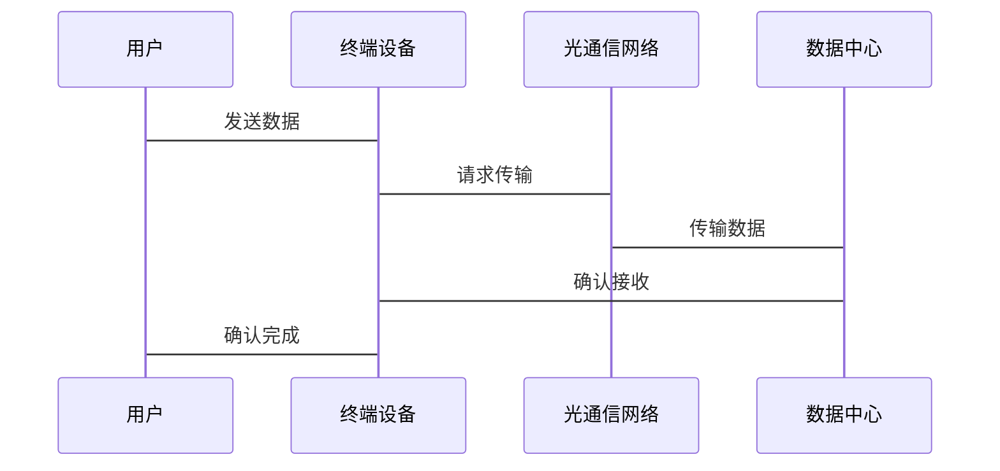

                 

# 价值投资中的下一代光通信技术前景

> **关键词**：光通信技术、价值投资、通信技术、投资前景、下一代技术、技术分析  
> **摘要**：随着信息技术的飞速发展，光通信技术在现代通信领域占据着越来越重要的地位。本文将从光通信技术的基本概念出发，分析其在价值投资中的潜力，探讨下一代光通信技术的核心原理、系统设计和投资价值。通过实际案例分析，本文将为投资者提供科学的决策依据，并展望未来光通信技术的发展趋势。

---

## 第1章 光通信技术概述

### 1.1 光通信的基本概念

光通信是一种利用光波作为信息载体进行数据传输的技术。它通过光纤或无线光媒介传输数据，具有传输速度快、带宽高、抗干扰能力强等优点。光通信的历史可以追溯到19世纪末，随着激光技术的发展，其应用范围逐渐扩大，成为现代通信的核心技术之一。

光通信的特点包括：
- 高速传输：光信号的传输速度接近光速，远超电子信号。
- 大带宽：光纤通信的带宽可达GHz级别，支持大规模数据传输。
- 长距离传输：光纤通信能够实现数千公里的长距离传输，且损耗较低。

### 1.2 价值投资的基本概念

价值投资是一种投资策略，强调以低于内在价值的价格购买优质资产。其核心理念是通过深入分析公司的基本面，寻找被市场低估的投资机会。在科技领域，价值投资尤其关注那些具有技术创新、市场领导地位和持续盈利能力的公司。

### 1.3 光通信技术与价值投资的结合

光通信技术在现代通信中的地位日益重要，尤其是在5G、物联网和数据中心等领域。投资者需要关注光通信技术的创新趋势、市场应用和企业盈利能力。通过价值投资的视角，投资者可以识别那些在技术革新中具备竞争优势的企业，从而获得长期稳定的收益。

---

## 第2章 下一代光通信技术的核心原理

### 2.1 光通信技术的核心原理

光通信技术的核心包括光纤通信和无线光通信。光纤通信通过光纤传输光信号，利用光的全反射原理实现数据传输。无线光通信则利用自由空间中的光波进行传输，适用于特定场景。

#### 光通信系统的组成
- **光源**：如激光器，用于生成光信号。
- **传输介质**：光纤或空气。
- **光接收器**：将光信号转换为电信号。
- **调制解调器**：对信号进行调制和解调。

### 2.2 下一代光通信技术的关键技术

下一代光通信技术将更加智能化和高速化，关键技术创新包括：
- **高速光传输技术**：通过先进的调制技术和编码方式提高传输速率。
- **新型光纤技术**：如多模光纤和空分复用技术，提升光纤的容量。
- **智能化技术**：利用AI和大数据优化网络性能。

### 2.3 光通信技术的数学模型与公式

光通信系统的性能可以通过数学模型进行分析。例如，光纤通信中的损耗模型：

$$
\text{损耗}(dB) = 10 \log_{10} \left( \frac{\text{入射功率}}{\text{输出功率}} \right)
$$

在分析光信号传输时，信噪比（SNR）是关键指标：

$$
\text{SNR} = \frac{\text{信号功率}}{\text{噪声功率}}
$$

---

## 第3章 下一代光通信技术的系统分析与架构设计

### 3.1 系统分析

#### 问题场景介绍
随着数据流量的急剧增加，现有通信系统面临带宽不足和延迟过高的问题。下一代光通信技术需要解决这些问题，满足5G和物联网的需求。

#### 系统功能需求分析
- 高速数据传输。
- 低延迟和高可靠性。
- 灵活的网络架构。

#### 性能指标设计
- 传输速率：>100Gbps。
- 传输距离：>1000公里。
- 网络延迟：<1ms。

### 3.2 系统架构设计

#### 分层设计
光通信系统通常分为三层：
1. **物理层**：负责光信号的传输和处理。
2. **网络层**：实现数据包的路由和转发。
3. **应用层**：提供用户服务和接口。

#### 模块划分
- **光源模块**：生成和调制光信号。
- **传输模块**：光纤或无线传输。
- **接收模块**：将光信号转换为电信号。

#### 实体关系图
使用Mermaid绘制系统架构图：

### 3.3 接口设计与交互流程

#### 接口设计
- **光源接口**：与激光器连接。
- **光纤接口**：与光纤连接。
- **光接收器接口**：与光电探测器连接。

#### 交互流程
使用Mermaid序列图：

---

## 第4章 下一代光通信技术的投资价值分析

### 4.1 光通信行业的投资价值

#### 市场规模分析
根据市场研究，全球光通信市场规模预计将以年均8%的速度增长，到2025年达到5000亿美元。

#### 增长潜力
随着5G、物联网和数据中心的需求增加，光通信行业具备较大的增长潜力。

#### 竞争格局
主要竞争企业包括华为、中兴通讯、康宁和博通等，行业集中度较高。

### 4.2 光通信技术的财务分析

#### 财务状况分析
以华为为例，其2022年通信设备收入超过500亿美元，净利润率约为10%。

#### 盈利能力分析
光通信企业的毛利率通常在30%-40%之间，净利率约为5%-10%。

#### 市场风险评估
主要风险包括技术更新、市场竞争和政策变化。

### 4.3 光通信技术的市场机会与风险

#### 市场机会
- 5G网络建设：推动光纤需求增长。
- 物联网发展：增加无线光通信的应用场景。

#### 风险
- 技术替代：无线通信技术的竞争压力。
- 市场饱和：部分地区光纤市场已接近饱和。

#### 应对策略
- 技术创新：加大研发投入，保持技术领先。
- 市场扩展：开拓新兴市场，如东南亚和非洲。

---

## 第5章 下一代光通信技术的投资策略与案例分析

### 5.1 投资策略制定

#### 长期投资策略
- 投资于具有技术领先和市场领导地位的企业。
- 关注行业趋势，如5G和物联网的发展。

#### 短期投资策略
- 逢低吸纳，利用市场波动获利。
- 关注催化剂事件，如新产品发布或政策支持。

#### 风险管理策略
- 分散投资，降低风险。
- 设置止损点，控制损失。

### 5.2 投资策略的数学模型与公式

#### 投资回报率计算
$$
\text{ROI} = \frac{\text{净利润}}{\text{总投资}} \times 100\%
$$

#### 风险评估模型
使用VaR（Value at Risk）模型评估潜在损失。

### 5.3 投资案例分析

#### 典型案例
- **案例1**：投资华为，在5G网络建设中获益。
- **案例2**：投资中兴通讯，利用其在光纤通信领域的优势。

#### 启示与总结
选择具有技术优势和市场前景的企业，长期持有，可以获得稳定收益。

---

## 第6章 下一代光通信技术的未来展望与投资建议

### 6.1 未来光通信技术的发展趋势

#### 新一代技术的演进方向
- 更高的传输速率和更低的延迟。
- 智能化和自适应网络。

#### 技术整合与融合
光通信将与AI、大数据和云计算深度融合，推动通信网络的智能化。

### 6.2 对投资者的建议

#### 关注技术创新
投资那些在技术研发方面持续投入的企业。

#### 重视行业动态
跟踪5G、物联网和数据中心的发展趋势。

#### 抓住市场机会
在新兴市场和地区寻找投资机会，如东南亚和非洲。

---

## 作者

**作者：AI天才研究院/AI Genius Institute & 禅与计算机程序设计艺术 /Zen And The Art of Computer Programming**

---

通过以上分析，我们可以看到，下一代光通信技术在价值投资中具有巨大的潜力。投资者应关注技术创新和市场趋势，选择具有竞争优势的企业进行投资，以获取长期稳定的收益。

