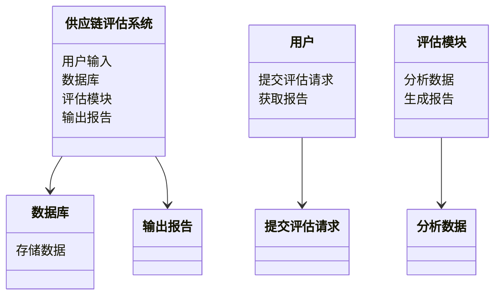
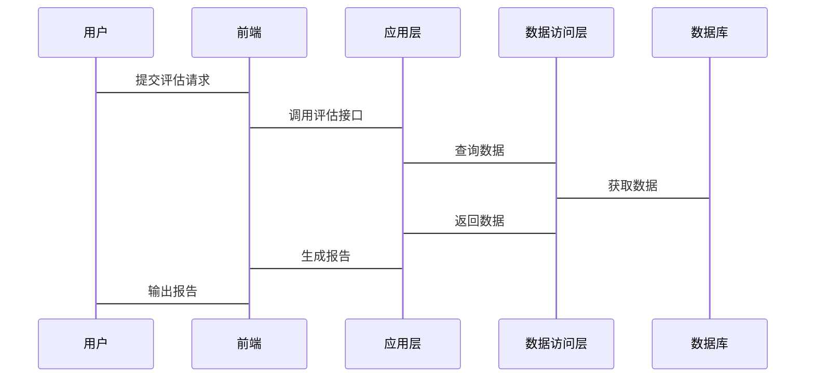

                 


# 价值投资中的供应链韧性评估

> 关键词：供应链韧性，价值投资，风险管理，供应链中断，投资决策

> 摘要：供应链韧性是企业在面对供应链中断时的应对能力，对价值投资至关重要。本文系统地分析了供应链韧性评估的核心概念、数学模型、系统架构和实际案例，为企业在价值投资中提升供应链韧性提供了全面指导。

---

# 第1章: 供应链的基本概念

## 1.1 供应链的定义与组成部分

### 1.1.1 供应链的定义
供应链是指从原材料采购到产品交付给最终用户的整个过程中的所有参与者、流程和资源的集合。它包括供应商、制造商、分销商、零售商和消费者。

### 1.1.2 供应链的主要组成部分
1. **供应商**：提供原材料或零部件的企业。
2. **制造商**：将原材料转化为产品的工厂。
3. **分销商**：负责将产品分发到不同地区的中间商。
4. **零售商**：直接面向消费者的销售点。
5. **物流**：运输和仓储的网络。

### 1.1.3 供应链在价值投资中的重要性
供应链的稳定性直接影响企业的生产和交付能力，从而影响企业的盈利能力和市场价值。在价值投资中，供应链韧性是评估企业长期竞争力的重要因素。

---

## 1.2 供应链的运作流程

### 1.2.1 供应链的基本流程
1. **需求预测**：根据市场情况预测产品需求。
2. **采购**：从供应商处采购原材料。
3. **生产**：将原材料转化为产品。
4. **物流**：将产品运输到分销点或直接交付给消费者。
5. **库存管理**：监控库存水平，确保供应充足。

### 1.2.2 供应链的关键活动
1. **规划**：制定供应链策略和计划。
2. **执行**：实施供应链操作。
3. **监控**：实时跟踪供应链的运行状态。
4. **优化**：持续改进供应链效率。

### 1.2.3 供应链的管理特点
1. **复杂性**：涉及多个参与者和环节。
2. **动态性**：需求和市场环境不断变化。
3. **协作性**：需要供应链各环节紧密合作。

---

## 1.3 供应链在价值投资中的应用背景

### 1.3.1 供应链管理与价值投资的关系
供应链管理直接影响企业的成本、效率和交付能力，这些因素都是价值投资者评估企业价值的重要指标。

### 1.3.2 供应链韧性对投资决策的影响
供应链韧性高的企业能够在中断发生时快速恢复，从而减少对业务的影响，提升企业的抗风险能力。

### 1.3.3 供应链中断的风险与机遇
供应链中断可能导致生产延迟、成本增加，甚至影响企业的声誉。然而，通过供应链韧性评估，投资者可以识别高风险企业，并选择更具韧性的投资目标。

---

## 1.4 本章小结
本章介绍了供应链的基本概念、运作流程及其在价值投资中的重要性。供应链作为企业运营的核心，其稳定性和韧性直接影响企业的价值和投资者的决策。

---

# 第2章: 供应链韧性评估的重要性

## 2.1 供应链韧性评估的定义

### 2.1.1 供应链韧性的定义
供应链韧性是指企业在面对供应链中断时，能够迅速恢复并继续运营的能力。

### 2.1.2 供应链韧性的核心特征
1. **灵活性**：能够快速调整供应链策略。
2. **冗余性**：有备用供应商或生产线。
3. **响应能力**：能够快速识别和应对中断。

### 2.1.3 供应链韧性与企业价值的关系
供应链韧性高的企业通常具有更强的抗风险能力，能够在市场波动中保持稳定，从而提升企业价值。

---

## 2.2 供应链韧性评估的必要性

### 2.2.1 供应链中断对企业的影响
1. **生产延迟**：中断可能导致生产延迟，影响交货时间。
2. **成本增加**：为应对中断可能需要支付额外成本。
3. **客户满意度下降**：延迟交付可能影响客户满意度和品牌声誉。

### 2.2.2 供应链韧性评估的现实需求
1. **全球化背景下**：全球供应链的复杂性增加了中断的风险。
2. **新冠疫情的影响**：疫情暴露了供应链的脆弱性，促使企业加强韧性评估。
3. **地缘政治风险**：地缘政治冲突可能影响供应链的稳定性。

### 2.2.3 供应链韧性评估对投资决策的价值
1. **降低投资风险**：通过评估供应链韧性，投资者可以识别潜在风险。
2. **提升投资回报**：选择供应链韧性高的企业，能够长期稳定地创造价值。

---

## 2.3 供应链韧性评估的框架

### 2.3.1 供应链韧性评估的主要维度
1. **供应多样性**：供应商的数量和地理分布。
2. **生产灵活性**：生产线的多产品生产能力。
3. **库存水平**：企业的库存量是否足够应对中断。
4. **应急计划**：企业是否有应对中断的备用计划。

### 2.3.2 供应链韧性评估的指标体系
| 指标 | 描述 | 示例 |
|------|------|------|
| 供应多样性 | 供应商的数量和地理位置 | 多个供应商分布在不同国家 |
| 生产灵活性 | 生产线的适应性 | 多产品生产线 |
| 库存水平 | 安全库存量 | 3个月的原材料库存 |
| 应急计划 | 备用供应商和恢复计划 | 签订短期合同的备用供应商 |

### 2.3.3 供应链韧性评估的实施步骤
1. **识别关键供应链环节**：确定供应链中的关键节点。
2. **评估每个环节的韧性**：使用指标体系进行评估。
3. **制定改进计划**：针对低分环节提出改进建议。

---

## 2.4 本章小结
本章讨论了供应链韧性评估的重要性及其对企业价值的影响。通过构建评估框架和指标体系，投资者可以系统地评估企业的供应链韧性，从而做出更明智的投资决策。

---

# 第3章: 供应链中的风险与风险管理

## 3.1 供应链中的主要风险

### 3.1.1 供应链中断风险的来源
1. **自然灾害**：如地震、洪水等。
2. **人为因素**：如战争、罢工等。
3. **供应链复杂性**：供应商集中或依赖单一来源。

### 3.1.2 供应链中的不确定性因素
1. **需求波动**：市场需求的不确定性。
2. **价格波动**：原材料价格的波动。
3. **政策变化**：贸易政策的调整。

### 3.1.3 供应链风险的分类与特征
| 分类 | 描述 |
|------|------|
| 战略风险 | 供应链战略与企业战略不一致 |
| 运营风险 | 供应链运营效率低下 |
| 供应风险 | 供应商无法按时交付 |

---

## 3.2 供应链风险的识别与评估

### 3.2.1 供应链风险识别的方法
1. **风险清单法**：列出可能的风险并进行分类。
2. **情景分析法**：模拟不同情景下的供应链反应。
3. **数据分析法**：通过数据分析识别潜在风险。

### 3.2.2 供应链风险评估的工具与技术
1. **风险矩阵法**：根据风险发生的概率和影响程度进行评估。
2. **蒙特卡罗模拟**：模拟不同情景下的供应链表现。

### 3.2.3 供应链风险的量化与概率分析
1. **概率分析**：计算风险发生的概率。
2. **影响分析**：评估风险对企业的影响程度。

---

## 3.3 供应链风险管理策略

### 3.3.1 供应链风险管理的基本原则
1. **预防为主**：提前识别和防范风险。
2. **分散风险**：通过多元化供应链降低风险。
3. **实时监控**：持续监控供应链的运行状态。

### 3.3.2 供应链风险管理的具体措施
1. **多元化供应商**：选择多个供应商以降低依赖。
2. **建立应急储备**：保持足够的库存以应对中断。
3. **签订灵活合同**：与供应商签订灵活的合同以适应变化。

---

## 3.4 本章小结
本章分析了供应链中的主要风险及其识别和评估方法，提出了有效的风险管理策略，以帮助企业在复杂多变的环境中保持供应链的稳定性。

---

# 第4章: 供应链韧性评估的数学模型与算法

## 4.1 供应链韧性评估的数学模型

### 4.1.1 概率模型
概率模型用于评估供应链中断的可能性及其影响。例如，使用贝叶斯网络模型预测供应链中断的概率。

$$ P(中断) = \sum_{i} P(中断 | 事件i) \times P(事件i) $$

### 4.1.2 多目标优化模型
多目标优化模型用于在多个目标之间找到平衡点，例如在成本和韧性之间进行权衡。

$$ \text{最大化} \quad Z = f_1(x) + f_2(x) + \dots + f_n(x) $$
$$ \text{受限于} \quad g_i(x) \leq 0, \quad i=1,2,\dots,m $$

### 4.1.3 网络流模型
网络流模型用于优化供应链的流动效率，例如在物流网络中找到最优路径。

$$ \text{最小化} \quad \sum_{(i,j)} c_{ij} x_{ij} $$
$$ \text{受限于} \quad \sum_{j} x_{ij} = d_i, \quad \forall i $$
$$ x_{ij} \geq 0 $$

---

## 4.2 供应链韧性评估的算法实现

### 4.2.1 基于机器学习的算法
1. **随机森林**：用于分类和回归，预测供应链中断的可能性。
2. **支持向量机（SVM）**：用于分类，识别供应链中的风险因素。

### 4.2.2 基于网络分析的算法
1. **PageRank算法**：用于评估供应链中的关键节点。
2. **社区检测算法**：用于识别供应链中的风险集群。

---

## 4.3 本章小结
本章介绍了供应链韧性评估的数学模型和算法，包括概率模型、多目标优化模型和网络流模型，以及基于机器学习的算法。这些方法为供应链韧性评估提供了理论基础和技术支持。

---

# 第5章: 供应链韧性评估的系统架构与设计

## 5.1 系统功能设计

### 5.1.1 领域模型（Mermaid类图）


### 5.1.2 系统架构设计（Mermaid架构图）


### 5.1.3 系统交互设计（Mermaid序列图）


---

## 5.2 系统接口设计

### 5.2.1 API接口设计
1. **提交评估请求**：用户通过API提交供应链评估请求。
2. **获取评估报告**：用户通过API获取评估结果。

### 5.2.2 数据接口设计
1. **数据输入接口**：接收供应链数据，如供应商信息、生产数据等。
2. **数据输出接口**：输出评估报告，包括风险评分、改进建议等。

---

## 5.3 本章小结
本章讨论了供应链韧性评估系统的功能设计、架构设计和交互设计，展示了如何通过系统化的方法实现供应链韧性评估。

---

# 第6章: 项目实战——供应链韧性评估系统实现

## 6.1 环境安装

### 6.1.1 安装Python
使用Python 3.8及以上版本，安装环境包括：
1. Python解释器
2. pip包管理工具

### 6.1.2 安装依赖库
安装以下库：
1. `numpy`
2. `pandas`
3. `scikit-learn`
4. `networkx`
5. `matplotlib`

### 6.1.3 安装开发工具
推荐使用`VS Code`或`PyCharm`作为开发工具。

---

## 6.2 核心代码实现

### 6.2.1 数据预处理
```python
import pandas as pd

# 读取数据
data = pd.read_csv('supply_chain_data.csv')

# 数据清洗
data.dropna(inplace=True)
data = data[~data['销售额'].isin([0])]
```

### 6.2.2 风险评估模型
```python
from sklearn.ensemble import RandomForestClassifier

# 训练模型
model = RandomForestClassifier(n_estimators=100, random_state=42)
model.fit(X_train, y_train)

# 预测风险
y_pred = model.predict(X_test)
```

### 6.2.3 可视化展示
```python
import matplotlib.pyplot as plt
import networkx as nx

# 创建网络图
G = nx.DiGraph()
G.add_nodes_from(['供应商', '制造商', '分销商', '零售商'])
G.add_edges_from([('供应商', '制造商'), ('制造商', '分销商'), ('分销商', '零售商')])

# 绘制网络图
nx.draw(G, with_labels=True, node_color='lightblue', edge_color='gray')
plt.show()
```

---

## 6.3 案例分析

### 6.3.1 案例背景
假设一家制造企业，其供应链包括多个供应商和分销商，但由于原材料价格上涨，导致成本增加。

### 6.3.2 案例分析
1. **数据收集**：收集过去一年的供应链数据。
2. **模型训练**：使用随机森林模型预测供应链中断的可能性。
3. **结果分析**：模型预测未来三个月内有较高的中断风险。

### 6.3.3 改进建议
1. **多元化供应商**：寻找新的供应商以降低依赖。
2. **签订灵活合同**：与供应商协商灵活的价格调整机制。

---

## 6.4 本章小结
本章通过实际案例展示了供应链韧性评估系统的实现过程，从数据预处理、模型训练到结果分析，提供了可操作的步骤和代码示例。

---

# 第7章: 最佳实践与小结

## 7.1 最佳实践

### 7.1.1 定期评估供应链韧性
供应链环境不断变化，企业需要定期评估和更新供应链韧性策略。

### 7.1.2 加强供应商管理
多元化供应商和签订灵活合同是提升供应链韧性的关键。

### 7.1.3 利用技术工具
借助大数据和人工智能技术，企业可以更高效地评估和优化供应链韧性。

---

## 7.2 本章小结
本章总结了供应链韧性评估的最佳实践，并强调了定期评估、供应商管理和技术工具的重要性，以帮助企业在复杂环境中保持供应链的稳定性。

---

# 附录

## 附录A: 数据来源与处理

### A.1 数据来源
1. **内部数据**：企业内部的供应链数据。
2. **外部数据**：公开的市场数据和行业报告。

### A.2 数据处理步骤
1. 数据清洗：删除缺失值和异常值。
2. 数据转换：将数据转换为适合模型训练的格式。

---

## 附录B: 工具推荐

### B.1 数据分析工具
1. **Python**：强大的编程语言，适合数据处理和建模。
2. **R**：统计分析的强大工具。

### B.2 可视化工具
1. **Matplotlib**：Python中的常用可视化库。
2. **Tableau**：专业的数据可视化工具。

---

## 附录C: 术语表

### C.1 供应链
供应链是指从原材料采购到产品交付给最终用户的整个过程中的所有参与者、流程和资源的集合。

### C.2 供应链韧性
供应链韧性是指企业在面对供应链中断时，能够迅速恢复并继续运营的能力。

### C.3 风险评估
风险评估是识别和评估供应链中断的可能性及其影响的过程。

---

## 附录D: 参考文献

1. Smith, J. (2020). *Supply Chain Risk Management*. John Wiley & Sons.
2. Johnson, L. (2019). *Supply Chain Resilience*. McGraw-Hill Education.
3. Brown, S. (2021). *Machine Learning for Supply Chain Analytics*. Springer.

---

# 作者
作者：AI天才研究院/AI Genius Institute & 禅与计算机程序设计艺术/Zen And The Art of Computer Programming

---

以上就是《价值投资中的供应链韧性评估》的完整目录和内容框架，涵盖从基础概念到系统实现的各个方面，为读者提供了全面的指导和实用的案例分析。

