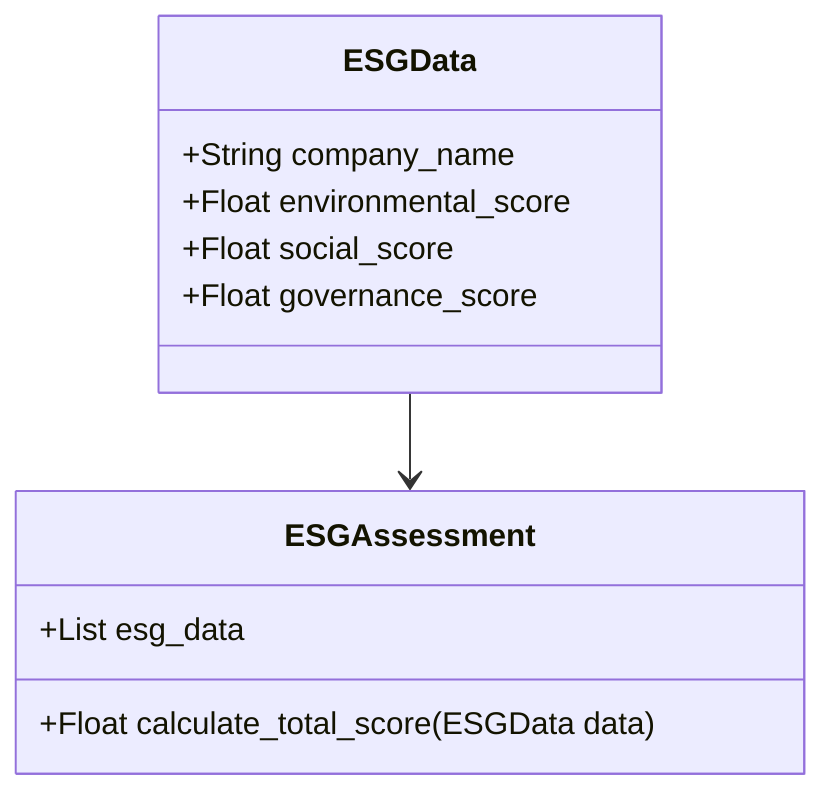
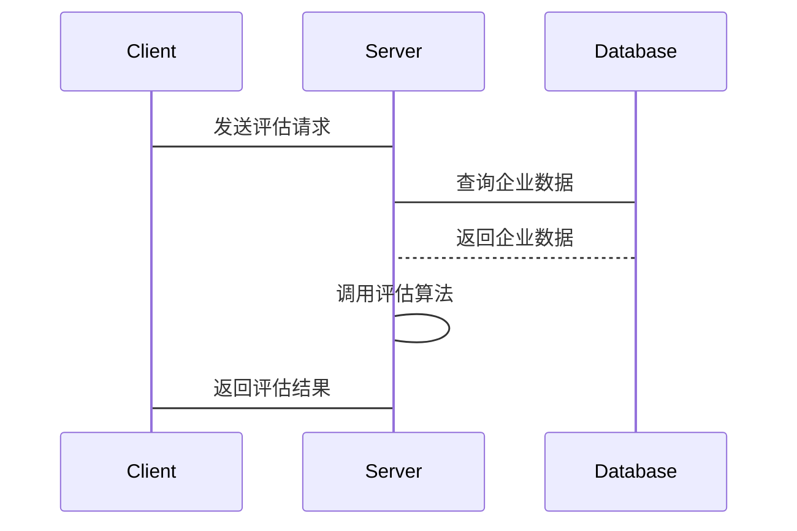

                 


# 价值投资中的可持续发展因素

> 关键词：可持续发展, 价值投资, ESG, 企业价值, 可持续发展评估

> 摘要：本文探讨了可持续发展因素在价值投资中的重要性，分析了环境、社会和治理（ESG）因素对企业价值的影响，并结合量化方法和系统设计，展示了如何将可持续发展因素整合到投资决策中。文章结合实际案例和数学模型，为投资者提供了可持续发展的投资策略和实践方法。

---

## 第1章 可持续发展与价值投资的背景

### 1.1 可持续发展与价值投资的背景

#### 1.1.1 可持续发展的定义与内涵
可持续发展是指在满足当前需求的同时，不损害后代人满足其需求的能力。在商业领域，可持续发展强调企业在追求经济效益的同时，还要关注环境保护、社会责任和治理结构。

#### 1.1.2 价值投资的核心理念
价值投资是一种投资策略，强调以低于内在价值的价格购买优质资产。其核心在于识别那些被市场低估的企业，长期持有以获取超额收益。

#### 1.1.3 可持续发展与价值投资的结合
随着全球对环境问题、社会责任和治理透明度的关注增加，可持续发展已成为企业竞争力的重要组成部分。价值投资者开始将ESG因素纳入投资决策，以识别更具长期稳定性的企业。

### 1.2 可持续发展在投资中的重要性

#### 1.2.1 环境、社会和治理（ESG）因素
- **环境（E）**：企业对环境的影响，包括碳排放、资源利用效率等。
- **社会（S）**：企业对社会的贡献，包括员工权益、社会责任等。
- **治理（G）**：企业的治理结构和透明度，包括董事会构成、内部控制等。

#### 1.2.2 可持续发展与企业长期价值的关系
可持续发展因素直接影响企业的长期盈利能力、抗风险能力和品牌价值。研究表明，ESG表现优异的企业往往具有更高的股东回报。

#### 1.2.3 投资者对可持续发展的关注趋势
越来越多的投资者认识到，可持续发展不仅是道德要求，更是实现长期投资收益的重要因素。全球资产管理行业正在将ESG因素纳入投资组合的评估体系。

### 1.3 本章小结
本章介绍了可持续发展的定义和内涵，探讨了其在价值投资中的重要性，并强调了ESG因素在企业长期价值创造中的作用。

---

## 第2章 可持续发展因素的多维度分析

### 2.1 环境因素（E）

#### 2.1.1 环境因素的定义与影响
环境因素关注企业在经营过程中对环境的影响，包括能源消耗、碳排放、废物处理等。这些因素不仅影响企业的运营成本，还可能引发环境风险。

#### 2.1.2 环境数据的收集与评估
- **数据收集**：通过企业公开报告、第三方评级机构数据等获取环境信息。
- **评估方法**：使用环境影响评估模型（如生命周期评估）量化企业的环境影响。

#### 2.1.3 环境风险对企业价值的影响
环境风险可能引发监管处罚、社会责任争议，进而影响企业的市场价值和融资成本。

### 2.2 社会因素（S）

#### 2.2.1 社会因素的定义与影响
社会因素关注企业在社会中的角色和贡献，包括员工权益、社区关系、产品安全等。良好的社会表现有助于提升企业的声誉和客户忠诚度。

#### 2.2.2 社会责任与企业声誉
企业履行社会责任可以提升品牌形象，增强客户信任，从而在竞争中获得优势。

#### 2.2.3 社会治理对企业价值的影响
有效的社会治理机制可以降低企业的经营风险，提升管理效率，从而增强企业的长期盈利能力。

### 2.3 治理因素（G）

#### 2.3.1 公司治理的定义与核心要素
公司治理是指企业如何管理和监督其业务运作，包括董事会结构、股权分布、内部控制等。

#### 2.3.2 治理结构对企业价值的影响
良好的治理结构可以提升企业的透明度和决策效率，降低代理成本，从而提升企业的市场价值。

#### 2.3.3 治理风险的评估与管理
治理风险包括董事会独立性不足、内部控制缺陷等问题，这些问题可能影响企业的长期发展和投资者信心。

### 2.4 本章小结
本章从环境、社会和治理三个维度分析了可持续发展因素，并探讨了它们对企业价值的影响。

---

## 第3章 可持续发展因素与企业价值的关系

### 3.1 可持续发展因素对企业财务表现的影响

#### 3.1.1 ESG因素与企业盈利能力的关系
研究表明，ESG表现优异的企业通常具有更高的利润率和净资产收益率。

#### 3.1.2 ESG因素与企业成长能力的关系
良好的环境和社会表现有助于企业拓展市场，提升品牌影响力，从而增强成长能力。

#### 3.1.3 ESG因素与企业抗风险能力的关系
可持续发展因素可以降低企业的经营风险，提升应对市场波动的能力。

### 3.2 可持续发展因素与企业市场价值的关系

#### 3.2.1 ESG评级与股票估值的关系
ESG评级高的企业通常具有较高的市盈率和市净率，因为投资者愿意为其可持续发展表现支付溢价。

#### 3.2.2 ESG表现与股票流动性的关系
良好的ESG表现可以提升股票的流动性和交易活跃度，从而降低交易成本。

#### 3.2.3 ESG因素与企业品牌价值的关系
品牌价值是企业市场价值的重要组成部分，而良好的ESG表现可以显著提升品牌价值。

### 3.3 可持续发展因素与企业长期价值的结合

#### 3.3.1 长期投资视角下的ESG因素
从长期来看，ESG因素能够预测企业的长期表现和抗风险能力。

#### 3.3.2 可持续发展与企业创新发展的关系
可持续发展因素推动企业技术创新和管理创新，从而提升企业的核心竞争力。

#### 3.3.3 可持续发展对企业竞争优势的影响
在竞争日益激烈的市场环境中，ESG表现优异的企业更容易吸引和留住优秀人才，从而形成竞争优势。

### 3.4 本章小结
本章分析了可持续发展因素对企业财务表现和市场价值的影响，强调了ESG因素在企业长期价值创造中的重要作用。

---

## 第4章 可持续发展因素的量化评估方法

### 4.1 ESG评级体系的构建

#### 4.1.1 ESG评级的定义与分类
ESG评级是对企业在环境、社会和治理方面的表现进行综合评估，并按照一定的标准进行分类。

#### 4.1.2 ESG评级的核心指标
- **环境指标**：碳排放、能源消耗等。
- **社会指标**：员工权益、社会责任等。
- **治理指标**：董事会结构、内部控制等。

#### 4.1.3 ESG评级的计算方法
通过加权评分法对企业在环境、社会和治理方面的表现进行量化评估。

### 4.2 可持续发展因素的量化模型

#### 4.2.1 ESG因子的定义与提取
通过数据挖掘和统计分析提取与ESG相关的因子。

#### 4.2.2 基于回归分析的ESG因子影响评估
使用多元回归模型分析ESG因子对企业价值的影响。

#### 4.2.3 基于机器学习的ESG预测模型
利用机器学习算法（如随机森林、支持向量机）预测企业的ESG表现。

### 4.3 本章小结
本章介绍了ESG评级体系的构建方法，并探讨了基于回归分析和机器学习的量化评估模型。

---

## 第5章 系统分析与架构设计方案

### 5.1 问题场景介绍
为了量化企业的ESG表现，我们需要构建一个可持续发展评估系统。

### 5.2 系统功能设计（领域模型）



### 5.3 系统架构设计


### 5.4 系统接口设计
- **输入接口**：接收企业的环境、社会和治理数据。
- **输出接口**：提供企业的ESG评分和评估报告。

### 5.5 系统交互设计



### 5.6 本章小结
本章设计了一个可持续发展评估系统的架构，并展示了系统的核心组件和交互流程。

---

## 第6章 项目实战

### 6.1 环境安装
安装Python、Pandas、Scikit-learn等工具。

### 6.2 系统核心实现源代码

```python
import pandas as pd
from sklearn.linear_model import LinearRegression

# 加载数据
data = pd.read_csv('esg.csv')

# 定义模型
model = LinearRegression()

# 训练模型
model.fit(data[['environmental_score', 'social_score', 'governance_score']], data['value'])

# 预测企业价值
predicted_value = model.predict([[0.8, 0.7, 0.6]])
```

### 6.3 代码应用解读与分析
通过上述代码，我们可以利用线性回归模型预测企业的价值，从而量化ESG因素的影响。

### 6.4 实际案例分析
以某企业为例，分析其ESG表现对价值的影响。

### 6.5 项目小结
本章通过实际案例展示了如何将可持续发展因素整合到投资决策中，并提供了代码实现。

---

## 第7章 总结与展望

### 7.1 本章总结
本文探讨了可持续发展因素在价值投资中的重要性，并结合量化方法和系统设计，展示了如何将ESG因素纳入投资决策。

### 7.2 未来展望
随着技术的进步和数据的丰富，可持续发展评估将更加精准和智能化。未来的研究可以进一步探索ESG因子与其他投资策略的结合。

### 7.3 最佳实践 tips
- 长期投资是实现可持续发展的关键。
- 数据质量是ESG评估的基础。
- 技术与人文的结合是实现可持续发展的核心。

### 7.4 本章小结
本章总结了全文的主要内容，并对未来的研究方向提出了展望。

---

## 作者信息

作者：AI天才研究院/AI Genius Institute & 禅与计算机程序设计艺术/Zen And The Art of Computer Programming

---

# 结语
通过本文的分析和实践，读者可以全面理解可持续发展因素在价值投资中的重要性，并掌握如何将这些因素整合到实际的投资决策中。未来，随着技术的进步和可持续发展理念的深入，价值投资将更加注重企业的长期价值和可持续发展能力。

