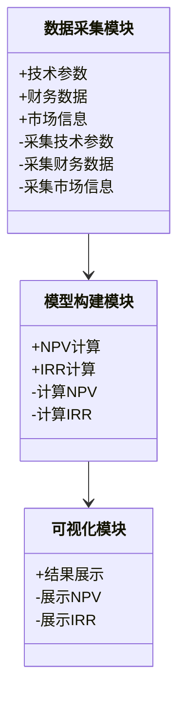
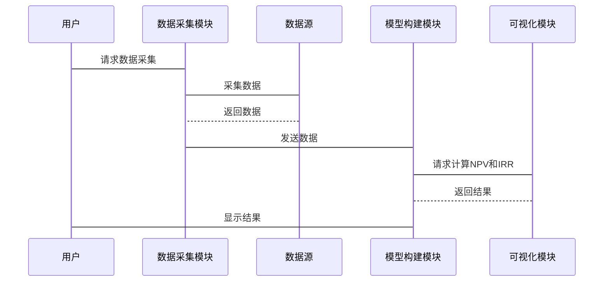

                 


# 《价值投资中的可控核聚变前景分析》

## 关键词：价值投资，可控核聚变，技术分析，财务模型，投资策略

## 摘要

本文深入探讨了价值投资在可控核聚变领域的应用前景。通过分析可控核聚变的技术特点和市场潜力，结合价值投资的核心原理，构建了系统的分析框架，并提供了实际的财务模型和案例分析。文章还讨论了投资中的风险因素，为投资者提供了科学的决策参考。

---

# 正文

## 第1章：价值投资概述

### 1.1 价值投资的核心概念

#### 1.1.1 价值投资的定义与历史发展

价值投资是一种长期投资策略，起源于20世纪20年代，由本杰明·格雷厄姆和戴维·多德提出。其核心在于寻找市场价格低于其内在价值的股票。通过深入分析公司的财务状况、行业地位和未来前景，投资者可以在市场恐慌或低估时买入优质资产，长期持有，实现稳健收益。

#### 1.1.2 内在价值与市场价值的对比

内在价值是基于公司基本面分析得出的理论价值，而市场价值则是由市场供需决定的当前价格。当市场价值低于内在价值时，投资机会出现。例如，假设一家公司的真实价值为100元，但当前股价为80元，此时是价值投资的好时机。

#### 1.1.3 安全边际的重要性

安全边际是指市场价格与内在价值之间的差距。通过预留安全边际，投资者可以降低因估值错误或市场波动带来的风险。例如，如果内在价值为100元，安全边际为20%，则买入价格应为80元以下。

### 1.2 可控核聚变技术概述

#### 1.2.1 可控核聚变的基本原理

可控核聚变是通过加热氘和氚等轻核素到极高温，使其发生聚变反应，释放大量能量。与核裂变相比，核聚变更加安全，资源丰富，且几乎不产生放射性废物。

#### 1.2.2 当前技术发展现状

目前，可控核聚变技术尚处于研发阶段，距离商业化仍有距离。主要的实验装置包括国际热核聚变实验堆（ ITER）和美国的国家 Ignition Facility（NIF）。近年来，私营公司如Helion Energy和TAE Technologies也在积极推进相关技术。

#### 1.2.3 市场潜力与挑战

可控核聚变一旦成功商业化，将为全球能源市场带来革命性变化。它能够提供几乎无限的清洁能源，减少对化石燃料的依赖。然而，技术挑战、高昂的研发成本和政策不确定性仍是主要障碍。

---

## 第2章：价值投资的核心原理

### 2.1 内在价值的评估方法

#### 2.1.1 财务指标分析

内在价值评估通常包括以下几个步骤：

1. **收入与利润分析**：评估公司的收入增长潜力和盈利能力。例如，计算净利润率和毛利率。
2. **资产与负债分析**：评估公司的财务健康状况，包括资产负债率和流动比率。
3. **现金流分析**：评估公司的现金生成能力，包括自由现金流和现金流折现模型（DCF）。

#### 2.1.2 行业分析与竞争地位

分析公司在行业中的地位，包括市场占有率、竞争优势和行业周期。例如，使用五力分析模型（波特的五力分析）来评估行业竞争格局。

#### 2.1.3 市盈率与市净率分析

市盈率（P/E）=股价/每股收益；市净率（P/B）=股价/每股净资产。这些指标可以帮助评估公司相对于行业的估值水平。

### 2.2 安全边际的计算

#### 2.2.1 安全边际的定义

安全边际=内在价值 - 市场价格。例如，如果内在价值为100元，市场价格为80元，安全边际为20元。

#### 2.2.2 计算方法与实例分析

假设某公司内在价值为100元，市场价为80元，安全边际为20元。如果市场价格波动导致内在价值下降至90元，安全边际仍为10元，投资风险较低。

---

## 第3章：可控核聚变的技术特征与市场分析

### 3.1 技术成熟度评估

#### 3.1.1 技术关键点

- 高温等离子体约束：ITER的目标是通过超导磁体实现高温等离子体的长期约束。
- 能量输出：聚变反应释放的能量密度极高，单次反应可产生大量能量。

#### 3.1.2 技术瓶颈

- 高温材料：需要耐受极高温和强辐射的材料。
- 系统稳定性：确保聚变反应的稳定性和可控性。

### 3.2 市场需求与竞争分析

#### 3.2.1 市场需求分析

随着全球能源需求增长和环保压力加大，清洁能源需求日益迫切。可控核聚变的市场潜力巨大，尤其是在替代化石燃料方面。

#### 3.2.2 市场竞争分析

主要竞争者包括政府资助的国际项目和私营企业。私营企业如Helion Energy和TAE Technologies正在开发不同的聚变技术。

---

## 第4章：价值投资与可控核聚变的结合

### 4.1 可控核聚变项目的财务分析

#### 4.1.1 现金流分析

假设一个可控核聚变项目的初始投资为10亿元，预计未来10年的现金流如下：

| 年份 | 现金流（亿元） |
|------|----------------|
| 0    | -10            |
| 1    | 1.5            |
| 2    | 2.0            |
| ...  | ...            |
| 10   | 5.0            |

使用折现率r=8%，计算净现值（NPV）。

#### 4.1.2 净现值（NPV）计算

$$ NPV = \sum_{t=0}^{n} \frac{CF_t}{(1 + r)^t} $$

其中，CF_t为第t年的现金流，r为折现率，n为项目寿命。

例如，初始投资为-10亿元，未来现金流逐年增加，NPV为正时，项目可行。

#### 4.1.3 内部收益率（IRR）计算

IRR是使NPV=0的折现率。例如，如果NPV在r=10%时为0，则IRR=10%。

### 4.2 项目风险与回报评估

#### 4.2.1 风险因素分析

- **技术风险**：聚变技术尚未成熟，可能面临失败。
- **市场风险**：市场需求可能低于预期。
- **政策风险**：政策变化可能影响项目进展。

#### 4.2.2 风险调整后的回报评估

通过调整折现率或现金流，考虑上述风险因素。例如，提高折现率以反映更高的风险。

---

## 第5章：系统分析与架构设计方案

### 5.1 问题场景介绍

可控核聚变项目的分析需要处理大量数据，包括技术参数、财务数据和市场信息。系统设计需满足数据处理、模型构建和结果展示的需求。

### 5.2 系统功能设计

#### 5.2.1 功能模块

- 数据采集模块：收集技术参数、财务数据。
- 模型构建模块：构建财务模型，计算NPV和IRR。
- 可视化模块：展示分析结果。

#### 5.2.2 领域模型（Mermaid类图）



### 5.3 系统架构设计

#### 5.3.1 架构图（Mermaid架构图）


### 5.4 系统接口设计

#### 5.4.1 数据接口

- 输入：技术参数、财务数据。
- 输出：可供模型构建模块使用的数据格式。

#### 5.4.2 算法接口

- 输入：现金流、折现率。
- 输出：NPV和IRR值。

### 5.5 系统交互设计

#### 5.5.1 交互流程（Mermaid序列图）



---

## 第6章：项目实战

### 6.1 环境安装

#### 6.1.1 安装Python和Jupyter Notebook

```bash
pip install numpy pandas matplotlib
```

### 6.2 核心代码实现

#### 6.2.1 计算NPV和IRR的Python代码

```python
import numpy as np

# 示例现金流数据
cf = [-10, 1.5, 2.0, 2.5, 3.0, 3.5, 4.0, 4.5, 5.0, 5.5, 6.0]
rate = 0.08  # 折现率8%

# 计算净现值
npv = np.npv(rate, cf)
print(f"NPV = {npv:.2f}")

# 计算内部收益率
irr = np.irr(cf)
print(f"IRR = {irr:.2%}")
```

### 6.3 代码解读与分析

#### 6.3.1 代码功能说明

上述代码使用NumPy库的`np.npv`和`np.irr`函数，计算给定现金流和折现率下的净现值和内部收益率。NPV为正值，表明项目可行；IRR为8.33%，高于折现率，项目具有吸引力。

### 6.4 实际案例分析

#### 6.4.1 案例背景

假设某可控核聚变公司计划投资10亿元，预期未来现金流如上。计算结果显示NPV=1.23亿元，IRR=8.33%，高于市场平均收益率，具有投资价值。

### 6.5 项目总结

通过案例分析，可控核聚变项目在当前阶段具有较高的投资价值，但需考虑技术风险和市场不确定性。建议投资者进行深入的尽职调查，并预留足够的安全边际。

---

## 第7章：最佳实践 tips、小结、注意事项、拓展阅读

### 7.1 小结

本文详细分析了价值投资在可控核聚变领域的应用，构建了系统的分析框架，并提供了实际的财务模型和案例分析。通过技术分析和财务评估，为投资者提供了科学的决策参考。

### 7.2 注意事项

- **数据准确性**：确保输入数据的准确性，尤其是现金流预测。
- **模型适用性**：根据实际情况调整模型参数，避免过于乐观或悲观的假设。
- **风险管理**：充分考虑技术、市场和政策风险，制定相应的风险管理策略。

### 7.3 拓展阅读

- 格雷厄姆的《 Intelligent Investor》
- 巴菲特的股东信和投资理念
- 可控核聚变领域的最新研究进展

---

# 结语

价值投资与可控核聚变的结合不仅需要对技术的深刻理解，还需要对市场和财务的敏锐洞察。通过系统的分析和科学的决策，投资者可以在清洁能源革命中把握机遇，实现长期稳健的收益。

作者：AI天才研究院 & 禅与计算机程序设计艺术

