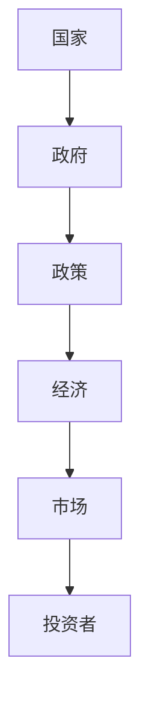
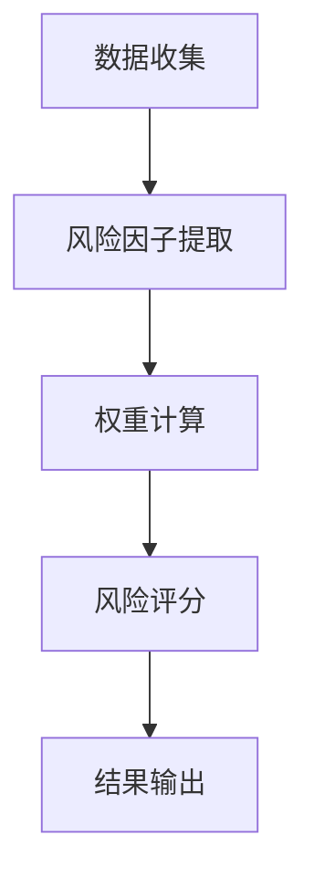
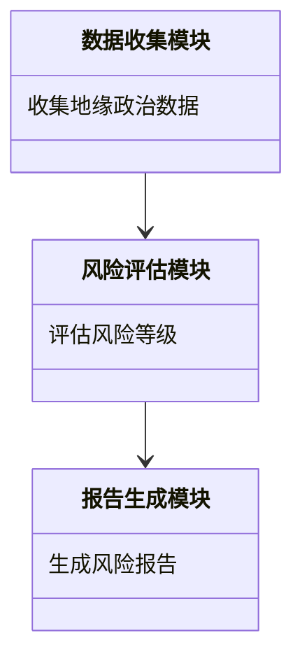
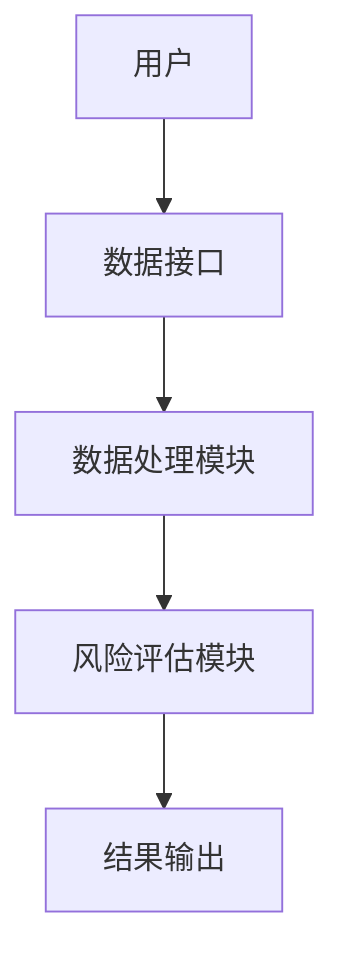

                 


# 价值投资中的地缘政治风险评估

## 关键词：价值投资、地缘政治风险、风险评估、投资策略、风险管理

## 摘要：  
地缘政治风险是价值投资中不可忽视的重要因素，它涵盖了政治、经济和军事等多个层面的风险。本文通过系统分析地缘政治风险的核心概念、评估方法和应对策略，为投资者提供全面的风险管理框架。文章从背景介绍、核心概念、算法原理、系统设计、项目实战到最佳实践，层层递进，帮助投资者在复杂的国际环境中做出明智的投资决策。

---

## 第一部分：地缘政治风险与价值投资的背景

### 第1章：地缘政治风险概述

#### 1.1 地缘政治风险的定义与特点

地缘政治风险是指因地理位置、国家政策、国际关系等因素变化而带来的不确定性，影响经济和市场表现。其特点包括复杂性、长期性、不可预测性，且对投资决策有重大影响。

#### 1.2 价值投资的基本原理

价值投资强调购买低于内在价值的资产，关注长期收益。核心理念包括安全边际、逆向思维和长期持有，但忽视地缘政治风险可能导致重大损失。

### 第2章：地缘政治风险对投资的影响

#### 2.1 地缘政治风险的分类

- **政治风险**：政策变动、政权更迭等。
- **经济风险**：贸易制裁、汇率波动等。
- **军事风险**：冲突、战争等。

#### 2.2 地缘政治风险的评估方法

- **定性评估**：分析政策变化、国际关系等。
- **定量评估**：使用数据模型预测。
- **综合评估**：结合定性和定量方法。

---

## 第二部分：地缘政治风险评估的核心概念与联系

### 第3章：地缘政治风险的核心要素

#### 3.1 地缘政治风险的实体关系图



#### 3.2 地缘政治风险的属性特征对比

| 属性 | 政治风险 | 经济风险 | 军事风险 |
|------|---------|---------|---------|
| 主体 | 政府行为 | 经济波动 | 军事冲突 |
| 影响 | 政治稳定性 | 经济增长 | 地区安全 |

### 第4章：地缘政治风险评估的算法原理

#### 4.1 风险评估模型



#### 4.2 数学模型与公式

**风险加权评分模型**

$$ \text{总风险评分} = \sum_{i=1}^{n} w_i \times r_i $$

其中，\( w_i \) 是风险因子 \( i \) 的权重，\( r_i \) 是风险因子 \( i \) 的评分。

---

## 第三部分：地缘政治风险评估的系统分析与架构设计

### 第5章：地缘政治风险评估系统

#### 5.1 系统功能设计



#### 5.2 系统架构设计



---

## 第四部分：地缘政治风险评估的项目实战

### 第6章：项目实战

#### 6.1 环境安装

- 数据收集工具：Python的requests库。
- 数据分析工具：Pandas和NumPy。
- 可视化工具：Matplotlib。

#### 6.2 核心实现代码

```python
import requests
import pandas as pd
import numpy as np

def collect_data(country):
    url = f"https://api.example.com/{country}/risk"
    response = requests.get(url)
    return pd.DataFrame(response.json())

def calculate_weights(matrix):
    # 示例：计算权重，这里简化为等权
    return np.array([1 for _ in range(matrix.shape[1])])

def assess_risk(matrix, weights):
    return np.dot(matrix, weights)

# 示例：评估某国风险
data = collect_data("美国")
weights = calculate_weights(data)
risk_scores = assess_risk(data, weights)
```

#### 6.3 案例分析

以中美贸易摩擦为例，分析关税政策对股市的影响，应用上述模型进行风险评估。

---

## 第五部分：最佳实践与总结

### 第7章：最佳实践

#### 7.1 投资策略建议

- 分散投资：降低单一市场的风险。
- 长期视角：关注地缘政治的长期趋势。
- 动态调整：定期评估并调整投资组合。

#### 7.2 注意事项

- 数据质量：确保数据来源可靠。
- 模型局限：认识到模型的预测能力有限。
- 综合考量：结合定量和定性分析。

### 7.3 项目小结

地缘政治风险评估是价值投资的重要环节，通过科学的模型和系统的架构，投资者可以更好地应对不确定性，实现稳健投资。

---

## 作者：AI天才研究院  
联系方式：[email protected]  
GitHub：[AI Genius Institute](https://github.com/AI-Genius-Institute)

