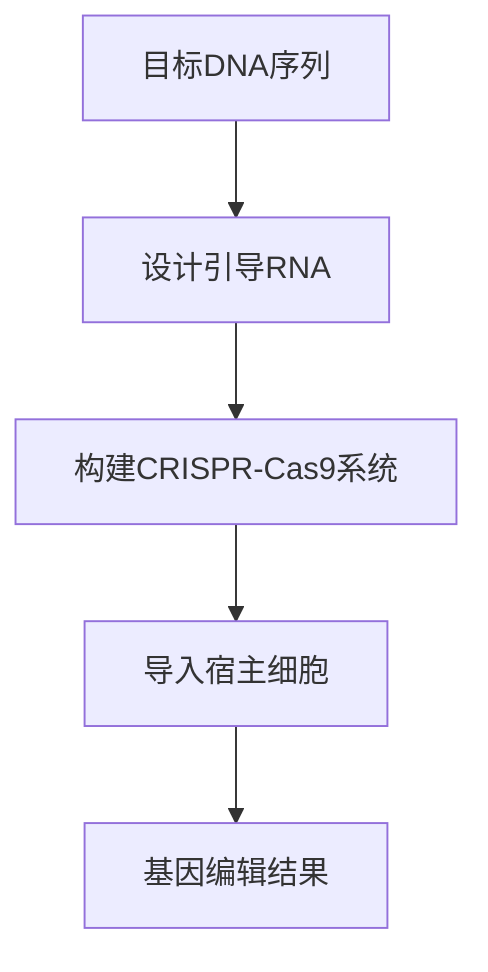
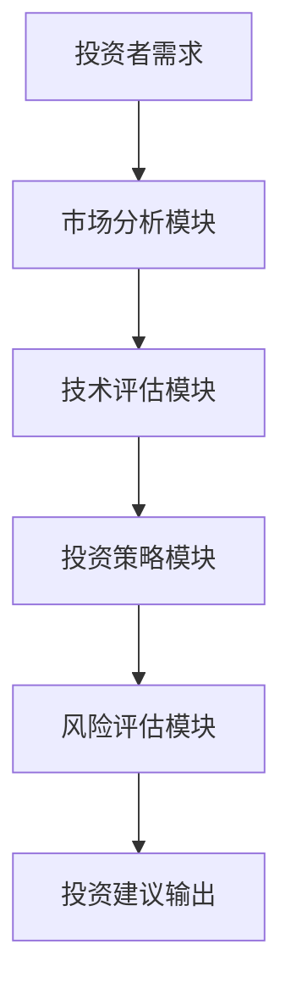

                 

# 价值投资中的基因编辑作物技术发展趋势

> 关键词：基因编辑技术、价值投资、CRISPR-Cas9、农业创新、投资策略

> 摘要：本文深入探讨了基因编辑技术在农业领域的应用及其投资价值，分析了基因编辑作物的市场现状、技术发展趋势，并结合价值投资的基本理论，提出了投资者在基因编辑作物领域的投资策略和风险控制方法。通过系统化的分析和案例研究，本文为投资者提供了科学、合理的投资建议。

---

## 第一章: 基因编辑技术的基本概念与原理

### 1.1 基因编辑技术的定义与分类

基因编辑技术是一种通过人工手段对生物体的基因组进行精确修改的技术。它能够定点修改基因组中的特定序列，从而实现对生物性状的精准调控。基因编辑技术主要包括以下几种类型：

1. **CRISPR-Cas9**：一种基于细菌免疫系统的基因编辑工具，具有高效、精准的特点。
2. **TALEN**：通过人工设计的转录激活因子样效应核酸酶，能够定点切割DNA。
3. **Zinc Finger Nuclease (ZFN)**：锌指核酸酶，利用锌指蛋白识别特定DNA序列并进行切割。

### 1.2 基因编辑技术在农业中的应用

基因编辑技术在农业领域的应用主要集中在作物改良和病虫害防治方面。例如：

1. **作物抗病性改良**：通过编辑作物基因组，增强作物对病虫害的抗性。
2. **提高营养价值**：通过基因编辑技术改良作物的营养成分，如增加维生素含量。
3. **抗旱抗涝特性**：通过基因编辑技术赋予作物更强的抗逆能力。

---

## 第二章: 价值投资的基本理论与方法

### 2.1 价值投资的核心理念

价值投资是一种以低于内在价值的价格买入优质资产的投资策略。其核心理念包括：

1. **安全边际**：买入价格低于内在价值，以确保投资的安全性。
2. **长期视角**：关注企业的长期发展潜力，而非短期市场波动。
3. **基本面分析**：通过对企业的财务状况、行业地位和竞争优势进行深入分析，评估其内在价值。

### 2.2 基因编辑作物领域的投资机会

基因编辑技术在农业领域的广泛应用为投资者提供了新的投资机会。以下是基因编辑作物领域的几个投资方向：

1. **基因编辑技术开发公司**：投资于掌握核心基因编辑技术的企业。
2. **基因编辑作物种植企业**：投资于利用基因编辑技术改良作物的农业企业。
3. **相关技术服务提供商**：投资于为基因编辑作物提供技术支持的企业。

---

## 第三章: 基因编辑技术的核心概念与联系

### 3.1 基因编辑技术的原理与流程

基因编辑技术的核心流程包括以下几个步骤：

1. **目标基因的识别**：确定需要编辑的基因及其功能。
2. **设计引导RNA（仅限CRISPR-Cas9）**：设计能够特异性识别目标基因的RNA序列。
3. **构建基因编辑系统**：将Cas9酶和引导RNA导入目标细胞。
4. **基因组编辑**：Cas9酶在引导RNA的指引下，对目标基因进行切割和修复。
5. **筛选与验证**：对编辑后的细胞进行筛选，验证基因编辑的成功率。

### 3.2 基因编辑技术与农业的关系

基因编辑技术在农业中的应用不仅能够提高作物的产量和抗病能力，还能够减少对化学农药和化肥的依赖，从而降低农业生产成本并改善环境质量。例如，通过基因编辑技术改良的抗虫作物可以减少农药的使用，从而降低农业生产的环境负担。

---

## 第四章: 基因编辑技术的算法原理与数学模型

### 4.1 CRISPR-Cas9算法的流程图

以下是CRISPR-Cas9基因编辑技术的流程图：

### 4.2 基因编辑技术的数学模型

基因编辑技术的编辑效率可以通过以下公式进行计算：

$$ \text{编辑效率} = \frac{\text{成功编辑的细胞数}}{\text{总处理的细胞数}} $$

---

## 第五章: 系统分析与架构设计方案

### 5.1 问题场景介绍

基因编辑技术在农业中的应用为投资者提供了新的投资机会，但也带来了技术和市场双重风险。投资者需要通过系统化的分析和评估，识别具有投资价值的企业和项目。

### 5.2 项目介绍与系统功能设计

以下是基因编辑作物投资分析系统的功能模块设计：

### 5.3 系统架构设计

以下是基因编辑作物投资分析系统的架构设计图：

---

## 第六章: 项目实战与案例分析

### 6.1 项目实战

以下是基因编辑技术在农业中的实际应用案例：

1. **抗虫作物的开发**：通过基因编辑技术改良的抗虫作物可以减少农药的使用，从而降低农业生产成本。
2. **高营养价值作物的培育**：通过基因编辑技术改良作物的营养成分，如增加维生素含量。

### 6.2 案例分析

以CRISPR-Cas9技术为例，以下是其在抗虫作物开发中的应用流程：

---

## 结语

基因编辑技术在农业领域的应用为投资者提供了新的投资机会，但也带来了技术和市场双重风险。投资者需要通过系统化的分析和评估，识别具有投资价值的企业和项目。未来，随着基因编辑技术的不断发展和应用，农业领域的投资潜力将更加巨大。

---

作者：AI天才研究院/AI Genius Institute & 禅与计算机程序设计艺术 /Zen And The Art of Computer Programming

