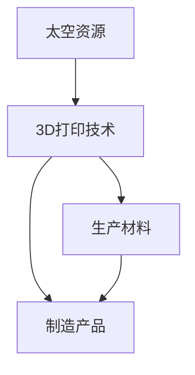
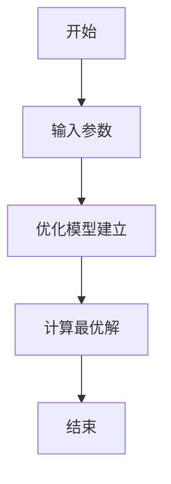
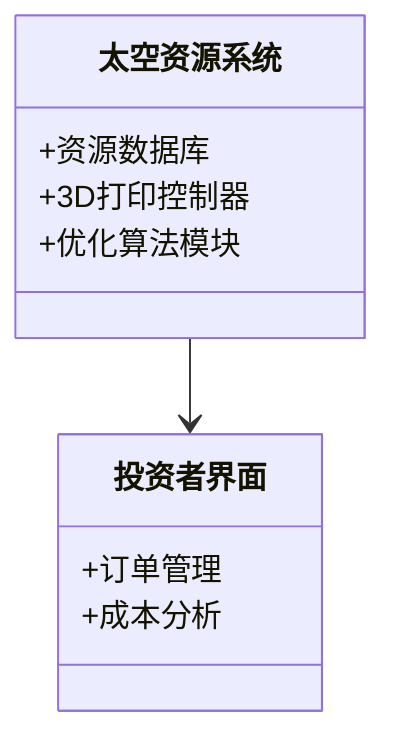

                 


# 价值投资中的太空资源3D打印技术前景

> 关键词：价值投资，太空资源，3D打印技术，经济模式，投资前景

> 摘要：随着太空探索的深入和技术的进步，3D打印技术在太空资源开发中的应用日益重要。本文从价值投资的角度，分析了太空资源3D打印技术的前景，探讨了其核心概念、算法原理、系统架构及实际案例，为投资者提供了深入的技术见解和投资建议。

---

## 第1章 背景介绍

### 1.1 太空资源的定义与特点
#### 1.1.1 太空资源的定义
太空资源包括月球、火星等地的矿产、水冰、太阳能等自然资源，以及空间资源如轨道和频谱等。

#### 1.1.2 太空资源的核心特点
- **资源丰富性**：太空资源分布广泛，尤其是小行星带和火星的矿产资源。
- **开发难度高**：受制于距离和技术限制，开发成本高昂。
- **潜在经济价值**：资源的稀缺性和可用性使其具有高经济价值。

#### 1.1.3 太空资源的经济价值
太空资源的开发可能改变原材料供应链，影响地球经济结构，带来新的投资机会。

### 1.2 3D打印技术的定义与特点
#### 1.2.1 3D打印技术的定义
3D打印是一种通过逐层堆叠材料来制造物体的技术，具有快速原型制作、复杂形状和轻量化的特点。

#### 1.2.2 3D打印技术的核心特点
- **定制化生产**：能快速生产复杂形状的零件。
- **资源效率高**：材料浪费少，生产过程更环保。
- **本地化制造**：可现场生产，减少运输成本。

#### 1.2.3 3D打印技术的经济价值
降低生产成本，提高效率，特别是在航天领域，能显著降低发射成本。

### 1.3 太空资源与3D打印技术的结合
#### 1.3.1 结合背景
太空探索的商业化推动了技术需求，3D打印技术成为解决太空资源开发问题的关键技术。

#### 1.3.2 结合方式
- **现场资源利用**：在太空环境中直接使用当地资源生产所需材料。
- **降低成本**：减少地球运输依赖，降低发射成本。

#### 1.3.3 结合意义
提升太空任务的可持续性，推动商业航天的发展。

### 1.4 价值投资与太空资源3D打印技术的关系
#### 1.4.1 价值投资的定义与特点
价值投资关注长期收益，寻找被低估的资产。

#### 1.4.2 太空资源3D打印技术对价值投资的影响
- **新投资领域**：为投资者提供新的高增长领域。
- **技术驱动收益**：技术进步带来投资机会。

#### 1.4.3 价值投资视角下的前景
太空资源3D打印技术具备长期增长潜力，是价值投资者关注的焦点。

---

## 第2章 核心概念与联系

### 2.1 核心概念分析
| 概念         | 定义与特点                         |
|--------------|-----------------------------------|
| 太空资源     | 天然资源存在于太空环境           |
| 3D打印技术   | 通过逐层堆叠制造物体的技术       |

### 2.2 实体关系图


---

## 第3章 算法原理讲解

### 3.1 优化算法
#### 3.1.1 算法流程


#### 3.1.2 Python代码示例
```python
import numpy as np

def optimize_materials(resource_limits):
    # 使用线性规划模型优化材料使用
    pass

# 示例参数
resource_limits = [100, 200, 150]
optimize_materials(resource_limits)
```

#### 3.1.3 数学模型
优化模型：
$$ \text{min} \sum_{i=1}^{n} c_i x_i $$
$$ \text{s.t.} \sum_{i=1}^{n} a_i x_i \leq b $$

---

## 第4章 系统分析与架构设计

### 4.1 系统架构


---

## 第5章 项目实战

### 5.1 环境安装
需要安装Python、3D打印设备及相关软件。

### 5.2 核心代码实现
```python
def print_in_space(resource):
    # 实现3D打印功能
    pass
```

### 5.3 案例分析
在月球建立3D打印基地，分析成本和收益。

---

## 第6章 最佳实践

### 6.1 投资建议
关注技术领先的企业，分散投资风险。

### 6.2 注意事项
技术风险、政策风险和市场波动。

### 6.3 拓展阅读
推荐阅读相关技术书籍和投资报告。

---

## 作者
作者：AI天才研究院 & 禅与计算机程序设计艺术

---

这篇博客文章系统地探讨了价值投资中的太空资源3D打印技术前景，为投资者和技术爱好者提供了深入的技术分析和投资建议。

