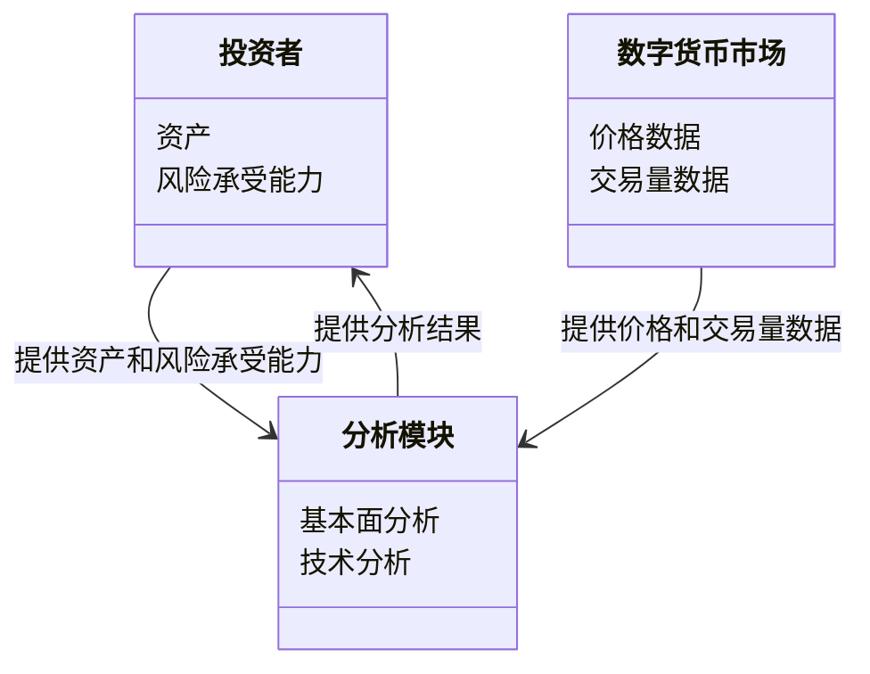
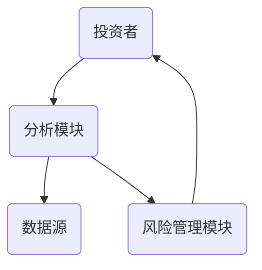
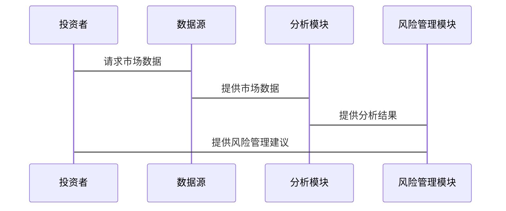

                 


# 价值投资中的数字货币影响分析

**关键词**: 价值投资, 数字货币, 市场波动, 投资组合, 数字货币分析

**摘要**: 本文深入探讨了数字货币对价值投资的多方面影响，分析了数字货币的基本概念、市场波动性、对投资组合的影响以及价值投资中的数字货币分析方法。通过结合理论与实践，本文提出了数字货币对传统价值投资理论与策略的创新性见解，并为投资者提供了有效的分析工具和方法。

---

# 第1章: 价值投资与数字货币的背景概述

## 1.1 价值投资的基本概念

### 1.1.1 价值投资的定义与核心理念

价值投资是一种以基本面分析为基础的投资策略，核心理念是寻找市场价格低于其内在价值的资产。其核心在于对企业的财务状况、行业地位、竞争优势和未来盈利能力进行深入分析，以确定其内在价值。

$$\text{内在价值} = \frac{\text{未来现金流的现值}}{\text{折现率}}$$

### 1.1.2 价值投资的基本原则与方法

价值投资强调长期投资、安全边际和分散投资。投资者需要关注企业的盈利能力、财务健康状况和管理层质量。以下是价值投资的主要原则：

1. **安全边际**：买入价格低于内在价值。
2. **长期视角**：关注企业的长期增长潜力。
3. **分散投资**：降低风险。

### 1.1.3 价值投资在现代金融中的地位与作用

价值投资在现代金融中占据重要地位，尤其是在传统股票市场和固定收益市场中。它通过基本面分析帮助企业识别被低估的资产，从而实现超额收益。

---

## 1.2 数字货币的定义与分类

### 1.2.1 数字货币的定义与特征

数字货币是基于区块链技术的数字资产，具有去中心化、匿名性、不可篡改和可追溯性等特点。数字货币可以分为以下几类：

- **加密货币**：如比特币、以太坊，用于价值转移和存储。
- **稳定币**：如USDT，与法定货币挂钩，用于稳定交易。
- **代币**：如ERC-20代币，用于特定区块链项目。

### 1.2.2 主流数字货币的分类与特点

| 类别          | 特点                                                                 |
|---------------|----------------------------------------------------------------------|
| 加密货币       | 去中心化，如比特币、以太坊                                             |
| 稳定币         | 与法定货币挂钩，如USDT、USDC                                         |
| 代币           | 用于特定项目，如ERC-20、SPL                                          |

### 1.2.3 数字货币的技术基础与发展趋势

数字货币的技术基础是区块链，其发展趋势包括去中心化金融（DeFi）、非同质化代币（NFT）和智能合约。区块链的去中心化特性使得数字货币具有高效、透明和安全的特点。

---

## 1.3 数字货币对传统金融市场的冲击

### 1.3.1 数字货币对传统货币体系的影响

数字货币对传统货币体系的冲击主要体现在以下方面：

1. **货币发行权**：去中心化的数字货币挑战了传统货币的发行权。
2. **支付方式**：数字货币提高了支付效率，降低了交易成本。
3. **货币政策**：央行对数字货币的监管和调控成为新的挑战。

### 1.3.2 数字货币对传统投资方式的挑战

数字货币的高波动性和去中心化特性对传统投资方式提出了挑战：

1. **风险偏好**：数字货币的风险高于传统资产。
2. **市场参与**：数字货币市场参与者更广泛，信息不对称加剧。

### 1.3.3 数字货币对金融监管的变革要求

数字货币的兴起要求金融监管机构进行变革：

1. **监管框架**：需要制定新的监管规则。
2. **技术监管**：需要应对去中心化技术带来的挑战。

---

## 1.4 数字货币与价值投资的结合

### 1.4.1 数字货币对价值投资理论的创新

数字货币为价值投资提供了新的分析维度：

1. **技术分析**：通过区块链技术评估项目的可行性。
2. **社区与网络效应**：关注数字货币的社区活跃度和网络效应。

### 1.4.2 数字货币对投资工具与策略的影响

数字货币的引入丰富了投资工具和策略：

1. **量化投资**：利用算法进行高频交易。
2. **多资产配置**：将数字货币纳入投资组合。

### 1.4.3 数字货币对投资风险与收益的双重影响

数字货币的高波动性带来了更高的收益和风险：

1. **收益**：数字货币的短期收益潜力大。
2. **风险**：市场波动大，政策风险高。

---

# 第2章: 数字货币对价值投资的核心影响分析

## 2.1 数字货币的市场波动性分析

### 2.1.1 数字货币价格波动的特征与规律

数字货币价格波动剧烈，受市场情绪、政策和技术创新的影响较大。以下是价格波动的主要特征：

1. **高波动性**：数字货币价格波动幅度远高于传统资产。
2. **市场情绪驱动**：投资者情绪对价格影响显著。
3. **技术驱动**：区块链技术创新推动价格上涨。

### 2.1.2 数字货币市场与传统金融市场的关联性

数字货币市场与传统金融市场存在一定的关联性：

1. **价格联动**：部分数字货币与传统资产价格相关。
2. **市场情绪影响**：传统市场的波动影响数字货币市场。

### 2.1.3 数字货币市场波动对价值投资的影响

数字货币的高波动性对价值投资的影响：

1. **短期干扰**：市场波动干扰长期价值判断。
2. **投资机会**：波动性带来短期套利机会。

---

## 2.2 数字货币对投资组合的影响

### 2.2.1 数字货币在投资组合中的角色与权重

数字货币在投资组合中的角色：

1. **风险分散**：数字货币可以分散传统资产的风险。
2. **收益增强**：数字货币可能带来超额收益。

### 2.2.2 数字货币对投资组合风险与收益的平衡

数字货币对投资组合的影响：

1. **收益潜力**：数字货币可能带来高收益。
2. **风险增加**：数字货币的高波动性增加整体风险。

### 2.2.3 数字货币对投资组合策略的优化

优化投资组合策略：

1. **分散投资**：合理配置数字货币比例。
2. **动态调整**：根据市场变化调整投资组合。

---

## 2.3 数字货币对投资决策的影响

### 2.3.1 数字货币信息的获取与分析

投资者需要获取数字货币的以下信息：

1. **技术信息**：区块链技术参数。
2. **市场信息**：市场交易量、价格波动。
3. **项目信息**：项目背景、团队实力。

### 2.3.2 数字货币对投资决策的实时性要求

数字货币投资需要实时监控市场动态：

1. **实时数据**：关注价格波动和交易量。
2. **实时分析**：及时调整投资策略。

### 2.3.3 数字货币对投资者心理与行为的影响

数字货币对投资者心理的影响：

1. **贪婪与恐惧**：市场波动容易引发非理性决策。
2. **决策疲劳**：频繁的价格波动导致决策疲劳。

---

# 第3章: 价值投资中的数字货币分析方法

## 3.1 数字货币的基本面分析

### 3.1.1 数字货币项目的背景与目标

分析数字货币项目的背景和目标：

1. **项目目标**：明确项目的核心目标。
2. **团队背景**：评估项目团队的资质和历史表现。

### 3.1.2 数字货币团队的资质与历史表现

团队资质是项目成功的关键因素：

1. **团队成员**：评估核心成员的经验和能力。
2. **历史表现**：分析团队以往项目的成功与否。

---

## 3.2 数字货币的技术分析

### 3.2.1 技术分析的核心指标

技术分析的核心指标包括：

1. **价格走势**：分析价格趋势和形态。
2. **成交量**：关注交易量与价格的关系。
3. **技术指标**：使用RSI、MACD等指标进行分析。

### 3.2.2 技术分析与价值投资的结合

技术分析在价值投资中的应用：

1. **短期趋势判断**：技术分析辅助判断短期价格走势。
2. **长期趋势确认**：结合基本面分析确认长期趋势。

---

## 3.3 数字货币的风险管理

### 3.3.1 风险管理的核心原则

风险管理的核心原则：

1. **分散投资**：降低单一资产的风险。
2. **止损策略**：设定止损点以限制损失。
3. **风险评估**：定期评估投资组合的风险。

### 3.3.2 风险管理的实施步骤

风险管理的实施步骤：

1. **风险识别**：识别潜在风险。
2. **风险量化**：评估风险的影响程度。
3. **风险控制**：制定风险管理策略。

---

## 3.4 数字货币的量化投资策略

### 3.4.1 量化投资的核心思想

量化投资的核心思想是通过数学模型进行投资决策：

1. **数据驱动**：基于大量数据进行分析。
2. **算法交易**：利用算法进行高频交易。

### 3.4.2 量化投资的实现方法

量化投资的实现方法：

1. **数据收集**：获取数字货币的市场数据。
2. **模型构建**：建立数学模型进行预测。
3. **算法交易**：根据模型信号进行交易。

---

## 3.5 数字货币的长期投资策略

### 3.5.1 长期投资的核心理念

长期投资的核心理念是关注企业的长期价值：

1. **价值发现**：寻找被低估的数字货币项目。
2. **长期持有**：坚持持有优质资产。

### 3.5.2 长期投资的实施步骤

长期投资的实施步骤：

1. **基本面分析**：分析项目的基本面。
2. **选择优质资产**：选择具有长期增长潜力的项目。
3. **长期持有**：坚持持有，避免频繁交易。

---

## 3.6 数字货币的价值评估模型

### 3.6.1 价值评估模型的构建

价值评估模型的构建：

1. **现金流折现法**：评估项目的未来现金流。
2. **市场比较法**：比较同类项目的市场价格。

### 3.6.2 价值评估模型的实施步骤

价值评估模型的实施步骤：

1. **数据收集**：收集项目的基本数据。
2. **模型构建**：建立数学模型。
3. **模型验证**：验证模型的准确性。

---

## 3.7 数字货币的价值投资案例分析

### 3.7.1 案例背景介绍

以比特币为例，分析其作为价值投资标的的可行性：

1. **项目背景**：比特币是最早的数字货币，具有去中心化和匿名性特点。
2. **市场表现**：比特币价格长期呈上升趋势。

### 3.7.2 案例分析

通过基本面分析和市场分析，评估比特币的投资价值：

1. **基本面分析**：比特币的供应量有限，具有稀缺性。
2. **市场分析**：比特币的市场认可度高，应用场景广泛。

---

## 3.8 数字货币的价值投资策略优化

### 3.8.1 优化策略的核心思想

优化策略的核心思想是结合基本面分析和技术分析：

1. **基本面分析**：评估项目的长期价值。
2. **技术分析**：判断短期价格走势。

### 3.8.2 优化策略的实施步骤

优化策略的实施步骤：

1. **基本面分析**：分析项目的财务状况和行业地位。
2. **技术分析**：分析价格走势和交易量。
3. **投资决策**：结合分析结果制定投资策略。

---

# 第4章: 数字货币对价值投资的系统分析与架构设计

## 4.1 系统分析

### 4.1.1 问题场景介绍

数字货币市场的复杂性要求投资者具备系统化的分析能力：

1. **市场波动**：数字货币价格波动剧烈。
2. **信息不对称**：市场信息分布不均。

### 4.1.2 项目介绍

本项目旨在构建一个基于价值投资理论的数字货币分析系统。

---

## 4.2 系统功能设计

### 4.2.1 系统功能模块

系统功能模块包括：

1. **数据采集模块**：采集数字货币市场数据。
2. **分析模块**：进行基本面和技术分析。
3. **风险管理模块**：制定风险管理策略。

### 4.2.2 系统功能设计的领域模型

领域模型如下：



---

## 4.3 系统架构设计

### 4.3.1 系统架构图

系统架构图如下：



---

## 4.4 系统接口设计

### 4.4.1 系统接口设计

系统接口设计：

1. **数据接口**：从数据源获取市场数据。
2. **用户接口**：与投资者进行交互。

### 4.4.2 系统接口实现

系统接口实现：

1. **数据接口**：通过API获取市场数据。
2. **用户接口**：通过网页或应用程序与投资者交互。

---

## 4.5 系统交互设计

### 4.5.1 系统交互流程

系统交互流程：

1. **数据采集**：从数据源获取市场数据。
2. **分析处理**：进行基本面和技术分析。
3. **风险管理**：制定风险管理策略。
4. **结果输出**：将分析结果反馈给投资者。

### 4.5.2 系统交互流程图

系统交互流程图如下：



---

# 第5章: 数字货币对价值投资的项目实战

## 5.1 项目环境安装

### 5.1.1 项目环境安装

安装必要的工具和环境：

1. **编程语言**：Python
2. **开发工具**：Jupyter Notebook
3. **数据源**：CoinMarketCap API

### 5.1.2 项目核心实现源代码

以下是项目的核心实现代码：

```python
import requests
import pandas as pd

# 数据采集函数
def get_data():
    url = "https://api.coinmarketcap.com/v2/ticker/"
    response = requests.get(url)
    data = response.json()
    return data

# 数据分析函数
def analyze_data(data):
    df = pd.DataFrame(data)
    df = df.dropna()
    return df

# 风险管理函数
def risk_management(data):
    # 示例风险管理策略
    return "低风险"

# 主函数
def main():
    data = get_data()
    df = analyze_data(data)
    risk = risk_management(data)
    print("数据获取成功")
    print("数据分析完成")
    print("风险等级：" + risk)

if __name__ == "__main__":
    main()
```

---

## 5.2 项目核心实现

### 5.2.1 核心实现的功能

核心实现的功能：

1. **数据采集**：从CoinMarketCap API获取市场数据。
2. **数据分析**：对数据进行清洗和分析。
3. **风险管理**：制定风险管理策略。

### 5.2.2 核心实现的代码解读

代码解读：

1. **数据采集**：使用requests库从API获取数据。
2. **数据分析**：使用pandas库对数据进行处理。
3. **风险管理**：根据分析结果制定风险管理策略。

---

## 5.3 项目实战案例分析

### 5.3.1 案例分析

以比特币为例，分析其投资价值：

1. **基本面分析**：比特币的供应量有限，具有稀缺性。
2. **市场分析**：比特币的市场认可度高，应用场景广泛。

### 5.3.2 案例分析结果

分析结果：

1. **投资价值**：比特币具有较高的投资价值。
2. **风险管理**：建议投资者设置止损点。

---

## 5.4 项目小结

### 5.4.1 项目总结

通过本项目，我们实现了基于价值投资理论的数字货币分析系统，能够对数字货币市场进行实时监控和分析，并制定相应的风险管理策略。

### 5.4.2 项目经验与教训

项目经验与教训：

1. **数据获取**：需要注意数据源的可靠性和稳定性。
2. **分析模型**：需要不断优化分析模型以适应市场变化。

---

# 第6章: 数字货币对价值投资的结论与展望

## 6.1 结论

### 6.1.1 研究结论

通过本文的研究，我们得出以下结论：

1. **数字货币对价值投资的影响**：数字货币对价值投资的理论和实践产生了深远影响。
2. **价值投资中的数字货币分析方法**：提出了基于基本面分析和技术分析的数字货币分析方法。
3. **风险管理策略**：制定了一系列风险管理策略以应对数字货币市场的高波动性。

### 6.1.2 研究意义

本文的研究意义在于为投资者提供了新的分析工具和方法，帮助他们在数字货币市场中实现价值投资。

---

## 6.2 未来展望

### 6.2.1 数字货币的未来发展

数字货币的未来发展：

1. **技术创新**：区块链技术的进一步发展。
2. **市场成熟**：数字货币市场的逐步成熟。
3. **监管完善**：监管框架的逐步完善。

### 6.2.2 价值投资的未来发展方向

价值投资的未来发展方向：

1. **多元化投资**：将数字货币纳入投资组合。
2. **量化投资**：利用算法进行高频交易。
3. **风险管理**：制定更完善的风险管理策略。

---

# 附录: 进一步学习与实践

## 附录A: 数字货币相关工具与资源

### 附录A.1 数字货币交易所

主流的数字货币交易所包括：

1. **CoinMarketCap**：https://coinmarketcap.com/
2. **CoinGecko**：https://www.coingecko.com/
3. **Binance**：https://www.binance.com/

### 附录A.2 数据分析工具

常用的数据分析工具包括：

1. **Python**：https://www.python.org/
2. **Pandas**：https://pandas.pydata.org/
3. **Matplotlib**：https://matplotlib.org/

---

## 附录B: 数字货币相关书籍与文献

### 附录B.1 推荐书籍

1. 《加密货币：区块链技术与投资》
2. 《价值投资实战》

### 附录B.2 推荐文献

1. 比特币白皮书：《比特币：一种点对点的电子现金系统》
2. 以太坊白皮书：《以太坊：下一代智能合约与分布式应用的平台》

---

## 附录C: 数字货币投资的风险提示

### 附录C.1 数字货币投资风险提示

1. **市场风险**：数字货币价格波动剧烈。
2. **政策风险**：政策变化可能影响市场。
3. **技术风险**：技术问题可能导致损失。

### 附录C.2 投资者注意事项

1. **理性投资**：避免盲目跟风。
2. **分散投资**：降低投资风险。
3. **持续学习**：保持对市场的关注和学习。

---

## 附录D: 数字货币投资的最佳实践 Tips

### 附录D.1 最佳实践 Tips

1. **选择优质项目**：关注项目的团队和背景。
2. **分散投资**：合理配置投资比例。
3. **风险管理**：制定风险管理策略。

### 附录D.2 投资者注意事项

1. **长期视角**：关注项目的长期价值。
2. **技术驱动**：关注区块链技术创新。
3. **政策影响**：关注政策变化对市场的影响。

---

**作者：AI天才研究院/AI Genius Institute & 禅与计算机程序设计艺术 /Zen And The Art of Computer Programming**

