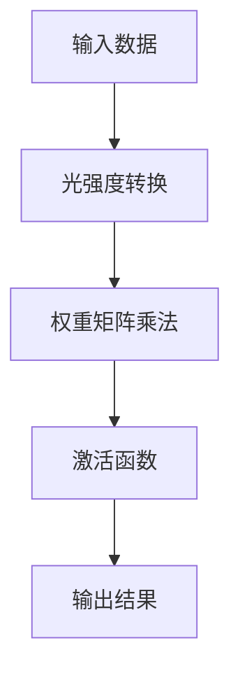
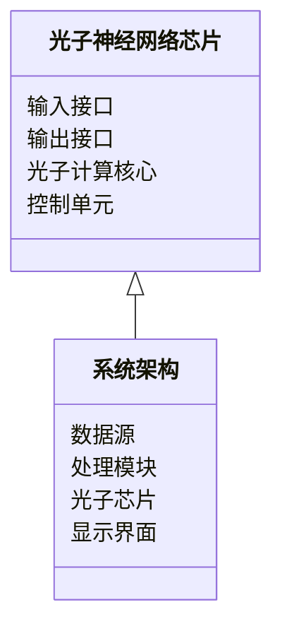
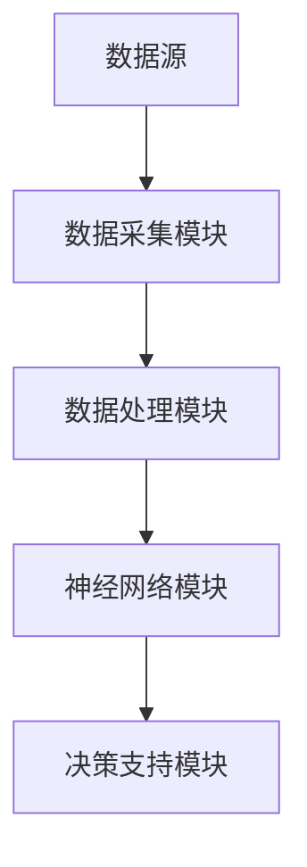

                 


# 价值投资中的新一代光子神经网络芯片技术

> 关键词：光子神经网络芯片，价值投资，人工智能，金融预测，风险管理

> 摘要：本文探讨了新一代光子神经网络芯片技术在价值投资中的应用潜力。通过分析光子神经网络芯片的技术原理、系统设计及在金融领域的实际应用，本文揭示了该技术如何提升金融数据分析的效率和准确性，为投资者提供更可靠的决策支持。文章结合理论与实践，详细阐述了光子神经网络芯片在价值投资中的具体应用场景，并对未来的发展趋势进行了展望。

---

## 第一部分：光子神经网络芯片的技术基础

### 第1章：光子神经网络芯片的背景与原理

#### 1.1 背景介绍
- **光子技术的起源**：光子技术是利用光波进行信息处理和计算的技术，相较于传统电子技术，具有更高的速度和更低的能耗。
- **神经网络的起源**：神经网络是一种模拟人脑结构的计算模型，广泛应用于模式识别、数据分析等领域。
- **结合的必要性**：随着金融数据的复杂化，传统计算技术难以满足实时性和高效性的需求，光子技术的引入为神经网络计算提供了新的可能性。

#### 1.2 核心概念与联系
- **光子神经网络芯片的定义**：一种利用光子技术实现神经网络计算的专用芯片。
- **核心要素**：
  - **光子计算引擎**：用于光信号的处理和计算。
  - **神经网络架构**：包括输入层、隐藏层和输出层。
  - **光学互联结构**：用于不同神经元之间的信息传递。

#### 1.3 技术优势对比
| 技术特性         | 传统电子芯片      | 光子神经网络芯片   |
|------------------|-------------------|--------------------|
| 计算速度         | 较慢             | 极快               |
| 能耗             | 较高             | 极低               |
| 并行处理能力     | 一般             | 强大               |
| 适用场景         | 单任务处理       | 多任务并行处理     |

#### 1.4 实体关系图
```mermaid
er
actor: 投资者
actor: 数据源
actor: 计算引擎
```

### 第2章：光子神经网络芯片的原理与实现

#### 2.1 算法原理
- **神经网络的基本模型**：$ y = f(x) $，其中$x$是输入，$y$是输出，$f$是激活函数。
- **光子计算的核心公式**：$ I_{out} = I_{in} \times W $，其中$I$是光强度，$W$是权重。

#### 2.2 光子神经网络的数学模型
$$ 
\text{输出} = \sum_{i=1}^{n} w_i x_i + b 
$$
其中，$w_i$是权重，$x_i$是输入，$b$是偏置。

#### 2.3 算法流程图


#### 2.4 系统架构设计


### 第3章：光子神经网络芯片在价值投资中的应用

#### 3.1 数据处理与分析
- **数据预处理**：对金融数据进行清洗和标准化处理。
- **特征提取**：通过光子神经网络提取关键特征，如市场情绪、技术指标等。

#### 3.2 金融预测模型
- **模型构建**：利用光子神经网络芯片构建股票价格预测模型。
- **模型训练**：通过大量历史数据训练模型，优化权重参数。

#### 3.3 风险管理与决策
- **风险评估**：基于光子神经网络的实时分析，评估投资组合的风险。
- **决策支持**：为投资者提供实时的买卖决策建议。

---

## 第二部分：价值投资中的系统设计与实现

### 第4章：系统架构与功能设计

#### 4.1 系统功能设计
- **数据采集模块**：从金融市场获取实时数据。
- **数据处理模块**：清洗、转换和特征提取。
- **神经网络模块**：进行预测和分析。
- **决策支持模块**：生成投资建议。

#### 4.2 系统架构图


### 第5章：项目实战与实现细节

#### 5.1 环境搭建
- **硬件环境**：配置光子神经网络芯片的开发板。
- **软件环境**：安装必要的开发工具和库。

#### 5.2 核心代码实现
```python
import numpy as np

class PhotonNeuralNetwork:
    def __init__(self, input_dim, hidden_dim, output_dim):
        self.W1 = np.random.randn(input_dim, hidden_dim)
        self.b1 = np.zeros((1, hidden_dim))
        self.W2 = np.random.randn(hidden_dim, output_dim)
        self.b2 = np.zeros((1, output_dim))

    def forward(self, X):
        self.z1 = np.dot(X, self.W1) + self.b1
        self.a1 = np.tanh(self.z1)
        self.z2 = np.dot(self.a1, self.W2) + self.b2
        self.a2 = np.sigmoid(self.z2)
        return self.a2

    def backward(self, X, y, learning_rate=0.01):
        m = X.shape[0]
        delta2 = (y - self.a2) * self.a2 * (1 - self.a2)
        dW2 = (1/m) * np.dot(self.a1.T, delta2)
        db2 = (1/m) * np.sum(delta2, axis=0)
        delta1 = delta2.dot(self.W2.T) * (1 - np.tanh(self.z1)**2)
        dW1 = (1/m) * np.dot(X.T, delta1)
        db1 = (1/m) * np.sum(delta1, axis=0)
        self.W2 += learning_rate * dW2
        self.b2 += learning_rate * db2
        self.W1 += learning_rate * dW1
        self.b1 += learning_rate * db1

    def train(self, X, y, epochs=100, learning_rate=0.01):
        for _ in range(epochs):
            output = self.forward(X)
            self.backward(X, y, learning_rate)
```

#### 5.3 实际案例分析
- **案例背景**：假设我们有某只股票的历史价格数据。
- **数据预处理**：将数据标准化并提取技术指标。
- **模型训练**：使用光子神经网络芯片进行训练，预测未来的价格走势。
- **结果分析**：评估模型的准确性和稳定性。

---

## 第三部分：总结与展望

### 第6章：总结与未来展望

#### 6.1 核心技术总结
- 光子神经网络芯片在价值投资中的应用潜力巨大。
- 通过高效的数据处理和分析，能够显著提升投资决策的准确性和效率。

#### 6.2 未来展望
- 技术优化：进一步提升光子芯片的计算能力和能效。
- 应用扩展：探索更多金融领域的应用场景，如高频交易、智能投顾等。
- 结合其他技术：与区块链、大数据等技术结合，构建更完善的金融生态系统。

### 6.3 最佳实践 Tips
- **数据质量**：确保数据的准确性和完整性。
- **模型优化**：定期更新模型参数，保持预测的准确性。
- **风险管理**：结合光子神经网络芯片的分析结果，制定合理的风险管理策略。

---

## 作者信息

作者：AI天才研究院/AI Genius Institute & 禅与计算机程序设计艺术 /Zen And The Art of Computer Programming

---

本文通过系统化的分析和详细的案例讲解，全面探讨了光子神经网络芯片在价值投资中的应用。从技术原理到实际应用，从系统设计到项目实战，为读者提供了丰富的知识和实践指导，帮助他们在金融投资领域中更好地利用这一前沿技术。

