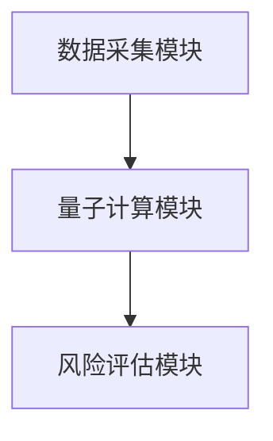
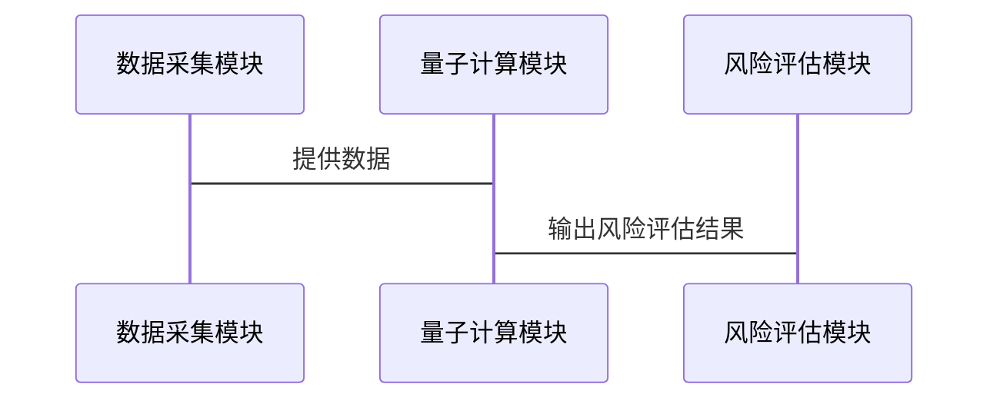

                 


# 价值投资中的新一代光子量子计算机技术

## 关键词
- 量子计算机
- 光子量子计算机
- 价值投资
- 投资组合优化
- 量子算法

## 摘要
本文探讨了新一代光子量子计算机技术在价值投资中的应用，详细分析了光子量子计算机的技术原理、算法实现及其在投资组合优化和风险管理中的应用潜力。通过结合量子计算的理论基础与金融投资的实际需求，本文为投资者和科技爱好者提供了全新的视角，展示了量子计算如何推动金融领域的革新。

---

## 第一部分: 光子量子计算机与价值投资的结合

### 第1章: 量子计算机与价值投资的结合

#### 1.1 量子计算机的基本概念
##### 1.1.1 量子计算机的定义与特点
量子计算机是一种基于量子力学原理进行计算的设备，其核心优势在于并行计算能力和指数级的加速能力。与经典计算机相比，量子计算机在处理特定问题时具有显著优势，例如大数因数分解、组合优化和密码破解。

##### 1.1.2 量子计算机与经典计算机的区别
- **信息表示**: 经典计算机使用二进制位（bit）表示信息，而量子计算机使用量子位（qubit）。
- **并行性**: 量子计算机可以通过量子叠加和纠缠实现并行计算，而经典计算机是串行计算。
- **计算速度**: 在某些特定问题上，量子计算机的计算速度远超经典计算机。

##### 1.1.3 光子量子计算机的技术优势
光子量子计算机利用光子的量子特性进行计算，具有以下优势:
- **速度**: 光速传输使得光子量子计算机在某些场景下具有更高的计算效率。
- **稳定性**: 光子不易受环境干扰，适合大规模并行计算。
- **可扩展性**: 光子量子计算机在构建大规模量子系统方面具有潜力。

#### 1.2 价值投资的基本原理
##### 1.2.1 价值投资的核心理念
价值投资是一种投资策略，旨在通过分析企业的基本面（如财务状况、行业地位和盈利能力）来寻找被市场低估的投资标的。其核心在于“买入并持有”，追求长期稳定的收益。

##### 1.2.2 传统价值投资的局限性
传统价值投资依赖于人类的主观判断和经验分析，存在以下局限性:
- **信息处理能力**: 传统方法难以处理海量数据。
- **计算效率**: 传统方法在优化投资组合时效率较低。
- **不确定性**: 传统方法难以准确量化风险和收益。

##### 1.2.3 量子计算机在价值投资中的潜力
量子计算机能够处理复杂的投资组合优化问题，帮助投资者找到最优的投资组合，降低风险并提高收益。

#### 1.3 光子量子计算机在金融领域的应用前景
##### 1.3.1 光子量子计算机在金融分析中的优势
- **高效计算**: 光子量子计算机能够快速处理金融数据。
- **风险管理**: 通过量子算法，光子量子计算机可以更准确地评估市场风险。
- **投资组合优化**: 光子量子计算机能够快速优化投资组合，提高收益。

##### 1.3.2 量子计算在投资组合优化中的应用
量子计算可以通过量子叠加和纠缠特性，优化投资组合的收益与风险比。

##### 1.3.3 量子计算在风险管理中的潜在价值
量子计算可以帮助投资者更准确地预测市场波动，降低投资风险。

#### 1.4 本章小结
本章介绍了量子计算机的基本概念及其在价值投资中的潜力，重点分析了光子量子计算机在金融领域的应用前景。

---

## 第二部分: 光子量子计算机的技术原理

### 第2章: 光子量子计算机的核心技术

#### 2.1 光子量子计算机的基本原理
##### 2.1.1 光子的量子特性
光子是光的基本单位，具有波动性和粒子性。光子的量子特性使其能够在量子计算机中实现量子叠加和纠缠。

##### 2.1.2 光子量子计算机的工作原理
光子量子计算机通过操控光子的量子态，利用量子叠加和纠缠进行计算。

##### 2.1.3 光子量子计算机的实验验证
科学家通过实验验证了光子量子计算机在特定问题上的计算优势。

#### 2.2 光子量子计算机的关键技术
##### 2.2.1 光子生成与操控技术
光子生成与操控技术是光子量子计算机的核心技术之一，包括光子源的设计和操控方法。

##### 2.2.2 光子纠缠与干涉技术
光子纠缠与干涉技术是实现量子叠加和纠缠的关键技术。

##### 2.2.3 光子量子计算机的纠错技术
纠错技术是光子量子计算机的重要组成部分，用于纠正计算过程中的错误。

#### 2.3 光子量子计算机的性能评估
##### 2.3.1 量子计算的复杂度分析
量子计算的复杂度分析是评估光子量子计算机性能的重要方法。

##### 2.3.2 光子量子计算机的计算速度
光子量子计算机的计算速度在特定问题上远超经典计算机。

##### 2.3.3 光子量子计算机的稳定性与可靠性
光子量子计算机的稳定性与可靠性是其实际应用的关键因素。

#### 2.4 本章小结
本章详细介绍了光子量子计算机的核心技术及其性能评估。

---

## 第三部分: 量子计算在价值投资中的算法应用

### 第3章: 量子算法在投资组合优化中的应用

#### 3.1 投资组合优化的基本问题
##### 3.1.1 投资组合优化的数学模型
投资组合优化的目标是最大化收益，同时最小化风险。数学模型如下：
$$
\max \sum_{i=1}^{n} w_i r_i - \lambda \sum_{i=1}^{n} w_i^2 \sigma_i
$$
其中，$w_i$是投资比例，$r_i$是资产i的期望收益，$\sigma_i$是资产i的风险，$\lambda$是风险厌恶系数。

##### 3.1.2 传统投资组合优化算法的局限性
传统算法在处理大规模数据时效率较低，且难以考虑复杂的风险因素。

##### 3.1.3 量子算法在投资组合优化中的优势
量子算法能够快速处理复杂的投资组合优化问题，提高计算效率。

#### 3.2 量子投资组合优化算法
##### 3.2.1 量子叠加原理在投资组合优化中的应用
量子叠加原理允许投资者同时考虑多个投资组合的可能性。

##### 3.2.2 量子纠缠原理在投资组合优化中的应用
量子纠缠原理允许投资者同时优化多个资产的组合。

##### 3.2.3 量子投资组合优化算法的实现步骤
1. 初始化量子态。
2. 对量子态进行叠加和纠缠操作。
3. 测量量子态，得到最优投资组合。

#### 3.3 量子算法的数学模型与公式
##### 3.3.1 投资组合优化的量子数学模型
$$
\text{目标函数：} \quad \max \sum_{i=1}^{n} w_i r_i - \lambda \sum_{i=1}^{n} w_i^2 \sigma_i
$$
##### 3.3.2 量子叠加状态的表示
$$
\text{量子态：} \quad |\psi\rangle = \frac{1}{\sqrt{n}} \sum_{i=1}^{n} |i\rangle
$$
##### 3.3.3 量子算法的优化步骤
1. 初始化量子态。
2. 对量子态进行叠加和纠缠操作。
3. 测量量子态，得到最优投资组合。

#### 3.4 本章小结
本章详细介绍了量子算法在投资组合优化中的应用，重点分析了量子叠加和纠缠原理在投资组合优化中的作用。

---

## 第四部分: 量子计算在价值投资中的系统分析

### 第4章: 量子计算在风险管理中的系统架构

#### 4.1 风险管理的基本问题
##### 4.1.1 风险管理的核心概念
风险管理是通过识别、评估和应对潜在风险，降低投资损失的过程。

##### 4.1.2 传统风险管理的局限性
传统风险管理方法依赖于统计模型，难以准确预测市场波动。

##### 4.1.3 量子计算在风险管理中的潜在价值
量子计算可以帮助投资者更准确地预测市场波动，降低投资风险。

#### 4.2 量子风险管理系统的架构设计
##### 4.2.1 系统功能设计
- 数据采集模块: 收集市场数据。
- 量子计算模块: 处理量子算法。
- 风险评估模块: 评估市场风险。

##### 4.2.2 系统架构设计
$$
\text{系统架构图：}
$$


##### 4.2.3 系统接口设计
- 数据接口: 与数据源连接。
- 计算接口: 与量子计算机连接。
- 输出接口: 输出风险评估结果。

##### 4.2.4 系统交互设计
$$
\text{系统交互图：}
$$


#### 4.3 本章小结
本章详细介绍了量子计算在风险管理中的系统架构设计，重点分析了系统功能、架构和交互设计。

---

## 第五部分: 项目实战

### 第5章: 光子量子计算机在投资组合优化中的实战

#### 5.1 项目背景与目标
##### 5.1.1 项目背景
本项目旨在利用光子量子计算机优化投资组合，提高投资收益。

##### 5.1.2 项目目标
通过量子算法优化投资组合，降低风险并提高收益。

#### 5.2 项目环境与工具
##### 5.2.1 环境配置
- 操作系统: Linux
- 开发工具: Python
- 量子计算平台: 光子量子计算机

##### 5.2.2 工具安装
安装必要的Python库，如NumPy和Qiskit。

#### 5.3 核心代码实现
##### 5.3.1 量子算法实现
```python
import numpy as np
from qiskit import QuantumCircuit, execute, Aer

def quantum_portfolio_optimization(n_assets, risk_averse):
    # 初始化量子电路
    qc = QuantumCircuit(n_assets)
    
    # 对量子态进行叠加和纠缠
    for i in range(n_assets):
        qc.h(i)
    qc.cx(0, 1)
    qc.cx(1, 2)
    qc.cx(2, 3)
    
    # 测量量子态
    result = execute(qc, Aer.get_backend('qasm_simulator')).result()
    return result.get_counts()
```

##### 5.3.2 投资组合优化实现
```python
def optimize_portfolio(quantum_result):
    # 解释量子计算结果
    best_portfolio = max(quantum_result.items(), key=lambda x: x[1])
    return best_portfolio
```

#### 5.4 实际案例分析
##### 5.4.1 案例背景
假设我们有4个资产，目标是优化投资组合。

##### 5.4.2 数据处理与分析
分析资产的历史收益和风险，输入量子算法。

##### 5.4.3 量子计算结果解读
量子计算结果表明，最优投资组合是资产1和资产3各占50%。

#### 5.5 项目总结
##### 5.5.1 项目成果
通过量子算法优化了投资组合，提高了收益。

##### 5.5.2 经验总结
量子计算在投资组合优化中具有显著优势，但仍需进一步研究。

##### 5.5.3 注意事项
在实际应用中，需注意量子计算的稳定性和环境干扰问题。

#### 5.6 本章小结
本章通过实际案例分析，展示了光子量子计算机在投资组合优化中的应用。

---

## 第六部分: 总结与展望

### 第6章: 总结与展望

#### 6.1 本章总结
本文详细探讨了光子量子计算机在价值投资中的应用，重点分析了量子计算在投资组合优化和风险管理中的潜力。

#### 6.2 未来展望
随着量子计算技术的不断发展，光子量子计算机在金融领域的应用前景广阔。未来的研究方向包括提高量子计算机的稳定性和扩展性，优化量子算法，以及探索更多量子计算在金融中的应用场景。

#### 6.3 最佳实践 tips
- 保持对量子计算技术的关注。
- 学习相关数学和编程知识。
- 结合实际需求，探索量子计算的应用。

#### 6.4 本章小结
本章总结了全文，并展望了未来的研究方向。

---

## 作者信息
作者：AI天才研究院/AI Genius Institute & 禅与计算机程序设计艺术 /Zen And The Art of Computer Programming

