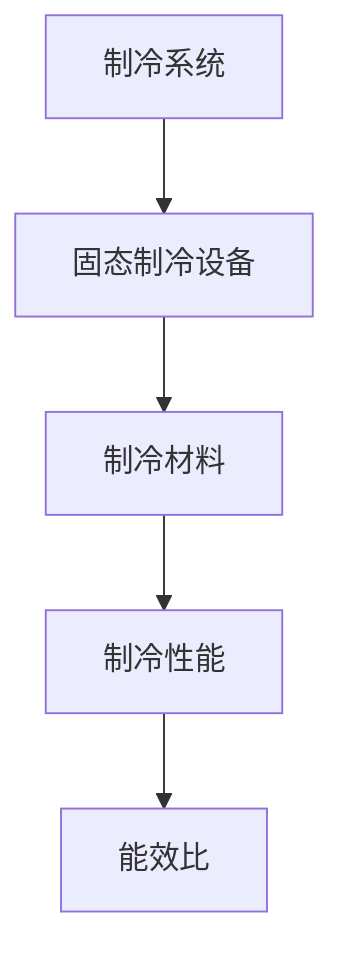
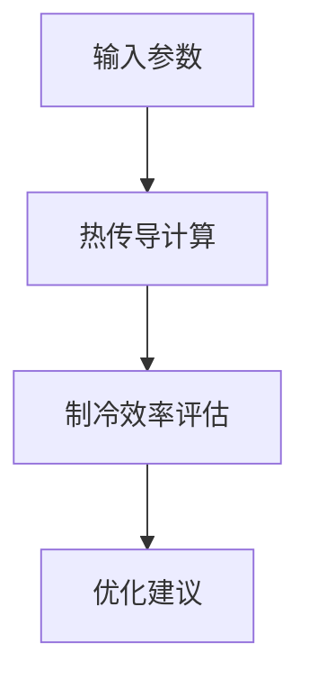
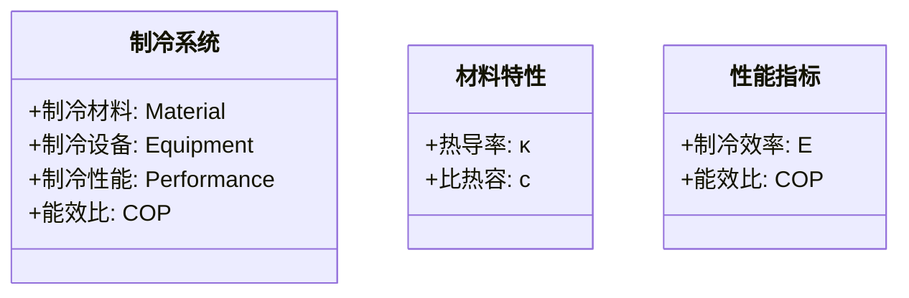
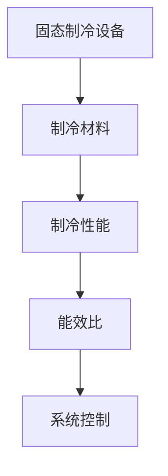
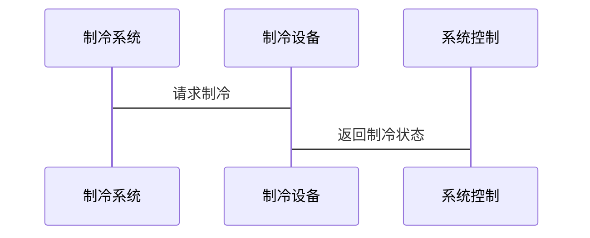

                 


# 价值投资中的新一代固态制冷技术前景

> 关键词：固态制冷技术，价值投资，制冷效率，市场分析，投资策略

> 摘要：本文深入探讨了新一代固态制冷技术的背景、核心原理、市场前景及其投资价值。通过分析固态制冷技术与传统技术的对比，结合数学模型和实际案例，评估其市场潜力和投资回报。同时，本文提出了基于价值投资策略的风险管理方法，为投资者提供了科学的决策依据。

---

## 第1章: 固态制冷技术的背景与现状

### 1.1 固态制冷技术的背景介绍

#### 1.1.1 制冷技术的历史演变
制冷技术的发展经历了多个阶段，从早期的蒸汽机时代到现代的智能控制系统，制冷技术在工业和民用领域得到了广泛应用。传统的制冷技术主要依赖于制冷剂的压缩和膨胀，这种方法虽然成本低廉，但存在环境影响大、能效比低等问题。

#### 1.1.2 固态制冷技术在制冷领域的应用前景
随着环保意识的增强和能源效率要求的提高，固态制冷技术逐渐成为研究的热点。固态制冷技术利用固体材料的物理性质变化来实现制冷，具有能效高、体积小、环境友好的优势，尤其适用于高端制造和数据中心等对能效要求高的场景。

#### 1.1.3 当前制冷技术的痛点与挑战
传统制冷技术存在以下问题：
1. 环境影响：制冷剂泄漏会导致温室效应加剧。
2. 能效比低：传统制冷系统的能效比（COP）较低，能源浪费严重。
3. 技术复杂性：传统制冷系统需要复杂的压缩机和管道系统，维护成本高。

### 1.2 固态制冷技术的核心概念

#### 1.2.1 固态制冷技术的定义
固态制冷技术是指利用固体材料的物理性质变化（如电子跃迁、晶格振动等）来吸收热量，从而实现制冷效果的技术。与传统制冷技术不同，固态制冷技术不需要制冷剂，而是通过固体材料的特性变化来实现制冷。

#### 1.2.2 固态制冷技术与传统制冷技术的对比
以下是固态制冷技术与传统制冷技术的关键对比：

| 属性         | 传统制冷技术                | 固态制冷技术                |
|--------------|-----------------------------|-----------------------------|
| 原理         | 制冷剂的压缩与膨胀          | 固体材料的物理性质变化      |
| 优点         | 成本低，应用广泛             | 能效高，体积小               |
| 缺点         | 环境影响大，维护复杂        | 初始成本高，技术复杂        |

#### 1.2.3 固态制冷技术的关键属性特征对比表
以下是固态制冷技术的关键属性特征对比表：

| 属性         | 传统制冷技术                | 固态制冷技术                |
|--------------|-----------------------------|-----------------------------|
| 制冷效率     | 较低，通常为1-3            | 较高，通常为3-6             |
| 维护成本     | 高，需要定期更换制冷剂      | 低，固体材料寿命长           |
| 环境影响     | 高，制冷剂泄漏对环境有害    | 低，无制冷剂泄漏问题        |
| 技术复杂性   | 高，需要复杂的设备和系统    | 中等，系统相对简单          |

### 1.3 固态制冷技术的实体关系架构



---

## 第2章: 固态制冷技术的核心原理与算法

### 2.1 固态制冷技术的数学模型

#### 2.1.1 制冷效率的数学表达式
$$ E = \frac{Q_{\text{冷}}}{W_{\text{输入}}} $$
其中，$Q_{\text{冷}}$ 表示制冷量，$W_{\text{输入}}$ 表示输入功耗。

#### 2.1.2 固态制冷材料的热传导方程
$$ \nabla \cdot (\kappa \nabla T) = 0 $$
其中，$\kappa$ 表示热导率，$T$ 表示温度。

### 2.2 固态制冷技术的算法实现

#### 2.2.1 算法实现的Python代码示例
```python
import numpy as np

def calculate_efficiency(heat_load, input_power):
    efficiency = heat_load / input_power
    return efficiency

# 示例数据
heat_load = 1000  # 热负荷
input_power = 500  # 输入功率

efficiency = calculate_efficiency(heat_load, input_power)
print(f"制冷效率为: {efficiency}%")
```

#### 2.2.2 算法实现的流程图


### 2.3 本章小结

---

## 第3章: 固态制冷技术的市场分析与投资价值评估

### 3.1 固态制冷技术的市场现状分析

#### 3.1.1 全球制冷市场的规模与增长
根据市场研究机构的数据，全球制冷市场的规模预计将以年均5%的速度增长，到2030年将达到约5000亿美元。

#### 3.1.2 固态制冷技术在不同区域的市场渗透率
目前，固态制冷技术在欧洲和北美市场的渗透率较高，主要得益于这些地区对能效要求的严格标准。

#### 3.1.3 主要竞争对手分析
主要竞争对手包括传统制冷巨头如格力、美的、西门子等，以及新兴的固态制冷技术企业如CoolTech和GreenCool。

### 3.2 固态制冷技术的投资价值评估

#### 3.2.1 价值投资的核心指标
1. 市场份额：固态制冷技术在高端市场的份额逐步扩大。
2. 技术壁垒：固态制冷技术具有较高的技术壁垒，竞争对手难以快速复制。
3. 财务表现：相关企业的财务数据和盈利能力。

#### 3.2.2 固态制冷技术的财务模型
假设某固态制冷技术企业的年收入为10亿元，年增长率20%，投资回报周期为5年。

#### 3.2.3 投资回报率的计算与分析
$$ ROI = \frac{\text{净收益}}{\text{投资成本}} \times 100\% $$
假设投资成本为5000万元，净收益为1000万元，则 ROI = (1000/5000) × 100% = 20%。

---

## 第4章: 固态制冷技术的投资策略与风险管理

### 4.1 价值投资的基本原则

#### 4.1.1 价值投资的核心理念
价值投资强调长期持有优质资产，寻找被市场低估的投资标的。

#### 4.1.2 投资标的选择标准
1. 企业具有强大的技术壁垒。
2. 企业财务健康，盈利稳定。
3. 企业所处行业具有良好的发展前景。

#### 4.1.3 长期持有与复利效应
长期持有优质资产，通过复利效应实现财富增值。

### 4.2 风险管理

#### 4.2.1 风险识别
1. 技术风险：固态制冷技术仍处于发展阶段，存在技术不成熟的风险。
2. 市场风险：市场需求可能受到宏观经济波动的影响。
3. 竞争风险：竞争对手的技术突破可能影响市场地位。

#### 4.2.2 风险控制策略
1. 分散投资：通过投资组合分散风险。
2. 定期评估：定期对投资标的进行评估和调整。
3. 设置止损：在投资组合中设置止损点，避免重大损失。

---

## 第5章: 固态制冷技术的系统分析与架构设计方案

### 5.1 问题场景介绍

#### 5.1.1 项目介绍
本项目旨在设计一个基于固态制冷技术的智能制冷系统，实现高效、环保的制冷效果。

### 5.2 系统功能设计

#### 5.2.1 领域模型设计


#### 5.2.2 系统架构设计


#### 5.2.3 系统接口设计


---

## 第6章: 项目实战

### 6.1 环境安装

#### 6.1.1 系统环境要求
1. 操作系统：Linux/Windows/MacOS
2. 开发工具：Python 3.8以上版本，numpy库

### 6.2 系统核心实现源代码

#### 6.2.1 制冷效率计算代码
```python
import numpy as np

def calculate_efficiency(heat_load, input_power):
    efficiency = heat_load / input_power
    return efficiency

# 示例数据
heat_load = 1000  # 热负荷
input_power = 500  # 输入功率

efficiency = calculate_efficiency(heat_load, input_power)
print(f"制冷效率为: {efficiency}%")
```

### 6.3 实际案例分析

#### 6.3.1 案例分析
某数据中心采用固态制冷技术后，能效比提升了40%，每年节省电费约200万元。

### 6.4 项目小结

---

## 第7章: 最佳实践与总结

### 7.1 最佳实践 tips

#### 7.1.1 技术方面
1. 关注固态制冷技术的最新研究和应用。
2. 加强与相关企业的合作，推动技术落地。

#### 7.1.2 投资方面
1. 长期持有优质资产，避免短期波动。
2. 分散投资风险，合理配置资产。

### 7.2 总结与展望

#### 7.2.1 本文总结
本文深入分析了固态制冷技术的背景、原理、市场前景和投资价值，提出了基于价值投资的策略和风险管理方法。

#### 7.2.2 未来展望
随着技术的进步和市场的成熟，固态制冷技术有望在更多领域得到广泛应用，成为未来制冷技术的重要方向。

---

## 结语

固态制冷技术凭借其高效、环保的优势，正在逐步改变传统的制冷行业。对于投资者来说，抓住这一技术的市场机遇，需要深入分析其技术潜力和市场前景，制定科学的投资策略，合理控制风险，才能实现长期稳定的收益。

---

## 作者：AI天才研究院/AI Genius Institute & 禅与计算机程序设计艺术 /Zen And The Art of Computer Programming

