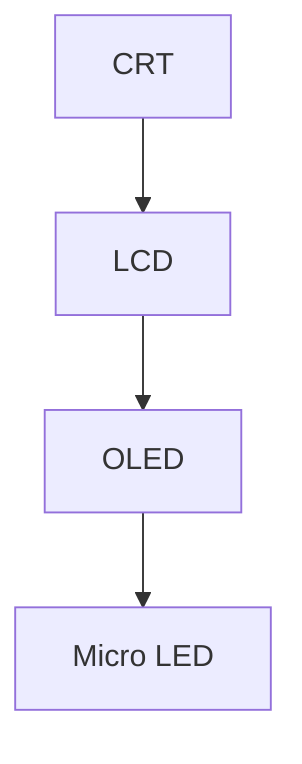

                 

# 价值投资中的新一代显示技术趋势

## 关键词：价值投资，显示技术，OLED，LCD，Micro LED，投资策略，未来趋势

## 摘要：  
本文将探讨显示技术领域的最新发展及其在价值投资中的潜在机会。通过分析不同显示技术的核心原理、市场表现和未来趋势，结合实际案例和数学模型，为投资者提供全面的视角和决策支持。

---

# 第1章: 显示技术的演变与价值投资的结合

## 1.1 显示技术的历史与发展

### 1.1.1 显示技术的起源与演变  
显示技术的历史可以追溯到20世纪初，从最初的阴极射线管（CRT）到现在的有机发光二极管（OLED），每一次技术进步都推动了显示行业的变革。  

**背景介绍：**  
- **CRT（阴极射线管）**：20世纪80年代的主流显示技术，体积大、分辨率低，但价格低廉。  
- **LCD（液晶显示）**：20世纪90年代崛起，以其轻薄、低功耗和高分辨率的特点迅速取代CRT。  
- **OLED（有机发光二极管）**：21世纪初开始商业化，以其更高的对比度、更快的响应速度和更广的色域成为高端显示设备的首选。  
- **Micro LED**：新一代显示技术，结合了OLED的高亮度和LCD的广视角，被认为是未来的主流技术。  

**核心概念与联系：**  
显示技术的进步主要体现在以下几个方面：  
1. **显示面板的物理特性**：包括发光效率、对比度、响应时间等。  
2. **显示材料的创新**：从传统的液晶材料到新型的有机发光材料，再到当前的研究热点——纳米材料。  
3. **显示驱动技术的进步**：从CCFL（冷阴极荧光灯）到AMOLED（主动矩阵有机发光二极管）。  

**图表：显示技术的演变历程**  

### 1.1.2 显示技术在现代科技中的核心地位  
显示技术是现代电子设备（如智能手机、平板电脑、电视和汽车仪表盘）的核心组成部分，其性能直接影响用户体验和设备价值。  

**背景介绍：**  
- 显示屏占据了智能手机成本的30%~40%，是决定设备售价的重要因素。  
- 高端显示技术（如OLED和Micro LED）通常应用于高端电子产品，成为品牌区分的重要手段。  

**核心概念与联系：**  
- **显示技术的市场定位**：高端技术驱动高端市场，中低端技术满足大众需求。  
- **显示技术的创新周期**：从LCD到OLED再到Micro LED，每一代技术的生命周期约为10年。  

### 1.1.3 价值投资视角下的显示技术机遇  
从价值投资的角度来看，显示技术领域的投资机会主要集中在技术创新和市场领先的公司。  

**背景介绍：**  
- 技术创新是显示技术行业的主要驱动力，拥有核心技术的公司通常能够获得更高的利润率。  
- 市场领先的公司在价格战中更具竞争力，能够通过规模化生产降低成本。  

**核心概念与联系：**  
- **技术驱动型投资**：重点关注技术创新能力强的公司。  
- **市场驱动型投资**：关注市场份额领先的公司。  

---

# 第2章: 新一代显示技术的市场分析

## 2.1 显示技术的市场现状

### 2.1.1 全球显示技术市场的规模与增长  
根据市场研究机构的数据，2022年全球显示面板市场规模约为1000亿美元，预计到2030年将增长至1500亿美元。  

**背景介绍：**  
- 中国是全球最大的显示面板生产国，占据了全球约50%的市场份额。  
- 韩国和日本在高端显示技术领域占据领先地位，尤其是OLED技术。  

**核心概念与联系：**  
- **市场集中度**：显示面板行业集中度较高，前五大厂商占据了80%以上的市场份额。  
- **价格竞争**：中低端市场以价格竞争为主，高端市场则以技术差异化为主。  

### 2.1.2 主要显示技术的市场占比分析  
目前，LCD技术仍占据市场主导地位，但OLED和Micro LED的市场份额正在快速增长。  

**背景介绍：**  
- **LCD**：占据全球显示面板市场约60%的份额，主要用于电视和 monitors。  
- **OLED**：占据约30%的份额，主要用于智能手机和高端电视。  
- **Micro LED**：市场份额不足5%，但增长潜力巨大。  

**核心概念与联系：**  
- **技术替代性**：LCD和OLED存在一定的替代关系，但Micro LED是未来的主流技术。  
- **市场渗透率**：Micro LED的市场渗透率低，但增长速度快。  

### 2.1.3 区域市场分布与竞争格局  
- **亚洲市场**：中国、韩国和日本是主要的显示面板生产国，占据了全球70%以上的市场份额。  
- **欧美市场**：以高端市场为主，消费者对显示技术的要求较高。  

---

## 2.2 显示技术的驱动因素

### 2.2.1 技术进步对市场需求的推动  
技术创新是显示技术行业发展的主要驱动力。例如，OLED的出现推动了智能手机市场的增长。  

**背景介绍：**  
- OLED技术的出现使得智能手机屏幕可以弯曲和折叠，极大地提升了用户体验。  
- Micro LED技术的出现使得显示面板的分辨率和亮度进一步提升，适用于更高端的市场。  

**核心概念与联系：**  
- **技术创新周期**：显示技术的创新周期约为5年，每次创新都会推动市场需求的增长。  
- **技术扩散效应**：一项新技术的出现通常会带动整个产业链的发展。  

### 2.2.2 消费者需求变化对显示技术的影响  
消费者对显示质量的要求不断提高，推动了显示技术的升级。  

**背景介绍：**  
- 消费者对高分辨率、高对比度和广色域的需求推动了OLED和Micro LED技术的发展。  
- 游戏用户和影视用户的高需求推动了高刷新率显示技术的发展。  

**核心概念与联系：**  
- **用户需求多样性**：不同用户群体对显示技术的需求不同，推动了显示技术的多样化发展。  
- **技术需求驱动**：消费者需求的变化是显示技术发展的主要动力之一。  

---

## 2.3 显示技术的未来趋势

### 2.3.1 新技术的崛起与传统技术的衰退  
未来，Micro LED和QLED（量子点发光二极管）技术将逐渐取代OLED和LCD技术。  

**背景介绍：**  
- Micro LED技术具有更高的亮度和对比度，但制造成本较高。  
- QLED技术具有更广的色域和更高的色彩饱和度，被认为是未来的主流技术。  

**核心概念与联系：**  
- **技术替代性**：Micro LED和QLED技术将逐渐取代OLED和LCD技术。  
- **技术发展周期**：每一代显示技术的生命周期约为10年，未来5年内将进入Micro LED和QLED技术的快速发展期。  

### 2.3.2 显示技术在不同领域的应用前景  
- **智能手机**：Micro LED技术将逐渐取代OLED技术，成为高端智能手机的主要显示技术。  
- **电视**：QLED技术将成为高端电视的主要显示技术，取代传统的LCD技术。  
- **汽车显示屏**：Micro LED技术将逐渐取代传统LCD技术，成为汽车仪表盘和中控屏的主要显示技术。  

### 2.3.3 未来显示技术的市场潜力与投资机会  
未来，显示技术的市场潜力主要集中在Micro LED和QLED技术领域。  

**背景介绍：**  
- Micro LED技术的市场潜力巨大，但制造成本较高，短期内难以大规模普及。  
- QLED技术的市场潜力较大，但技术成熟度较低，仍需进一步研发。  

**核心概念与联系：**  
- **技术成熟度**：Micro LED和QLED技术目前仍处于研发阶段，但市场潜力巨大。  
- **投资机会**：Micro LED和QLED技术的研发和生产将带来巨大的投资机会。  

---

## 2.4 显示技术的投资策略与风险评估

### 2.4.1 技术驱动型投资的特征  
技术驱动型投资主要关注技术创新能力强的公司，如Micro LED和QLED技术的研发公司。  

**背景介绍：**  
- 技术驱动型投资的风险较高，但回报潜力也较大。  
- 投资者需要关注技术创新公司的研发能力和技术成熟度。  

### 2.4.2 市场需求驱动型投资的策略  
市场需求驱动型投资主要关注市场份额领先的公司，如LCD和OLED技术的龙头企业。  

**背景介绍：**  
- 市场需求驱动型投资的风险较低，但回报潜力也较小。  
- 投资者需要关注市场需求的变化和公司市场份额的变化。  

### 2.4.3 投资组合优化与风险分散  
投资者可以通过构建多元化投资组合来分散风险，同时关注技术创新能力强和市场份额领先的公司。  

**背景介绍：**  
- 投资组合优化是价值投资的重要策略之一，通过多元化投资可以降低风险。  
- 投资者需要根据市场变化和公司表现动态调整投资组合。  

---

## 2.5 成功案例分析

### 2.5.1 典型显示技术企业的投资价值分析  
以三星和京东方为例，分析其投资价值。  

**背景介绍：**  
- 三星是全球最大的显示面板制造商之一，拥有领先的技术和市场份额。  
- 京东方是中国最大的显示面板制造商，近年来在OLED技术领域取得了显著进展。  

**核心概念与联系：**  
- **技术优势**：三星在Micro LED和QLED技术领域具有领先地位。  
- **市场优势**：京东方在LCD技术领域具有领先地位。  

### 2.5.2 投资失败的教训与经验总结  
以夏普为例，分析其投资失败的原因。  

**背景介绍：**  
- 夏普曾经是全球最大的显示面板制造商之一，但由于技术研发和市场策略的失误，最终被三星和京东方超越。  
- 夏普的失败教训是技术创新能力和市场策略对企业成功至关重要。  

### 2.5.3 未来潜在投资机会的展望  
未来，Micro LED和QLED技术的研发和生产将带来巨大的投资机会。  

**背景介绍：**  
- Micro LED和QLED技术是未来的主流显示技术，市场潜力巨大。  
- 投资者需要关注相关技术的研发和生产进展。  

---

## 2.6 显示技术的未来展望与挑战

### 2.6.1 新一代显示技术的创

