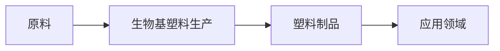
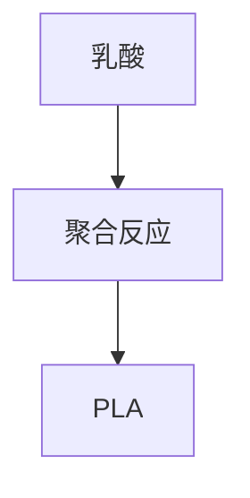
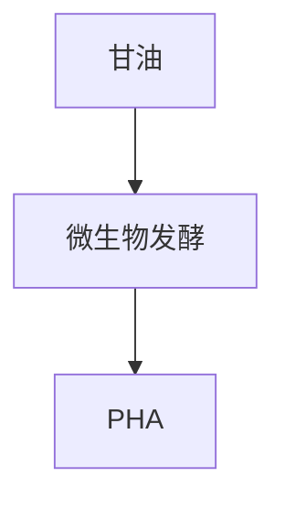
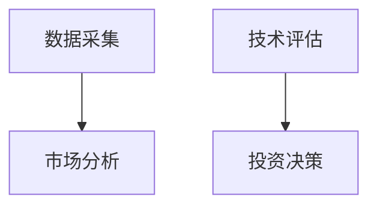

                 

# 价值投资中的新一代生物基塑料技术前景

---

## 关键词：
生物基塑料、价值投资、技术前景、环境影响、投资策略

---

## 摘要：
生物基塑料作为一种可持续发展的新材料，正逐渐取代传统石油基塑料，成为全球绿色经济的重要组成部分。本文从技术背景、市场趋势、投资分析等多维度，深入探讨生物基塑料的潜力与挑战。通过分析核心概念、技术原理、数学模型和系统架构，结合实际案例，为投资者提供科学的决策支持。本文旨在揭示生物基塑料行业的投资价值，为价值投资者提供战略性的见解。

---

## 第一部分: 生物基塑料技术的背景与价值投资概述

### 第1章: 生物基塑料技术的背景介绍

#### 1.1 生物基塑料的定义与优势
生物基塑料是以可再生生物质（如淀粉、纤维素、甘油等）为原料，通过生物或化学方法合成的塑料。与传统石油基塑料相比，生物基塑料具有以下优势：

- **环境友好**：生物基塑料可降解，减少白色污染。
- **资源可持续**：依赖可再生资源，降低对化石燃料的依赖。
- **碳中和潜力**：通过植物光合作用固定二氧化碳，实现碳中和。

#### 1.2 价值投资的基本概念
价值投资是一种投资策略，强调以低于内在价值的价格买入优质资产。在生物基塑料领域，价值投资者关注技术创新、市场潜力和可持续发展能力。

---

### 第2章: 生物基塑料技术的市场现状

#### 2.1 全球生物基塑料市场的发展趋势
- **市场规模**：预计到2030年，全球生物基塑料市场规模将超过1000亿美元。
- **主要应用领域**：包装、纺织、汽车、电子等领域。
- **区域分布**：欧洲和亚洲是主要市场，政策支持推动市场增长。

#### 2.2 生物基塑料技术的创新与挑战
- **技术创新**：新型材料（如PHA）的研发推动行业进步。
- **技术瓶颈**：生产成本高、规模化难。
- **解决方案**：政策支持、技术突破和市场推广。

---

## 第二部分: 生物基塑料技术的核心概念与联系

### 第3章: 生物基塑料的核心概念

#### 3.1 生物基塑料的分类
- **生物基可降解塑料**：如PLA、PHA。
- **生物基不可降解塑料**：如PTA。

#### 3.2 生物基塑料的技术特点
- **原料来源**：可再生资源。
- **生产过程**：绿色工艺。
- **性能优势**：可降解、可循环。

#### 3.3 生物基塑料的产业链分析

---

## 第三部分: 生物基塑料技术分析

### 第4章: 生物基塑料的关键技术

#### 4.1 聚乳酸（PLA）的合成
- **原料**：乳酸。
- **工艺**：发酵、聚合。
- **流程图**：

#### 4.2 聚羟基脂肪酸酯（PHA）的合成
- **原料**：甘油。
- **工艺**：微生物发酵。
- **流程图**：

---

## 第四部分: 投资分析

### 第5章: 生物基塑料的投资价值分析

#### 5.1 成本分析
- **生产成本**：原料价格波动、技术成本。
- **经济效益**：规模效应降低单位成本。

#### 5.2 收益预测
- **市场需求**：环保政策推动需求增长。
- **价格优势**：绿色溢价。

#### 5.3 风险评估
- **市场风险**：竞争加剧。
- **技术风险**：技术迭代快。

---

## 第五部分: 系统分析与架构设计

### 第6章: 生物基塑料投资的系统架构

#### 6.1 系统功能设计
- **市场分析模块**：数据采集、趋势预测。
- **技术评估模块**：技术可行性、成本分析。

#### 6.2 系统架构设计

---

## 第六部分: 项目实战

### 第7章: 生物基塑料投资实战

#### 7.1 项目选择
- **案例分析**：投资某生物基塑料企业。
- **技术评估**：评估企业的技术优势。
- **市场分析**：评估市场需求。

#### 7.2 风险管理
- **策略制定**：分散投资、动态调整。

---

## 结语

生物基塑料技术具有广阔的发展前景，但也面临技术和市场的双重挑战。价值投资者应关注技术创新、市场需求和政策支持，抓住绿色经济的机遇。

---

## 作者：AI天才研究院/AI Genius Institute & 禅与计算机程序设计艺术 /Zen And The Art of Computer Programming

