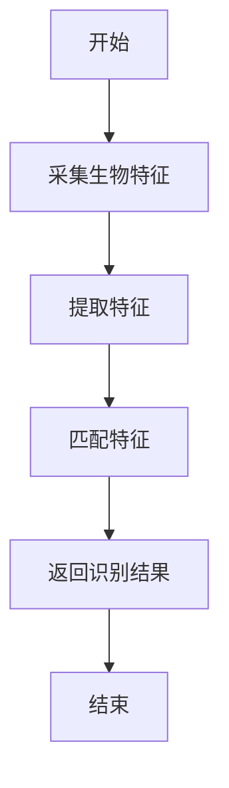
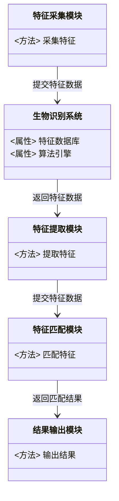

                 


# 价值投资中的新一代生物识别技术前景

## 关键词：生物识别技术、价值投资、人工智能、金融创新、投资策略

## 摘要：本文探讨了生物识别技术在价值投资中的应用前景，分析了其核心概念、算法原理、系统架构及项目实战，揭示了生物识别技术如何助力投资决策，优化投资策略，为投资者提供新的视角和工具。

---

## 第1章: 生物识别技术的背景与现状

### 1.1 生物识别技术的定义与核心概念

#### 1.1.1 生物识别技术的定义
生物识别技术是一种通过人体的生物特征（如指纹、虹膜、面部特征、声音等）来识别人体身份的 technologies。它是基于生物特征的唯一性和稳定性，利用先进的算法和传感器，实现对个体身份的精准识别。

#### 1.1.2 生物识别技术的核心要素
生物识别技术的核心要素包括：  
1. **生物特征采集**：通过传感器（如指纹传感器、摄像头等）获取生物特征数据。  
2. **特征提取**：从采集的生物特征中提取关键特征信息（如指纹的脊线、人脸的关键点等）。  
3. **特征匹配**：将提取的特征与数据库中的特征进行比对，实现身份识别。  
4. **算法优化**：通过机器学习和深度学习算法提升识别准确率和速度。

#### 1.1.3 生物识别技术的分类与特点
生物识别技术主要分为以下几类：  
1. **指纹识别**：基于指纹的脊线和细节特征进行识别。  
2. **人脸识别**：通过面部特征（如眼睛、鼻子、嘴巴的位置）进行识别。  
3. **虹膜识别**：基于虹膜的纹理特征进行识别。  
4. **声音识别**：通过语音特征进行识别。  

其特点包括高精度、非接触性、安全性高、便于集成等。

---

### 1.2 生物识别技术在投资领域的应用背景

#### 1.2.1 投资领域的数字化转型
随着金融科技的快速发展，投资领域正在经历数字化转型。传统的投资决策主要依赖于市场数据和人工分析，而数字化技术的应用（如大数据分析、人工智能）正在改变这一格局。

#### 1.2.2 生物识别技术在金融行业的潜力
生物识别技术在金融行业的潜力主要体现在以下几个方面：  
1. **身份验证**：通过生物识别技术实现客户身份的精准验证，提升交易的安全性。  
2. **投资行为分析**：通过分析投资者的生物特征（如面部表情、声音特征）来判断其情绪状态，辅助投资决策。  
3. **风险管理**：通过实时监测投资者的行为特征，识别异常交易行为，降低投资风险。

#### 1.2.3 价值投资与生物识别技术的结合点
价值投资的核心理念是通过深入分析企业的基本面，寻找被市场低估的投资标的。生物识别技术可以通过以下方式助力价值投资：  
1. **投资者情绪分析**：通过分析投资者的生物特征（如面部表情、语音语调）来判断市场的整体情绪，辅助投资决策。  
2. **个性化投资建议**：通过分析投资者的生物特征，提供个性化的投资策略，满足不同投资者的需求。  
3. **风险管理**：通过实时监测投资者的行为特征，识别潜在风险，优化投资组合。

---

### 1.3 价值投资的基本概念与方法

#### 1.3.1 价值投资的定义与核心理念
价值投资是一种以基本面分析为基础的投资策略，旨在通过识别被市场低估的企业，进行长期投资。其核心理念是“买便宜的好东西”，即关注企业的内在价值，而非短期市场波动。

#### 1.3.2 价值投资的关键要素分析
价值投资的关键要素包括：  
1. **企业基本面分析**：包括企业的财务状况、盈利能力、行业地位等。  
2. **市场情绪分析**：通过分析市场情绪，判断市场的低估或高估状态。  
3. **长期投资视角**：关注企业的长期发展潜力，而非短期市场波动。

#### 1.3.3 生物识别技术对价值投资的潜在影响
生物识别技术可以通过以下方式影响价值投资：  
1. **投资者情绪分析**：通过分析投资者的生物特征，判断市场的整体情绪，辅助价值投资决策。  
2. **个性化投资策略**：通过分析投资者的生物特征，制定个性化的投资策略，满足不同投资者的需求。  
3. **风险管理**：通过实时监测投资者的行为特征，识别潜在风险，优化投资组合。

---

### 1.4 本章小结
本章介绍了生物识别技术的定义、核心要素及其在金融行业的潜力，并探讨了其与价值投资的结合点。通过分析价值投资的基本概念和方法，揭示了生物识别技术在价值投资中的潜在影响。

---

## 第2章: 生物识别技术的核心概念与联系

### 2.1 生物识别技术的核心原理

#### 2.1.1 生物特征的提取与处理
生物特征的提取与处理是生物识别技术的核心步骤。例如，指纹识别需要提取指纹的脊线和细节特征，人脸识别需要提取面部的关键点和纹理特征。

#### 2.1.2 生物识别算法的基本流程
生物识别算法的基本流程包括：  
1. **特征提取**：从生物特征数据中提取关键特征。  
2. **特征匹配**：将提取的特征与数据库中的特征进行比对。  
3. **身份识别**：根据匹配结果输出身份识别结果。  

#### 2.1.3 生物识别技术的性能指标
生物识别技术的性能指标包括：  
1. **准确率**：识别正确的比例。  
2. **误报率**：错误识别为真用户的概率。  
3. **漏报率**：漏识别真用户的概率。  

---

### 2.2 生物识别技术与投资决策的关系

#### 2.2.1 生物识别技术在用户身份验证中的作用
生物识别技术在用户身份验证中的作用主要体现在：  
1. **提升安全性**：通过高精度的生物特征识别，确保交易的安全性。  
2. **简化登录流程**：通过非接触式识别，提升用户体验。  

#### 2.2.2 生物识别技术对投资行为分析的启示
生物识别技术可以通过分析投资者的生物特征（如面部表情、语音语调）来判断其情绪状态，辅助投资决策。

#### 2.2.3 生物识别技术与投资风险管理的结合
生物识别技术可以通过实时监测投资者的行为特征，识别异常交易行为，降低投资风险。

---

### 2.3 生物识别技术的核心概念对比分析

#### 2.3.1 不同生物识别技术的对比表格
以下是对不同生物识别技术的对比分析：

| **技术** | **优点** | **缺点** | **适用场景** |
|----------|----------|----------|--------------|
| 指纹识别 | 高精度、成本低 | 易受皮肤磨损影响 | 适用于身份验证 |
| 人脸识别 | 非接触性、适用性强 | 易受光照影响 | 适用于公共安全 |
| 虹膜识别 | 高精度、稳定性好 | 成本高 | 适用于高安全场景 |

#### 2.3.2 生物识别技术的ER实体关系图
以下是生物识别技术的ER实体关系图：

```mermaid
erDiagram
    actor 投资者 {
        <属性> 姓名
        <属性> 身份证号
        <属性> 生物特征
    }
    class 生物识别系统 {
        <属性> 系统ID
        <属性> 特征数据库
        <属性> 算法引擎
    }
    投资者 --| 生物识别系统 : 提交生物特征
    生物识别系统 --> 投资者 : 返回识别结果
```

#### 2.3.3 生物识别技术的Mermaid流程图
以下是生物识别技术的Mermaid流程图：



---

## 第3章: 生物识别技术的算法原理与数学模型

### 3.1 生物识别技术的算法原理

#### 3.1.1 特征提取算法的流程
特征提取算法的流程包括：  
1. **数据预处理**：对采集的生物特征数据进行降噪处理。  
2. **特征提取**：提取生物特征的关键特征。  
3. **特征标准化**：将提取的特征标准化为统一的格式。  

#### 3.1.2 匹配算法的核心原理
匹配算法的核心原理是通过将提取的特征与数据库中的特征进行比对，输出匹配结果。常见的匹配算法包括：  
1. **模板匹配**：将提取的特征与预存的模板进行比对。  
2. **特征点匹配**：通过特征点的相似性进行匹配。  
3. **深度学习匹配**：利用深度学习模型进行特征匹配。  

#### 3.1.3 生物识别算法的优化方法
生物识别算法的优化方法包括：  
1. **特征提取优化**：通过改进特征提取算法提升识别精度。  
2. **匹配算法优化**：通过优化匹配算法提升识别速度。  
3. **模型训练优化**：通过改进训练数据和模型结构提升识别精度。  

---

### 3.2 生物识别技术的数学模型与公式

#### 3.2.1 生物识别中的概率模型
在生物识别中，概率模型常用于评估识别结果的可靠性。例如，计算识别结果的置信概率：

$$ P = \frac{\text{正确匹配数}}{\text{总匹配数}} $$

#### 3.2.2 匹配算法的数学公式
匹配算法的数学公式可以表示为：

$$ \text{匹配结果} = \text{argmin}(\text{距离函数}) $$

其中，距离函数可以是欧氏距离、曼哈顿距离等。

#### 3.2.3 生物识别技术的性能评估公式
生物识别技术的性能评估公式包括：  
1. **准确率**：  

$$ \text{准确率} = \frac{\text{正确识别数}}{\text{总识别数}} $$

2. **误报率**：  

$$ \text{误报率} = \frac{\text{误报数}}{\text{总用户数}} $$

3. **漏报率**：  

$$ \text{漏报率} = \frac{\text{漏报数}}{\text{总用户数}} $$

---

### 3.3 生物识别技术的算法实现与代码示例

#### 3.3.1 特征提取算法的Python代码实现
以下是特征提取算法的Python代码示例：

```python
import numpy as np

def extract_features(image):
    # 对图像进行预处理
    processed_image = preprocess(image)
    # 提取特征
    features = []
    for pixel in processed_image:
        features.append(pixel.value)
    return features

# 示例使用
image = np.array([1, 2, 3, 4])
features = extract_features(image)
print(features)
```

#### 3.3.2 匹配算法的Python代码实现
以下是匹配算法的Python代码示例：

```python
def match_features(query_features, database_features):
    # 计算距离
    distances = []
    for db_feature in database_features:
        distance = np.linalg.norm(query_features - db_feature)
        distances.append(distance)
    # 返回匹配结果
    min_distance = min(distances)
    return min_distance

# 示例使用
query_features = np.array([1, 2, 3])
database_features = np.array([[1, 2, 3], [4, 5, 6]])
result = match_features(query_features, database_features)
print(result)
```

#### 3.3.3 生物识别技术的算法优化与改进
生物识别算法的优化与改进可以通过以下方式实现：  
1. **改进特征提取算法**：通过引入深度学习模型提升特征提取的精度。  
2. **优化匹配算法**：通过改进距离计算方法提升匹配速度。  
3. **增强模型训练**：通过增加训练数据和优化模型结构提升识别精度。  

---

## 第4章: 生物识别技术的系统分析与架构设计

### 4.1 生物识别系统的功能设计

#### 4.1.1 系统功能模块划分
生物识别系统的功能模块包括：  
1. **特征采集模块**：负责采集生物特征数据。  
2. **特征提取模块**：负责提取生物特征的关键特征。  
3. **特征匹配模块**：负责将提取的特征与数据库中的特征进行匹配。  
4. **结果输出模块**：负责输出识别结果。  

#### 4.1.2 系统功能的领域模型Mermaid类图
以下是系统功能的领域模型Mermaid类图：



---

## 作者：AI天才研究院/AI Genius Institute & 禅与计算机程序设计艺术 /Zen And The Art of Computer Programming

---

以上是关于“价值投资中的新一代生物识别技术前景”的完整目录和文章内容。每一章都详细介绍了生物识别技术的核心概念、算法原理、系统架构及项目实战，并通过Mermaid图表和Python代码示例，深入剖析了生物识别技术在价值投资中的应用前景。希望本文能为读者提供有价值的技术见解和投资策略。

