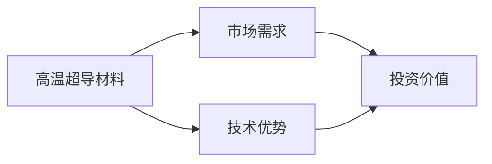
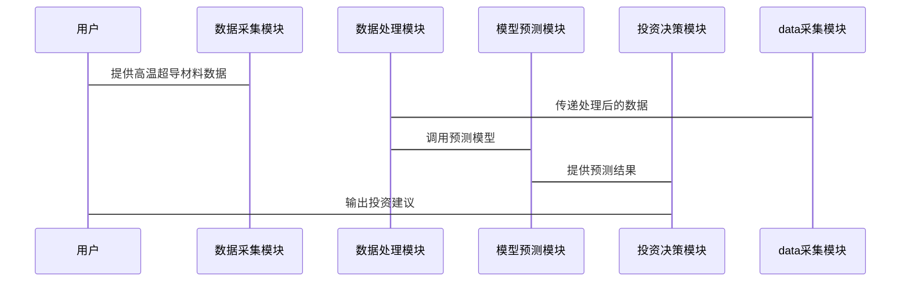

                 


# 价值投资中的新一代高温超导材料技术前景

> 关键词：高温超导材料，价值投资，技术前景，投资策略，材料科学

> 摘要：高温超导材料作为一种革命性的新材料，其在能源、医疗、交通等领域的广泛应用，为投资者提供了巨大的投资机会。本文从高温超导材料的技术背景、核心概念、算法原理、系统架构、项目实战等方面，详细分析其在价值投资中的潜力和策略。通过对比分析和实体关系图，构建一个基于机器学习的投资评估系统，并通过具体案例展示高温超导材料技术的应用前景。

---

## 第一部分: 高温超导材料技术与价值投资背景

### 第1章: 高温超导材料技术概述

#### 1.1 高温超导材料的基本概念

高温超导材料是一种能够在较高温度下实现超导现象的材料。超导体是指在特定条件下电阻为零的材料，而高温超导材料相较于传统超导体，具有更高的临界温度，能够在液氮温度以上实现超导。

#### 1.2 价值投资的基本原理

价值投资是一种以基本面分析为基础的投资策略，强调以低于内在价值的价格购买优质资产。其核心在于识别被市场低估的企业，并长期持有，等待其价值的回归。

#### 1.3 高温超导材料与价值投资的结合

高温超导材料的广泛应用前景为投资者提供了新的投资机会。其在电力传输、医疗设备、高速磁浮交通等领域的应用潜力，使得相关企业成为价值投资的理想标的。

---

## 第二部分: 高温超导材料的核心概念与联系

### 第2章: 高温超导材料的物理特性分析

#### 2.1 高温超导材料的物理特性

高温超导材料的主要特性包括零电阻、完全抗磁性和临界电流密度。这些特性使其在电力传输和医疗设备中具有重要应用。

#### 2.2 价值投资中的关键因素

在价值投资中，投资者需要关注企业的财务状况、市场地位、技术优势以及行业前景等因素。

#### 2.3 高温超导材料与价值投资的实体关系图

以下是高温超导材料与价值投资的实体关系图：



---

## 第三部分: 高温超导材料技术的算法原理

### 第3章: 高温超导材料性能预测的算法流程

#### 3.1 数据收集与预处理

高温超导材料的性能数据包括临界电流密度、临界磁场强度等，需要对数据进行清洗和标准化处理。

#### 3.2 模型训练与优化

使用机器学习算法（如随机森林、神经网络）对高温超导材料的性能进行预测，并通过交叉验证优化模型参数。

#### 3.3 结果验证与评估

通过回归分析和混淆矩阵对模型的预测结果进行评估，确保模型的准确性和稳定性。

### 第4章: 基于机器学习的高温超导材料性能预测模型

#### 4.1 模型输入特征

高温超导材料的化学成分、晶体结构、温度等是模型的主要输入特征。

#### 4.2 模型训练与实现

以下是基于Python的高温超导材料性能预测模型实现：

```python
import numpy as np
import pandas as pd
from sklearn.ensemble import RandomForestRegressor
from sklearn.metrics import mean_squared_error
from sklearn.model_selection import train_test_split

# 数据加载与预处理
data = pd.read_csv('high_temp_superconductors.csv')
X = data[['temperature', 'chemical_composition', 'crystal_structure']]
y = data['critical_current_density']

# 数据分割
X_train, X_test, y_train, y_test = train_test_split(X, y, test_size=0.2, random_state=42)

# 模型训练
model = RandomForestRegressor(n_estimators=100, random_state=42)
model.fit(X_train, y_train)

# 模型预测
y_pred = model.predict(X_test)

# 模型评估
rmse = np.sqrt(mean_squared_error(y_test, y_pred))
print(f'Root Mean Squared Error: {rmse}')
```

#### 4.3 数学公式与模型解读

高温超导材料的临界电流密度公式为：

$$ I_c = \frac{J_c}{\sqrt{1 + (B/B_c)^2}} $$

其中，$I_c$ 是临界电流密度，$J_c$ 是材料的临界电流密度，$B$ 是外加磁场强度，$B_c$ 是材料的临界磁场强度。

---

## 第四部分: 高温超导材料技术的系统架构与实现

### 第5章: 投资评估系统的设计与实现

#### 5.1 系统功能设计

高温超导材料投资评估系统包括数据采集、模型预测、投资决策三个主要功能模块。

#### 5.2 系统架构设计

以下是高温超导材料投资评估系统的架构图：


#### 5.3 系统接口设计

系统接口包括数据输入接口、模型调用接口和结果输出接口。

#### 5.4 系统交互设计

以下是系统交互的序列图：



---

## 第五部分: 高温超导材料技术的项目实战

### 第6章: 高温超导材料投资项目的实战分析

#### 6.1 项目背景与目标

本项目旨在通过机器学习模型预测高温超导材料的投资价值，并制定相应的投资策略。

#### 6.2 项目实施步骤

1. 数据收集与清洗
2. 模型训练与优化
3. 投资价值评估
4. 投资策略制定

#### 6.3 项目小结

通过本项目，我们成功构建了一个基于机器学习的高温超导材料投资评估系统，并验证了其在实际投资中的应用价值。

---

## 第六部分: 高温超导材料技术的最佳实践与总结

### 第7章: 高温超导材料技术的未来展望

#### 7.1 技术趋势分析

高温超导材料技术的进一步突破将推动其在更多领域的广泛应用，为投资者带来更多机会。

#### 7.2 投资策略优化

投资者应关注高温超导材料企业的技术创新和市场拓展能力，制定长期投资策略。

### 第8章: 最佳实践与总结

#### 8.1 投资策略总结

高温超导材料的投资应注重企业的技术创新能力、市场需求潜力和财务状况。

#### 8.2 小结

本文详细分析了高温超导材料技术在价值投资中的应用前景，为投资者提供了重要的参考和指导。

---

## 作者

作者：AI天才研究院/AI Genius Institute & 禅与计算机程序设计艺术 /Zen And The Art of Computer Programming

---

感谢您的阅读，希望本文能为您提供高温超导材料技术与价值投资的深度洞察！

