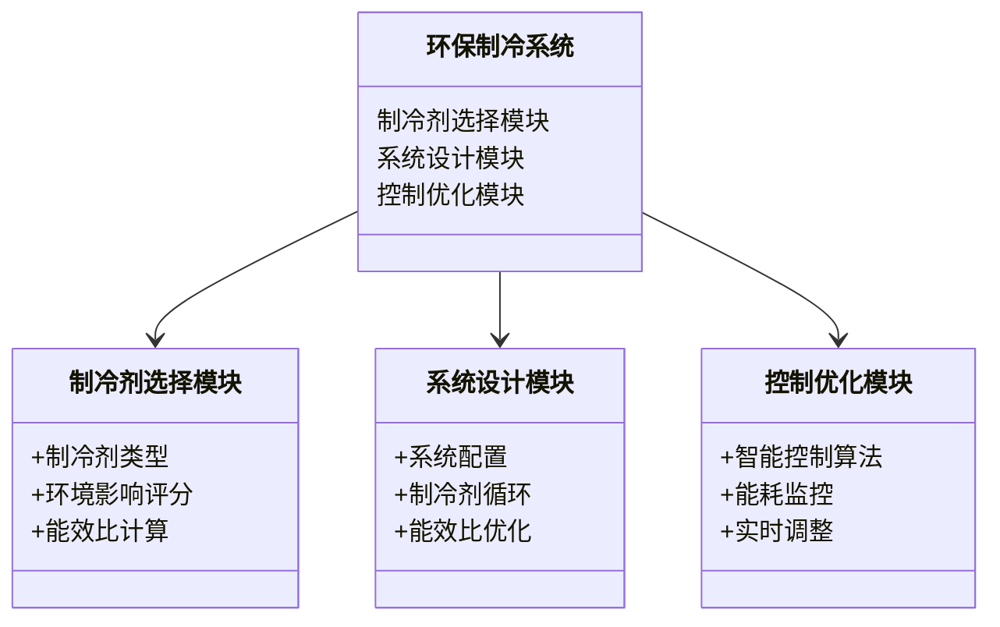

                 


# 价值投资中的新型环保制冷技术前景

## 关键词：环保制冷技术、价值投资、制冷剂、能效、环境影响评估

## 摘要：  
随着全球气候变化加剧和环保法规的日益严格，新型环保制冷技术正成为制冷行业的重要发展方向。本文从价值投资的角度，分析环保制冷技术的市场前景、技术优势以及投资机会。通过对比不同制冷技术的环境影响、能效比和成本效益，构建一套科学的投资评估体系，帮助投资者识别具有长期增长潜力的环保制冷技术公司。

---

## 正文

### 第一部分：环保制冷技术的背景与价值投资概述

#### 第1章：环保制冷技术的背景与现状

##### 1.1 环保制冷技术的背景

全球气候变化是一个 pressing issue，而制冷行业作为能源消耗大户，对环境的影响不容忽视。根据联合国环境规划署（UNEP）的数据，制冷行业是温室气体排放的主要来源之一。传统的制冷剂，如氢氟碳化物（HFCs），具有极高的全球变暖潜能值（GWP），对环境造成严重破坏。

近年来，环保制冷剂的研发和应用逐渐成为行业趋势。环保制冷剂主要包括自然制冷剂（如二氧化碳、氨）和合成环保制冷剂（如HFOs）。这些制冷剂的GWP较低，对环境的影响显著减小。例如，二氧化碳制冷剂的GWP为1，远低于传统HFC-404A的6750。

##### 1.2 价值投资的基本概念

价值投资是一种长期投资策略，强调以低于市场价的合理价格买入具有内在价值的资产。在环保制冷技术领域，价值投资者需要识别那些技术领先、市场前景广阔且财务健康的公司。

环保制冷技术的市场潜力巨大。根据市场研究公司Grand View Research的报告，全球环保制冷剂市场预计将从2023年的XX亿美元增长到2030年的XX亿美元，年复合增长率超过8%。这一增长主要得益于环保法规的推动和市场对节能、环保技术的需求。

---

### 第二部分：环保制冷技术的核心概念与分析

#### 第2章：环保制冷技术的核心原理

##### 2.1 环保制冷剂的分类与特性

环保制冷剂主要分为两类：自然制冷剂和合成环保制冷剂。

1. **自然制冷剂**  
   - **二氧化碳（R-744）**：  
     二氧化碳是一种天然制冷剂，具有零Ozone Depletion Potential（ODP）和低GWP。但它对系统设计要求较高，高压操作可能限制其应用。  
   - **氨（R-717）**：  
     氨也是一种天然制冷剂，具有零ODP和低GWP，但具有毒性和腐蚀性，应用场景受限。

2. **合成环保制冷剂**  
   - **氢氟烯烃（HFOs）**：  
     HFOs的GWP较低，且不含臭氧破坏潜能，是传统HFCs的替代品。例如，HFO-1234ze的GWP为23，远低于HFC-404A的6750。

##### 2.2 制冷系统的效率与优化

制冷系统的效率是衡量其环保性和经济性的关键指标。能效比（COP）是制冷系统效率的重要指标，公式如下：

$$
\text{COP} = \frac{\text{制冷量}}{\text{输入功率}}
$$

系统优化的目标是在保证制冷效果的同时，降低能耗和环境影响。例如，采用变制冷剂流量（VRF）系统和智能控制技术可以显著提高能效。

---

### 第三部分：环保制冷技术的算法与数学模型

#### 第3章：环保制冷技术的算法原理

##### 3.1 环保制冷剂选择的算法

环保制冷剂的选择需要综合考虑环境影响、能效比和成本。以下是选择制冷剂的算法步骤：

1. **确定需求参数**：  
   根据应用场景确定制冷量、温度范围和压力要求。

2. **计算环境影响指标**：  
   使用GWP和ODP评估制冷剂的环境影响。

3. **评估能效比**：  
   计算制冷剂在系统中的能效比，公式如下：

$$
\text{能效比} = \frac{\text{制冷量}}{\text{输入功率}}
$$

4. **成本评估**：  
   考虑制冷剂的初始成本和长期使用成本。

5. **综合评分**：  
   根据环境影响、能效比和成本对制冷剂进行综合评分，选择得分最高的制冷剂。

##### 3.2 系统效率优化的数学模型

系统效率优化的目标是降低能耗和环境影响。以下是一个简单的优化模型：

$$
\min \text{能耗} = \sum_{i=1}^{n} \text{制冷剂}_i \times \text{能效比}_i
$$

$$
\text{约束条件}：  
\text{制冷量} \geq \text{需求制冷量}
$$

---

### 第四部分：环保制冷技术的系统架构与设计

#### 第4章：环保制冷技术的系统架构

##### 4.1 系统架构设计

环保制冷技术的系统架构包括制冷剂选择、系统设计和控制优化三个模块。以下是系统架构的类图：



##### 4.2 系统架构的优缺点对比

以下是不同系统架构的对比表：

| 系统架构 | 优点 | 缺点 |
|----------|------|------|
| 自然制冷剂系统 | 环境影响小，能效高 | 设计复杂，成本高 |
| 合成环保制冷剂系统 | 环境影响较低，应用广泛 | 成本较高 |
| 混合制冷剂系统 | 综合性能较好 | 系统复杂 |

---

### 项目实战：环保制冷技术的投资分析

#### 环境安装与核心实现

1. **环境要求**：  
   - 制冷剂相容性测试  
   - 系统压力和温度适应性  

2. **核心实现代码**：  
   以下是一个简单的环境影响评分系统的Python代码：

```python
def calculate_env_impact(cooling_system):
    gwp = cooling_system.gwp
    odp = cooling_system.odp
    return gwp + odp
```

#### 投资价值分析

以某环保制冷剂公司为例，分析其投资价值：

1. **市场需求**：  
   公司的环保制冷剂市场占有率逐年上升，符合行业趋势。

2. **技术优势**：  
   公司拥有专利的低GWP制冷剂技术，具有技术壁垒。

3. **财务状况**：  
   公司的利润率和研发投入占比逐年增加，财务健康。

4. **竞争优势**：  
   公司与多家国际企业合作，具有较强的市场影响力。

---

### 总结

新型环保制冷技术是制冷行业发展的必然趋势。通过价值投资的角度分析，环保制冷技术不仅符合环保要求，还具有广阔的市场前景。投资者应关注具有技术优势、市场竞争力和财务健康的环保制冷技术公司。

---

### 作者：AI天才研究院/AI Genius Institute & 禅与计算机程序设计艺术 /Zen And The Art of Computer Programming

---

通过以上思考，我们可以系统地分析环保制冷技术的价值投资前景，并为投资者提供科学的决策依据。

