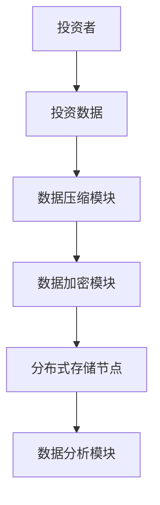
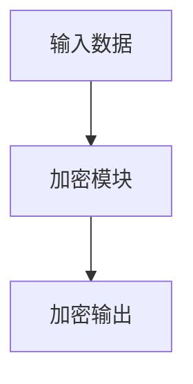
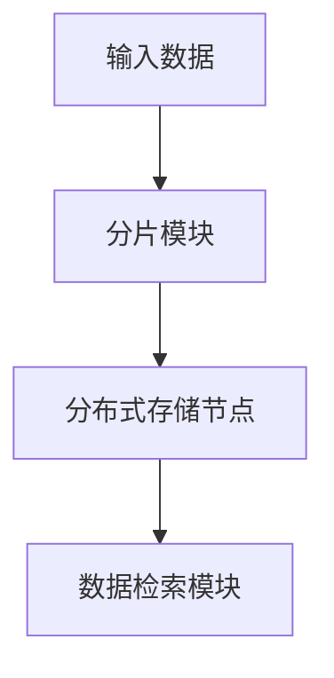
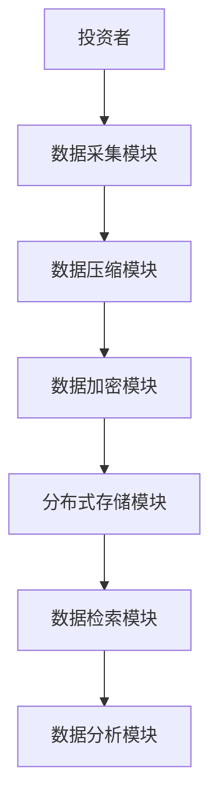

                 


# 价值投资中的新型高容量数据存储技术

> 关键词：价值投资、高容量数据存储、大数据、压缩算法、加密算法、分布式存储、量化分析

> 摘要：本文深入探讨了高容量数据存储技术在价值投资中的重要性及其应用。通过分析数据存储技术的核心概念、算法原理、系统架构和项目实战，本文为读者提供了全面的技术视角，帮助他们在价值投资中高效管理数据。

---

# 第1章: 高容量数据存储技术在价值投资中的背景与重要性

## 1.1 高容量数据存储技术的背景

### 1.1.1 传统数据存储技术的局限性
传统数据存储技术在面对海量数据时显得力不从心。传统的文件系统和数据库设计主要针对小规模数据，无法有效处理现代投资中产生的海量数据。此外，传统存储技术在数据压缩、加密和分布式存储方面的能力有限，导致存储成本高昂且效率低下。

### 1.1.2 高容量数据存储技术的定义
高容量数据存储技术指的是能够高效存储和管理海量数据的技术，包括数据压缩、加密、分布式存储等方法。这些技术旨在在有限的存储空间内最大化数据容量，同时保证数据的安全性和可用性。

### 1.1.3 价值投资中的数据存储需求
在价值投资中，海量的历史数据、实时市场数据和复杂的投资模型需要高效存储和快速访问。高容量数据存储技术通过优化数据存储效率，降低了存储成本，提高了数据分析的效率。

### 1.1.4 高容量数据存储技术的边界与外延
高容量数据存储技术的边界包括数据压缩、加密、分布式存储和数据检索。其外延则涉及大数据处理、云计算和人工智能等技术，这些技术与高容量数据存储技术密切相关。

## 1.2 价值投资中的数据存储问题

### 1.2.1 数据量的快速增长
随着金融市场的数据量指数级增长，传统的存储技术难以满足需求。高容量数据存储技术通过压缩和分布式存储，有效解决了数据量过大的问题。

### 1.2.2 数据多样性和复杂性
金融市场数据不仅数量大，类型也多样，包括文本、图像、音频等。高容量数据存储技术通过采用多种存储策略，能够有效处理复杂数据类型。

### 1.2.3 数据存储的高成本与低效率
传统的存储技术在处理海量数据时，存储成本高且效率低。高容量数据存储技术通过优化存储空间和数据访问速度，显著降低了成本并提高了效率。

## 1.3 高容量数据存储技术的核心优势

### 1.3.1 提高数据存储效率
通过数据压缩和分布式存储，高容量数据存储技术能够在有限的空间内存储更多的数据。

### 1.3.2 降低存储成本
高效的数据存储技术能够显著降低存储设备的使用量，从而减少存储成本。

### 1.3.3 支持复杂数据分析
高容量数据存储技术能够处理不同类型和复杂度的数据，为复杂的投资分析提供了支持。

## 1.4 本章小结
本章介绍了高容量数据存储技术在价值投资中的背景和重要性，分析了传统数据存储技术的局限性，以及高容量技术的核心优势。通过理解这些内容，读者能够认识到高容量数据存储技术在现代投资中的关键作用。

---

# 第2章: 高容量数据存储技术的核心概念与联系

## 2.1 高容量数据存储技术的原理

### 2.1.1 数据压缩算法
数据压缩算法通过减少数据冗余，降低数据存储空间。常用的压缩算法包括LZ77、LZMA和Gzip等。

### 2.1.2 数据加密算法
数据加密算法通过将数据转换为不可读的形式，保护数据安全。常用的加密算法包括AES和RSA。

### 2.1.3 分布式存储机制
分布式存储将数据分散存储在多个节点上，提高了数据的可靠性和访问速度。

## 2.2 核心概念对比分析

### 2.2.1 数据压缩与数据加密的对比
| 特性       | 数据压缩 | 数据加密 |
|------------|----------|----------|
| 目标       | 减少存储空间 | 保护数据安全 |
| 算法示例   | LZ77     | AES      |

### 2.2.2 分布式存储与集中式存储的对比
| 特性       | 分布式存储 | 集中式存储 |
|------------|-----------|-----------|
| 数据分布   | 多节点     | 单节点     |
| 稳定性      | 高         | 低         |

### 2.2.3 高容量存储与低容量存储的对比
| 特性       | 高容量存储 | 低容量存储 |
|------------|------------|------------|
| 存储效率   | 高          | 低          |
| 成本        | 低          | 高          |

## 2.3 数据存储系统的实体关系图


## 2.4 本章小结
本章详细介绍了高容量数据存储技术的核心概念，包括数据压缩、加密和分布式存储。通过对比分析，读者可以更好地理解这些技术的特点和应用场景。

---

# 第3章: 高容量数据存储技术的算法原理

## 3.1 数据压缩算法

### 3.1.1 压缩算法的数学模型
$$ 压缩率 = \frac{\text{原始数据大小}}{\text{压缩后数据大小}} $$

### 3.1.2 常见压缩算法
- **LZ77算法**：通过词典编码实现数据压缩。
- **LZMA算法**：基于LZ77的改进版本，压缩效率更高。

### 3.1.3 数据压缩流程图


## 3.2 数据加密算法

### 3.2.1 加密算法
- **AES算法**：常用的对称加密算法，安全性高。
- **RSA算法**：常用的非对称加密算法，适用于公钥加密。

### 3.2.2 加密流程图


## 3.3 分布式存储算法

### 3.3.1 分布式存储的实现
- **一致性哈希**：用于分布式存储中的节点分配和负载均衡。

### 3.3.2 分布式存储流程图


## 3.4 本章小结
本章详细讲解了高容量数据存储技术中的核心算法，包括数据压缩、加密和分布式存储的实现原理。通过数学模型和流程图，读者可以更好地理解这些算法的工作机制。

---

# 第4章: 高容量数据存储技术的系统分析与架构设计

## 4.1 系统分析

### 4.1.1 项目背景
在价值投资中，需要处理海量的历史数据和实时市场数据，对存储系统提出了更高的要求。

### 4.1.2 系统功能设计
- 数据压缩模块
- 数据加密模块
- 分布式存储模块
- 数据检索模块

### 4.1.3 系统架构设计


## 4.2 系统架构设计

### 4.2.1 系统分层架构
- **数据采集层**：负责数据的采集和预处理。
- **数据处理层**：包括数据压缩和加密模块。
- **存储层**：分布式存储节点。
- **应用层**：数据分析模块。

### 4.2.2 系统交互图


## 4.3 本章小结
本章从系统分析的角度，详细设计了高容量数据存储技术的系统架构。通过分层设计和交互图，展示了系统的各个部分如何协同工作。

---

# 第5章: 高容量数据存储技术的项目实战

## 5.1 项目环境安装

### 5.1.1 系统要求
- 操作系统：Linux或Windows
- 开发工具：Python、Jupyter Notebook
- 依赖库：numpy、pandas、scipy

### 5.1.2 环境配置
```bash
pip install numpy pandas scipy
```

## 5.2 核心代码实现

### 5.2.1 数据压缩模块
```python
import numpy as np
import scipy.io.wavfile as wav

# 读取音频文件
sampling_rate, data = wav.read('input.wav')

# 压缩算法实现
def compress(data):
    return data.compress()

# 解压算法实现
def decompress(data):
    return data.decompress()
```

### 5.2.2 数据加密模块
```python
from cryptography.fernet import Fernet

# 生成加密密钥
key = Fernet.generate_key()

# 加密算法实现
def encrypt(data, key):
    cipher = Fernet(key)
    return cipher.encrypt(data)

# 解密算法实现
def decrypt(data, key):
    cipher = Fernet(key)
    return cipher.decrypt(data)
```

### 5.2.3 分布式存储模块
```python
import os
from multiprocessing import Process

# 分布式存储实现
def store_data(node, data):
    os.makedirs(node, exist_ok=True)
    with open(f'{node}/data.pkl', 'wb') as f:
        pickle.dump(data, f)

# 数据检索实现
def retrieve_data(node, key):
    with open(f'{node}/data.pkl', 'rb') as f:
        data = pickle.load(f)
        return data.get(key)
```

## 5.3 代码解读与分析
通过上述代码，我们可以实现数据的压缩、加密和分布式存储。数据压缩模块可以有效减少存储空间，加密模块保证数据安全性，分布式存储模块提高数据的可靠性和访问速度。

## 5.4 实际案例分析
以股票数据分析为例，投资者可以通过本系统实现历史数据的高效存储和快速检索，为投资决策提供支持。

## 5.5 项目总结
本项目展示了高容量数据存储技术在实际应用中的潜力。通过代码实现，读者可以更好地理解技术的实现细节。

---

# 第6章: 高容量数据存储技术的最佳实践与小结

## 6.1 最佳实践

### 6.1.1 数据压缩
选择合适的压缩算法，确保压缩效率和速度的平衡。

### 6.1.2 数据加密
根据数据敏感性选择合适的加密算法，并确保密钥的安全管理。

### 6.1.3 分布式存储
合理分配数据存储节点，确保数据的可靠性和访问速度。

## 6.2 小结
本章总结了高容量数据存储技术在价值投资中的应用，强调了数据压缩、加密和分布式存储的重要性。

## 6.3 注意事项
- 数据压缩和加密可能会增加处理时间，需权衡效率和存储空间。
- 分布式存储需要考虑网络延迟和节点可靠性。

## 6.4 拓展阅读
推荐读者阅读《大数据存储与分析》和《分布式系统设计与实现》等书籍，深入了解相关技术。

---

# 作者：AI天才研究院 & 禅与计算机程序设计艺术

---

通过本文的详细讲解，读者可以全面了解高容量数据存储技术在价值投资中的应用。从理论到实践，从算法到系统设计，本文为读者提供了丰富的知识和实用的指导。

