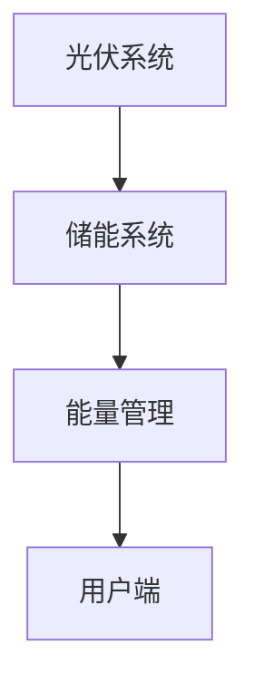
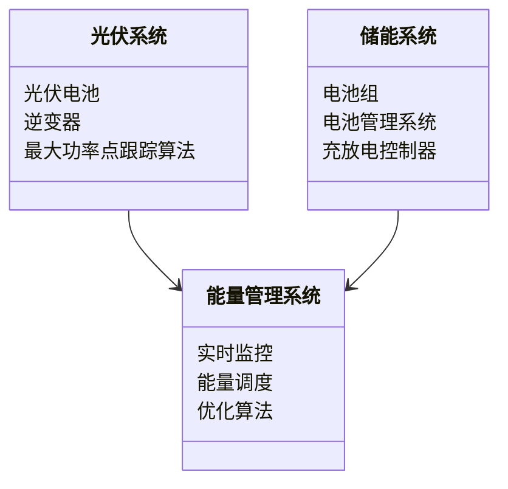
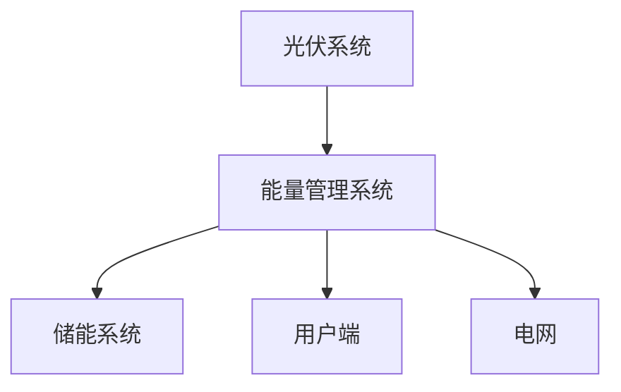
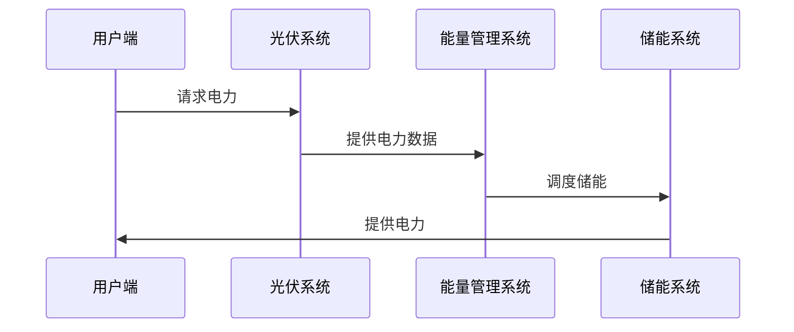

                 


# 价值投资中的新型高效光伏-储能一体化技术

## 关键词：光伏技术、储能技术、价值投资、一体化系统、能源互联网、能源转换效率

## 摘要：  
光伏-储能一体化技术是将光伏发电与储能技术相结合，形成高效、智能的能源转换和管理系统。本文从技术背景、核心概念、算法原理、系统架构、项目实战到投资分析，全面探讨光伏-储能一体化技术的创新与应用，结合实际案例分析其在价值投资中的潜力与策略。  

---

# 第一部分: 光伏-储能一体化技术的背景与核心概念

## 第1章: 价值投资中的光伏-储能技术概述

### 1.1 光伏与储能技术的基本概念

#### 1.1.1 光伏技术的定义与发展
- **光伏技术**：利用半导体材料将太阳光直接转化为电能的技术。  
- **发展历程**：从实验室研究到商业化应用，技术不断进步，效率提升。  
- **现状**：全球光伏装机容量持续增长，成为可再生能源的重要组成部分。  

#### 1.1.2 储能技术的定义与发展
- **储能技术**：通过电池或其他装置存储能量，以备后续使用的技术。  
- **常见技术**：铅酸电池、锂电池、钠离子电池、超级电容器等。  
- **发展趋势**：储能技术向高效率、长寿命、低成本方向发展，应用场景广泛。  

#### 1.1.3 光伏-储能一体化技术的定义与特点
- **定义**：将光伏发电与储能技术结合，形成一个闭环系统，实现能源的高效利用与管理。  
- **特点**：  
  - 高效性：优化能量转换与存储效率。  
  - 智能性：通过智能控制系统实现能量的精准管理。  
  - 灵活性：适应不同场景的应用需求。  

---

### 1.2 价值投资与光伏-储能技术的结合

#### 1.2.1 价值投资的基本概念
- **价值投资**：以企业的内在价值为基础，寻找市场价格低于内在价值的投资机会。  
- **关键因素**：企业的盈利能力、成长性、竞争优势、财务健康状况等。  

#### 1.2.2 光伏-储能技术在价值投资中的应用
- **技术创新**：光伏-储能一体化技术的创新性决定了其市场竞争力。  
- **成本优势**：高效的技术能够降低能源成本，提高投资回报率。  
- **政策支持**：全球能源转型政策推动可再生能源市场的发展，为投资提供政策保障。  

#### 1.2.3 光伏-储能一体化技术的市场前景
- **市场规模**：随着全球能源需求的增长和环保政策的推动，市场规模持续扩大。  
- **竞争格局**：技术领先的企业将占据更大的市场份额。  
- **投资机会**：技术创新型企业具有较大的投资潜力。  

---

## 第2章: 光伏-储能一体化技术的核心概念与联系

### 2.1 光伏技术的核心原理

#### 2.1.1 太阳能的转换原理
- **光生伏特效应**：半导体材料在光照下产生电动势的现象，是光伏技术的核心原理。  
- **能量转换流程**：  
  1. 太阳光照射到光伏电池，产生电子-空穴对。  
  2. 外部电路将电子和空穴分开，形成电流。  
  3. 电流通过负载做功。  

#### 2.1.2 光伏电池的工作原理
- **光伏电池结构**：包括扩散层、耗尽层、欧姆接触层等。  
- **光电转换效率**：影响因素包括材料特性、光照条件、温度等。  

#### 2.1.3 光伏系统的组成部分
- **组件**：光伏电池组件、逆变器、支架等。  
- **系统功能**：将太阳能转化为电能，并接入电网或直接使用。  

---

### 2.2 储能技术的核心原理

#### 2.2.1 储能的基本概念
- **储能技术**：通过存储能量以应对能源需求波动的技术。  
- **储能类型**：  
  - **电化学储能**：锂电池、铅酸电池等。  
  - **物理储能**：抽水蓄能、压缩空气储能等。  

#### 2.2.2 常见储能技术的分类与特点
| 技术类型 | 特点 | 优缺点 | 应用场景 |
|----------|------|--------|----------|
| 锂电池  | 高能量密度、长循环寿命 | 成本高、资源依赖 | 电网调频、分布式储能 |
| 铅酸电池 | 成本低、技术成熟 | 能量密度低、寿命短 | 备用电源 |
| 压缩空气储能 | 储量大、成本低 | 压缩和释放过程能耗高 | 大规模储能 |

#### 2.2.3 储能系统的组成部分
- **储能单元**：电池模块、电池管理系统（BMS）。  
- **储能系统**：包括能量转换器、储能单元、监控系统等。  

---

### 2.3 光伏-储能一体化技术的系统架构

#### 2.3.1 系统整体架构图


#### 2.3.2 系统功能模块对比分析表
| 功能模块 | 光伏系统 | 储能系统 | 一体化系统 |
|----------|----------|----------|------------|
| 输入     | 太阳能   | 电能     | 太阳能、电能 |
| 输出     | 电能     | 电能     | 电能        |
| 调度     | 智能控制 | 智能控制 | 统一控制    |
| 优化目标 | 最大化发电 | 最小化能耗 | 整体效率最大化 |

---

# 第二部分: 算法原理与数学模型

## 第3章: 光伏-储能一体化技术的算法原理

### 3.1 最大功率点跟踪算法（MPPT）

#### 3.1.1 算法原理
- **目标**：在变化的光照条件下，找到光伏系统的最大功率点。  
- **方法**：通过调整光伏系统的运行参数，使其输出功率最大化。  

#### 3.1.2 算法实现
```python
def mppt_algorithm(voltage, current, irradiance):
    # 根据光照强度调整电压
    if irradiance > 1000:  # 高光照强度
        voltage = voltage + 5
    elif irradiance < 500:  # 低光照强度
        voltage = voltage - 2
    # 计算功率
    power = voltage * current
    return power
```

#### 3.1.3 优化策略
- **扰动观察法**：通过小幅度扰动电压，观察功率变化，找到最大值。  
- **爬山法**：逐步调整电压，直到功率不再增加。  

---

### 3.2 储能系统的能量管理算法

#### 3.2.1 算法原理
- **目标**：优化储能系统的充放电策略，提高能量利用效率。  
- **方法**：根据电网需求和储能容量，动态调整充放电功率。  

#### 3.2.2 算法实现
```python
def battery_management(soc, grid_demand):
    if grid_demand > 100:  # 高需求
        if soc > 0.2:  # 状态充足
            return " discharge 50kW"
        else:
            return " charge 50kW"
    else:  # 低需求
        return " standby"
```

---

## 第4章: 数学模型与公式推导

### 4.1 光伏系统的能量转换效率模型
- **公式**：  
  $$ \eta_{\text{光伏}} = \frac{P_{\text{输出}}}{P_{\text{输入}}} $$
  其中，$P_{\text{输出}}$ 是光伏系统的输出功率，$P_{\text{输入}}$ 是太阳辐照度的能量。  

- **影响因素**：光照强度、温度、电池特性等。  

---

### 4.2 储能系统的能量损失模型
- **公式**：  
  $$ E_{\text{损失}} = E_{\text{输入}} - E_{\text{输出}} $$
  其中，$E_{\text{输入}}$ 是储能系统的输入能量，$E_{\text{输出}}$ 是储能系统的输出能量。  

- **优化目标**：通过改进储能技术，降低能量损失。  

---

# 第三部分: 系统分析与架构设计

## 第5章: 系统分析与架构设计方案

### 5.1 问题场景介绍
- **目标**：设计一个高效的光伏-储能一体化系统，实现能量的高效转换与管理。  
- **挑战**：光照波动、储能效率低、系统稳定性等。  

### 5.2 系统功能设计

#### 5.2.1 领域模型设计


---

### 5.3 系统架构设计

#### 5.3.1 系统架构图


#### 5.3.2 接口设计
- **光伏系统接口**：与逆变器、最大功率点跟踪算法接口对接。  
- **储能系统接口**：与电池管理系统、充放电控制器接口对接。  

#### 5.3.3 交互流程图


---

## 第6章: 项目实战与案例分析

### 6.1 项目环境安装

#### 6.1.1 硬件安装
- **光伏系统**：安装光伏电池组件、逆变器、支架等。  
- **储能系统**：安装电池组、电池管理系统、充放电控制器等。  

#### 6.1.2 软件安装
- **能量管理系统**：部署实时监控、能量调度算法。  

### 6.2 核心代码实现

#### 6.2.1 光伏系统核心代码
```python
def main():
    import serial
    import time

    ser = serial.Serial('COM1', 9600)
    while True:
        data = ser.readline().decode('utf-8')
        voltage = float(data.split(',')[0])
        current = float(data.split(',')[1])
        print(f"电压: {voltage}, 电流: {current}")
        time.sleep(1)

if __name__ == "__main__":
    main()
```

#### 6.2.2 储能系统核心代码
```python
def battery_management(soc):
    import time
    while True:
        if soc > 0.8:
            print("停止充电")
        elif soc < 0.2:
            print("开始充电")
        else:
            print("保持备用")
        time.sleep(60)
```

---

### 6.3 实际案例分析

#### 6.3.1 案例介绍
- **项目规模**：50kW光伏系统+1MWh储能系统。  
- **应用场景**：工业园区自用与电网调峰。  

#### 6.3.2 投资回报分析
- **初始投资**：约500万元。  
- **年收益**：通过节省电费和电网服务费，年收益约200万元。  
- **投资回收期**：约3年。  

---

# 第四部分: 投资分析与价值评估

## 第7章: 投资分析与价值评估

### 7.1 技术分析与投资策略

#### 7.1.1 技术分析
- **技术壁垒**：高效光伏电池技术、长寿命储能技术。  
- **竞争优势**：技术创新型企业具有更高的市场准入门槛。  

#### 7.1.2 投资策略
- **重点关注领域**：技术创新型企业、政策支持地区。  
- **风险控制**：关注技术可行性、市场需求、政策变化。  

---

### 7.2 市场分析与投资建议

#### 7.2.1 市场分析
- **市场规模**：全球光伏储能市场规模预计未来五年年均增长30%。  
- **主要参与者**：国际企业如特斯拉、宁德时代，国内企业如比亚迪、阳光能源。  

#### 7.2.2 投资建议
- **短期投资**：关注技术成熟、市场认可的企业。  
- **长期投资**：布局技术创新型企业，享受市场增长红利。  

---

## 第8章: 最佳实践与投资小结

### 8.1 最佳实践 tips
- **技术创新**：持续关注光伏-储能技术的创新，选择具有技术壁垒的企业。  
- **政策支持**：利用政府补贴、税收优惠等政策，降低投资成本。  
- **风险管理**：建立风险评估机制，应对市场波动和技术变革。  

### 8.2 投资小结
- **技术驱动**：光伏-储能一体化技术是未来能源革命的核心技术。  
- **投资价值**：技术创新型企业具有较高的投资回报潜力。  

---

## 作者：AI天才研究院/AI Genius Institute & 禅与计算机程序设计艺术/Zen And The Art of Computer Programming

