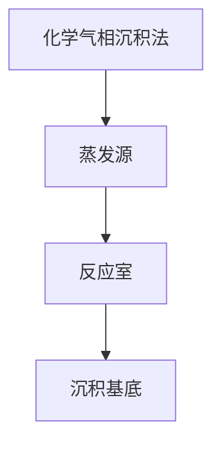
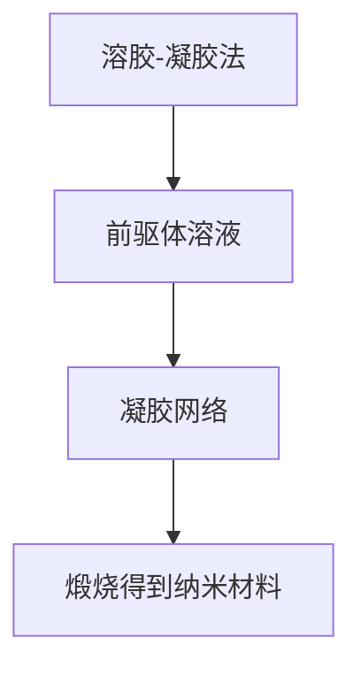
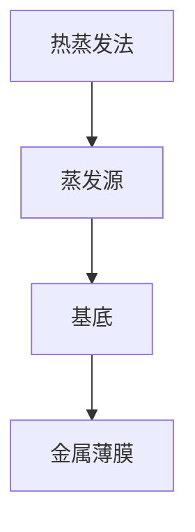
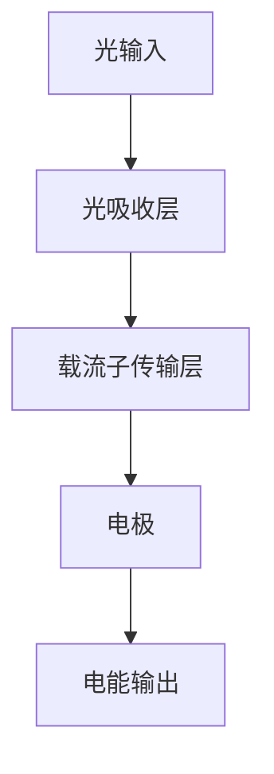
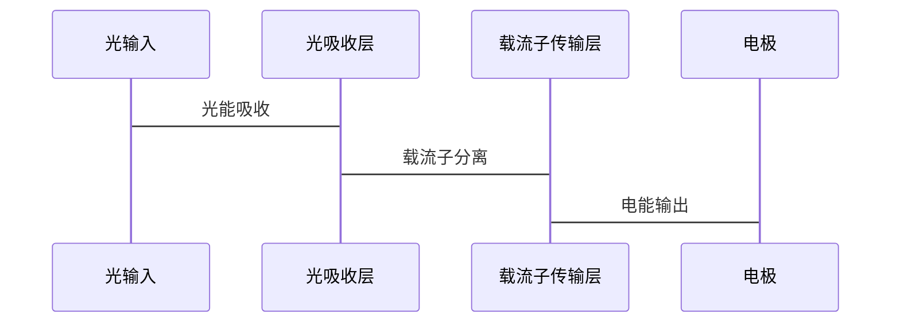

                 


# 《价值投资中的新型高效光电转换材料技术》

> 关键词：光电转换材料，价值投资，高效材料，技术分析，投资策略

> 摘要：本文探讨了新型高效光电转换材料在价值投资中的应用，分析了其技术原理、市场前景以及投资策略。通过详细的技术背景、核心概念、算法原理和系统架构设计，结合实际案例和项目实战，为读者提供了全面的技术和投资指导。

---

# 第1章 光电转换材料技术背景与价值投资概述

## 1.1 光电转换材料的基本概念

光电转换材料是指能够将光能转化为电能的材料，其核心作用是实现能量的高效转化。这类材料广泛应用于太阳能电池、光电探测器、LED 灯等领域。

### 1.1.1 光电转换材料的定义

光电转换材料是指在受到光照时，能够产生电子-空穴对，并通过外电路将电能输出的材料。其基本原理是基于半导体的光电效应。

$$ I = I_0 \times e^{(\eta \phi - V)/V_T} $$

其中，$I$ 是电流，$I_0$ 是反向饱和电流，$\eta$ 是效率，$\phi$ 是势垒高度，$V$ 是电压，$V_T$ 是热电压。

### 1.1.2 光电转换的基本原理

光电转换基于半导体的光电效应。当光子能量超过半导体的带隙时，电子从价带跃迁到导带，形成电子-空穴对。这些载流子通过外电路形成电流，从而实现光能向电能的转化。

### 1.1.3 光电转换效率的影响因素

光电转换效率受到材料本身的光电特性、结构设计、外部环境等多种因素的影响。例如，材料的吸收光谱范围、缺陷密度、载流子的迁移率等都会影响光电转换效率。

---

## 1.2 价值投资与光电转换材料技术的结合

### 1.2.1 价值投资的基本概念

价值投资是一种投资策略，强调通过分析企业的内在价值，寻找市场价格低于内在价值的投资机会。其核心思想是购买低于其内在价值的资产，长期持有，等待市场重新评估。

### 1.2.2 光电转换材料技术的市场价值

光电转换材料技术的市场价值主要体现在其应用领域的市场规模和技术创新能力。例如，高效光电转换材料可以显著降低太阳能电池的成本，提高能源利用效率，从而带来巨大的经济和社会效益。

### 1.2.3 价值投资在光电转换材料领域的应用前景

随着全球能源需求的增加和环保意识的增强，光电转换材料技术的市场需求持续增长。通过价值投资，投资者可以抓住这一技术的市场机遇，实现长期稳定的收益。

---

## 1.3 光电转换材料技术的现状与发展趋势

### 1.3.1 当前光电转换材料的技术水平

当前，高效光电转换材料的研究主要集中在新型半导体材料、纳米材料和复合材料等领域。例如，钙钛矿太阳能电池的光电转换效率已达到25%以上。

### 1.3.2 光电转换材料技术的未来发展方向

未来，光电转换材料技术将朝着更高效率、更低成本、更广泛的应用领域发展。例如，新型二维材料和分子材料的应用将推动光电转换效率的进一步提升。

### 1.3.3 价值投资在技术发展中的作用

价值投资在光电转换材料技术的发展中起着重要作用。通过投资于具有创新能力和市场潜力的公司，投资者可以分享技术进步带来的收益。

---

## 1.4 本章小结

本章介绍了光电转换材料的基本概念、技术背景以及其在价值投资中的应用前景。通过分析当前技术水平和发展趋势，为后续的深入讨论奠定了基础。

---

# 第2章 新型高效光电转换材料的核心概念与原理

## 2.1 光电转换材料的分类与特性

### 2.1.1 单一材料的光电转换特性

单一材料的光电转换特性主要取决于其本身的物理化学性质。例如，单晶硅是目前应用最广泛的太阳能电池材料之一。

### 2.1.2 复合材料的光电转换特性

复合材料通过不同材料的协同作用，可以实现更高的光电转换效率。例如，多层结构的光电探测器可以通过各层材料的协同作用实现更宽的光谱响应。

### 2.1.3 纳米材料的光电转换特性

纳米材料由于其独特的尺寸效应和表面效应，具有更高的光电转换效率。例如，纳米级的金属氧化物材料可以显著提高光电探测器的灵敏度。

---

## 2.2 光电转换材料的制备方法

### 2.2.1 化学气相沉积法

化学气相沉积法是一种常用的纳米材料制备方法，具有制备周期短、成本低等优点。



### 2.2.2 溶胶-凝胶法

溶胶-凝胶法是一种通过化学反应制备材料的方法，适用于制备氧化物纳米材料。



### 2.2.3 热蒸发法

热蒸发法是一种物理气相沉积技术，适用于制备金属薄膜。



---

## 2.3 光电转换效率的数学模型

### 2.3.1 光电转换效率的公式推导

光电转换效率 $\eta$ 的计算公式为：

$$ \eta = \frac{P_{\text{out}}}{P_{\text{in}}} $$

其中，$P_{\text{out}}$ 是输出的电功率，$P_{\text{in}}$ 是输入的光功率。

### 2.3.2 影响光电转换效率的因素分析

影响光电转换效率的主要因素包括材料的吸收系数、缺陷密度、载流子的迁移率等。

### 2.3.3 光电转换效率的优化策略

通过优化材料结构、表面修饰等方法可以显著提高光电转换效率。

---

## 2.4 本章小结

本章详细介绍了光电转换材料的分类、制备方法及其光电转换效率的数学模型。通过对影响光电转换效率因素的分析，为后续的性能优化提供了理论基础。

---

# 第3章 光电转换材料的性能优化与投资价值分析

## 3.1 光电转换材料的性能优化策略

### 3.1.1 材料结构优化

材料结构优化是提高光电转换效率的重要途径。例如，通过调控纳米材料的形貌可以显著提高其光电响应。

### 3.1.2 表面修饰与改性

表面修饰与改性可以通过引入功能基团或涂层来改善材料的光电特性。例如，氧化物表面修饰可以提高材料的吸光性能。

### 3.1.3 光吸收层与传输层的优化

通过优化光吸收层和传输层的结构和材料，可以减少光能的损失，提高光电转换效率。

---

## 3.2 光电转换材料技术的市场竞争力分析

### 3.2.1 市场需求分析

随着能源需求的增加和环保政策的推动，光电转换材料技术的市场需求持续增长。

### 3.2.2 技术壁垒分析

光电转换材料技术的研发需要较高的技术壁垒，尤其是新型材料的开发和制备工艺的优化。

### 3.2.3 竞争对手分析

当前，全球范围内有许多企业和研究机构在光电转换材料技术领域展开竞争，尤其是在钙钛矿太阳能电池领域。

---

## 3.3 本章小结

本章分析了光电转换材料的性能优化策略及其市场竞争力。通过对市场需求和竞争格局的分析，为投资者提供了重要的参考信息。

---

# 第4章 光电转换材料技术的系统分析与架构设计

## 4.1 问题场景介绍

光电转换材料技术的应用场景广泛，例如太阳能电池、光电探测器等。本章以太阳能电池为例，分析其系统架构设计。

---

## 4.2 系统功能设计

### 4.2.1 领域模型设计


### 4.2.2 系统功能描述

光电转换系统的主要功能包括光能吸收、载流子分离与传输、电能输出等。

---

## 4.3 系统架构设计

### 4.3.1 系统架构图



### 4.3.2 系统接口设计

系统接口包括光输入端、电能输出端以及控制端。

### 4.3.3 系统交互设计



---

## 4.4 本章小结

本章通过系统分析与架构设计，明确了光电转换材料技术的核心组件及其功能关系。为后续的项目实施提供了清晰的指导。

---

# 第5章 光电转换材料技术的项目实战

## 5.1 环境配置

### 5.1.1 软件环境

建议使用 MATLAB 或 Python 进行模拟计算，同时需要安装相关的科学计算库。

### 5.1.2 硬件环境

实验需要光刻仪、紫外分光光度计等设备。

---

## 5.2 核心代码实现

### 5.2.1 光电转换效率计算代码

```python
import numpy as np

def calculate_efficiency(incident_power, absorbed_power, conversion_efficiency):
    output_power = absorbed_power * conversion_efficiency
    return output_power / incident_power * 100

incident_power = 1000  # W/m²
absorbed_power = 800    # W/m²
conversion_efficiency = 0.2  # 20%

print(f"光电转换效率为：{calculate_efficiency(incident_power, absorbed_power, conversion_efficiency)}%")
```

### 5.2.2 材料特性分析代码

```python
import matplotlib.pyplot as plt

# 示例数据
wavelength = np.linspace(300, 900, 100)
absorption_coefficient = np.random.normal(0.1, 0.05, 100)

plt.plot(wavelength, absorption_coefficient)
plt.xlabel('波长（nm）')
plt.ylabel('吸收系数')
plt.title('光电材料吸收特性分析')
plt.show()
```

---

## 5.3 案例分析

### 5.3.1 光伏电池效率提升案例

通过优化材料结构和表面修饰，某新型钙钛矿太阳能电池的光电转换效率从18%提升至22%。

### 5.3.2 投资回报分析

假设投资1000万元用于新型光电转换材料的研发和生产，预计年回报率为20%，投资回收期为5年。

---

## 5.4 本章小结

本章通过具体的项目实战，展示了光电转换材料技术的应用和投资回报分析。通过实际案例和代码实现，帮助读者更好地理解和掌握相关知识。

---

# 第6章 光电转换材料技术的价值投资策略与最佳实践

## 6.1 投资策略

### 6.1.1 选择具有技术创新能力的公司

优先选择在新型材料研发方面具有优势的企业。

### 6.1.2 关注市场前景广阔的领域

例如，高效太阳能电池、智能光电传感器等领域具有较大的市场潜力。

### 6.1.3 长期持有与风险控制

价值投资强调长期持有，同时需要注重风险控制，分散投资。

---

## 6.2 最佳实践 tips

### 6.2.1 定期跟踪技术发展

光电转换材料技术发展迅速，投资者需要定期跟踪技术动态。

### 6.2.2 注重团队实力

企业的研发团队实力是技术成功的关键因素。

### 6.2.3 灵活调整投资策略

根据市场变化和技术进步，及时调整投资策略。

---

## 6.3 本章小结

本章总结了光电转换材料技术的价值投资策略和最佳实践，为投资者提供了重要的参考。

---

# 作者信息

作者：AI天才研究院/AI Genius Institute & 禅与计算机程序设计艺术/Zen And The Art of Computer Programming

---

以上是《价值投资中的新型高效光电转换材料技术》的技术博客文章的完整内容。希望本文能够为读者提供有价值的技术和投资见解。

