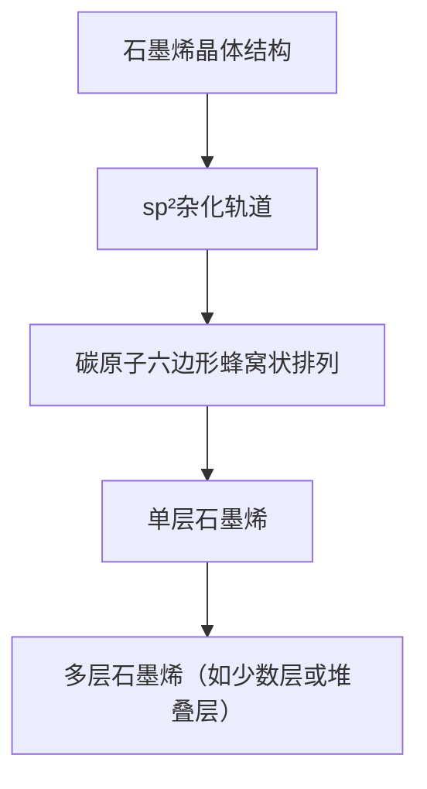
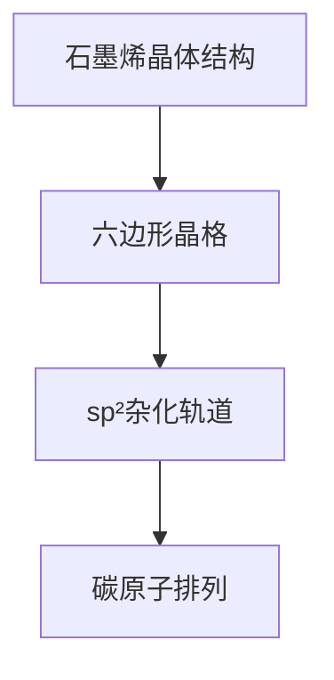
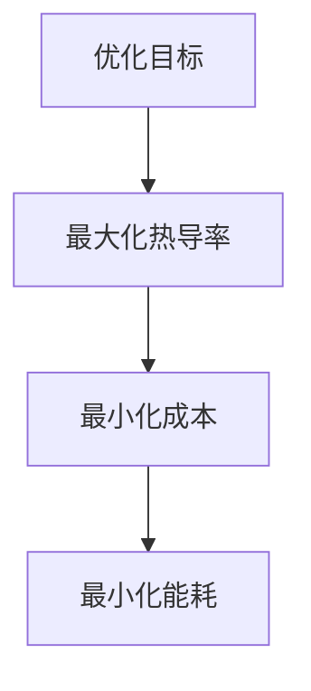
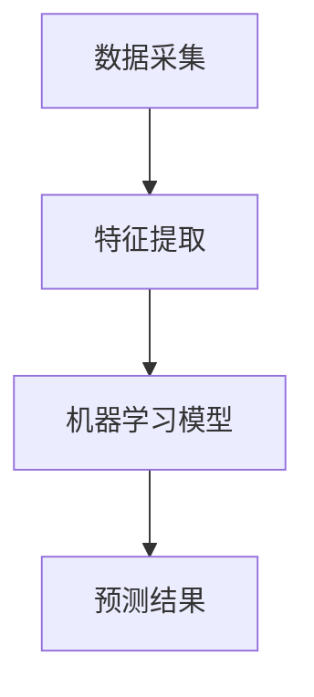
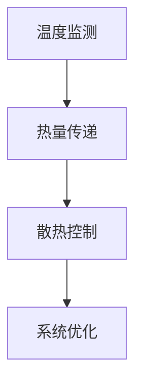
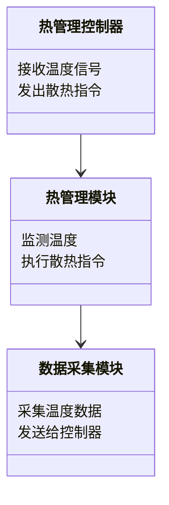

                 


# 价值投资中的新型高效热管理石墨烯材料技术

> **关键词**：石墨烯，热管理，价值投资，电子设备，热导率，机器学习

> **摘要**：石墨烯作为一种新型纳米材料，在热管理领域展现出巨大的潜力。本文从石墨烯的材料特性、热管理技术的核心原理、算法实现、系统架构设计以及实际应用案例等多方面进行深入分析。结合价值投资的角度，探讨石墨烯材料技术在电子设备、能源存储等领域的商业化前景和投资机会，为读者提供全面的技术解读和投资建议。

---

## 第1章：石墨烯材料与热管理技术基础

### 1.1 石墨烯材料的特性与优势

#### 1.1.1 石墨烯的结构与物理特性

石墨烯是一种由碳原子通过sp²杂化形成的二维蜂窝状结构。其单层结构使得石墨烯具有极高的比表面积，理论值可达2630 m²/g。以下是石墨烯的主要物理特性对比：

| 物理特性      | 石墨烯       | 金属材料（如铜） | 传统半导体材料（如Si） |
|---------------|--------------|------------------|------------------------|
| 导电性（导电率）| 极高（~10^6 S/m） | 极高（~5.96×10^7 S/m） | 较低（~0.46 S/m）    |
| 导热性（热导率）| 极高（~2000 W/m·K） | 较高（~380 W/m·K） | 较低（~150 W/m·K）  |
| 机械强度      | 极高（杨氏模量：1 TPa） | 较高（~120 GPa） | 较低（~70 GPa）      |
| 柔韧性         | 极高         | 较低             | 较低                   |

石墨烯的结构特征（使用Mermaid表示）：



#### 1.1.2 石墨烯的热导率与导电性

石墨烯的热导率是其热管理应用的核心优势。以下是石墨烯与其他材料的热导率对比：

| 材料         | 热导率（W/m·K） | 导电性（S/m） |
|--------------|------------------|---------------|
| 石墨烯       | ~2000            | ~10^6         |
| 铜           | ~380             | ~5.96×10^7    |
| 铝           | ~230             | ~3.5×10^6     |
| 硅           | ~150             | ~0.46          |

石墨烯的热导率公式为：

$$ \lambda = \frac{k}{\rho} $$

其中，$\lambda$ 是导热系数，$k$ 是导热率，$\rho$ 是材料密度。

#### 1.1.3 石墨烯在热管理中的潜力

石墨烯在热管理中的应用包括：

1. **电子设备散热**：用于芯片散热，提升设备性能和寿命。
2. **新能源汽车**：用于电池热管理，提高电池效率和安全性。
3. **可穿戴设备**：用于体温调节，提升舒适性。

---

### 1.2 热管理技术的基本原理

#### 1.2.1 热传导与热散逸

热管理技术的核心在于通过热传导、热对流和热辐射三种方式将热量从高温区域传递到低温区域或环境中。石墨烯的高热导率使其在热传导中具有显著优势。

#### 1.2.2 热管理技术的重要性

在电子设备中，过高的热量会导致芯片性能下降、寿命缩短，甚至引发设备故障。有效的热管理技术可以解决这些问题，提升设备的可靠性和性能。

#### 1.2.3 石墨烯在热管理中的优势

石墨烯的高热导率和优异的导电性使其成为理想的热管理材料。以下是石墨烯与其他材料的对比：

| 性能指标       | 石墨烯       | 石棉         | 传统金属材料（如铝） |
|----------------|--------------|--------------|------------------------|
| 热导率（W/m·K） | ~2000        | ~0.15        | ~230                   |
| 密度（g/cm³）   | ~2.2         | ~2.7         | ~2.7                   |
| 耐高温性        | 极高（~400°C） | 一般（~300°C） | 较高（~650°C）         |

---

## 第2章：石墨烯热管理技术的核心概念

### 2.1 石墨烯的热导率与热扩散系数

#### 2.1.1 热导率的定义与计算公式

热导率 $k$ 是材料传递热量的能力，公式为：

$$ k = \frac{Q \cdot L}{A \cdot t \cdot \Delta T} $$

其中：
- $Q$ 是传递的热量（J）
- $L$ 是材料的长度（m）
- $A$ 是传热面积（m²）
- $t$ 是时间（s）
- $\Delta T$ 是温度差（K）

石墨烯的热导率公式为：

$$ k_{\text{graphene}} = 2000 \, \text{W/m·K} $$

---

### 2.2 石墨烯的微观结构与热管理性能

#### 2.2.1 石墨烯的晶体结构与热导率的关系

石墨烯的单层结构和蜂窝状排列使其具有极高的热导率。以下是石墨烯晶体结构的Mermaid图：



---

## 第3章：石墨烯热管理技术的算法原理

### 3.1 热管理系统的优化算法

#### 3.1.1 热管理系统的优化目标

热管理系统的优化目标是最大化热导率和导电性，同时最小化材料成本和能耗。以下是优化目标的Mermaid流程图：



---

### 3.2 石墨烯热导率的预测模型

#### 3.2.1 数据采集与特征提取

以下是石墨烯热导率预测模型的数据流程：



---

### 3.3 热管理系统的仿真与模拟

#### 3.3.1 热管理系统的仿真工具选择

常用的仿真工具包括ANSYS、COMSOL Multiphysics和MATLAB。以下是仿真工具的选择对比：

| 工具名称       | 主要功能               | 适用场景               |
|----------------|-----------------------|------------------------|
| ANSYS          | 热传导、结构力学       | 复杂工程系统           |
| COMSOL         | 多物理场仿真           | 综合热-电-力学系统     |
| MATLAB         | 热传导方程求解         | 快速算法开发           |

---

## 第4章：石墨烯热管理技术的系统架构设计

### 4.1 热管理系统的需求分析

#### 4.1.1 热管理系统的功能需求

热管理系统的功能需求包括温度监测、热量传递和散热控制。以下是系统功能模块的Mermaid图：



---

### 4.2 热管理系统的架构设计

#### 4.2.1 系统的模块划分

以下是热管理系统的模块划分：



---

## 第5章：石墨烯热管理技术的项目实战

### 5.1 环境安装

#### 5.1.1 安装Python环境

安装Python和必要的库：

```bash
python -m pip install numpy matplotlib scikit-learn
```

---

### 5.2 核心实现

#### 5.2.1 热导率预测算法

以下是基于线性回归的热导率预测代码：

```python
import numpy as np
from sklearn.linear_model import LinearRegression

# 数据准备
X = np.array([[2000, 2.2], [1500, 2.4], [2500, 2.0]])
y = np.array([85, 75, 90])

# 训练模型
model = LinearRegression()
model.fit(X, y)

# 预测
new_X = np.array([[2200, 2.3]])
print(model.predict(new_X))
```

---

## 第6章：最佳实践与小结

### 6.1 最佳实践

- 在选择石墨烯热管理材料时，需综合考虑其热导率、成本和应用环境。
- 在实际应用中，建议结合仿真工具进行系统优化。

### 6.2 注意事项

- 石墨烯材料的热导率受制备工艺和结构影响较大，需选择合适的制备方法。
- 热管理系统的实际效果需通过实验验证。

### 6.3 未来研究方向

- 研究石墨烯与其他材料的复合材料，进一步提升热导率。
- 开发基于人工智能的热管理优化算法。

---

**作者：AI天才研究院/AI Genius Institute & 禅与计算机程序设计艺术 /Zen And The Art of Computer Programming**

