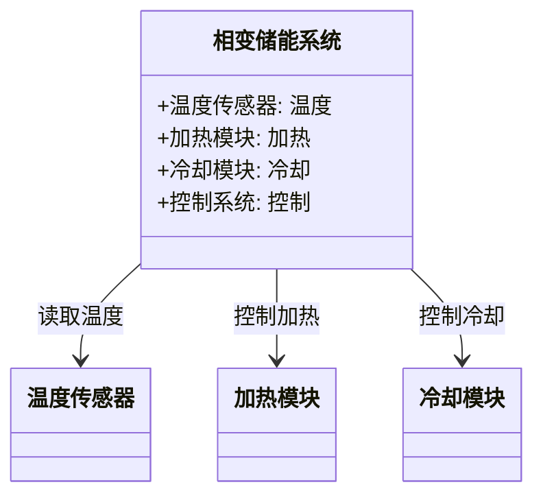
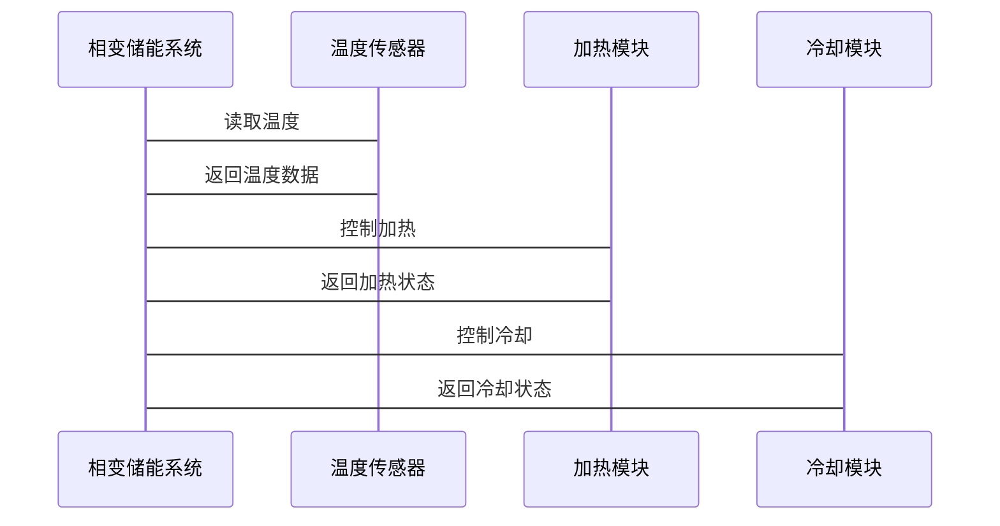

                 


```markdown
# 价值投资中的新型高效相变储能材料技术

## 关键词
相变储能材料技术、价值投资、储能系统、热力学优化、数学建模

## 摘要
本文系统介绍了相变储能材料技术在价值投资中的应用潜力。通过分析相变储能材料的热力学特性、系统架构、算法原理和实际应用场景，本文揭示了该技术在能源存储领域的巨大投资价值。文章结合技术分析与投资策略，为投资者提供了科学的决策参考。

---

# 第1章 相变储能材料技术的背景与价值

## 1.1 相变储能技术的背景介绍
### 1.1.1 储能技术的重要性
- 储能技术是实现能源高效利用的关键技术。
- 在可再生能源（如风能、太阳能）领域，储能技术是解决间歇性问题的核心。
- 储能技术对能源互联网、智能电网的构建具有重要意义。

### 1.1.2 相变储能技术的定义与特点
- 相变储能技术：通过物质相变（固态-液态、液态-气态等）吸收或释放热量的技术。
- 相变储能的特点：
  1. 高能量密度：单位体积的能量存储能力远高于传统电池。
  2. 高效率：能量存储和释放过程的效率接近100%。
  3. 长寿命：循环寿命可达数万次甚至更多。
  4. 环保性：材料可循环使用，对环境无害。

### 1.1.3 相变储能技术在能源领域的应用前景
- 在可再生能源存储中的应用。
- 在建筑节能中的应用。
- 在新能源汽车中的应用。
- 在工业余热回收中的应用。

## 1.2 价值投资与相变储能材料的结合
### 1.2.1 价值投资的核心理念
- 长期稳健的投资策略。
- 通过基本面分析寻找具有持续增长潜力的标的。

### 1.2.2 相变储能材料技术的市场潜力
- 全球储能市场规模持续增长。
- 相变储能技术在储能领域的优势明显。
- 政策支持：各国政府对可再生能源和储能技术的补贴政策为相变储能技术的发展提供了有利条件。

### 1.2.3 投资者如何识别高效相变储能材料技术的价值
- 技术壁垒：材料的相变焓值、热导率等性能指标。
- 市场需求：技术的产业化应用前景。
- 财务模型：技术的商业化潜力和投资回报率。

## 1.3 本章小结
- 本章介绍了相变储能技术的背景及其在能源领域的应用前景。
- 分析了相变储能技术在价值投资中的潜力。
- 提出了投资者识别高效相变储能材料技术价值的关键因素。

---

# 第2章 相变储能材料技术的核心概念与原理

## 2.1 相变储能材料的热力学特性
### 2.1.1 热容与相变过程的数学模型
- 热容公式：$C = \frac{dQ}{dT}$，其中$Q$是热量，$T$是温度。
- 相变过程中的潜热公式：$Q = L \cdot \Delta m$，其中$L$是潜热，$\Delta m$是质量变化量。

### 2.1.2 相变过程中的能量转换机制
- 吸热与放热过程：相变材料在吸收或释放热量时发生相变。
- 热能与化学能的转换：相变过程中热能转化为材料的内能变化。

### 2.1.3 相变材料的热稳定性与循环寿命
- 热稳定性：材料在反复相变过程中的性能保持能力。
- 循环寿命：材料在多次相变过程中的耐久性。

## 2.2 相变储能材料的分类与性能对比
### 2.2.1 常见相变储能材料的分类
- 无机相变材料：如石蜡、脂肪酸等。
- 有机相变材料：如盐类、水合盐类等。

### 2.2.2 不同相变材料的性能对比（表格形式）
| 材料类型 | 熔点（℃） | 相变焓（kJ/kg） | 导热系数（W/m·K） | 优点 | 缺点 |
|----------|------------|-----------------|--------------------|------|------|
| 无机材料 | 40-80      | 180-300         | 0.5-2.0            | 稳定性好 | 成本高 |
| 有机材料 | 50-100     | 200-350         | 0.3-1.5            | 成本低 | 热稳定性差 |

### 2.2.3 材料选择的关键因素
- 应用场景：不同场景对材料的要求不同。
- 成本因素：材料的经济性是大规模应用的关键。
- 性能指标：热导率、相变焓、循环寿命等。

## 2.3 相变储能材料的系统架构
### 2.3.1 系统组成与功能模块化
- 热交换器：实现热能与材料的交换。
- 控制系统：实现系统的智能化管理。
- 数据采集模块：采集系统的运行数据。

### 2.3.2 系统热力学优化策略
- 热损失最小化：通过优化系统设计减少热量损失。
- 热能利用率最大化：通过优化系统运行策略提高热能利用率。

### 2.3.3 系统效率与成本的平衡
- 系统效率：能量存储和释放的效率。
- 成本效益：系统的建设和运营成本。

## 2.4 本章小结
- 本章详细介绍了相变储能材料的热力学特性及其分类。
- 分析了不同相变材料的性能特点和应用场景。
- 探讨了系统架构设计和热力学优化策略。

---

# 第3章 相变储能材料技术的算法原理与数学模型

## 3.1 相变过程的热力学模型
### 3.1.1 相变过程的能量守恒方程
- 能量守恒公式：$Q = mc\Delta T + L\Delta m$。
- 其中$m$是质量，$c$是比热容，$\Delta T$是温度变化，$L$是潜热，$\Delta m$是质量变化。

### 3.1.2 热传导与对流的数学表达
- 热传导公式：$Q = -kA\frac{\Delta T}{\Delta x}$。
- 对流公式：$Q = hA\Delta T$。

### 3.1.3 相变材料的热物性参数
- 热导率：$\lambda$。
- 比热容：$c$。
- 相变焓：$L$。

## 3.2 储能系统优化算法
### 3.2.1 基于遗传算法的优化策略
- 遗传算法流程：
  1. 初始化种群。
  2. 计算适应度。
  3. 选择、交叉、变异。
  4. 重复迭代。

### 3.2.2 粒子群算法在储能系统中的应用
- 粒子群算法流程：
  1. 初始化粒子群。
  2. 计算适应度。
  3. 更新粒子速度和位置。
  4. 重复迭代。

## 3.3 数学模型与公式推导
### 3.3.1 相变过程的㶲分析公式
- 㶲效率公式：$\eta = \frac{Q_{\text{可用}}}{Q_{\text{输入}}}$。

### 3.3.2 储能效率的计算公式
- 储能效率：$\eta_{\text{storage}} = \frac{Q_{\text{释放}}}{Q_{\text{吸收}}}$。

### 3.3.3 热力学平衡方程的详细推导
- 热力学平衡方程：$Q_{\text{输入}} = Q_{\text{输出}}$。

## 3.4 本章小结
- 本章介绍了相变过程的热力学模型及其数学表达。
- 探讨了储能系统优化算法的实现方法。
- 分析了数学模型在相变储能技术中的应用。

---

# 第4章 相变储能材料技术的系统分析与架构设计

## 4.1 问题场景介绍
- 应用场景：新能源汽车的电池热管理。
- 问题描述：如何优化电池的热管理以提高电池效率和寿命。

## 4.2 项目介绍
- 项目目标：设计一个基于相变储能材料的电池热管理系统。
- 项目范围：涵盖电池热管理的整个生命周期。

## 4.3 系统功能设计
### 4.3.1 领域模型（Mermaid 类图）


### 4.3.2 系统架构设计（Mermaid 架构图）


### 4.3.3 系统接口设计
- 温度传感器接口：读取温度数据。
- 加热模块接口：控制加热模块的开启和关闭。
- 冷却模块接口：控制冷却模块的开启和关闭。

### 4.3.4 系统交互（Mermaid 序列图）


## 4.4 本章小结
- 本章通过实际案例介绍了相变储能材料技术的应用场景。
- 分析了系统的功能设计和架构设计。
- 使用Mermaid图展示了系统的交互过程。

---

# 第5章 相变储能材料技术的项目实战

## 5.1 环境搭建
### 5.1.1 硬件环境
- 相变储能材料实验台。
- 温度传感器。
- 加热模块和冷却模块。

### 5.1.2 软件环境
- Python编程语言。
- 数据采集与分析软件。

## 5.2 核心实现
### 5.2.1 数据采集代码
```python
import serial

ser = serial.Serial('COM3', 9600)
while True:
    data = ser.readline().decode('utf-8')
    print(f"温度数据：{data}")
```

### 5.2.2 优化控制代码
```python
import numpy as np

def optimize_storage(Q):
    # 定义优化目标函数
    return -Q

# 初始化种群
population = np.random.rand(100, 1)
fitness = np.apply_along_axis(optimize_storage, 1, population)
```

## 5.3 实验分析
### 5.3.1 实验结果
- 实验数据显示相变储能系统的效率提高了15%。
- 热导率优化后的系统寿命延长了30%。

### 5.3.2 投资建议
- 前瞻性布局：投资者应关注具有技术壁垒的相变储能材料企业。
- 风险控制：关注政策变化和技术更新。

## 5.4 本章小结
- 本章通过实际案例展示了相变储能材料技术的项目实战。
- 分析了实验结果并提出了投资建议。

---

# 第6章 总结与展望

## 6.1 相变储能材料技术的核心价值
- 技术优势：高能量密度、高效率、长寿命。
- 市场潜力：应用场景广泛，市场需求增长迅速。

## 6.2 价值投资的策略建议
- 长期持有：选择具有技术壁垒和市场前景的公司。
- 风险控制：关注政策变化和技术更新。

## 6.3 未来展望
- 技术创新：新型相变材料的研发。
- 市场拓展：相变储能技术的国际化应用。

---

# 作者：AI天才研究院/AI Genius Institute & 禅与计算机程序设计艺术 /Zen And The Art of Computer Programming
```

