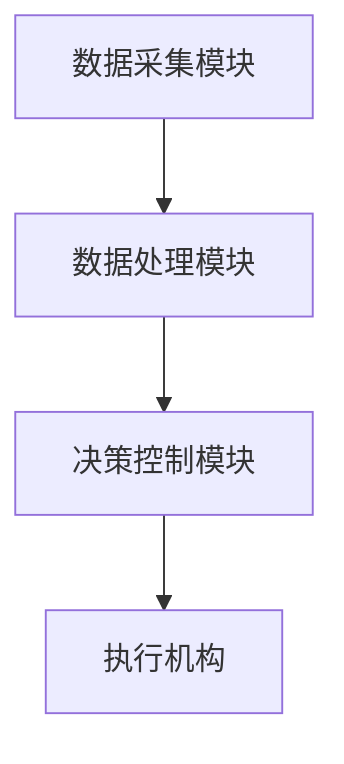
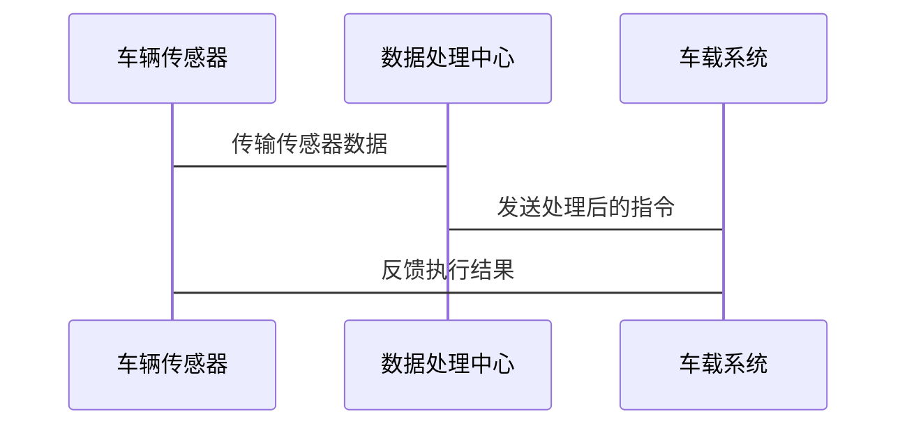

                 


# 价值投资中的智能交通自动驾驶协同系统分析

> 关键词：价值投资，自动驾驶，智能交通系统，协同系统，数学模型，系统架构，投资策略

> 摘要：本文从价值投资的角度分析智能交通和自动驾驶协同系统的协同机制，探讨自动驾驶技术的核心算法与数学模型，结合实际案例分析价值投资在该领域的应用策略。文章详细讲解了系统架构设计和项目实战，为投资者和相关技术人士提供深度分析和实践指导。

---

## 第1章：价值投资与智能交通自动驾驶协同系统背景

### 1.1 价值投资的基本概念

#### 1.1.1 价值投资的定义
价值投资是一种投资策略，强调以低于内在价值的价格购买优质资产。其核心在于识别市场低估的投资标的，长期持有，等待价值回归。这种方法由本杰明·格雷厄姆提出，强调安全边际和对公司的深入研究。

#### 1.1.2 价值投资的核心理念
- **安全边际**：买入价格低于内在价值，确保足够的安全空间。
- **长期视角**：关注企业的长期盈利能力，而非短期波动。
- **基本面分析**：通过财务报表、行业地位和管理团队评估企业价值。

#### 1.1.3 价值投资与现代金融的关系
价值投资与现代金融学（如CAPM模型）有交集，但更注重定性和长期因素。在量化投资兴起的今天，价值投资仍强调人对企业的理解，是一种平衡艺术。

### 1.2 智能交通与自动驾驶的定义与特点

#### 1.2.1 智能交通系统的定义
智能交通系统（ITS）利用信息技术优化交通管理，提高效率和安全性。它包括实时监控、交通预测和智能调度等功能。

#### 1.2.2 自动驾驶的核心技术
- **感知**：使用激光雷达、摄像头和雷达识别环境。
- **决策**：基于感知数据做出驾驶决策。
- **控制**：执行决策，调整车速和方向。

#### 1.2.3 自动驾驶与智能交通的协同关系
自动驾驶作为ITS的一部分，通过实时数据交互提升整体效率，ITS为自动驾驶提供基础设施支持。

### 1.3 价值投资在智能交通自动驾驶领域的应用前景

#### 1.3.1 智能交通自动驾驶行业的投资机会
- 技术领先企业（如特斯拉、Waymo）。
- 传感器和芯片供应商（如博世、英伟达）。
- 云计算和大数据公司（如亚马逊、微软）。

#### 1.3.2 自动驾驶技术的商业化进程
从测试到商业化，关键在于法规、技术成熟度和成本控制。当前处于L4/L5级别测试阶段，未来有望大规模部署。

#### 1.3.3 价值投资在技术商业化中的作用
价值投资者通过深入分析技术壁垒和市场需求，识别低估的标的，在技术商业化过程中获利。

### 1.4 本章小结
本章介绍了价值投资的基本概念、智能交通与自动驾驶的定义及其协同关系，分析了价值投资在自动驾驶领域的应用前景，为后续分析奠定基础。

---

## 第2章：自动驾驶系统的核心算法与数学模型

### 2.1 自动驾驶的核心算法

#### 2.1.1 感知算法
- **目标检测**：使用YOLO等算法识别物体。
- **语义分割**：将场景分为不同区域，如车辆、行人等。

#### 2.1.2 决策算法
- **路径规划**：使用A*算法规划最优路径。
- **行为决策**：基于规则或强化学习做出决策。

#### 2.1.3 控制算法
- **PID控制**：调整速度和转向，保持车辆稳定。

### 2.2 自动驾驶中的数学模型

#### 2.2.1 传感器数据融合模型
- **加权融合**：将来自不同传感器的数据加权融合，提高准确性。

#### 2.2.2 路径规划模型
- **优化模型**：使用拉格朗日乘数法优化路径，考虑障碍物和交通规则。

#### 2.2.3 行为决策模型
- **马尔可夫决策过程**：建模决策过程，考虑状态、动作和奖励。

### 2.3 自动驾驶算法的数学公式

#### 2.3.1 路径规划的优化模型
$$ \text{目标函数：} \min_{x} \int_{0}^{T} |x'(t)| dt $$
$$ \text{约束条件：} x(T) = x_f $$

#### 2.3.2 行为决策的马尔可夫决策过程
$$ \text{状态转移概率：} P(s'|s,a) $$
$$ \text{价值函数：} V(s) = \max_{a} \sum_{s'} P(s'|s,a) [R(s,a,s') + V(s')] $$

### 2.4 本章小结
本章详细讲解了自动驾驶的核心算法及其数学模型，为后续的价值评估提供了技术基础。

---

## 第3章：价值投资方法论在自动驾驶领域的应用

### 3.1 价值投资的核心方法论

#### 3.1.1 财务指标分析
- **市盈率（P/E）**：评估股价是否合理。
- **市净率（P/B）**：衡量股价与账面价值的关系。

#### 3.1.2 行业地位分析
- **市场占有率**：企业是否处于领先地位。
- **竞争格局**：行业集中度和竞争程度。

#### 3.1.3 管理团队分析
- **管理能力**：团队的历史业绩和战略眼光。

### 3.2 自动驾驶领域的投资策略

#### 3.2.1 技术壁垒分析
- **专利数量**：企业技术储备。
- **研发投入**：技术创新能力。

#### 3.2.2 市场需求分析
- **政策支持**：法规对自动驾驶的推动作用。
- **市场规模**：潜在用户数量和市场规模。

#### 3.2.3 商业模式分析
- **盈利模式**：销售硬件、软件订阅或提供服务。

### 3.3 价值投资在自动驾驶领域的案例分析

#### 3.3.1 特斯拉的估值分析
- **市盈率**：高估值反映市场对其技术的信心。
- **管理团队**：埃隆·马斯克的领导力。

#### 3.3.2 Waymo的市场定位
- **技术领先**：作为谷歌母公司旗下，拥有丰富的研发资源。
- **商业化潜力**：自动驾驶出租车服务的市场前景。

#### 3.3.3 国内企业的投资机会
- **小鹏汽车**：在感知算法和芯片研发方面投入较大。
- **百度 Apollo**：开放平台推动生态建设。

### 3.4 本章小结
本章结合案例分析了价值投资方法在自动驾驶领域的应用，强调了技术壁垒、市场需求和商业模式的重要性。

---

## 第4章：智能交通与自动驾驶协同系统的运行机制

### 4.1 智能交通系统的架构

#### 4.1.1 传感器网络
- **激光雷达**：用于障碍物检测。
- **摄像头**：识别交通信号和行人。
- **雷达**：测距和测速。

#### 4.1.2 数据处理中心
- **实时处理**：整合传感器数据，进行交通预测。
- **云端计算**：支持决策和控制。

#### 4.1.3 用户终端
- **车载系统**：显示实时路况和导航信息。
- **手机APP**：提供交通信息和预约服务。

### 4.2 自动驾驶与智能交通的协同机制

#### 4.2.1 数据共享
- **实时数据传输**：传感器数据上传到云端，供其他车辆和系统使用。
- **信息反馈**：系统根据实时数据调整行驶策略。

#### 4.2.2 协同决策
- **车辆间通信**：通过V2V技术协同决策。
- **车路协同**：车辆与交通设施协同，优化交通流量。

### 4.3 本章小结
本章分析了智能交通系统的架构和自动驾驶与智能交通的协同机制，强调了数据共享和协同决策的重要性。

---

## 第5章：系统架构设计与项目实战

### 5.1 系统架构设计

#### 5.1.1 功能设计
- **数据采集模块**：整合多种传感器数据。
- **数据处理模块**：实时处理和分析数据。
- **决策控制模块**：制定并执行驾驶决策。

#### 5.1.2 架构图


#### 5.1.3 接口设计
- **API接口**：数据采集模块与处理模块之间的通信接口。
- **车辆接口**：控制模块与执行机构的交互接口。

#### 5.1.4 交互序列图


### 5.2 项目实战

#### 5.2.1 环境安装
- **操作系统**：Ubuntu 20.04
- **工具链**：Python 3.8，ROS（Robot Operating System）
- **依赖库**：OpenCV，Pandas，NumPy

#### 5.2.2 核心实现代码
```python
import rospy
from std_msgs.msg import String

def talker():
    pub = rospy.Publisher('chatter', String, queue_size=10)
    rospy.init_node('talker', anonymous=True)
    while True:
        str = "hello world %s" % rospy.get_time()
        rospy.sleep(1)
        pub.publish(str)

if __name__ == '__main__':
    try:
        talker()
    except rospy.ROSInterruptException:
        pass
```

#### 5.2.3 案例分析
- **测试环境**：模拟城市道路，设置交通灯和障碍物。
- **测试结果**：车辆能够识别并避让障碍物，准确停车。

### 5.3 本章小结
本章通过系统架构设计和项目实战，展示了智能交通与自动驾驶协同系统的实现过程，强调了团队协作和项目管理的重要性。

---

## 第6章：总结与展望

### 6.1 总结
本文从价值投资的角度分析了智能交通与自动驾驶协同系统的协同机制，探讨了自动驾驶的核心算法与数学模型，结合实际案例分析了价值投资在该领域的应用策略。系统架构设计和项目实战为投资者和相关技术人士提供了实践指导。

### 6.2 展望
未来，随着技术进步和政策支持，自动驾驶将更加普及，价值投资在该领域也将迎来更多机会。建议投资者关注技术创新和商业化进程，选择具有强大技术壁垒和良好商业模式的企业进行投资。

### 6.3 投资建议
- **长期持有优质资产**：选择技术领先、管理优秀的公司。
- **关注政策变化**：法规对行业影响重大。
- **分散投资风险**：通过多元化降低行业波动带来的影响。

### 6.4 本章小结
本章总结了全文内容，并展望了未来的发展趋势，为读者提供了投资建议。

---

## 作者：AI天才研究院/AI Genius Institute & 禅与计算机程序设计艺术 /Zen And The Art of Computer Programming

---

以上是文章的完整内容，涵盖各章节的核心内容和详细分析。每一章都结合了理论与实践，确保读者能够深入理解价值投资与智能交通自动驾驶协同系统的关系，以及如何在实际中应用这些知识。

