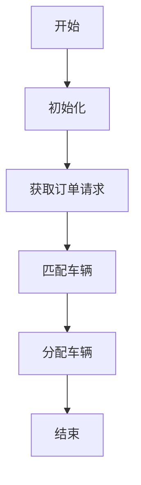
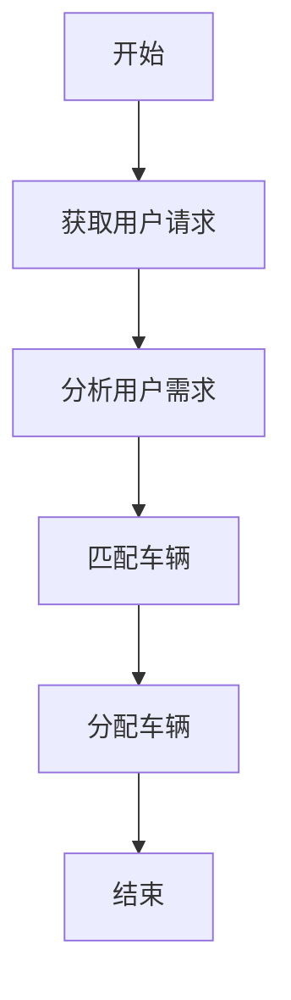
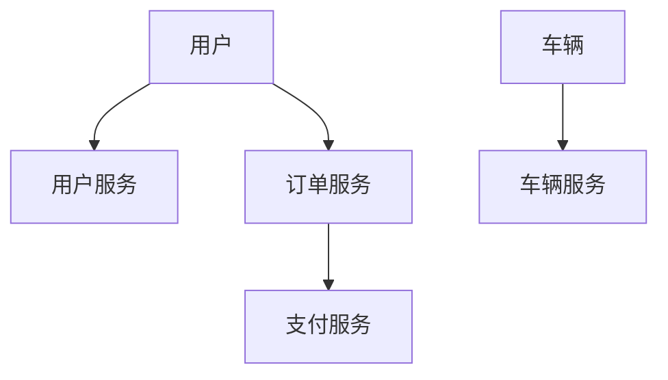
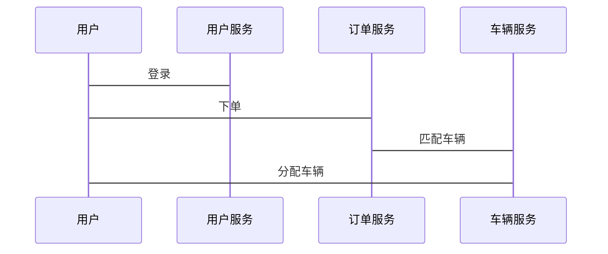

                 


# 价值投资中的智能交通车辆共享系统分析

---

## 关键词：
价值投资、智能交通、车辆共享系统、算法原理、系统架构、项目实战

---

## 摘要：
智能交通车辆共享系统是一种基于互联网和人工智能技术的新兴出行方式，通过共享经济模式和智能化管理，为用户提供便捷、高效的交通服务。本文从价值投资的角度，深入分析智能交通车辆共享系统的背景、核心概念、算法原理、系统架构、项目实战等方面，揭示其技术本质和投资价值。

---

# 第一章: 智能交通车辆共享系统的背景与价值

## 1.1 价值投资与智能交通的结合
### 1.1.1 价值投资的基本概念
价值投资是一种长期投资策略，强调通过深入分析企业的基本面，寻找具有长期增长潜力和合理估值的企业进行投资。在智能交通领域，价值投资的核心在于识别那些能够持续创造价值的企业，关注其商业模式、技术创新和市场竞争力。

### 1.1.2 智能交通的发展现状
智能交通系统（ITS）通过物联网、大数据、人工智能等技术，实现交通管理的智能化和高效化。共享经济的兴起进一步推动了智能交通的发展，车辆共享系统作为智能交通的重要组成部分，已经成为城市交通优化的重要工具。

### 1.1.3 车辆共享系统的市场潜力
随着城市化进程的加快和环保意识的增强，共享经济模式在交通领域的应用越来越广泛。车辆共享系统通过优化资源配置，降低用户出行成本，提升城市交通效率，具有巨大的市场潜力。

## 1.2 智能交通车辆共享系统的定义与特点
### 1.2.1 系统的基本定义
智能交通车辆共享系统是一种基于互联网的共享经济模式，用户可以通过手机APP或其他在线平台，随时预订和使用共享车辆（如共享单车、共享汽车等），并按使用时间付费。

### 1.2.2 系统的核心特点
1. **灵活性**：用户可以根据需求随时预订和使用车辆，无需长期拥有。
2. **高效性**：通过智能算法优化车辆调度和用户匹配，提高资源利用率。
3. **便捷性**：用户可以通过手机APP完成预订、支付、解锁等操作，无需与传统租车方式复杂的流程。

### 1.2.3 与传统交通方式的区别
| 特性       | 传统交通方式         | 智能交通车辆共享系统 |
|------------|----------------------|-----------------------|
| 资源利用    | 低效，资源浪费       | 高效，按需分配         |
| 用户体验    | 复杂，费用高         | 简单，按需付费         |
| 技术依赖    | 依赖人工调度         | 依赖智能算法           |

## 1.3 价值投资中的关键问题
### 1.3.1 问题背景分析
智能交通车辆共享系统的快速发展带来了巨大的市场机会，但也面临诸多挑战，如市场竞争激烈、运营成本高、用户需求多样化等。

### 1.3.2 问题描述与解决思路
1. **市场竞争**：如何在激烈的市场竞争中找到具有差异化优势的企业。
2. **运营成本**：如何通过技术创新降低运营成本，提高利润率。
3. **用户需求**：如何通过数据分析满足用户多样化的需求，提升用户粘性。

### 1.3.3 系统的边界与外延
智能交通车辆共享系统的边界包括用户端、车辆端和平台端，外延则涉及支付系统、交通管理系统、法律政策等外部因素。

## 1.4 本章小结
本章从价值投资的角度，分析了智能交通车辆共享系统的背景、定义和特点，并探讨了其在价值投资中的关键问题和挑战。

---

# 第二章: 智能交通车辆共享系统的核心概念与联系

## 2.1 系统核心要素
### 2.1.1 用户需求分析
用户需求是智能交通车辆共享系统的核心，包括便利性、经济性、安全性等。用户可能需要实时车辆位置、快速响应、灵活支付等功能。

### 2.1.2 车辆资源管理
车辆资源管理是系统的重要组成部分，包括车辆调度、车辆状态监控、车辆维护等。通过智能算法优化车辆分布，减少空驶率，提高资源利用率。

### 2.1.3 订单与支付流程
订单与支付流程是用户使用共享车辆的全过程，包括下单、车辆分配、使用、支付等环节。系统需要确保订单处理的高效性和支付的安全性。

## 2.2 系统核心概念的联系
### 2.2.1 用户、车辆、订单的实体关系
用户通过订单使用车辆，订单连接了用户和车辆。系统需要通过智能算法匹配用户和车辆，确保订单的高效处理。

### 2.2.2 系统功能模块的交互关系
系统功能模块包括用户管理、车辆管理、订单管理、支付管理等，各模块之间通过数据交互实现系统的整体运行。

### 2.2.3 核心概念的属性特征对比表格
| 实体       | 属性               | 特征对比             |
|------------|--------------------|----------------------|
| 用户       | 用户ID、用户名、密码 | 唯一性、安全性       |
| 车辆       | 车辆ID、车牌号、车型 | 唯一性、可调度性     |
| 订单       | 订单ID、开始时间、结束时间 | 时间性、关联性     |

## 2.3 ER实体关系图
```mermaid
erDiagram
    actor 用户 {
        +string 用户ID
        +string 用户名
        +string 密码
    }
    actor 车辆 {
        +string 车辆ID
        +string 车牌号
        +string 车型
    }
    actor 订单 {
        +string 订单ID
        +datetime 开始时间
        +datetime 结束时间
    }
    用户 --> 订单 : 下单
    车辆 --> 订单 : 分配车辆
```

## 2.4 本章小结
本章通过分析智能交通车辆共享系统的核心概念，揭示了用户、车辆、订单之间的关系，并通过ER图展示了系统的实体关系。

---

# 第三章: 智能交通车辆共享系统的算法原理

## 3.1 车辆调度算法
### 3.1.1 算法原理
车辆调度算法通过优化车辆的分布和调度，减少空驶率，提高资源利用率。常用算法包括贪心算法、动态规划算法等。

### 3.1.2 算法流程图


### 3.1.3 数学模型与公式
$$ \text{调度优化目标} = \min \sum_{i=1}^{n} c_i x_i $$
其中，$c_i$ 是车辆 $i$ 的调度成本，$x_i$ 是调度变量。

## 3.2 用户需求匹配算法
### 3.2.1 算法原理
用户需求匹配算法通过分析用户的位置、时间、车辆类型等信息，匹配最合适的车辆。常用算法包括最近邻算法、匈牙利算法等。

### 3.2.2 算法流程图


### 3.2.3 数学模型与公式
$$ \text{匹配优化目标} = \min \sum_{j=1}^{m} d_j y_j $$
其中，$d_j$ 是用户 $j$ 的需求距离，$y_j$ 是匹配变量。

## 3.3 本章小结
本章详细分析了智能交通车辆共享系统的车辆调度算法和用户需求匹配算法，并通过数学模型和流程图展示了算法的实现过程。

---

# 第四章: 智能交通车辆共享系统的系统分析与架构设计

## 4.1 系统功能设计
### 4.1.1 用户管理模块
用户管理模块包括用户注册、登录、信息修改等功能。

### 4.1.2 车辆管理模块
车辆管理模块包括车辆信息管理、车辆状态监控、车辆维护等功能。

### 4.1.3 订单管理模块
订单管理模块包括订单处理、订单查询、订单统计等功能。

## 4.2 系统架构设计
### 4.2.1 微服务架构
系统采用微服务架构，包括用户服务、车辆服务、订单服务、支付服务等。

### 4.2.2 系统架构图


## 4.3 系统接口设计
### 4.3.1 API接口设计
系统提供RESTful API接口，包括用户接口、车辆接口、订单接口等。

### 4.3.2 接口交互流程
用户通过API接口与系统进行交互，完成订单处理、车辆分配等操作。

## 4.4 系统交互流程
### 4.4.1 序列图


## 4.5 本章小结
本章通过系统功能设计和架构设计，展示了智能交通车辆共享系统的整体结构和交互流程。

---

# 第五章: 智能交通车辆共享系统的项目实战

## 5.1 项目背景与目标
### 5.1.1 项目背景
本项目旨在开发一个智能交通车辆共享系统，实现用户下单、车辆分配、订单处理等功能。

### 5.1.2 项目目标
通过开发一个智能交通车辆共享系统，验证系统的可行性、实用性和可扩展性。

## 5.2 系统核心实现
### 5.2.1 环境安装
系统开发环境包括Python、Django框架、MySQL数据库等。

### 5.2.2 核心代码实现
```python
# 用户管理模块
class User:
    def __init__(self, user_id, username, password):
        self.user_id = user_id
        self.username = username
        self.password = password

    def login(self):
        # 登录验证
        pass
```

### 5.2.3 代码应用解读
系统核心代码包括用户管理、车辆管理、订单管理等功能模块，通过Python和Django框架实现。

## 5.3 实际案例分析
### 5.3.1 案例背景
以某城市共享单车系统为例，分析系统的实际运行情况。

### 5.3.2 案例分析
通过数据分析，优化车辆调度算法，提高车辆使用效率。

## 5.4 项目小结
本章通过项目实战，展示了智能交通车辆共享系统的开发过程和实际应用。

---

# 第六章: 智能交通车辆共享系统的总结与展望

## 6.1 本章总结
智能交通车辆共享系统是一种基于互联网和人工智能技术的新兴出行方式，通过共享经济模式和智能化管理，为用户提供便捷、高效的交通服务。

## 6.2 未来展望
随着技术的不断进步，智能交通车辆共享系统将更加智能化、个性化和高效化。未来的发展方向包括人工智能技术的深入应用、5G通信技术的普及、区块链技术的安全保障等。

## 6.3 投资建议
从价值投资的角度来看，智能交通车辆共享系统具有巨大的市场潜力和技术优势，建议投资者关注具有技术创新和市场竞争力的企业。

---

# 作者：AI天才研究院/AI Genius Institute & 禅与计算机程序设计艺术 /Zen And The Art of Computer Programming

