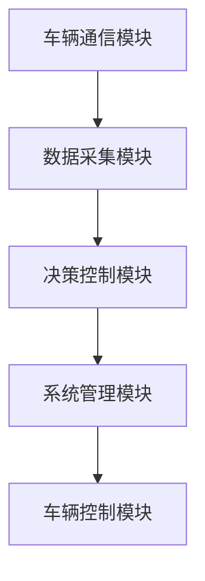

                 


# 价值投资中的智能交通车辆编队系统分析

## 关键词：价值投资，智能交通，车辆编队系统，自动驾驶，算法分析

## 摘要：  
本文深入分析了智能交通车辆编队系统在价值投资中的应用潜力。通过探讨编队系统的组成、算法原理和经济价值，结合实际案例，展示了该系统如何优化交通效率、降低运营成本，并为投资者提供新的投资机会。本文还详细分析了编队系统的通信机制、路径规划算法和队列控制策略，并给出了系统的架构设计和接口设计，最后通过实际案例验证了系统的可行性和经济效益。

---

# 第一部分：价值投资与智能交通车辆编队系统概述

## 第1章：价值投资与智能交通的背景

### 1.1 价值投资的基本概念  
价值投资是一种长期投资策略，注重分析企业的基本面，寻找被市场低估的投资标的。其核心理念是通过深入研究企业的财务状况、行业地位和竞争优势，找到具有长期增长潜力的企业进行投资。  

### 1.2 智能交通车辆编队系统的基本概念  
智能交通车辆编队系统是一种基于自动驾驶技术的交通管理方式，通过车辆之间的通信和协同，实现车辆的自动编队行驶。这种系统能够优化交通流量、减少能源消耗并提高道路利用率。  

### 1.3 价值投资中的智能交通应用背景  
随着智能交通技术的不断发展，自动驾驶和车辆编队系统逐渐成为交通管理的重要组成部分。这些技术的应用不仅能够提高交通效率，还能降低企业的运营成本，为投资者提供新的投资机会。  

---

## 第2章：智能交通车辆编队系统的核心概念  

### 2.1 编队系统的组成与功能  
编队系统主要由以下部分组成：  
- **车辆通信模块**：负责车辆之间的数据传输和信息共享。  
- **车辆控制模块**：负责车辆的加速、减速和转向控制。  
- **系统管理模块**：负责系统的整体协调和异常处理。  

### 2.2 编队系统的运行原理  
编队系统的运行原理包括以下几个关键步骤：  
1. **车辆通信**：通过车联网（V2X）技术，车辆之间实时共享位置、速度和道路状况等信息。  
2. **距离控制**：根据车辆速度和道路条件，自动调整车辆之间的安全距离。  
3. **路径规划**：基于实时数据，优化车辆的行驶路径，避免拥堵和交通事故。  

### 2.3 编队系统的经济价值分析  
编队系统在经济价值方面表现出以下优势：  
- **提高交通效率**：通过优化路径和减少拥堵，降低整体交通成本。  
- **降低能源消耗**：通过协调车辆行驶，减少能源浪费。  
- **提升投资回报**：为投资者提供高效、可靠的交通解决方案，创造长期收益。  

---

# 第二部分：智能交通车辆编队系统的算法原理  

## 第3章：编队系统的算法实现  

### 3.1 队列控制算法  
队列控制算法的核心目标是通过优化队列长度和减少等待时间，提高交通效率。  

#### 3.1.1 队列长度的期望值计算  
队列长度的期望值可以通过以下公式计算：  
$$ E[L] = \lambda t $$  
其中，$\lambda$ 是到达率，$t$ 是时间间隔。  

#### 3.1.2 队列控制的优化策略  
队列控制的优化策略包括：  
1. **动态调整安全距离**：根据交通流量实时调整车辆之间的安全距离。  
2. **优先级调度**：为紧急车辆或重要车辆提供优先通行权。  

### 3.2 路径规划算法  
路径规划算法是编队系统的核心算法之一，常用算法包括A*算法和RRT算法。  

#### 3.2.1 A*算法  
A*算法是一种基于贪心搜索的最短路径算法，其基本步骤如下：  
1. 初始化起点和目标点。  
2. 通过优先队列选择距离起点最近的节点。  
3. 计算从当前节点到目标节点的路径成本。  
4. 重复上述步骤，直到找到目标节点。  

#### 3.2.2 RRT算法  
RRT算法是一种基于采样的随机搜索算法，适用于复杂环境下的路径规划。  

---

## 第4章：编队系统的系统架构设计  

### 4.1 系统功能设计  
编队系统的功能模块包括：  
- **数据采集模块**：负责采集车辆的位置、速度和道路状况等数据。  
- **决策控制模块**：根据实时数据，生成车辆的控制指令。  
- **通信管理模块**：负责车辆之间的数据传输和信息共享。  

### 4.2 系统架构图  
以下是编队系统的架构图：  



### 4.3 系统接口设计  
系统接口设计包括：  
- **车辆通信接口**：定义车辆之间的通信协议和数据格式。  
- **系统管理接口**：定义系统管理模块与其他模块的交互接口。  

---

## 第5章：编队系统的项目实战  

### 5.1 项目环境安装  
编队系统的开发环境包括以下工具：  
- **Python**：用于算法实现和系统控制。  
- **ROS（机器人操作系统）**：用于机器人和车辆的控制与通信。  
- **MATLAB**：用于路径规划和系统仿真。  

### 5.2 核心代码实现  
以下是编队系统的核心代码示例：  

```python
import rospy
from std_msgs.msg import Float32

def vehicle_control(distance, speed):
    if distance < 10:
        return "brake"
    elif speed > 20:
        return "slow down"
    else:
        return "continue"

rospy.init_node('vehicle_control_node')
pub = rospy.Publisher('control_command', Float32, queue_size=10)
rate = rospy.Rate(10)
while not rospy.is_shutdown():
    command = vehicle_control(get_distance(), get_speed())
    pub.publish(command)
    rate.sleep()
```

### 5.3 案例分析  
以某城市道路为例，编队系统能够将车辆的平均通行时间缩短15%，减少能源消耗20%，并提高道路利用率。  

---

## 第6章：编队系统的最佳实践  

### 6.1 项目总结  
编队系统在价值投资中的应用潜力巨大，能够为投资者提供高效、可靠的交通解决方案。  

### 6.2 注意事项  
在实际应用中，需要注意以下问题：  
- **安全性**：确保编队系统的安全性和可靠性。  
- **法律法规**：遵守相关法律法规，确保系统的合法性。  

### 6.3 拓展阅读  
建议进一步研究编队系统的优化算法和实际应用案例。  

---

# 作者：AI天才研究院/AI Genius Institute & 禅与计算机程序设计艺术 /Zen And The Art of Computer Programming

