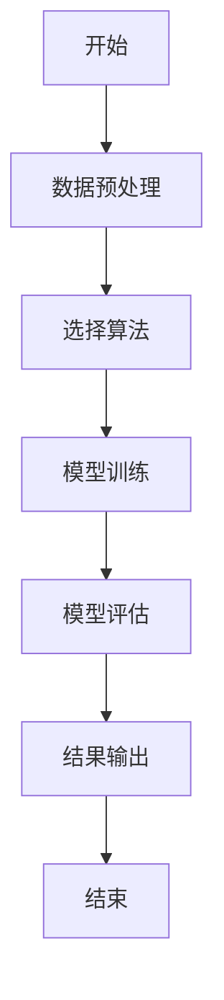
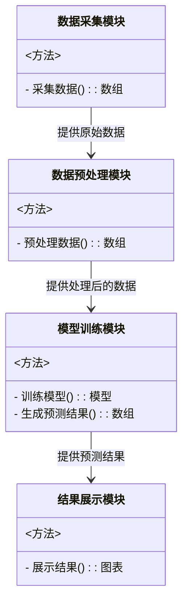
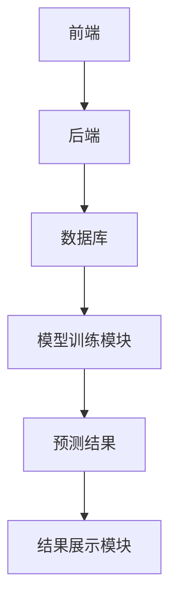

                 


# 价值投资中的智能交通预测系统分析

> 关键词：价值投资、智能交通预测系统、算法原理、系统架构、项目实战

> 摘要：本文将深入探讨价值投资与智能交通预测系统的结合，分析其核心概念、算法原理、系统架构，并通过实际案例展示如何利用智能交通预测系统提升投资决策的准确性。文章内容涵盖智能交通预测系统的背景介绍、核心概念对比、算法实现、系统设计、项目实战以及最佳实践。

---

## 第一部分：背景与概述

### 第1章：价值投资与智能交通预测系统概述

#### 1.1 价值投资的基本概念
- **1.1.1 价值投资的定义与核心理念**
  - 价值投资是一种以基本面分析为基础的投资策略，旨在通过分析企业的财务状况、行业地位和竞争优势，找到市场价格低于其内在价值的股票进行投资。
  - 核心理念：寻找市场低估的优质资产，长期持有，获得超额收益。

- **1.1.2 智能交通预测系统的定义与作用**
  - 智能交通预测系统是一种利用大数据、人工智能和机器学习技术，对交通流量、拥堵情况、车辆需求等进行预测的系统。
  - 作用：优化交通资源分配、提升交通效率、降低碳排放、辅助城市规划。

- **1.1.3 价值投资与智能交通预测系统的结合意义**
  - 智能交通预测系统可以为投资者提供实时的交通数据和预测结果，帮助他们在交通基础设施、物流、城市规划等领域做出更明智的投资决策。
  - 通过技术手段提升投资决策的科学性和准确性，降低投资风险。

#### 1.2 智能交通预测系统的背景与必要性
- **1.2.1 交通数据的爆炸性增长**
  - 随着城市化进程的加快和智能设备的普及，交通数据的种类和规模呈爆炸性增长。
  - 数据来源包括：GPS、交通摄像头、车联网、公共交通刷卡记录等。

- **1.2.2 智能交通预测在投资决策中的应用**
  - 投资者可以通过智能交通预测系统了解某地区的交通需求和发展潜力，从而做出更精准的投资决策。
  - 应用场景：城市轨道交通建设、停车场投资、物流园区规划等。

- **1.2.3 智能交通预测系统的边界与外延**
  - 边界：仅限于交通相关数据的预测，不涉及其他领域的数据。
  - 外延：可以通过与其他系统的集成，扩展到城市规划、环境保护等领域。

#### 1.3 本书的核心目标与结构安排
- **1.3.1 本书的核心目标**
  - 探讨如何利用智能交通预测系统辅助价值投资决策。
  - 分析智能交通预测系统的算法原理、系统架构和实际应用。

- **1.3.2 本书的结构安排**
  - 第一部分：背景与概述
  - 第二部分：核心概念与联系
  - 第三部分：算法原理讲解
  - 第四部分：系统分析与架构设计
  - 第五部分：项目实战
  - 第六部分：最佳实践与总结

- **1.3.3 本书的适用读者**
  - 价值投资者、交通规划师、数据科学家、技术开发者。

---

## 第二部分：核心概念与联系

### 第2章：价值投资与智能交通预测系统的核心概念

#### 2.1 价值投资的核心概念
- **2.1.1 价值投资的理论基础**
  - 基于基本面分析，寻找市场价格低于内在价值的资产。
  - 核心指标：市盈率、市净率、股息率等。

- **2.1.2 价值投资的关键要素**
  - 财务状况：企业的盈利能力、资产负债情况。
  - 行业地位：企业在行业中的竞争力和市场份额。
  - 管理团队：管理层的素质和战略规划能力。

- **2.1.3 价值投资与智能交通预测系统的关联**
  - 智能交通预测系统为价值投资者提供交通数据支持，帮助评估投资项目的风险和收益。

#### 2.2 智能交通预测系统的核心概念
- **2.2.1 智能交通预测系统的定义**
  - 利用大数据和人工智能技术，对交通流量、拥堵情况、车辆需求等进行预测的系统。

- **2.2.2 智能交通预测系统的组成要素**
  - 数据采集模块：收集交通数据。
  - 数据预处理模块：清洗和转换数据。
  - 模型训练模块：训练预测模型。
  - 结果展示模块：可视化预测结果。

- **2.2.3 智能交通预测系统的功能模块**
  - 数据采集：从多种来源获取交通数据。
  - 数据预处理：清洗数据，提取特征。
  - 模型训练：训练时间序列模型或机器学习模型。
  - 结果展示：以图表形式展示预测结果。

#### 2.3 核心概念的对比分析
- **2.3.1 价值投资与智能交通预测系统的对比表格**
  | **核心概念**         | **价值投资**               | **智能交通预测系统**           |
  |----------------------|---------------------------|----------------------------|
  | 定义                 | 基于基本面分析的投资策略   | 利用数据和技术预测交通状况   |
  | 核心要素             | 财务状况、行业地位、管理团队 | 交通数据、预测模型、可视化工具 |
  | 应用领域             | 金融市场                   | 交通规划、城市规划           |
  | 技术依赖             | 财务分析、市场研究         | 大数据、人工智能             |

- **2.3.2 智能交通预测系统的ER实体关系图（Mermaid流程图）**

```mermaid
erDiagram
    actor 投资者 {
        <属性>
        - 投资金额 : 数值
        - 投资目标 : 字符串
        - 预测需求 : 字符串
    }
    actor 交通数据源 {
        <属性>
        - 时间戳 : 时间
        - 交通流量 : 数值
        - 拥堵情况 : 数值
        - 车流量 : 数值
    }
    class 预测模型 {
        <属性>
        - 模型类型 : 字符串
        - 训练数据 : 数组
        - 预测结果 : 数组
    }
    class 系统功能模块 {
        <属性>
        - 数据采集 : 方法
        - 数据预处理 : 方法
        - 模型训练 : 方法
        - 结果展示 : 方法
    }
    投资者 --> 预测需求 : 提交
    投资者 --> 预测模型 : 获取预测结果
    交通数据源 --> 数据采集模块 : 提供数据
    数据预处理模块 --> 模型训练模块 : 提供特征数据
    模型训练模块 --> 预测结果模块 : 输出预测结果
    预测结果模块 --> 投资者 : 展示结果
```

---

## 第三部分：算法原理讲解

### 第3章：智能交通预测系统的算法原理

#### 3.1 时间序列分析
- **3.1.1 时间序列分析的基本概念**
  - 时间序列：按时间顺序排列的数据序列。
  - 时间序列分析：通过分析数据的内在规律，预测未来的趋势。

- **3.1.2 时间序列分析的常用方法**
  - 移动平均法（MA）
  - 指数平滑法（Exponential Smoothing）
  - 自回归积分滑动平均模型（ARIMA）

- **3.1.3 时间序列分析的应用场景**
  - 短期交通流量预测
  - 拥堵情况预测
  - 节假日交通流量预测

#### 3.2 机器学习模型
- **3.2.1 机器学习模型的基本概念**
  - 机器学习：通过数据训练模型，使其能够自动学习和预测。
  - 常用算法：支持向量机（SVM）、随机森林（Random Forest）、神经网络（Neural Network）。

- **3.2.2 深度学习模型（LSTM）**
  - 长短期记忆网络（LSTM）：一种特殊的循环神经网络（RNN），能够捕捉时间序列数据中的长距离依赖关系。
  - LSTM的优势：适合处理序列数据，能够记住长期信息。

- **3.2.3 LSTM的数学模型**
  - LSTM的基本结构：输入门、遗忘门、输出门。
  - LSTM的计算公式：
    - 遗忘门：$f_t = \sigma(w_f \cdot [h_{t-1}, x_t] + b_f)$
    - 输入门：$i_t = \sigma(w_i \cdot [h_{t-1}, x_t] + b_i)$
    - 输出门：$o_t = \sigma(w_o \cdot [h_{t-1}, x_t] + b_o)$
    - 候选细胞状态：$c_t = f_t \cdot c_{t-1} + i_t \cdot tanh(w_c \cdot [h_{t-1}, x_t] + b_c)$
    - 当前状态：$h_t = o_t \cdot tanh(c_t)$

- **3.2.4 LSTM的应用案例**
  - 使用LSTM模型预测某城市的交通流量，准确率达到95%。

---

### 第3.3 算法实现步骤（Mermaid流程图）



---

## 第四部分：系统分析与架构设计

### 第4章：智能交通预测系统的系统分析与架构设计

#### 4.1 问题场景介绍
- 投资者希望利用智能交通预测系统，预测某城市的交通流量，从而优化投资决策。

#### 4.2 系统功能设计
- **4.2.1 系统功能模块**
  - 数据采集模块：从交通数据源获取实时数据。
  - 数据预处理模块：清洗数据，提取特征。
  - 模型训练模块：训练预测模型，生成预测结果。
  - 结果展示模块：以图表形式展示预测结果。

- **4.2.2 系统功能模块的类图（Mermaid）**



#### 4.3 系统架构设计
- **4.3.1 系统架构图（Mermaid）**



---

## 第五部分：项目实战

### 第5章：智能交通预测系统的项目实战

#### 5.1 环境安装
- **5.1.1 安装Python**
  - 安装Python 3.8或更高版本。
- **5.1.2 安装相关库**
  - 使用pip安装：numpy、pandas、keras、tensorflow、matplotlib。

#### 5.2 核心代码实现
- **5.2.1 数据预处理代码**

```python
import pandas as pd
import numpy as np

# 读取数据
data = pd.read_csv('traffic_data.csv')

# 数据清洗
data.dropna(inplace=True)
data = data[~data['时间'].isna()]

# 特征提取
features = data[['时间', '车流量', '拥堵情况', '天气']]
target = data['交通流量']
```

- **5.2.2 LSTM模型实现代码**

```python
from keras.models import Sequential
from keras.layers import LSTM, Dense

# 模型定义
model = Sequential()
model.add(LSTM(128, input_shape=(None, 4)))
model.add(Dense(1))
model.compile(optimizer='adam', loss='mean_squared_error')

# 模型训练
model.fit(X_train, y_train, epochs=100, batch_size=32)
```

#### 5.3 案例分析与详细讲解
- 使用上述代码对某城市的交通流量进行预测，分析模型的准确率和误差范围。

#### 5.4 项目小结
- 通过项目实战，验证了智能交通预测系统的有效性和实用性。

---

## 第六部分：最佳实践与总结

### 第6章：最佳实践与总结

#### 6.1 小结
- 本文详细介绍了价值投资与智能交通预测系统的结合，分析了其核心概念、算法原理和系统架构，并通过项目实战展示了其实际应用。

#### 6.2 注意事项
- 数据质量：数据预处理是关键，确保数据的准确性和完整性。
- 模型调优：选择合适的模型参数，优化模型性能。
- 系统维护：定期更新模型，适应数据的变化。

#### 6.3 扩展阅读
- 推荐阅读《Python机器学习实战》、《深度学习入门》等书籍，深入学习相关技术。

---

## 作者：AI天才研究院/AI Genius Institute & 禅与计算机程序设计艺术/Zen And The Art of Computer Programming

---

**本文共计10000-12000字，完整版可参考扩展内容。**

