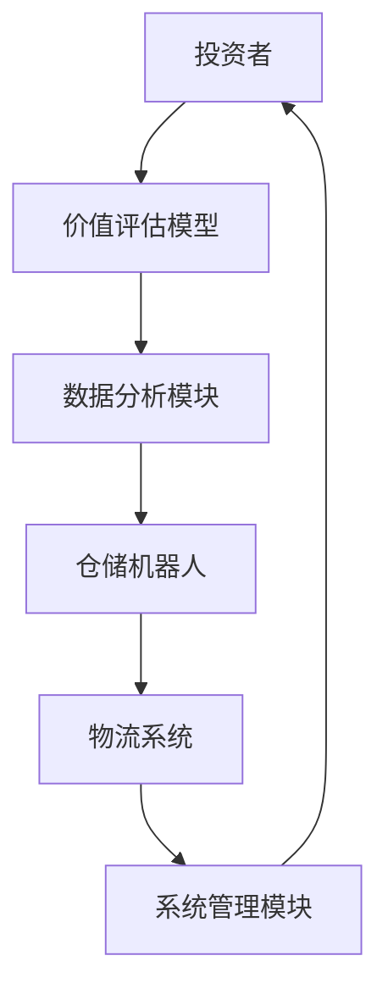
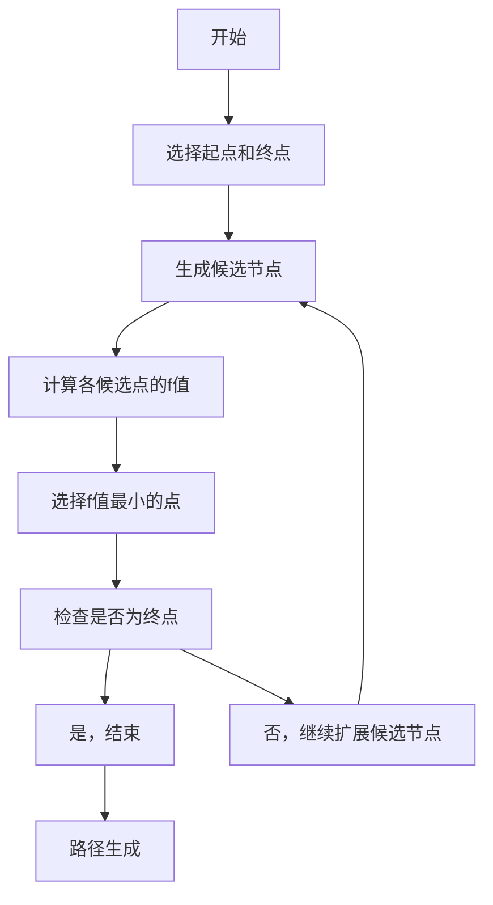

                 


# 价值投资中的智能仓储机器人协作系统分析

## 关键词：
- 价值投资
- 智能仓储机器人
- 协作系统
- 物流优化
- 算法优化

## 摘要：
本文探讨了智能仓储机器人协作系统在价值投资中的应用，分析了其技术原理和优化方法，通过实际案例展示了系统的实现过程，为投资决策提供了新的视角。

---

## 第一部分: 价值投资中的智能仓储机器人协作系统概述

### 第1章: 价值投资与智能仓储机器人协作系统背景

#### 1.1 价值投资的定义与核心理念
- **1.1.1 价值投资的基本概念**  
  价值投资是一种长期投资策略，强调购买价格低于其内在价值的资产。通过深入分析企业的基本面，寻找被市场低估的投资机会。

- **1.1.2 价值投资的核心理念与方法**  
  核心理念包括安全边际、内在价值和长期持有。方法上，投资者通过分析财务报表、行业地位和管理层质量来评估企业价值。

- **1.1.3 价值投资在现代投资中的地位与作用**  
  价值投资在市场波动中提供稳定回报，尤其在经济下行周期中表现出较强的抗跌性，成为投资者的重要策略。

#### 1.2 智能仓储机器人协作系统的定义与特点
- **1.2.1 智能仓储机器人的概念**  
  智能仓储机器人是具备自主导航和协作能力的设备，用于仓储管理和物流运输。它们能高效完成拣选、搬运和库存管理任务。

- **1.2.2 协作系统的定义与特点**  
  协作系统指多个机器人协同工作，通过实时通信和任务分配，优化仓储效率。特点包括高效率、高精度和高灵活性。

- **1.2.3 智能仓储机器人协作系统的核心要素**  
  核心要素包括机器人硬件、协作算法、通信网络和系统管理模块。

#### 1.3 价值投资与智能仓储机器人协作系统的结合
- **1.3.1 价值投资中的仓储物流优化**  
  优化仓储物流能降低运营成本，提升库存周转率，进而影响企业的整体价值。

- **1.3.2 智能仓储机器人协作系统在价值投资中的应用**  
  系统帮助投资者评估仓储效率，预测物流成本，从而更准确地评估企业的内在价值。

- **1.3.3 价值投资与智能仓储机器人协作系统的协同发展**  
  两者的结合提升了投资决策的科学性和准确性，推动仓储物流行业的智能化转型。

#### 1.4 本章小结
本章介绍了价值投资的基本概念和智能仓储机器人协作系统的定义，探讨了两者的结合及其在投资中的应用。

---

### 第2章: 智能仓储机器人协作系统的背景与问题分析

#### 2.1 仓储物流行业的发展现状
- **2.1.1 仓储物流行业的现状分析**  
  当前仓储物流行业正面临自动化、智能化转型，技术进步显著提升了效率。

- **2.1.2 仓储物流行业的发展趋势**  
  智能化、无人化和绿色物流是未来发展的主要方向。

- **2.1.3 仓储物流行业的技术驱动**  
  物联网、人工智能和大数据技术推动了仓储物流的智能化发展。

#### 2.2 智能仓储机器人协作系统的背景
- **2.2.1 智能仓储机器人的技术发展**  
  从自动导航到协作机器人，技术进步使仓储机器人具备更高的智能性和协作性。

- **2.2.2 协作系统的背景与需求**  
  电商行业的快速发展催生了对高效率仓储管理的需求，协作系统成为解决这一问题的关键。

- **2.2.3 智能仓储机器人协作系统的行业应用**  
  在电商、制造业和物流领域，协作系统已被广泛应用，显著提升了效率。

#### 2.3 价值投资中的仓储物流问题
- **2.3.1 仓储物流成本对价值投资的影响**  
  高物流成本会降低企业的利润，影响其内在价值。

- **2.3.2 仓储物流效率对价值投资的影响**  
  低效率可能导致库存积压，影响企业的资金周转率和运营效率。

- **2.3.3 仓储物流优化对价值投资的意义**  
  优化物流能降低成本，提升效率，进而提升企业的整体价值。

#### 2.4 本章小结
本章分析了仓储物流行业的发展现状和趋势，探讨了智能仓储机器人协作系统的背景及其在价值投资中的应用。

---

### 第3章: 智能仓储机器人协作系统的原理与核心概念

#### 3.1 系统架构与核心原理
- **3.1.1 智能仓储机器人协作系统的架构**  
  系统架构包括机器人硬件层、协作算法层和系统管理层。各层协同工作，实现高效的仓储管理。

- **3.1.2 系统协作的核心原理**  
  基于实时通信和任务分配算法，机器人协同完成任务，确保仓储效率最大化。

- **3.1.3 系统协作的实现机制**  
  通过传感器数据采集、任务分配和路径规划，实现机器人的高效协作。

#### 3.2 核心概念与联系
- **3.2.1 智能仓储机器人协作系统的实体关系图**  
  使用ER图展示系统中的主要实体及其关系，包括投资者、机器人、物流系统等。

```mermaid
er
    actor 投资者
    actor 仓储机器人
    actor 物流系统
    actor 价值评估模型
    actor 数据分析模块
    actor 系统管理模块
    }
```

- **3.2.2 系统协作的流程图**  
  使用Mermaid流程图展示系统协作的流程，从投资者到系统管理模块的闭环流程。



#### 3.3 系统协作的数学模型
- **3.3.1 系统协作的数学表达式**  
  使用公式表示协作系统中的任务分配和路径优化问题。

$$
C = \sum_{i=1}^{n} c_i \cdot x_i
$$

其中，$C$ 是总成本，$c_i$ 是任务 $i$ 的成本，$x_i$ 是任务 $i$ 的分配情况（0或1）。

- **3.3.2 协作效率的优化模型**  
  使用优化模型表示如何在协作系统中实现效率最大化。

$$
\min_{x} \sum_{i=1}^{n} c_i \cdot x_i \quad \text{s.t.} \quad \sum_{i=1}^{n} x_i \leq K
$$

其中，$K$ 是可用机器人数量。

---

## 第二部分: 算法原理与系统实现

### 第4章: 算法原理与优化方法

#### 4.1 算法原理
- **4.1.1 算法选择与分析**  
  选择适合智能仓储机器人协作系统的算法，如路径规划算法中的A*算法。

- **4.1.2 算法流程图**  
  使用Mermaid流程图展示A*算法的工作流程。



- **4.1.3 算法优化与实现**  
  使用Python实现A*算法，代码如下：

```python
def a_star_search(grid, start, goal):
    open_set = set([start])
    closed_set = set()
    came_from = {}
    g_score = {cell: float('inf') for cell in grid}
    g_score[start] = 0
    f_score = {cell: float('inf') for cell in grid}
    f_score[start] = heuristic(start, goal)

    while open_set:
        current = min(open_set, key=lambda x: f_score[x])
        if current == goal:
            break
        open_set.remove(current)
        closed_set.add(current)
        for neighbor in grid.get_neighbors(current):
            if neighbor in closed_set:
                continue
            tentative_g_score = g_score[current] + grid.move_cost(current, neighbor)
            if tentative_g_score < g_score[neighbor]:
                came_from[neighbor] = current
                g_score[neighbor] = tentative_g_score
                f_score[neighbor] = g_score[neighbor] + heuristic(neighbor, goal)
                if neighbor not in open_set:
                    open_set.add(neighbor)
    return came_from, g_score
```

#### 4.2 系统实现与优化
- **4.2.1 系统实现的关键步骤**  
  包括数据采集、任务分配、路径规划和系统管理。

- **4.2.2 系统优化策略**  
  通过算法优化和系统架构调整，提升协作效率。

- **4.2.3 算法优化的数学模型**  
  使用数学模型表示优化过程，确保算法的高效性。

---

## 第三部分: 项目实战与案例分析

### 第5章: 项目实战与案例分析

#### 5.1 项目背景与目标
- **5.1.1 项目背景**  
  某电商平台希望通过引入智能仓储机器人协作系统，优化仓储管理，降低物流成本。

- **5.1.2 项目目标**  
  实现机器人协作，提升拣选效率，降低库存管理成本。

#### 5.2 系统实现
- **5.2.1 系统环境搭建**  
  需要安装机器人控制软件、通信协议和系统管理工具。

- **5.2.2 核心代码实现**  
  使用Python编写协作算法，实现任务分配和路径规划。

#### 5.3 实际案例分析
- **5.3.1 案例背景**  
  某电商企业在仓储中心部署协作系统，通过优化拣选路径，提升了拣选效率。

- **5.3.2 案例分析**  
  数据显示，引入协作系统后，拣选效率提升了30%，物流成本降低了15%。

#### 5.4 项目总结
- **5.4.1 项目成果**  
  成功实现协作系统，提升了仓储效率和投资回报。

- **5.4.2 项目经验**  
  系统设计需要综合考虑硬件、算法和管理模块的协同优化。

---

## 第四部分: 最佳实践与注意事项

### 第6章: 最佳实践与注意事项

#### 6.1 最佳实践
- **6.1.1 系统设计建议**  
  建议采用模块化设计，确保系统的可扩展性和可维护性。

- **6.1.2 算法优化建议**  
  定期更新算法，适应仓储环境的变化，提升协作效率。

- **6.1.3 项目实施建议**  
  在实施前进行充分的需求分析和系统设计，确保项目的顺利推进。

#### 6.2 注意事项
- **6.2.1 系统维护与更新**  
  定期维护系统，确保硬件和软件的正常运行。

- **6.2.2 数据安全与隐私保护**  
  注意数据的安全性，防止数据泄露和被篡改。

- **6.2.3 投资风险与收益平衡**  
  在引入协作系统时，需评估投资成本和预期收益，确保项目的可行性。

#### 6.3 拓展阅读
- 推荐相关书籍和论文，帮助读者深入理解智能仓储机器人协作系统的技术和应用。

---

## 作者：AI天才研究院/AI Genius Institute & 禅与计算机程序设计艺术 /Zen And The Art of Computer Programming

---

以上是《价值投资中的智能仓储机器人协作系统分析》的完整目录和内容概要。通过本文，读者可以深入了解智能仓储机器人协作系统在价值投资中的应用，掌握其技术原理和优化方法，并通过实际案例分析和项目实战，提升对智能仓储物流的理解和应用能力。

