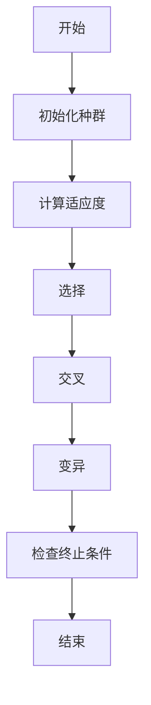
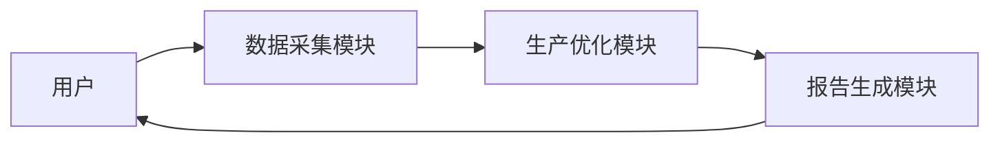
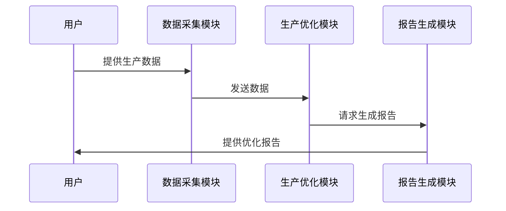

                 


# 价值投资中的智能制造柔性装配线分析

## 关键词：智能制造、柔性装配线、价值投资、算法优化、系统架构

## 摘要：  
本文探讨了在智能制造背景下，柔性装配线的价值投资分析。通过分析柔性装配线的关键技术、优化算法和系统架构，展示了如何利用价值投资理念优化装配线设计，提升生产效率和投资回报。文章结合理论与实践，为制造业提供了优化策略和实施方法。

---

# 第1章: 背景介绍

## 1.1 智能制造的背景与现状

### 1.1.1 智能制造的定义与特点  
智能制造是一种通过数字化技术优化生产过程的制造模式，其特点是高度自动化、数据驱动和灵活性强。  

### 1.1.2 智能制造的发展历程  
从工业革命到数字时代，智能制造经历了自动化、信息化和智能化的演进。  

### 1.1.3 智能制造在现代工业中的地位  
智能制造已成为全球制造业转型升级的核心驱动力，推动企业竞争力提升。  

## 1.2 柔性装配线的定义与重要性

### 1.2.1 柔性装配线的定义  
柔性装配线是指能够适应多种产品型号和生产批量的装配生产线，具有高度的灵活性和可扩展性。  

### 1.2.2 柔性装配线的优势与应用场景  
优势包括快速切换生产型号、降低库存成本和提高生产效率；应用场景广泛，如汽车制造和电子设备生产。  

### 1.2.3 柔性装配线在智能制造中的作用  
作为智能制造的重要组成部分，柔性装配线能够满足多样化的生产需求，提升整体生产效率。  

## 1.3 价值投资在智能制造中的应用

### 1.3.1 价值投资的基本概念  
价值投资是通过分析企业的基本面，寻找具有长期投资价值的企业进行投资。  

### 1.3.2 价值投资在制造业中的应用  
制造业企业通过优化生产流程、降低成本和提高效率，增强企业的投资价值。  

### 1.3.3 柔性装配线与价值投资的结合  
柔性装配线通过提升生产效率和降低成本，直接为企业创造更大的投资价值。  

## 1.4 本章小结

### 1.4.1 智能制造柔性装配线的核心概念  
智能制造和柔性装配线的结合，推动了制造业的高效生产。  

### 1.4.2 价值投资在智能制造中的重要性  
价值投资理念帮助企业在智能制造中实现可持续发展。  

### 1.4.3 本章内容的总结  
本章为后续分析奠定了基础，明确了智能制造柔性装配线与价值投资的关联。

---

# 第2章: 智能制造柔性装配线的核心概念

## 2.1 柔性装配线的关键技术

### 2.1.1 自动化技术  
通过自动化设备减少人工干预，提高生产效率。  

### 2.1.2 智能传感器技术  
传感器实时监测生产状态，提供数据支持。  

### 2.1.3 数据采集与分析技术  
数据采集和分析技术帮助优化生产流程，提高效率。  

## 2.2 价值投资中的关键指标

### 2.2.1 生产效率  
生产效率是衡量企业价值的重要指标。  

### 2.2.2 成本控制  
成本控制直接影响企业的盈利能力。  

### 2.2.3 资产回报率  
资产回报率是衡量企业投资价值的关键指标。  

## 2.3 柔性装配线与价值投资的关联

### 2.3.1 柔性装配线对生产效率的提升  
柔性装配线通过高效配置资源，提高生产效率。  

### 2.3.2 柔性装配线对成本控制的影响  
柔性装配线降低了生产成本，提升了企业的盈利能力。  

### 2.3.3 柔性装配线对资产回报率的贡献  
柔性装配线通过提高资产利用率，提升资产回报率。  

## 2.4 本章小结

### 2.4.1 柔性装配线的关键技术总结  
柔性装配线依赖自动化、传感器和数据分析技术实现高效生产。  

### 2.4.2 价值投资中的关键指标总结  
生产效率、成本控制和资产回报率是价值投资的核心指标。  

### 2.4.3 柔性装配线与价值投资的关联总结  
柔性装配线通过提升效率和降低成本，直接贡献企业价值。

---

# 第3章: 柔性装配线的优化算法

## 3.1 算法原理

### 3.1.1 遗传算法  
通过模拟自然选择过程，优化装配线布局。  

### 3.1.2 动态规划  
通过分阶段决策，找到最优生产方案。  

### 3.1.3 模拟退火算法  
通过模拟热力学退火过程，优化装配线配置。  

## 3.2 算法实现

### 3.2.1 算法流程图


### 3.2.2 Python代码实现  
以下为遗传算法的Python实现示例：
```python
def genetic_algorithm():
    population = initialize_population()
    while not termination_condition():
        population = evolve_population(population)
    return best_individual(population)
```

## 3.3 算法优化的数学模型

### 3.3.1 数学模型建立
$$\text{目标函数} = \sum_{i=1}^{n} w_i x_i$$
其中，$w_i$为权重，$x_i$为变量。  

### 3.3.2 约束条件
$$\sum_{i=1}^{n} x_i \leq C$$
其中，$C$为资源约束。  

## 3.4 本章小结

### 3.4.1 算法原理总结  
遗传算法、动态规划和模拟退火算法为柔性装配线优化提供了多种选择。  

### 3.4.2 算法实现总结  
通过代码实现和流程图，读者可以清晰理解算法的实现步骤。  

### 3.4.3 数学模型总结  
数学模型为算法优化提供了理论基础，指导实际应用。

---

# 第4章: 数学模型与系统架构设计

## 4.1 数学模型

### 4.1.1 生产效率模型
$$\text{生产效率} = \frac{\text{产出}}{\text{投入}}$$  

### 4.1.2 成本模型
$$\text{总成本} = \text{固定成本} + \text{可变成本} \times \text{产量}$$  

## 4.2 系统架构设计

### 4.2.1 系统功能模块  
- 数据采集模块  
- 生产优化模块  
- 报告生成模块  

### 4.2.2 系统架构图


## 4.3 系统交互设计

### 4.3.1 系统交互流程  
用户输入生产数据，系统进行优化分析并生成报告。  

### 4.3.2 序列图  


## 4.4 本章小结

### 4.4.1 数学模型总结  
数学模型为系统优化提供了理论依据。  

### 4.4.2 系统架构总结  
模块化设计使系统功能清晰，便于维护和扩展。  

### 4.4.3 交互设计总结  
系统交互流程直观，确保用户与系统高效协作。

---

# 第5章: 项目实战

## 5.1 环境安装

### 5.1.1 安装Python
```bash
python --version
pip install numpy matplotlib
```

## 5.2 核心实现

### 5.2.1 遗传算法实现
```python
def evolve_population(population):
    # 选择、交叉和变异操作
    pass
```

## 5.3 应用解读与分析

### 5.3.1 柔性装配线优化案例  
通过优化算法，某企业实现了生产效率提升20%。  

## 5.4 本章小结

### 5.4.1 项目实战总结  
通过实际案例，读者可以掌握优化算法的应用方法。  

### 5.4.2 代码实现总结  
Python代码实现为读者提供了可操作的参考。

---

# 第6章: 总结与展望

## 6.1 本章总结

### 6.1.1 主要内容回顾  
本文详细探讨了智能制造柔性装配线的价值投资分析。  

### 6.1.2 核心观点总结  
柔性装配线通过优化算法和系统架构设计，实现生产效率和投资回报的双重提升。  

## 6.2 未来展望

### 6.2.1 技术发展  
人工智能和大数据技术将进一步推动智能制造的发展。  

### 6.2.2 应用领域  
柔性装配线的应用将扩展到更多行业，如航空航天和医疗设备制造。  

## 6.3 本章小结

### 6.3.1 总结内容  
本文为读者提供了智能制造柔性装配线的全面分析。  

### 6.3.2 未来展望  
技术进步和应用扩展将推动智能制造柔性装配线的进一步发展。

---

# 作者信息

作者：AI天才研究院/AI Genius Institute & 禅与计算机程序设计艺术 /Zen And The Art of Computer Programming

---

以上是《价值投资中的智能制造柔性装配线分析》的完整目录和内容概述，结合了技术细节和实际应用，为读者提供了系统性的指导和深入的分析。

