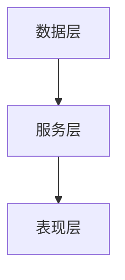

                 


# 价值投资中的智能办公空间技术趋势

> 关键词：价值投资，智能办公空间，技术趋势，AI，物联网，大数据

> 摘要：本文探讨了价值投资与智能办公空间的结合，分析了相关技术趋势，包括AI、大数据和物联网的应用，及其对价值投资的影响。通过算法和系统设计，展示了如何将智能办公技术应用于价值评估，并提供了实战案例。

---

## 第1章：价值投资与智能办公空间概述

### 1.1 价值投资的核心概念
价值投资是一种长期投资策略，强调通过分析企业的内在价值来决定投资决策。其核心在于识别被市场低估的企业，长期持有以实现资本增值。内在价值是基于企业未来现金流的折现值，考虑了企业的财务状况、行业地位和竞争优势等因素。

### 1.2 智能办公空间的定义与特点
智能办公空间是通过先进技术优化办公环境和效率的空间。它利用物联网、AI、大数据等技术实现设备的智能化管理和办公流程的自动化。智能办公空间的特点包括灵活性、高效性、舒适性和可持续性，能够显著提升员工的工作体验和企业竞争力。

### 1.3 价值投资与智能办公空间的结合
随着科技的发展，智能办公空间成为企业提升效率和降低成本的重要手段。价值投资者开始关注那些在智能办公技术方面有优势的企业，因为这些企业可能具备更高的成长潜力和竞争优势。因此，智能办公空间的技术趋势对价值投资的决策过程产生了重要影响。

---

## 第2章：价值投资与智能办公空间的核心概念分析

### 2.1 核心概念原理
价值投资的核心是内在价值评估，而智能办公空间的核心是通过技术优化办公环境。内在价值评估需要考虑企业的财务健康、行业地位和管理团队等因素，而智能办公技术则通过提升效率和降低成本影响企业的竞争力。

### 2.2 核心概念属性特征对比

| 特性         | 价值投资                     | 智能办公空间                 |
|--------------|------------------------------|------------------------------|
| 核心目标     | 寻找被低估的企业               | 提升办公效率和体验             |
| 依赖技术     | 财务分析、市场研究             | AI、物联网、大数据             |
| 应用领域     | 金融投资                     | 物理空间优化                 |
| 影响因素     | 财务指标、行业趋势             | 设备智能化、数据驱动           |

### 2.3 ER实体关系图
以下是一个简化的ER图，展示了价值投资与智能办公空间的关系：

```mermaid
erdiagram
actor 投资者 {
  id 投资者ID
  name 投资者名称
}
actor 企业 {
  id 企业ID
  name 企业名称
}
actor 智能办公技术 {
  id 技术ID
  name 技术名称
}
关系 投资者-企业 {
  投资者 -> 企业
  关系：投资
}
关系 企业-智能办公技术 {
  企业 -> 智能办公技术
  关系：应用
}
```

---

## 第3章：智能办公空间的技术发展趋势

### 3.1 AI与大数据在智能办公中的应用
AI技术用于分析员工行为数据，优化工作流程和空间布局。大数据分析则帮助企业识别办公环境中的低效点，提供数据驱动的改进建议。

### 3.2 物联网技术在智能办公空间中的应用
物联网设备实时监测办公环境，如温度、空气质量、设备使用情况等，确保办公环境的舒适性和安全性。

### 3.3 云计算与边缘计算在智能办公中的应用
云计算提供数据存储和分析的弹性资源，边缘计算则在本地处理数据，减少延迟，提升实时响应能力。

---

## 第4章：智能办公空间价值评估算法

### 4.1 算法原理
智能办公空间的价值评估算法基于数据驱动的方法，结合企业的财务指标和办公效率提升效果。其数学模型如下：

$$ \text{内在价值} = \text{财务价值} + \text{技术价值} + \text{效率提升价值} $$

### 4.2 算法实现
以下是一个简单的Python代码示例，用于计算智能办公技术对价值的影响：

```python
def calculate_intrinsic_value(financial_value, tech_value, efficiency_value):
    return financial_value + tech_value + efficiency_value

# 示例
financial_value = 100
tech_value = 50
efficiency_value = 30
intrinsic_value = calculate_intrinsic_value(financial_value, tech_value, efficiency_value)
print(f"计算的内在价值为：{intrinsic_value}")
```

### 4.3 算法应用案例
通过分析某企业的数据，算法可以预测智能办公技术的应用将提升其效率，从而增加企业的内在价值。

---

## 第5章：智能办公空间价值评估系统架构

### 5.1 系统功能设计
系统功能模块包括数据采集、分析处理、结果展示和优化建议。

### 5.2 系统架构设计
系统采用分层架构，包括数据层、服务层和表现层。以下是一个系统架构图：



### 5.3 系统接口设计
系统提供API接口，用于数据采集和结果返回。接口设计如下：

- 数据采集接口：`GET /api/data`
- 结果返回接口：`POST /api/results`

---

## 第6章：智能办公空间价值评估系统实现

### 6.1 环境安装与配置
需要安装Python、数据处理库（如Pandas）和可视化库（如Matplotlib）。

### 6.2 系统核心功能实现
实现数据采集、分析和结果展示功能，代码示例如下：

```python
import pandas as pd
import matplotlib.pyplot as plt

data = {'财务价值': [100, 80, 90], '技术价值': [50, 60, 40]}
df = pd.DataFrame(data)
plt.bar(df.index, df['财务价值'], label='财务价值')
plt.bar(df.index, df['技术价值'], label='技术价值')
plt.legend()
plt.show()
```

### 6.3 项目案例分析
通过案例分析，展示系统如何帮助企业在智能办公空间中实现价值提升。

---

## 第7章：总结与展望

### 7.1 总结
本文探讨了价值投资与智能办公空间的结合，分析了相关技术趋势，并通过算法和系统设计展示了如何将智能办公技术应用于价值评估。

### 7.2 最佳实践
- 定期更新技术分析模型
- 关注行业趋势和政策变化
- 选择合适的智能办公技术

### 7.3 未来展望
随着技术的进步，智能办公空间将更加智能化，价值投资也将更加依赖数据驱动的分析。未来，两者结合将为企业创造更大的价值。

---

作者：AI天才研究院/AI Genius Institute & 禅与计算机程序设计艺术 /Zen And The Art of Computer Programming

