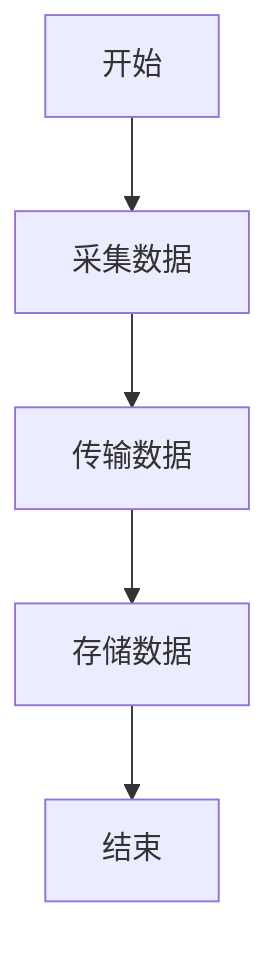
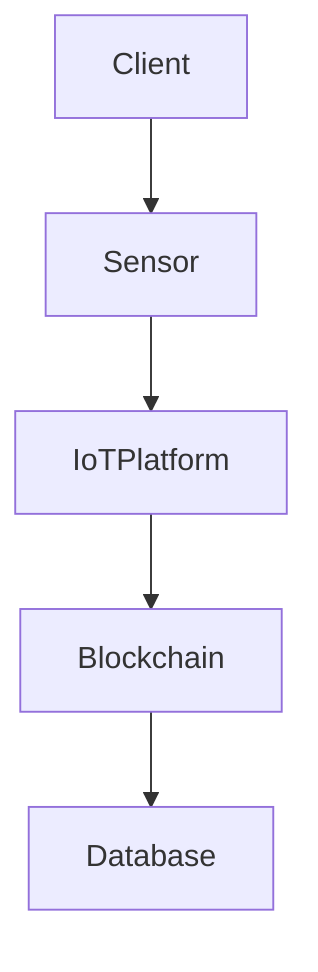

                 


---

# 《价值投资中的智能包装与溯源系统分析》

> 关键词：价值投资，智能包装，溯源系统，区块链，物联网，供应链管理

> 摘要：本文从价值投资的角度，分析了智能包装与溯源系统在供应链管理中的应用，探讨了其技术原理、系统架构以及实际案例。通过对比分析和项目实战，揭示了智能包装与溯源系统如何提升供应链透明度和产品信任度，为价值投资者提供了新的视角和工具。

---

## 第一部分：价值投资与智能包装的背景介绍

### 第1章：价值投资的定义与核心理念

#### 1.1 价值投资的基本概念
- **1.1.1 价值投资的定义**  
  价值投资是一种长期投资策略，强调以低于内在价值的价格买入优质资产。其核心在于识别那些被市场低估的企业，长期持有，分享其成长带来的收益。

- **1.1.2 价值投资的核心理念**  
  价值投资强调基本面分析，关注企业的盈利能力、财务状况、行业地位和竞争优势。投资者通过深入研究企业，寻找具有持续增长潜力的公司。

- **1.1.3 价值投资与智能包装的关联**  
  智能包装与溯源系统通过技术创新，提升了产品信息的透明度和真实性，为价值投资者提供了更可靠的决策依据。

#### 1.2 智能包装与溯源系统的背景
- **1.2.1 智能包装的定义**  
  智能包装是一种集成传感器、RFID标签、二维码等技术的包装形式，能够实时监测和记录产品状态（如温度、湿度、地理位置等）。

- **1.2.2 溯源系统的定义**  
  溯源系统是利用区块链、物联网等技术，记录和追踪产品从生产到消费者的全生命周期信息的系统。

- **1.2.3 智能包装与溯源系统在价值投资中的作用**  
  智能包装与溯源系统通过提供实时、透明的产品信息，帮助投资者评估企业的供应链管理能力，从而判断其长期竞争力。

#### 1.3 价值投资中的智能包装与溯源系统分析
- **1.3.1 智能包装与溯源系统的核心要素**  
  - 智能传感器：监测产品状态  
  - 区块链技术：确保信息不可篡改  
  - 物联网平台：实现数据传输与存储

- **1.3.2 价值投资中的问题背景**  
  传统供应链信息不透明，企业可能存在虚假记录或质量问题，导致投资者难以准确评估企业的真实价值。

- **1.3.3 智能包装与溯源系统如何解决这些问题**  
  智能包装实时监测产品状态，溯源系统记录全生命周期信息，为投资者提供真实可靠的数据支持。

---

## 第二部分：智能包装与溯源系统的核心概念与联系

### 第2章：智能包装与溯源系统的核心原理

#### 2.1 智能包装的原理
- **2.1.1 智能包装的技术基础**  
  智能包装通常集成传感器、RFID标签和二维码，通过物联网平台与云端数据库连接，实时采集并传输数据。

- **2.1.2 智能包装的功能与特性**  
  - 实时监测：温度、湿度、地理位置等  
  - 数据存储：记录产品状态变化  
  - 交互性：通过手机APP或网页查询信息  

- **2.1.3 智能包装与传统包装的对比**  
  智能包装不仅提供保护功能，还能提供产品全生命周期的信息，增强消费者信任。

#### 2.2 溯源系统的原理
- **2.2.1 溯源系统的定义与功能**  
  溯源系统通过区块链技术，记录产品从生产到消费者的每一步信息，确保数据不可篡改。

- **2.2.2 溯源系统的技术实现**  
  - 区块链：分布式账本，确保数据透明性和不可篡改性  
  - IoT：实时采集数据，记录产品状态  
  - 数据存储：云端数据库，支持信息查询  

- **2.2.3 溯源系统的核心要素**  
  - 数据采集：传感器、RFID标签  
  - 数据传输：物联网平台  
  - 数据存储：区块链账本  

#### 2.3 智能包装与溯源系统的联系
- **2.3.1 智能包装如何支持溯源系统**  
  智能包装通过集成传感器和二维码，为溯源系统提供实时数据。

- **2.3.2 溯源系统如何增强智能包装的功能**  
  溯源系统通过区块链技术，确保智能包装采集的数据真实可靠。

- **2.3.3 两者的协同工作原理**  
  - 智能包装采集数据并传输到物联网平台  
  - 平台将数据写入区块链账本  
  - 消费者可通过扫描二维码查询产品信息  

---

### 第3章：智能包装与溯源系统的属性特征对比

#### 3.1 智能包装的属性特征
- **3.1.1 智能性**  
  智能包装能够实时监测和记录产品状态。

- **3.1.2 交互性**  
  智能包装支持消费者通过手机APP或网页查询信息。

- **3.1.3 可追溯性**  
  智能包装记录的产品信息可以被追踪和查询。

#### 3.2 溯源系统的属性特征
- **3.2.1 可追溯性**  
  溯源系统记录产品全生命周期信息。

- **3.2.2 透明性**  
  溯源系统通过区块链技术确保数据透明。

- **3.2.3 安全性**  
  溯源系统数据不可篡改，确保信息真实。

#### 3.3 对比分析
- **3.3.1 智能包装与溯源系统的共同点**  
  - 都支持产品信息的记录与追踪  
  - 都依赖于物联网和区块链技术  

- **3.3.2 智能包装与溯源系统的区别**  
  - 智能包装侧重于实时数据采集，而溯源系统侧重于数据存储与管理  

- **3.3.3 两者结合的优势**  
  智能包装提供实时数据，溯源系统确保数据真实，两者结合提升了供应链的透明度和信任度。

---

## 第三部分：智能包装与溯源系统的ER实体关系图

### 第4章：智能包装与溯源系统的ER图

```mermaid
erDiagram
    act
    act.something
    act.Actor
    act.Sensor
    act.Product
    act.Transaction
    act.Sensor :<o-| something
    Sensor --> Product
    Sensor --> Transaction
    Product --> Transaction
    Actor --> Sensor
    Actor --> Product
```

---

## 第四部分：智能包装与溯源系统的算法原理

### 第5章：智能包装与溯源系统的算法原理

#### 5.1 算法原理概述
- 智能包装与溯源系统的算法主要涉及数据采集、数据传输和数据存储三个部分。

#### 5.2 数据采集算法
- 数据采集通过传感器完成，采用时间戳记录数据，确保数据的实时性和准确性。

#### 5.3 数据传输算法
- 数据通过物联网平台传输到云端数据库，采用AES加密算法保证数据传输安全。

#### 5.4 数据存储算法
- 数据存储在区块链账本中，采用哈希函数确保数据不可篡改。

#### 5.5 算法流程图


---

## 第五部分：智能包装与溯源系统的系统架构

### 第6章：系统架构设计方案

#### 6.1 系统功能设计
- 智能包装功能：实时监测、数据采集  
- 溯源系统功能：数据存储、信息查询  

#### 6.2 系统架构图


---

## 第六部分：项目实战

### 第7章：项目实战与案例分析

#### 7.1 项目背景
- 以红酒供应链为例，设计智能包装与溯源系统。

#### 7.2 系统实现
- 环境安装：Python、区块链框架、物联网平台  
- 核心代码实现：传感器数据采集、区块链数据存储  

#### 7.3 案例分析
- 红酒供应链中，智能包装实时监测酒品状态，溯源系统记录运输信息，确保红酒品质。

---

## 第七部分：最佳实践与总结

### 第8章：最佳实践与注意事项

#### 8.1 小结
- 智能包装与溯源系统提升了供应链透明度，为价值投资者提供了可靠的数据支持。

#### 8.2 注意事项
- 数据采集的准确性  
- 系统安全性的保障  

#### 8.3 拓展阅读
- 区块链技术在供应链中的应用  
- 智能包装技术的最新发展  

---

## 作者：AI天才研究院/AI Genius Institute & 禅与计算机程序设计艺术 /Zen And The Art of Computer Programming

---

通过以上结构化的内容，我详细地展开分析了智能包装与溯源系统在价值投资中的应用，从背景、技术原理到实际案例，全面探讨了其对供应链管理和投资决策的深远影响。希望这篇文章能够为价值投资者和技术创新者提供新的视角和思路。

