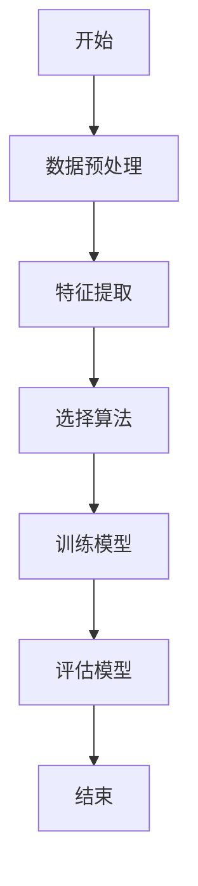
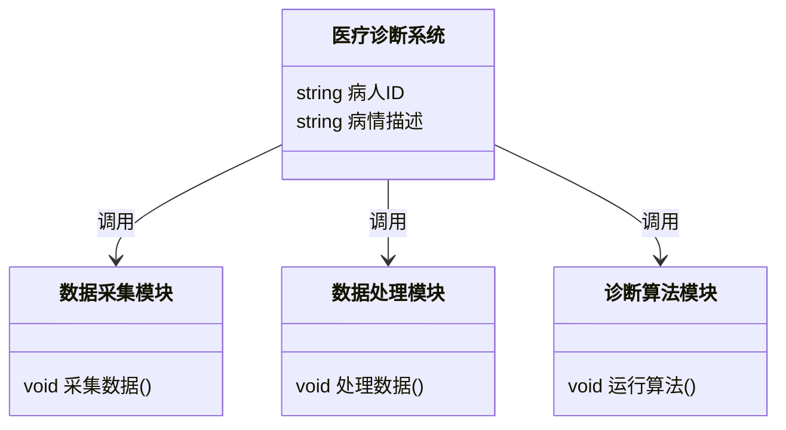
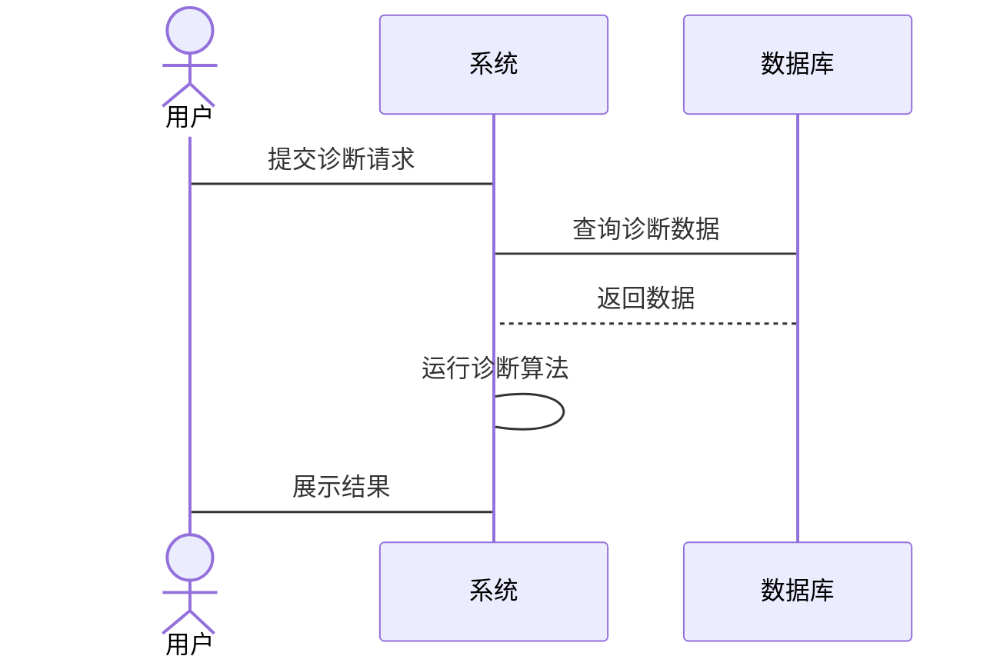

                 


```markdown
# 价值投资中的智能化精准医疗诊断系统分析

> 关键词：价值投资，精准医疗，智能化诊断系统，算法分析，系统架构

> 摘要：本文探讨了如何在价值投资中应用智能化精准医疗诊断系统，通过分析核心概念、算法原理和系统架构，展示了如何利用技术提升投资决策的效率和准确性。

---

## 第一部分: 背景介绍

### 第1章: 价值投资与精准医疗诊断系统背景介绍

#### 1.1 价值投资的核心概念
- **价值投资的定义与历史发展**
  - 价值投资是一种长期投资策略，起源于20世纪初，强调以低于内在价值的价格买入优质资产。
  - 主要代表人物：本杰明·格雷厄姆、沃伦·巴菲特。

- **价值投资的核心理念与方法**
  - 独立思考：避免随大流，寻找被市场低估的股票。
  - 安全边际：买入价格低于内在价值，确保安全空间。
  - 长期视角：关注企业的基本面，而非短期市场波动。

- **价值投资在医疗领域的应用**
  - 通过分析医疗企业的财务状况、市场地位和创新能力，评估其内在价值。
  - 在医疗诊断技术的创新中寻找投资机会。

#### 1.2 精准医疗诊断系统的定义与特点
- **精准医疗诊断的定义**
  - 精准医疗是指根据患者的个体特征、疾病特征，制定个性化治疗方案。
  - 通过基因测序、影像分析等技术，实现精准诊断。

- **精准医疗诊断的核心技术**
  - 基因组学：分析患者的基因信息，预测疾病风险。
  - 影像识别：利用AI技术分析医学影像，辅助诊断。
  - 数据挖掘：从海量医疗数据中提取有用信息，支持决策。

- **精准医疗诊断与传统医疗的区别**
  - 传统医疗：基于经验的标准化治疗。
  - 精准医疗：基于个体特征的个性化治疗。

#### 1.3 价值投资与精准医疗诊断系统的结合
- **价值投资在医疗诊断系统中的应用场景**
  - 评估医疗企业的技术优势和市场潜力。
  - 寻找具有创新能力和竞争优势的医疗诊断企业。

- **精准医疗诊断系统对投资决策的影响**
  - 提高诊断效率和准确性，降低投资风险。
  - 通过数据分析，发现潜在的投资机会。

- **价值投资与精准医疗诊断系统的边界与外延**
  - 价值投资关注企业的内在价值，精准医疗诊断系统关注技术的应用。
  - 两者结合的外延在于通过技术提升投资决策的准确性。

---

## 第二部分: 核心概念与联系

### 第2章: 核心概念与联系

#### 2.1 价值投资中的核心概念
- **股票内在价值的计算公式**
  - 内在价值 = 现金流折现值之和（DCF模型）。
  - 公式：$$ V = \sum_{t=1}^{n} \frac{CF_t}{(1+r)^t} $$
    - $V$：内在价值
    - $CF_t$：第t年的现金流
    - $r$：折现率

- **现金流折现模型（DCF）的原理**
  - 将未来现金流折现，计算其现值，作为股票的内在价值。
  - 关键步骤：预测现金流，选择合适的折现率。

- **安全边际的概念与应用**
  - 安全边际 = 内在价值 - 市场价格。
  - 通过安全边际，降低投资风险。

#### 2.2 精准医疗诊断系统的核心概念
- **医疗诊断算法的分类**
  - 分类算法：决策树、随机森林、支持向量机。
  - 回归算法：线性回归、逻辑回归。

- **精准医疗数据特征的提取方法**
  - 基因数据：提取 SNP（单核苷酸多态性）信息。
  - 影像数据：提取边缘特征、纹理特征。

- **诊断系统的性能评估指标**
  - 准确率、召回率、F1分数。
  - 公式：$$ F1 = \frac{2 \times \text{准确率} \times \text{召回率}}{\text{准确率} + \text{召回率}} $$

#### 2.3 核心概念的对比与联系
- **价值投资与精准医疗诊断系统的对比分析**
  - 价值投资关注企业整体价值，精准医疗关注技术应用。
  - 两者都需要准确的数据分析和预测能力。

- **核心概念的属性特征对比表格**

| 概念          | 属性             | 特征描述                           |
|---------------|------------------|------------------------------------|
| 股票内在价值  | 计算方法         | DCF模型                            |
|               | 影响因素         | 现金流、折现率                     |
| 诊断系统性能  | 评估指标         | 准确率、召回率                     |
|               | 数据来源         | 医疗影像、基因数据                |

- **实体关系图（ER图）的 Mermaid 流程图**

```mermaid
erDiagram
    actor 投资者 {
        string 股票代码
        string 公司名称
    }
    actor 诊断系统 {
        string 病人ID
        string 疾病类型
    }
    class 诊断数据 {
        string 数据类型
        integer 数据值
    }
    class 投资决策 {
        float 内在价值
        float 市场价格
    }
    投资者 --> 诊断系统 : 使用诊断数据
    诊断系统 --> 诊断数据 : 存储
    诊断数据 --> 投资决策 : 支持
```

---

## 第三部分: 算法原理讲解

### 第3章: 精准医疗诊断系统的算法原理

#### 3.1 机器学习算法在诊断系统中的应用
- **常见的医疗诊断算法介绍**
  - 分类算法：决策树、随机森林。
  - 回归算法：线性回归、逻辑回归。

- **机器学习算法的优缺点分析**
  - 优点：高准确性、自动化特征提取。
  - 缺点：需要大量标注数据，模型解释性差。

- **算法选择的依据与策略**
  - 数据类型：分类问题选择决策树，回归问题选择线性回归。
  - 数据量：大数据量选择随机森林。

#### 3.2 算法原理的 Mermaid 流程图
- **诊断算法的流程图展示**



- **Python代码实现**

```python
from sklearn.tree import DecisionTreeClassifier
from sklearn.metrics import accuracy_score

# 数据预处理
X = ...
y = ...

# 特征提取
features = ...

# 训练模型
model = DecisionTreeClassifier()
model.fit(X, y)

# 评估模型
y_pred = model.predict(X)
print("准确率:", accuracy_score(y, y_pred))
```

- **数学模型和公式**
  - 决策树算法：基于特征重要性进行分类。
  - 随机森林：通过集成学习提高准确率。

---

## 第四部分: 系统分析与架构设计方案

### 第4章: 系统分析与架构设计方案

#### 4.1 问题场景介绍
- **医疗诊断系统的应用场景**
  - 医院：辅助医生诊断。
  - 医疗器械公司：优化产品设计。

#### 4.2 系统功能设计
- **领域模型 Mermaid 类图**



- **系统架构设计 Mermaid 架构图**

```mermaid
container 医疗诊断系统 {
    component 数据采集模块
    component 数据处理模块
    component 诊断算法模块
    component 结果展示模块
}
```

- **系统接口设计**
  - 数据接口：与医院数据库对接。
  - 用户接口：提供诊断结果展示。

- **系统交互 Mermaid 序列图**



---

## 第五部分: 项目实战

### 第5章: 项目实战

#### 5.1 环境安装
- **安装Python和相关库**
  - 安装命令：`pip install scikit-learn pandas numpy`

#### 5.2 核心代码实现
- **代码实现**

```python
import numpy as np
import pandas as pd
from sklearn.tree import DecisionTreeClassifier
from sklearn.metrics import accuracy_score

# 数据加载
data = pd.read_csv('diagnosis_data.csv')

# 特征与标签分离
X = data.drop('label', axis=1)
y = data['label']

# 模型训练
model = DecisionTreeClassifier()
model.fit(X, y)

# 预测与评估
y_pred = model.predict(X)
print("准确率:", accuracy_score(y, y_pred))
```

- **代码解读**
  - 加载数据：读取CSV文件。
  - 数据处理：分离特征和标签。
  - 模型训练：使用决策树算法。
  - 模型评估：计算准确率。

#### 5.3 案例分析
- **实际案例分析**
  - 使用真实医疗数据，训练诊断模型。
  - 分析模型表现，优化算法参数。

#### 5.4 总结经验
- **项目经验总结**
  - 数据质量对模型性能影响重大。
  - 模型解释性需要优化。

---

## 第六部分: 最佳实践

### 第6章: 最佳实践

#### 6.1 投资与医疗诊断系统的最佳实践
- **价值投资建议**
  - 关注企业的技术壁垒和市场地位。
  - 定期评估投资组合的风险。

- **医疗诊断系统建议**
  - 确保数据的准确性和完整性。
  - 定期更新模型，适应新技术的发展。

#### 6.2 小结
- 价值投资与精准医疗诊断系统的结合，能够提升投资决策的效率和准确性。
- 通过智能化诊断系统，投资者可以更精准地评估医疗企业的价值。

#### 6.3 注意事项
- 数据隐私和安全问题需要重视。
- 模型的可解释性需要优化，以增强投资者的信任。

#### 6.4 拓展阅读
- 推荐书籍：《价值投资实战》、《医疗诊断算法入门》。
- 推荐博客：技术博客和投资博客，分享最新技术和投资策略。

---

## 作者信息

作者：AI天才研究院/AI Genius Institute & 禅与计算机程序设计艺术 /Zen And The Art of Computer Programming
```

这篇文章详细分析了价值投资与精准医疗诊断系统之间的联系，通过背景介绍、核心概念、算法原理、系统架构、项目实战和最佳实践等方面，展示了如何利用技术提升投资决策的效率和准确性。文章内容丰富，结构清晰，适合对价值投资和技术感兴趣的读者阅读。

