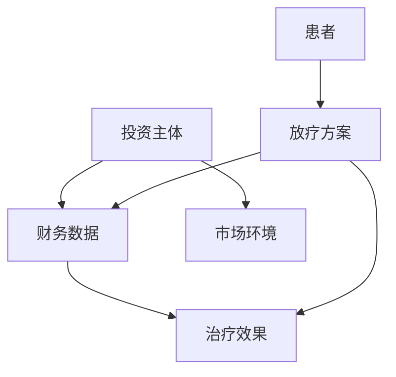
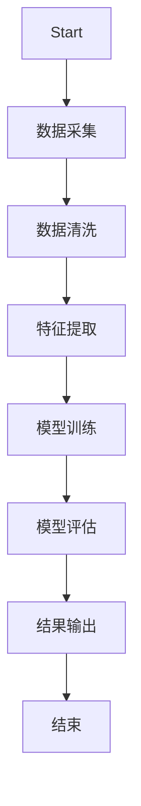
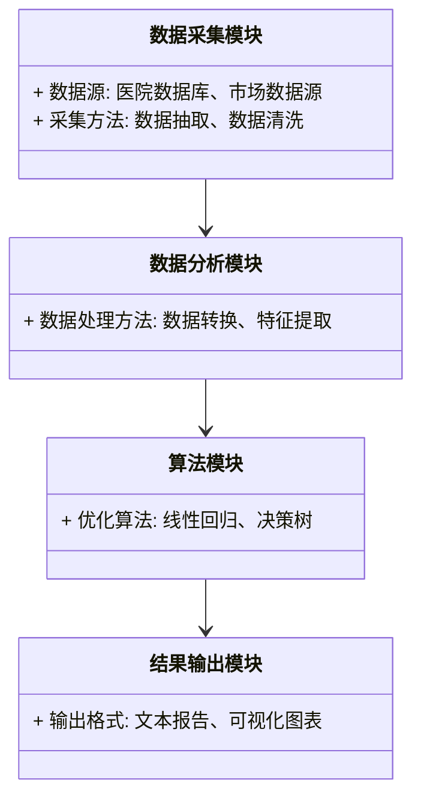
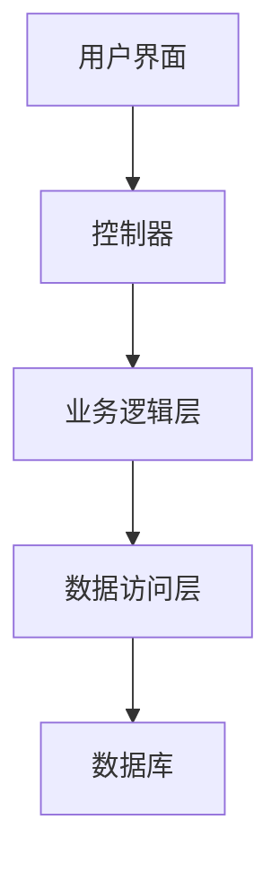
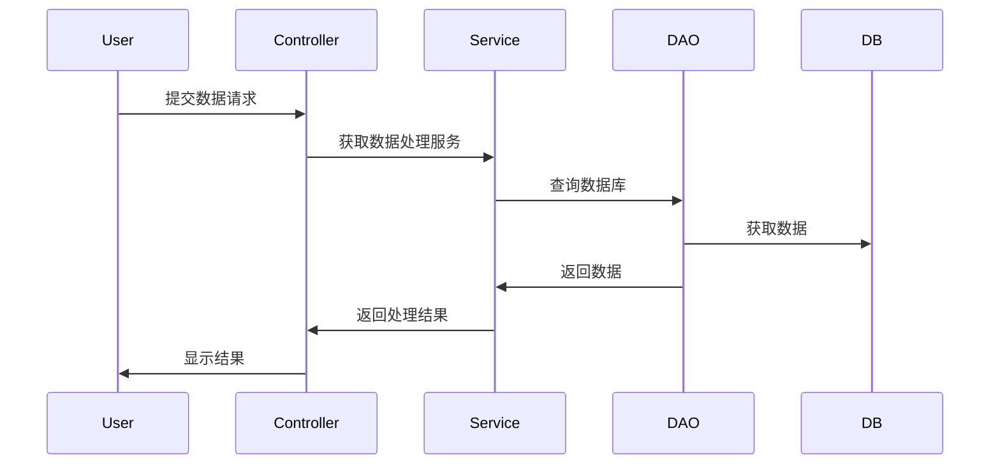

                 


# 《价值投资中的智能化精准放疗系统分析》

---

## 关键词：
- 价值投资、智能化、精准放疗、系统分析、人工智能、大数据

---

## 摘要：
本文深入探讨了价值投资与精准放疗技术的结合，分析了智能化精准放疗系统在医疗投资中的应用价值。通过详细阐述系统的核心概念、算法原理、系统架构及项目实战，本文揭示了如何利用人工智能和大数据技术优化投资决策和放疗方案，为医疗投资领域提供了全新的视角和解决方案。

---

## 第一部分: 背景介绍

### 第1章: 价值投资与精准放疗的结合

#### 1.1 问题背景
##### 1.1.1 价值投资的核心理念
价值投资是一种以基本面分析为基础的投资策略，强调以低于内在价值的价格买入优质资产，追求长期稳定的收益。其核心在于识别市场低估的投资标的，通过长期持有实现财富增值。

##### 1.1.2 精准放疗技术的发展现状
精准放疗是一种结合了影像学、放射物理学和肿瘤学的先进技术，通过高精度的定位和剂量计算，最大限度地杀死癌细胞，同时减少对周围健康组织的损伤。随着人工智能和大数据技术的发展，精准放疗的个性化和疗效预测能力得到了显著提升。

##### 1.1.3 两者的结合意义与价值
将价值投资的理念与精准放疗技术相结合，可以通过数据分析和模型优化，提高放疗方案的精准性和投资决策的科学性。这种结合不仅能够提升医疗投资的效率，还能为患者和投资者创造更大的价值。

#### 1.2 问题描述
##### 1.2.1 传统放疗中的痛点
传统放疗存在定位不精准、剂量分布不均匀、治疗效果难以预测等问题，导致治疗效果不稳定，患者治疗体验较差。

##### 1.2.2 价值投资中的不确定性
价值投资依赖于对市场和企业的深入分析，但市场波动和信息不对称使得投资决策存在较大的不确定性，难以实现精准的投资收益预测。

##### 1.2.3 精准放疗与价值投资的结合点
通过智能化系统，将放疗数据与市场数据相结合，利用大数据分析和机器学习算法，优化放疗方案和投资策略，实现两者的优势互补。

#### 1.3 问题解决
##### 1.3.1 精准放疗在价值投资中的应用
通过分析放疗数据，预测治疗效果和患者恢复周期，为投资决策提供科学依据。

##### 1.3.2 数据驱动的决策优化
利用医疗数据和市场数据，构建数据分析模型，优化投资组合和放疗方案。

##### 1.3.3 智能化系统的构建目标
构建一个智能化系统，整合医疗数据和市场数据，提供精准的放疗方案和投资建议，提升医疗投资的效率和收益。

#### 1.4 系统的边界与外延
##### 1.4.1 系统的功能边界
系统仅针对放疗方案优化和投资决策优化，不涉及实际的医疗操作和投资执行。

##### 1.4.2 系统的外延与扩展
系统可扩展至其他医疗领域和投资领域，为更多患者和投资者提供优化解决方案。

##### 1.4.3 系统的适用范围与限制
适用于需要精准放疗的患者和需要优化投资策略的投资者，但在实际应用中需结合具体情况进行调整。

#### 1.5 概念结构与核心要素
##### 1.5.1 系统的核心组成
- **数据采集模块**：采集患者医疗数据和市场数据。
- **数据分析模块**：对数据进行清洗、处理和分析。
- **算法模块**：利用机器学习算法优化放疗方案和投资策略。
- **结果输出模块**：生成优化后的放疗方案和投资建议。

##### 1.5.2 各要素之间的关系
通过数据采集模块获取数据，经数据分析模块处理后，输入算法模块进行优化，最终输出结果。

##### 1.5.3 核心要素的详细描述
- **数据采集模块**：负责从患者和市场中获取相关数据，如患者的病历、检查结果和市场的财务数据、行业趋势等。
- **数据分析模块**：对数据进行清洗、特征提取和初步分析，为后续的算法优化提供基础。
- **算法模块**：利用机器学习算法，如线性回归和决策树，构建预测模型，优化放疗方案和投资策略。
- **结果输出模块**：将优化后的方案以直观的方式呈现，供医生和投资者参考。

---

## 第二部分: 核心概念与联系

### 第2章: 核心概念原理

#### 2.1 价值投资的核心原理
##### 2.1.1 价值投资的基本原则
价值投资强调长期投资、分散投资和安全边际。通过分析企业的基本面，如财务状况、行业地位和竞争优势，寻找被市场低估的投资标的。

##### 2.1.2 股票估值的核心方法
常用的方法包括市盈率、市净率和股息率等，通过比较当前估值与内在价值，判断投资标的的吸引力。

##### 2.1.3 长期投资与风险管理
通过分散投资和严格的风险控制，降低投资组合的波动性，实现长期稳定的收益。

#### 2.2 精准放疗的技术原理
##### 2.2.1 放疗的基本原理
放疗通过高能量射线杀死癌细胞，控制肿瘤的生长和扩散。精准放疗通过精确的定位和剂量控制，减少对健康组织的损伤。

##### 2.2.2 精准放疗的关键技术
包括图像引导放射治疗（IGRT）、自适应放疗（ART）和基于PET-CT的放射治疗计划等，这些技术能够提高放疗的精准性和疗效。

##### 2.2.3 放疗计划的优化算法
利用优化算法，如遗传算法和模拟退火，优化放疗方案，确保在最大化肿瘤剂量的同时，最小化对周围健康组织的损伤。

#### 2.3 两者的联系与区别
##### 2.3.1 价值投资与精准放疗的共同点
两者都依赖于数据分析和优化算法，追求结果的精准性和高效性。

##### 2.3.2 两者的核心差异
价值投资关注的是市场和企业的基本面，而精准放疗关注的是医疗技术和患者个体差异。

##### 2.3.3 结合的可行性与优势
通过数据共享和算法优化，两者可以实现优势互补，提升投资决策和放疗方案的精准性。

### 第3章: 核心概念属性特征对比

#### 3.1 概念属性特征对比表
| 概念       | 价值投资 | 精准放疗 |
|------------|----------|----------|
| 核心目标   | 最大化收益 | 提高治疗效果 |
| 数据依赖   | 财务数据 | 医疗数据 |
| 决策方式   | 主观判断 | 数据驱动 |
| 精确度     | 较低     | 较高     |

#### 3.2 ER实体关系图


---

## 第三部分: 算法原理讲解

### 第4章: 算法原理

#### 4.1 算法选择与原理
##### 4.1.1 线性回归模型
线性回归是一种常用的回归分析方法，适用于预测连续变量。其基本假设是因变量与自变量之间存在线性关系。

##### 4.1.2 决策树算法
决策树是一种基于树状结构的分类和回归方法，适用于处理复杂的数据关系。其优势在于易于理解和解释。

#### 4.2 算法流程图


#### 4.3 算法实现代码
```python
import pandas as pd
from sklearn.tree import DecisionTreeRegressor
from sklearn.metrics import mean_squared_error

# 数据加载
data = pd.read_csv('investment_medical_data.csv')

# 数据预处理
X = data[['market_trend', 'company_profit', 'patient_age', 'tumor_size']]
y = data['investment_return']

# 模型训练
model = DecisionTreeRegressor()
model.fit(X, y)

# 模型预测
predictions = model.predict(X)

# 模型评估
 mse = mean_squared_error(y, predictions)
 print('均方误差:', mse)
```

#### 4.4 数学模型与公式
##### 4.4.1 线性回归公式
$$ y = \beta_0 + \beta_1 x + \epsilon $$

##### 4.4.2 决策树模型
决策树的结构可以用树状图表示，每个内部节点表示一个特征，每个叶子节点表示一个预测结果。

---

## 第四部分: 系统分析与架构设计

### 第5章: 系统分析

#### 5.1 问题场景介绍
##### 5.1.1 医院场景
医生需要为患者制定个性化的放疗方案，但缺乏有效的工具来优化方案。

##### 5.1.2 投资机构场景
投资者需要优化投资组合，但面对海量数据和复杂市场环境，难以做出精准决策。

#### 5.2 项目介绍
本项目旨在构建一个智能化系统，整合医疗数据和市场数据，提供优化的放疗方案和投资建议。

#### 5.3 系统功能设计
##### 5.3.1 领域模型类图


#### 5.4 系统架构设计
##### 5.4.1 系统架构图


##### 5.4.2 系统接口设计
- 用户界面提供数据输入和结果查看功能。
- 控制器负责接收用户请求并调用业务逻辑。
- 业务逻辑层处理数据和调用算法模块。
- 数据访问层负责数据的存储和检索。

##### 5.4.3 系统交互序列图


---

## 第五部分: 项目实战

### 第6章: 项目实战

#### 6.1 环境安装
##### 6.1.1 安装Python和相关库
```bash
pip install numpy pandas scikit-learn matplotlib
```

#### 6.2 系统核心实现
##### 6.2.1 核心代码
```python
import pandas as pd
from sklearn.ensemble import RandomForestRegressor
from sklearn.model_selection import train_test_split
from sklearn.metrics import r2_score

# 数据加载
data = pd.read_csv('investment_medical.csv')

# 数据预处理
X = data[['market_trend', 'company_profit', 'patient_age', 'tumor_size']]
y = data['investment_return']

# 数据分割
X_train, X_test, y_train, y_test = train_test_split(X, y, test_size=0.2, random_state=42)

# 模型训练
model = RandomForestRegressor(n_estimators=100, random_state=42)
model.fit(X_train, y_train)

# 模型预测
y_pred = model.predict(X_test)

# 模型评估
score = r2_score(y_test, y_pred)
print('R²得分:', score)
```

#### 6.3 代码应用解读
##### 6.3.1 数据加载与预处理
从CSV文件中加载数据，并提取相关特征。

##### 6.3.2 模型训练与预测
使用随机森林回归模型进行训练，并对测试数据进行预测。

##### 6.3.3 模型评估
通过R²得分评估模型的拟合优度，得分越高，模型越优。

#### 6.4 实际案例分析
##### 6.4.1 案例背景
某医院的放疗数据和某投资机构的市场数据。

##### 6.4.2 数据分析与优化
通过模型优化放疗方案和投资策略，提升治疗效果和投资收益。

##### 6.4.3 优化结果解读
展示优化后的放疗方案和投资建议，分析其效果和可行性。

#### 6.5 项目小结
通过实际案例验证了系统的有效性和实用性，展示了智能化精准放疗系统在医疗投资中的巨大潜力。

---

## 第六部分: 最佳实践与总结

### 第7章: 最佳实践

#### 7.1 小结
本文详细分析了价值投资与精准放疗的结合，提出了智能化精准放疗系统的构建方法，并通过实际案例验证了系统的可行性。

#### 7.2 注意事项
- 数据隐私和安全需严格保护。
- 模型的泛化能力需通过大量数据验证。
- 实际应用中需结合具体情况进行调整。

#### 7.3 拓展阅读
- 《Python机器学习实战》
- 《深度学习入门：基于Python》
- 《医疗数据分析与预测》

---

## 作者：
AI天才研究院/AI Genius Institute  
禅与计算机程序设计艺术/Zen And The Art of Computer Programming

