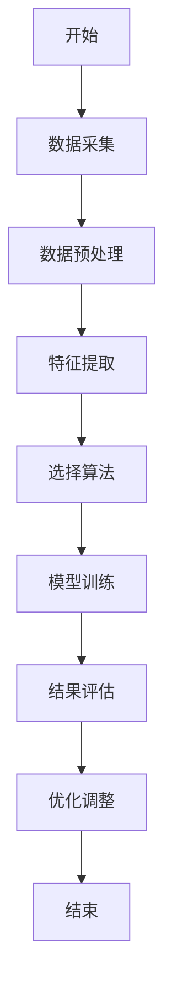
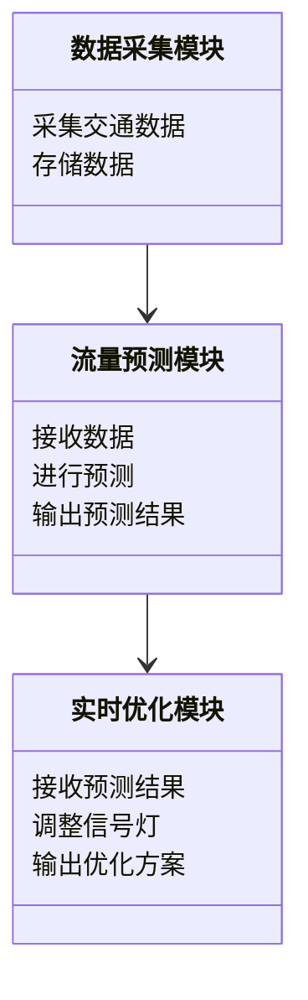
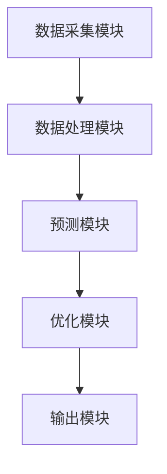
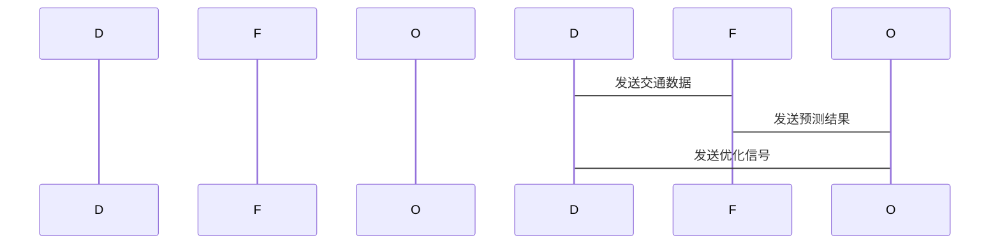

                 


# 价值投资中的智能城市交通流量优化系统

## 关键词：
- 价值投资
- 智能交通系统
- 交通流量优化
- 数据分析
- 机器学习
- 算法优化
- 城市规划

## 摘要：
本文探讨了在智能城市交通流量优化系统中应用价值投资策略的潜力和方法。通过分析交通流量优化的核心算法和价值投资的长期策略，本文揭示了如何利用技术手段提升城市交通效率，同时实现经济和社会效益的双重优化。文章详细介绍了系统的构建过程，包括数据采集、算法设计、系统架构，以及实际案例分析，为读者提供了全面的技术和投资视角。

---

# 目录大纲

## 第一部分：价值投资与智能城市交通流量优化系统概述

### 第1章：价值投资与智能城市交通流量优化系统的背景

#### 1.1 问题背景
- 1.1.1 智能城市交通流量优化的必要性
  - 城市化进程加速带来的交通压力
  - 交通拥堵对经济和社会的影响
- 1.1.2 传统交通管理的局限性
  - 信号灯优化的传统方法
  - 交通预测的低准确性
- 1.1.3 价值投资在优化中的作用
  - 长期投资策略与系统优化的结合

#### 1.2 问题描述
- 1.2.1 城市交通流量的复杂性
  - 不同交通模式（汽车、公交车、自行车）的交织
  - 高峰期与非高峰期的流量差异
- 1.2.2 交通拥堵对经济和社会的影响
  - 经济成本（时间损失、燃料消耗）
  - 社会成本（环境污染、事故风险）
- 1.2.3 价值投资视角下的优化目标
  - 提升交通效率的同时，最大化经济和社会价值

#### 1.3 问题解决
- 1.3.1 智能交通系统的解决方案
  - 数据驱动的实时优化
  - 人工智能在交通预测中的应用
- 1.3.2 价值投资在系统优化中的应用
  - 高效算法的选择与长期收益的关系
  - 投资于可持续优化的技术和团队

#### 1.4 边界与外延
- 1.4.1 系统优化的边界条件
  - 数据采集范围与精度
  - 算法适用的场景限制
- 1.4.2 价值投资的适用范围
  - 技术成熟度与投资风险
  - 经济效益的可量化性
- 1.4.3 系统优化的外延影响
  - 对城市规划的影响
  - 对交通政策的指导意义

#### 1.5 核心要素组成
- 1.5.1 数据采集与处理
  - 多源数据的融合（传感器、GPS、摄像头）
  - 数据清洗与特征提取
- 1.5.2 智能算法设计
  - 机器学习在流量预测中的应用
  - 基于价值投资的算法优化方向
- 1.5.3 经济效益评估
  - 投资回报周期的计算
  - 社会效益的量化分析

### 第2章：价值投资与智能交通系统的核心概念

#### 2.1 智能城市交通流量优化系统原理
- 2.1.1 系统构成与功能
  - 数据采集模块
  - 流量预测模块
  - 实时优化模块
- 2.1.2 数据流与信息处理流程
  - 数据输入、处理、分析、输出的全过程
- 2.1.3 系统优化算法概述
  - 常见算法（遗传算法、强化学习）及其特点

#### 2.2 价值投资的核心原理
- 2.2.1 价值投资的基本理念
  - 长期投资、精选个股
- 2.2.2 长期投资与系统优化的关系
  - 投资于优质的算法和系统架构
- 2.2.3 投资回报与系统效益的关联
  - 系统优化带来的长期收益

#### 2.3 核心概念对比分析
- 2.3.1 智能交通系统与传统交通管理的对比
  - 数据驱动 vs. 人工经验
  - 实时优化 vs. 静态规划
- 2.3.2 价值投资与其他投资策略的对比
  - 长期 vs. 短期投资
  - 高风险 vs. 低风险投资
- 2.3.3 系统优化算法的优劣势分析
  - 遗传算法的全局搜索能力 vs. 强化学习的实时适应性

### 第3章：智能交通流量优化系统的算法原理

#### 3.1 算法原理概述
- 3.1.1 基于价值投资的优化目标
  - 最大化长期效益
- 3.1.2 算法选择与优化方向
  - 根据问题特点选择算法
- 3.1.3 算法的数学模型构建
  - 目标函数和约束条件的定义

#### 3.2 算法实现
- 3.2.1 数据预处理与特征提取
  - 数据清洗、标准化、特征选择
- 3.2.2 算法实现步骤
  - 算法流程分解
- 3.2.3 算法优化与调参
  - 超参数优化、性能评估

#### 3.3 算法流程图


#### 3.4 算法实现代码示例
```python
import numpy as np
from sklearn.metrics import accuracy_score

# 示例代码：使用遗传算法优化交通信号灯
def fitness(individual, data):
    # 计算适应度函数，这里简化为准确率
    predicted = np.argmax(individual, axis=1)
    accuracy = accuracy_score(data.labels, predicted)
    return accuracy,

# 遗传算法设置
population = 100
generations = 50
```

#### 3.5 数学模型与公式
- 3.5.1 目标函数
  $$ \text{目标函数} = \sum_{i=1}^{n} w_i x_i $$
- 3.5.2 约束条件
  $$ \sum_{i=1}^{n} x_i \leq C $$

---

## 第四部分：系统分析与架构设计

### 第4章：系统分析与架构设计方案

#### 4.1 项目背景介绍
- 4.1.1 项目目标
  - 实现智能交通流量优化
- 4.1.2 项目范围
  - 城市主干道的交通优化
- 4.1.3 项目需求
  - 实时监控、预测、优化

#### 4.2 系统功能设计
- 4.2.1 领域模型类图


- 4.2.2 系统架构设计


- 4.2.3 系统接口设计
  - 数据接口：数据输入和输出的标准
  - API接口：与其他系统的交互

#### 4.3 系统交互流程图


---

## 第五部分：项目实战

### 第5章：项目实战

#### 5.1 环境安装
- 安装必要的库：numpy、pandas、scikit-learn、tensorflow

#### 5.2 核心代码实现
```python
import numpy as np
from sklearn.linear_model import LinearRegression

# 示例代码：使用线性回归预测交通流量
data = np.array([[1, 2], [2, 4], [3, 6], [4, 8]])
model = LinearRegression()
model.fit(data[:, 0], data[:, 1])
predictions = model.predict([[5]])
print("预测值为：", predictions[0])
```

#### 5.3 代码功能分析
- 数据预处理：清洗和标准化
- 模型训练：选择合适的算法并训练
- 模型评估：准确率、召回率等指标

#### 5.4 实际案例分析
- 案例背景：某城市主干道的交通优化
- 数据分析：高峰期和非高峰期的流量对比
- 算法选择：使用强化学习优化信号灯
- 优化结果：减少高峰期间的拥堵时间

#### 5.5 项目小结
- 成功实现系统的优化目标
- 验证了算法的有效性
- 提出了进一步优化的方向

---

## 第六部分：最佳实践与总结

### 第6章：最佳实践

#### 6.1 小结
- 价值投资在智能交通系统中的应用前景广阔
- 算法优化与经济效益提升密切相关

#### 6.2 注意事项
- 数据质量对系统性能的影响
- 算法选择与实际需求的匹配
- 系统维护与持续优化的重要性

#### 6.3 拓展阅读
- 推荐书籍：《算法导论》、《机器学习实战》
- 推荐文章：《价值投资与技术创新》

---

## 作者：AI天才研究院 & 禅与计算机程序设计艺术

---

### 总结：
这篇博客文章从价值投资的角度探讨了智能城市交通流量优化系统的设计与实现，通过系统的分析、算法的优化和项目的实战，展示了如何将长期投资策略与技术创新相结合，实现经济效益与社会效益的双重提升。

